# VigilantAI — Executive Summary

> **Enterprise Security Intelligence Platform**
> Product Architecture Document — Version 1.0

---

## Table of Contents

| Section | Title                                           |
|---------|-------------------------------------------------|
| 1       | Document Control                                |
| 2       | Revision History                                |
| 3       | Executive Summary                               |
| 4       | Product Vision                                  |
| 5       | Mission Statement                               |
| 6       | Product Positioning                             |
| 7       | Business Problem                                |
| 8       | Current Industry Challenges                     |
| 9       | Product Objectives                              |
| 10      | Business Goals                                  |
| 11      | Target Industries                               |
| 12      | Target Users                                    |
| 13      | Stakeholders                                    |
| 14      | Product Scope                                   |
| 15      | Functional Overview                             |
| 16      | Core Modules — Detailed Descriptions            |
| 17      | Enterprise Architecture                         |
| 18      | Data Flow Architecture                          |
| 19      | C4 Architecture Model                           |
| 20      | Technology Stack Overview                       |
| 21      | Architecture Principles                         |
| 22      | Non-Functional Goals                            |
| 23      | Quality Attributes                              |
| 24      | Security Architecture                           |
| 25      | Business Benefits                               |
| 26      | Competitive Differentiators                     |
| 27      | Scalability Strategy                            |
| 28      | Product Roadmap                                 |
| 29      | Success Metrics                                 |
| 30      | Risks and Assumptions                           |
| 31      | Glossary                                        |
| 32      | References                                      |

---

## 1. Document Control

| Field              | Value                                      |
|--------------------|---------------------------------------------|
| **Document Title** | Executive Summary — Product Architecture    |
| **Product Name**   | VigilantAI Enterprise Security Intelligence Platform |
| **Document Type**  | Product Overview & Architecture Reference   |
| **Version**        | 1.0                                         |
| **Date**           | 2026-07-21                                  |
| **Classification** | Internal — Confidential                     |
| **Owner**          | Product Architecture                        |
| **Approved By**    | *[Pending Approval]*                        |
| **Review Cycle**   | Quarterly                                   |
| **Distribution**   | Engineering, Product, Security Operations, Executive Leadership |

---

## 2. Revision History

| Version | Date       | Author          | Changes                                      |
|---------|------------|-----------------|----------------------------------------------|
| 1.0     | 2026-07-21 | Product Team    | Initial document creation                    |

---

## 3. Executive Summary

VigilantAI is an Enterprise Security Intelligence Platform that transforms traditional video surveillance into intelligent, AI-driven security operations. The platform combines AI-powered computer vision with a high-performance Rust event processing engine to provide real-time security monitoring for enterprise environments.

Unlike conventional Video Management Systems (VMS) that simply record and store footage, VigilantAI continuously analyzes live camera feeds, detects security events using computer vision models, creates and manages incidents, applies configurable business rules, preserves forensic evidence, and delivers real-time visibility through a modern Security Operations dashboard.

The platform is purpose-built for security operations teams in corporate offices, manufacturing plants, warehouses, hospitals, airports, retail chains, government facilities, and critical infrastructure environments. It addresses the fundamental limitations of legacy surveillance systems — high false-positive rates, manual monitoring dependency, fragmented evidence handling, and lack of intelligent automation.

VigilantAI is designed as a modular, scalable, cloud-ready platform engineered to production-grade standards. The architecture separates concerns across distinct layers — camera ingestion, AI inference, event processing, incident management, and presentation — enabling independent scaling and deployment flexibility.

> **Key Differentiator:** VigilantAI is not a VMS replacement. It is an intelligence layer that sits above existing camera infrastructure, extracting actionable security intelligence from live video streams in real time.

---

## 4. Product Vision

VigilantAI exists to close the gap between passive video recording and active security intelligence.

Most enterprise surveillance systems generate thousands of hours of footage that are never reviewed. Security teams are overwhelmed by alert fatigue, manual workflows, and the inability to correlate events across a distributed camera fleet. The result is delayed response times, missed incidents, and expensive post-incident forensic investigations.

VigilantAI shifts the paradigm from *record and review* to *detect and respond*. By applying computer vision at the edge of the camera stream and orchestrating events through a centralized intelligence layer, the platform enables security teams to operate proactively rather than reactively.

The long-term vision positions VigilantAI as the intelligent fabric connecting physical security infrastructure with enterprise security operations — a platform where every camera becomes a sensor, every event becomes actionable intelligence, and every incident is tracked from detection through resolution.

---

## 5. Mission Statement

To provide enterprises with an intelligent security platform that automates threat detection, streamlines incident response, and delivers operational visibility across the entire camera fleet — reducing risk while lowering the operational burden on security teams.

---

## 6. Product Positioning

### 6.1 Market Opportunity

The global video surveillance market is projected to exceed $80 billion by 2028. However, the intelligence layer on top of surveillance infrastructure remains significantly underpenetrated. enterprises spend billions on camera hardware but capture less than 5% of the available security intelligence from their video feeds.

The convergence of three market forces creates a distinct opportunity:

- **AI maturity** — Computer vision models have reached production-grade accuracy for physical security use cases
- **Cloud infrastructure** — Scalable compute and storage eliminate the cost barriers that previously constrained on-premise AI
- **Security operations burden** — Rising labor costs and staffing shortages make automation a operational necessity, not a luxury

VigilantAI is positioned to capture the emerging **AI-powered Physical Security Intelligence** market segment — a category distinct from both legacy VMS and cloud-managed camera platforms.

### 6.2 Industry Trends

| Trend                                           | Impact on VigilantAI                                      |
|------------------------------------------------|-----------------------------------------------------------|
| Shift from hardware to software-defined security | Validates platform-first architecture approach           |
| Convergence of physical and cyber security      | Enables integration with existing SIEM/SOAR platforms    |
| Edge AI deployment models                       | Supports future edge inference architecture               |
| Regulatory pressure on video data governance    | Strengthens compliance-focused feature positioning        |
| Cloud-native security operations                | Aligns with cloud-ready containerized deployment model   |
| AI model democratization                        | Reduces dependency on proprietary ML infrastructure       |

### 6.3 Competitive Landscape

The competitive environment spans three distinct categories:

**Legacy VMS Vendors** — Verkada, Genetec, Milestone, Avigilon
- Established distribution channels
- Hardware-dependent business models
- Limited AI capabilities or bolt-on integrations
- Slow to adopt cloud-native architectures

**Cloud Camera Platforms** — Rhombus, Meraki, Eagle Eye Networks
- Strong cloud management and fleet visibility
- Camera-focused, not intelligence-focused
- Basic or absent event processing capabilities
- Limited incident management workflows

**AI Analytics Providers** — BriefCam, Agent Vi, Gorilla
- Specialized video analytics
- Typically deployed as add-on to existing VMS
- No integrated incident management or evidence handling
- Require separate platform for operations workflow

### 6.4 Why VigilantAI Exists

No existing solution combines real-time AI detection, configurable event processing, integrated incident management, evidence management, and a unified Security Operations dashboard in a single platform. Legacy vendors bolt AI onto VMS. Cloud platforms manage cameras but not intelligence. Analytics providers detect events but do not manage incidents.

VigilantAI exists to fill the gap between detection and response — the intelligence layer that makes security operations effective.

### 6.5 Value Proposition

> For enterprise security teams managing distributed camera fleets, VigilantAI is the Security Intelligence Platform that transforms passive video recording into active threat detection and incident management — unlike legacy VMS which only records footage, or cloud camera platforms which only manage devices.

### 6.6 Product Positioning Statement

VigilantAI is an Enterprise Security Intelligence Platform that provides AI-powered threat detection, real-time incident management, and forensic evidence capabilities for organizations with distributed camera infrastructure. It is positioned as the intelligence layer between camera hardware and security operations — not as a replacement for cameras or VMS, but as the platform that makes existing surveillance infrastructure intelligent.

---

## 7. Business Problem

Enterprise security operations face a convergence of challenges that legacy surveillance systems are structurally unable to address:

**Manual Monitoring at Scale is Unsustainable**

A facility with 200 cameras produces over 4,800 hours of video per day. No security operations center can continuously monitor this volume. Operators experience fatigue within minutes, and critical events are missed in real time.

**High False-Positive Rates Erode Trust**

Motion-based and pixel-change alerting generates enormous volumes of false alarms — shadows, weather, animals, lighting changes. Security teams learn to ignore alerts, creating a culture of desensitization that delays response to genuine threats.

**Incident Workflows are Fragmented**

When an event is detected, operators must manually export footage, create incident reports, notify stakeholders, and track resolution across disconnected tools. This process is slow, error-prone, and creates gaps in the chain of custody for evidence.

**Lack of Correlated Intelligence**

Individual camera events exist in isolation. Without cross-camera correlation, pattern analysis, and contextual enrichment, security teams cannot identify coordinated threats, recurring patterns, or systemic vulnerabilities.

**Compliance and Audit Requirements are Increasing**

Regulations such as GDPR, CCPA, HIPAA, and industry-specific standards impose strict requirements on video data handling, retention, access control, and audit trails. Legacy systems lack the granularity needed to demonstrate compliance.

---

## 8. Current Industry Challenges

| Challenge                           | Impact                                                       |
|--------------------------------------|--------------------------------------------------------------|
| Operator fatigue from alert overload | Critical events missed in real time                         |
| No intelligent filtering of events   | 80–95% of alerts are false positives                         |
| Disparate security tools             | No unified view of physical security posture                 |
| Manual evidence collection           | Hours spent assembling footage for incident reports          |
| Limited forensic capability          | Slow post-incident investigation and root cause analysis     |
| Static rule sets                     | Cannot adapt to evolving threat patterns or site conditions  |
| Scaling camera fleets                | Performance degrades linearly with camera count              |
| Vendor lock-in                       | Proprietary protocols prevent interoperability               |
| Compliance burden                    | Audit preparation requires manual data assembly              |

---

## 9. Product Objectives

| #  | Objective                                         | Priority |
|----|---------------------------------------------------|----------|
| 1  | Detect security events in real time from live camera streams | Critical |
| 2  | Reduce false-positive alerts through AI-based classification | Critical |
| 3  | Manage incidents from detection through resolution | High     |
| 4  | Provide configurable business rules for event processing | High     |
| 5  | Store and manage forensic evidence with chain-of-custody integrity | High     |
| 6  | Deliver real-time operational visibility via Security Dashboard | High     |
| 7  | Support enterprise camera fleet at scale          | High     |
| 8  | Enable role-based access control across all modules | Medium   |
| 9  | Expose functionality through REST APIs and WebSocket streams | Medium   |
| 10 | Provide audit logging for compliance requirements | Medium   |

---

## 10. Business Goals

**Year 1**

- Deploy production instances across 3–5 enterprise pilot customers
- Achieve measurable reduction in mean-time-to-detect (MTTD) for security incidents
- Establish the platform as a viable alternative to legacy VMS for intelligent monitoring

**Year 2**

- Scale to 20+ enterprise deployments across multiple verticals
- Expand AI model coverage to support additional detection scenarios
- Build integration ecosystem with access control, HR, and SIEM platforms

**Year 3**

- Achieve market recognition as a category leader in AI-driven physical security
- Support 10,000+ camera deployments per customer instance
- Generate recurring revenue through SaaS and managed service offerings

---

## 11. Target Industries

| Industry                    | Primary Use Cases                                              |
|-----------------------------|----------------------------------------------------------------|
| Corporate Offices           | After-hours intrusion, tailgating, restricted area monitoring  |
| Manufacturing Plants        | PPE compliance, safety zone enforcement, equipment theft       |
| Warehouses & Logistics      | Dock security, inventory protection, access control            |
| Industrial Facilities       | Perimeter monitoring, hazardous zone enforcement               |
| Hospitals                   | Patient area security, pharmacy access, infant protection      |
| Educational Campuses        | Campus safety, building access, after-hours monitoring         |
| Airports                    | Perimeter security, restricted zone monitoring                 |
| Retail Chains               | Loss prevention, store monitoring, shrinkage analysis          |
| Smart Buildings             | Tenant security, common area monitoring, access management     |
| Government Facilities       | Compliance-driven security, classified area protection         |
| Critical Infrastructure     | Perimeter defense, sabotage prevention, regulatory compliance  |

---

## 12. Target Users

| User Role                    | Description                                                           |
|------------------------------|-----------------------------------------------------------------------|
| Security Operations Manager  | Oversees security operations, manages team workflows, reviews KPIs    |
| Security Operator / Monitor  | Monitors live feeds, responds to alerts, triages incidents             |
| Security Director            | Sets security strategy, reviews reports, manages budget               |
| Facilities Manager           | Coordinates physical security with building operations                 |
| IT / Systems Administrator   | Manages platform deployment, integration, and maintenance             |
| Compliance Officer           | Ensures regulatory adherence, generates audit reports                  |
| Incident Investigator        | Conducts post-incident forensics, assembles evidence packages         |
| Executive Leadership         | Reviews security posture dashboards, strategic risk metrics           |

---

## 13. Stakeholders

| Stakeholder Group      | Role in Project                                      | Interest Area                   |
|------------------------|------------------------------------------------------|---------------------------------|
| Product Management     | Defines requirements, prioritizes roadmap            | Feature delivery, market fit    |
| Engineering            | Designs and builds platform                          | Architecture, performance       |
| AI / ML Team           | Develops and maintains detection models              | Model accuracy, inference speed |
| Security Operations    | Primary platform users                               | Usability, reliability          |
| QA / Test Engineering  | Validates platform quality                           | Coverage, defect prevention     |
| DevOps / SRE           | Manages deployment and infrastructure                | Uptime, scalability             |
| Legal / Compliance     | Ensures regulatory alignment                         | Data handling, audit trails     |
| Executive Sponsors     | Provides funding and strategic direction             | ROI, competitive positioning    |

---

## 14. Product Scope

### In Scope (MVP)

- Live camera stream ingestion via RTSP
- AI object detection (persons, vehicles, objects of interest)
- Restricted zone monitoring and unauthorized access detection
- Real-time event generation and classification
- Incident creation, assignment, and lifecycle management
- Evidence storage with timestamping and access tracking
- Configurable rule engine for event processing
- Security Operations Dashboard with real-time feed
- Event timeline with filtering and search
- Camera fleet management and health monitoring
- Role-based access control
- Audit logging
- REST API and WebSocket streaming
- Docker-based deployment

### Out of Scope (MVP)

- On-premise hardware appliance offering
- Custom model training interface (planned for Phase 2)
- Video analytics marketplace / plugin architecture (Phase 3)
- Mobile application (Phase 2)
- Multi-tenant SaaS control plane (Phase 2)
- Video management features (playback, export, NVR functions) — deferred to integration partners

---

## 15. Functional Overview

The platform operates across five functional layers:

1. **Ingestion Layer** — Connects to camera fleets via RTSP, normalizes streams, and buffers for downstream processing.

2. **AI Inference Layer** — Applies computer vision models to each frame to detect and classify objects, zones, and behavioral patterns.

3. **Event Processing Layer** — Evaluates detected objects against configured rules, generates events, and triggers alerts when conditions are met.

4. **Incident Management Layer** — Creates incidents from correlated events, manages assignment and status, and associates evidence.

5. **Presentation Layer** — Delivers real-time dashboards, alert consoles, incident management interfaces, and reporting tools to end users.

Cross-cutting concerns — authentication, authorization, audit logging, and API access — are applied uniformly across all layers.

---

## 16. Core Modules — Detailed Descriptions

Each module is described below with its purpose, responsibilities, inputs, outputs, dependencies, failure handling, scalability characteristics, and future enhancements.

---

### 16.1 Camera Gateway

| Attribute          | Description                                                                      |
|--------------------|----------------------------------------------------------------------------------|
| **Purpose**        | Establish and maintain connections to IP camera fleets via RTSP, normalize video streams, and deliver frames to downstream consumers |
| **Responsibilities** | Stream lifecycle management, connection pooling, frame extraction, stream health monitoring, reconnection logic, bandwidth management |
| **Inputs**         | RTSP stream URLs, camera credentials, connection configuration                   |
| **Outputs**        | Normalized frame sequences with metadata (camera ID, timestamp, resolution)     |
| **Dependencies**   | Camera fleet network accessibility, RTSP-compliant cameras                       |
| **Failure Handling** | Automatic reconnection with exponential backoff; degraded mode continues with available streams; dead cameras flagged for fleet management; no data loss — buffered frames processed on reconnection |
| **Scalability**    | Horizontally scalable via stream distribution across gateway instances; connection pooling manages large fleets; frame sampling configurable per camera |
| **Future Enhancements** | ONVIF auto-discovery, SRT protocol support, edge-side frame pre-processing, hardware-accelerated decoding |

---

### 16.2 AI Detection Engine

| Attribute          | Description                                                                      |
|--------------------|----------------------------------------------------------------------------------|
| **Purpose**        | Analyze video frames using computer vision models to detect, classify, and track objects of interest within camera fields of view |
| **Responsibilities** | Object detection (persons, vehicles, objects), classification, restricted zone monitoring, intrusion detection, object tracking across frames, confidence scoring |
| **Inputs**         | Frame sequences from Camera Gateway, detection zone configurations, model parameters |
| **Outputs**        | Detection results with bounding boxes, classifications, confidence scores, zone status, tracking IDs |
| **Dependencies**   | YOLO model weights, OpenCV runtime, GPU availability (optional), Camera Gateway frame delivery |
| **Failure Handling** | Graceful degradation to previous model version on load failure; inference timeout triggers frame skip without pipeline blockage; model health reported to fleet management; fallback to motion detection if AI engine unavailable |
| **Scalability**    | GPU-accelerated inference; batch processing for multiple frames; model quantization for CPU-only deployments; independent scaling from event processing |
| **Future Enhancements** | Custom model training interface, multi-model ensemble, edge inference deployment, face recognition, license plate recognition, weapon detection, PPE detection, behavioral analytics |

---

### 16.3 Event Processor

| Attribute          | Description                                                                      |
|--------------------|----------------------------------------------------------------------------------|
| **Purpose**        | Evaluate detection results against active business rules, generate security events, trigger alerts, and coordinate downstream actions |
| **Responsibilities** | Event generation from detections, rule evaluation, alert triggering, event correlation across cameras, event persistence, event enrichment with contextual data |
| **Inputs**         | Detection results from AI Detection Engine, active rule configurations from Rule Engine, event correlation rules |
| **Outputs**        | Security events (with severity, classification, timestamps), alert triggers, incident creation requests |
| **Dependencies**   | AI Detection Engine, Rule Engine, Database (persistence), Alert Dispatcher, Incident Manager |
| **Failure Handling** | Event queue buffering during downstream unavailability; no event loss — persistent queue ensures durability; circuit breaker pattern prevents cascade failures; degraded mode continues processing with delayed persistence |
| **Scalability**    | Stateless horizontal scaling; event queue decoupling from ingestion; configurable event sampling rates; partitioned processing by camera group |
| **Future Enhancements** | Complex event processing (CEP), machine learning-based event scoring, temporal pattern detection, cross-site event correlation |

---

### 16.4 Rule Engine

| Attribute          | Description                                                                      |
|--------------------|----------------------------------------------------------------------------------|
| **Purpose**        | Provide a configurable business rules framework that determines how detection events are evaluated, filtered, escalated, and routed |
| **Responsibilities** | Rule storage and retrieval, rule evaluation logic, condition matching, action dispatching, rule conflict resolution, version management |
| **Inputs**         | Event data from Event Processor, user-configured rule definitions, system default rules |
| **Outputs**        | Rule evaluation results (match/no-match), action directives (alert, escalate, suppress, create incident) |
| **Dependencies**   | Event Processor (invokes rule evaluation), Database (rule persistence), Authorization Service (rule permission enforcement) |
| **Failure Handling** | Default safety rules always active; rule evaluation failures result in conservative action (alert generated, not suppressed); rule configuration errors logged and flagged to administrator |
| **Scalability**    | Rule cache for high-frequency evaluation; rule set partitioning by camera group or site; parallel evaluation of independent rule chains |
| **Future Enhancements** | Visual rule builder UI, time-based rule scheduling, conditional rule chains, A/B rule testing, machine learning-assisted rule recommendations |

---

### 16.5 Incident Manager

| Attribute          | Description                                                                      |
|--------------------|----------------------------------------------------------------------------------|
| **Purpose**        | Manage the complete lifecycle of security incidents from creation through investigation, resolution, and archival |
| **Responsibilities** | Incident creation from events, assignment to operators, status tracking, SLA monitoring, evidence association, timeline reconstruction, resolution tracking, reporting |
| **Inputs**         | Event data from Event Processor, incident creation requests, user actions (assignment, status changes, notes), evidence references |
| **Outputs**        | Incident records with full lifecycle history, SLA status, associated evidence, resolution documentation |
| **Dependencies**   | Event Processor (incident triggers), Evidence Manager (evidence association), Database (persistence), Alert Dispatcher (notifications), Audit Service (activity logging) |
| **Failure Handling** | Incident creation retried on transient failures; evidence association queued if Evidence Manager unavailable; SLA timers continue independent of downstream status; incident data eventually consistent |
| **Scalability**    | Incident partitioning by site or time; archival strategy for resolved incidents; read-optimized views for dashboard queries |
| **Future Enhancements** | Automated incident severity scoring, AI-assisted investigation recommendations, cross-incident pattern detection, integration with external incident management platforms |

---

### 16.6 Evidence Manager

| Attribute          | Description                                                                      |
|--------------------|----------------------------------------------------------------------------------|
| **Purpose**        | Store, manage, and protect forensic evidence including video clips, snapshots, and metadata with chain-of-custody integrity |
| **Responsibilities** | Evidence clip creation and storage, access control on evidence, chain-of-custody logging, retention policy enforcement, evidence retrieval, integrity verification |
| **Inputs**         | Video clips and snapshots from Camera Gateway, incident references, access requests from authorized users |
| **Outputs**        | Stored evidence with metadata, access logs, retention status, integrity verification results |
| **Dependencies**   | Camera Gateway (source footage), Incident Manager (incident association), Authorization Service (access enforcement), Audit Service (access logging) |
| **Failure Handling** | Evidence write failures trigger local buffering with retry; integrity hash verified on every access; retention policies enforced even during partial system degradation; evidence cannot be deleted without proper authorization chain |
| **Scalability**    | Tiered storage (hot/warm/cold); evidence lifecycle management with automated archival; configurable retention per site or incident type |
| **Future Enhancements** | Evidence blockchain anchoring, automated evidence packaging for legal proceedings, cross-site evidence federation, AI-assisted evidence summarization |

---

### 16.7 Security Operations Dashboard

| Attribute          | Description                                                                      |
|--------------------|----------------------------------------------------------------------------------|
| **Purpose**        | Deliver a real-time Security Operations console providing live monitoring, alert management, incident workflows, and operational visibility |
| **Responsibilities** | Live camera feed rendering, real-time alert display, incident management interface, event timeline visualization, camera fleet status, KPI dashboards, user interaction handling |
| **Inputs**         | WebSocket streams for real-time data, REST API responses for historical queries, user interactions (clicks, filters, assignments) |
| **Outputs**        | Rendered dashboards, alert displays, incident forms, camera views, reports |
| **Dependencies**   | API Gateway (data access), WebSocket service (real-time streaming), all backend modules (data source) |
| **Failure Handling** | Graceful degradation with cached data during API unavailability; WebSocket reconnection with state synchronization; offline mode for basic camera viewing; error boundaries prevent full UI collapse |
| **Scalability**    | Client-side rendering optimization; lazy loading of camera feeds; paginated data queries; configurable refresh rates per panel |
| **Future Enhancements** | Mobile-responsive design, customizable operator dashboards, wall-mounted display mode, multi-monitor support, 3D facility mapping integration |

---

### 16.8 Camera Fleet Manager

| Attribute          | Description                                                                      |
|--------------------|----------------------------------------------------------------------------------|
| **Purpose**        | Centralized management and health monitoring of the entire camera fleet across all sites |
| **Responsibilities** | Camera registration and discovery, health monitoring, configuration management, firmware status tracking, site organization, camera grouping, fleet-wide reporting |
| **Inputs**         | Camera registration data, health telemetry from Camera Gateway, configuration changes from administrators |
| **Outputs**        | Fleet health status, camera inventory, configuration state, health alerts |
| **Dependencies**   | Camera Gateway (stream health data), Database (fleet configuration), Alert Dispatcher (health alerts) |
| **Failure Handling** | Health monitoring continues independently of other modules; stale health data flagged rather than hidden; camera offline alerts generated within configurable threshold; fleet data cached for offline access |
| **Scalability**    | Hierarchical organization (sites → buildings → zones → cameras); batch operations for fleet-wide configuration changes; health monitoring distributed across gateway instances |
| **Future Enhancements** | ONVIF auto-discovery, firmware management integration, camera placement optimization recommendations, bandwidth utilization analytics |

---

### 16.9 Authentication Service

| Attribute          | Description                                                                      |
|--------------------|----------------------------------------------------------------------------------|
| **Purpose**        | Authenticate users, manage sessions, and enforce identity verification across all platform access points |
| **Responsibilities** | User credential verification, JWT token issuance and validation, session management, password policy enforcement, login attempt tracking, SSO integration readiness |
| **Inputs**         | User credentials (username/password), SSO assertions (future), token refresh requests |
| **Outputs**        | JWT access tokens, refresh tokens, session state, authentication audit events |
| **Dependencies**   | Database (user credentials, session store), Authorization Service (post-authentication permission resolution) |
| **Failure Handling** | Authentication service failure denies access (fail-closed); credential store unavailability triggers lockout protection; token validation performed locally with cached public keys; brute-force protection with progressive delays |
| **Scalability**    | Stateless token validation enables horizontal scaling; session store supports distributed deployment; token refresh distributed across instances |
| **Future Enhancements** | OAuth2 / OIDC provider integration, SAML SSO, MFA support, certificate-based authentication, API key management for service accounts |

---

### 16.10 Authorization Service

| Attribute          | Description                                                                      |
|--------------------|----------------------------------------------------------------------------------|
| **Purpose**        | Enforce role-based access control across all platform modules, APIs, and data access patterns |
| **Responsibilities** | Role definition and management, permission evaluation, resource-level access enforcement, API authorization, data scope filtering |
| **Inputs**         | Authenticated user identity (from Authentication Service), requested resource and action, role assignments |
| **Outputs**        | Authorization decision (allow/deny), filtered data scopes, permission metadata |
| **Dependencies**   | Authentication Service (user identity), Database (role and permission definitions) |
| **Failure Handling** | Authorization service failure defaults to deny (fail-closed); permission cache ensures availability during transient database issues; unauthorized access attempts logged regardless of outcome |
| **Scalability**    | Permission cache reduces database queries; role hierarchy enables efficient evaluation; permission resolution adds < 1ms overhead per request |
| **Future Enhancements** | Attribute-based access control (ABAC), policy-as-code integration, dynamic permission adjustment based on context, multi-tenant authorization isolation |

---

### 16.11 Audit Service

| Attribute          | Description                                                                      |
|--------------------|----------------------------------------------------------------------------------|
| **Purpose**        | Record immutable audit trails for all user actions, system events, and data access across the platform |
| **Responsibilities** | Activity logging, compliance report generation, access audit trail maintenance, tamper-evident log storage, retention management, export for compliance review |
| **Inputs**         | User action events from all modules, system events, API call metadata, authentication events |
| **Outputs**        | Audit log records, compliance reports, access audit summaries, export packages |
| **Dependencies**   | All platform modules (event source), Database (log storage), Authorization Service (permission context) |
| **Failure Handling** | Audit logging failures do not block user operations (non-blocking); buffered writes with retry; audit log integrity verified periodically; critical audit events persisted synchronously |
| **Scalability**    | Append-only log structure for write performance; log partitioning by date and module; read-optimized views for compliance queries; configurable retention policies |
| **Future Enhancements** | SIEM integration for centralized log aggregation, real-time anomaly detection on audit patterns, automated compliance reporting, blockchain-anchored audit integrity |

---

### 16.12 API Gateway

| Attribute          | Description                                                                      |
|--------------------|----------------------------------------------------------------------------------|
| **Purpose**        | Expose platform functionality through RESTful APIs and WebSocket streams for integration with external systems and custom applications |
| **Responsibilities** | REST API routing and versioning, WebSocket connection management, request authentication and authorization, rate limiting, request/response transformation, API documentation, usage metrics |
| **Inputs**         | External API requests, WebSocket connection requests, internal service registrations |
| **Outputs**        | REST API responses, WebSocket event streams, API documentation, usage metrics, error responses |
| **Dependencies**   | Authentication Service (token validation), Authorization Service (permission enforcement), all backend modules (API handlers), Audit Service (API call logging) |
| **Failure Handling** | Rate limiting protects backend from overload; circuit breaker prevents cascade failures; authentication failure returns 401 without reaching backend; API versioning ensures backward compatibility; malformed requests rejected at gateway |
| **Scalability**    | Stateless horizontal scaling; WebSocket connection pooling; request queuing for backend overload protection; API response caching for read-heavy endpoints |
| **Future Enhancements** | GraphQL API support, webhook management, API marketplace, developer portal, SDK generation, OpenAPI specification automation |

---

## 17. Enterprise Architecture

### 17.1 Enterprise Architecture View

The following diagram illustrates VigilantAI within the broader enterprise technology landscape:

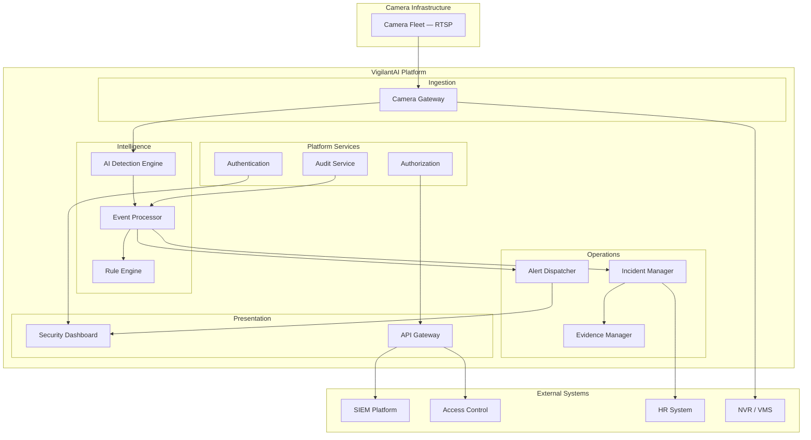

### 17.2 Logical Architecture View

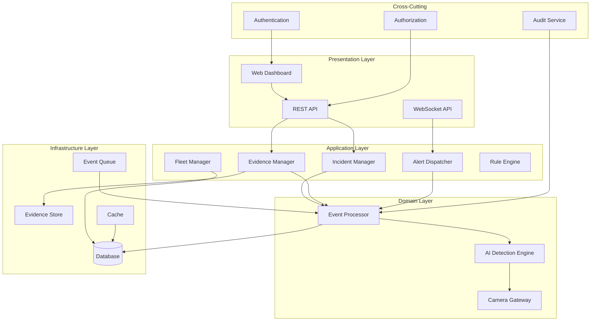

### 17.3 Container Architecture View

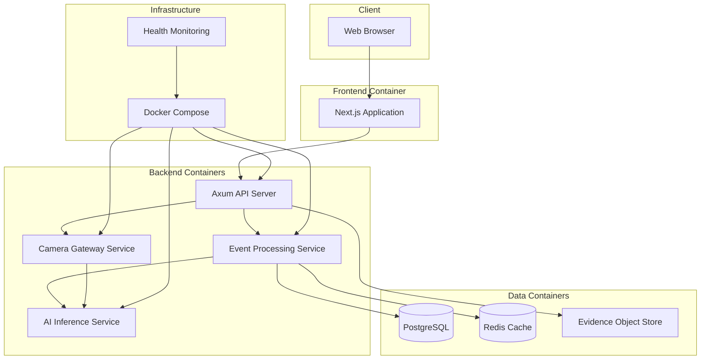

### 17.4 Component Architecture View

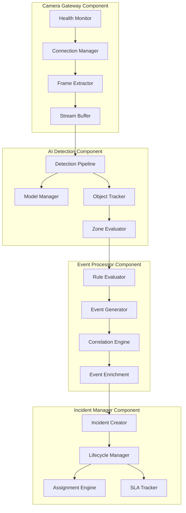

### 17.5 Deployment Architecture View

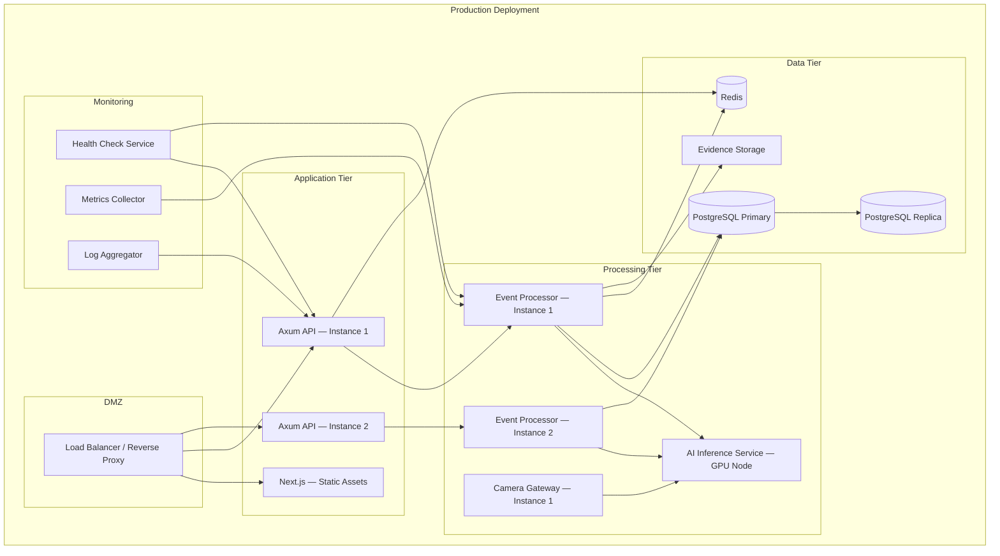

### 17.6 Network Architecture View

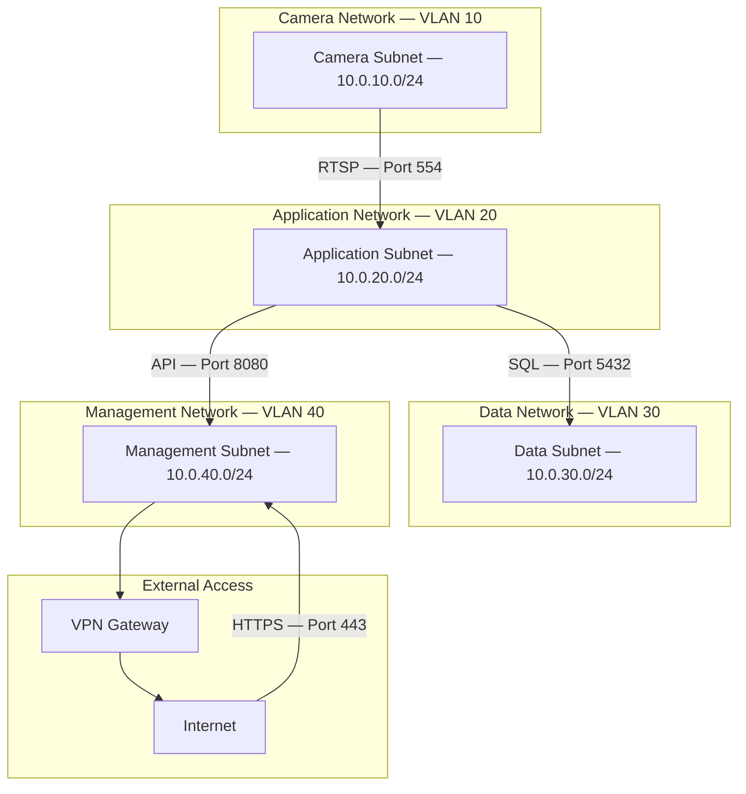

### 17.7 Data Flow Architecture View

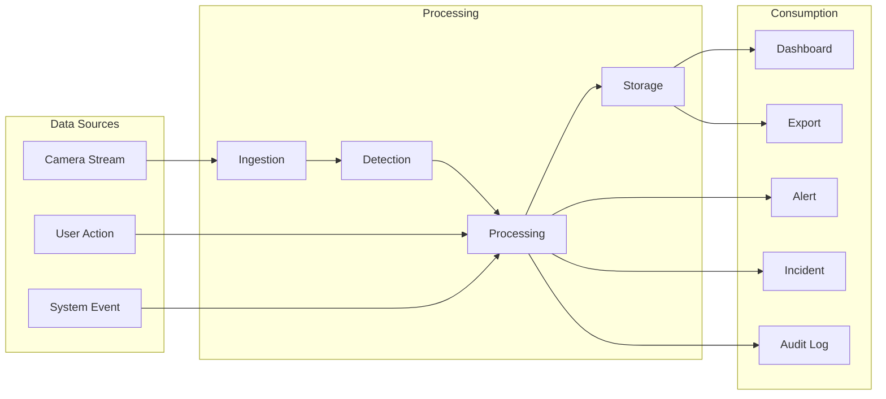

---

## 18. Data Flow Architecture

### 18.1 Primary Data Flow — Detection to Dashboard

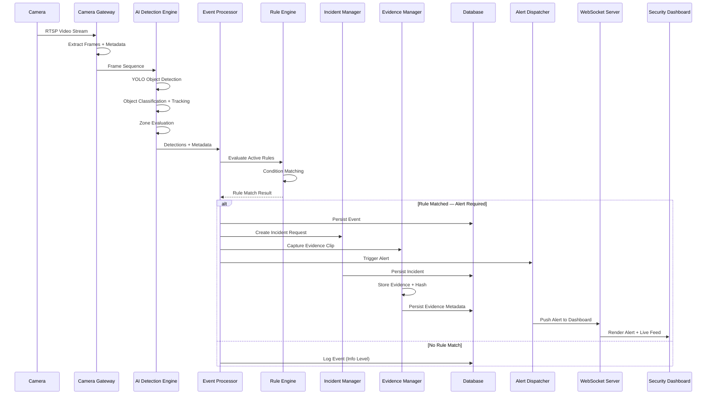

### 18.2 Incident Lifecycle Data Flow

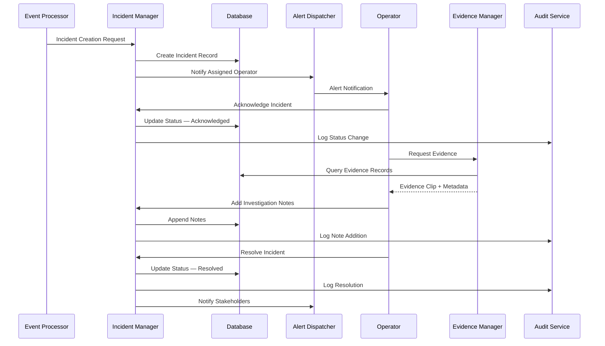

### 18.3 Evidence Chain of Custody Flow

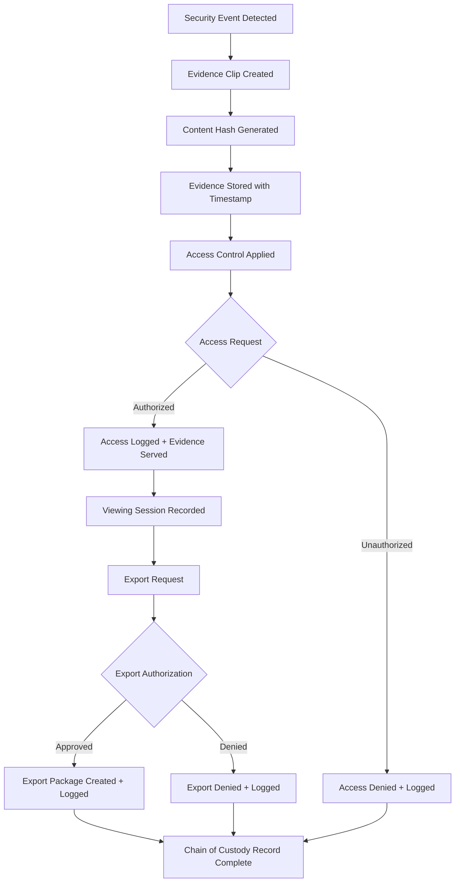

---

## 19. C4 Architecture Model

### 19.1 Level 1 — System Context

The system context diagram shows VigilantAI and its relationships with external actors and systems:

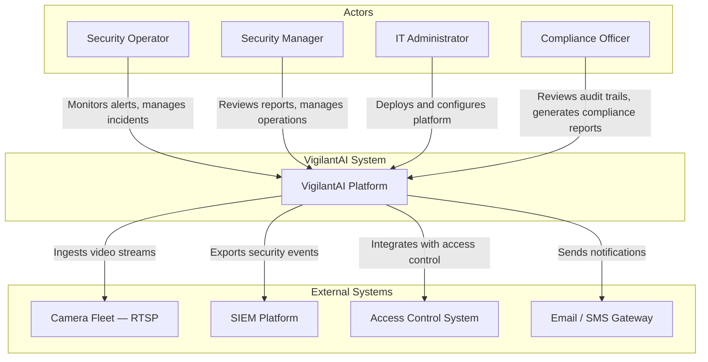

### 19.2 Level 2 — Container Diagram

The container diagram shows the high-level technical building blocks:

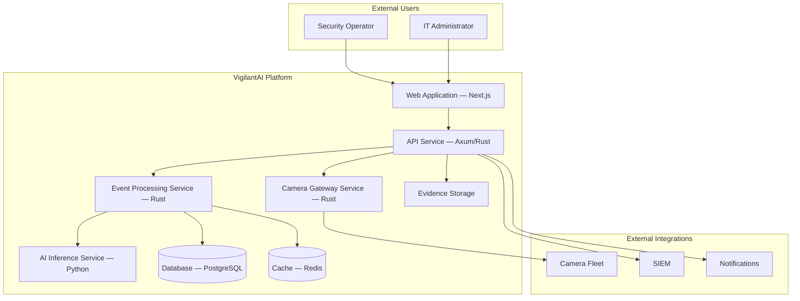

### 19.3 Level 3 — Component Diagram

The component diagram decomposes the API Service into its internal components:

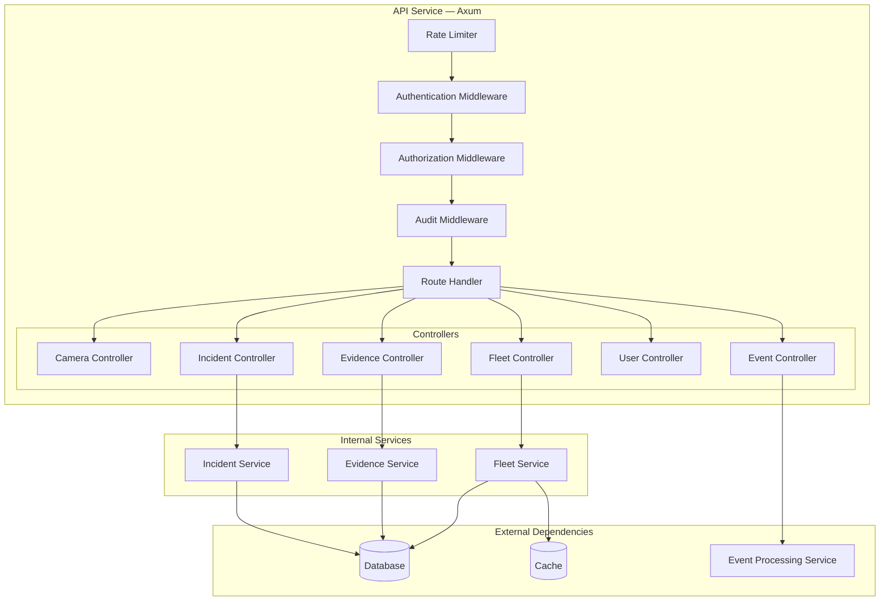

### 19.4 Level 4 — Code (Future Roadmap)

Level 4 decomposition into code structures will be defined during Phase 2 development. Planned decomposition areas:

- **Domain Models** — Entity definitions, value objects, aggregate roots
- **Repository Interfaces** — Data access abstractions
- **Service Implementations** — Business logic encapsulation
- **Event Handlers** — Asynchronous event processing
- **API Handlers** — Request/response mapping

> *Detailed code-level architecture will be documented in `docs/02-Code-Architecture.md` during Phase 2.*

---

## 20. Technology Stack Overview

| Layer             | Technology               | Rationale                                               |
|-------------------|--------------------------|----------------------------------------------------------|
| **Frontend**      | Next.js, TypeScript, Tailwind CSS | Modern React framework, type safety, rapid UI development |
| **Backend**       | Rust, Axum, Tokio, SQLx  | High-performance async runtime, memory safety, low latency |
| **AI Engine**     | Python, OpenCV, YOLO     | Mature computer vision ecosystem, proven detection models |
| **Database**      | SQLite (MVP), PostgreSQL (Production) | Embedded simplicity for MVP, enterprise-grade for scale |
| **Cache**         | Redis (Production)       | Session storage, rule caching, event queue               |
| **Communication** | REST, WebSocket          | Standard APIs for integration, real-time streaming for dashboard |
| **Deployment**    | Docker, Docker Compose   | Containerized deployment, environment consistency         |

### Architecture Rationale

The backend is implemented in Rust to achieve the throughput required for real-time video event processing across large camera fleets. Rust's memory safety guarantees and zero-cost abstractions provide the performance characteristics needed for an always-on security platform without the operational overhead of garbage-collected runtimes.

The AI inference layer is implemented in Python to leverage the extensive computer vision ecosystem — OpenCV for frame processing, YOLO for object detection. This layer operates as a separate process communicating with the Rust backend through well-defined interfaces, allowing independent scaling of inference and event processing workloads.

The frontend uses Next.js with TypeScript and Tailwind CSS to deliver a responsive Security Operations dashboard capable of rendering live camera feeds, real-time alerts, and incident management workflows.

---

## 21. Architecture Principles

| #  | Principle                      | Description                                                                                       |
|----|--------------------------------|---------------------------------------------------------------------------------------------------|
| 1  | **Clean Architecture**         | Dependencies point inward toward the domain. Business logic is independent of frameworks, databases, and UI. |
| 2  | **SOLID Principles**           | Single Responsibility, Open/Closed, Liskov Substitution, Interface Segregation, Dependency Inversion applied throughout. |
| 3  | **Domain-Driven Design**       | Bounded contexts align with module boundaries. Ubiquitous language used in code and documentation. |
| 4  | **Separation of Concerns**     | Each module owns a distinct responsibility. No module directly modifies another module's internal state. |
| 5  | **Dependency Injection**       | All dependencies are injected, not created. Enables testing, swapping implementations, and lifecycle management. |
| 6  | **API-First Design**           | All functionality exposed through defined APIs before UI implementation. APIs are versioned and documented. |
| 7  | **Security-First**             | Every design decision considers security implications. Authentication, authorization, and audit are non-negotiable. |
| 8  | **Cloud-Native Architecture**  | Platform is designed for containerized deployment with horizontal scaling, stateless services, and infrastructure-as-code. |
| 9  | **Modular Design**             | Platform is composed of independently deployable modules with well-defined interfaces and clear ownership boundaries. |
| 10 | **Event-Driven Architecture**  | Components communicate through events where loose coupling is required. Event queue ensures durability and decoupling. |
| 11 | **Loose Coupling**             | Modules interact through interfaces and events, not direct implementation references. Changes in one module do not cascade. |
| 12 | **High Cohesion**              | Related functionality is grouped within modules. Each module has a clear, focused purpose with minimal external dependencies. |

---

## 22. Non-Functional Goals

| Category            | Goal                                                                 | Target                          |
|---------------------|----------------------------------------------------------------------|----------------------------------|
| **Availability**    | System operational uptime for security operations                    | 99.95% annual                    |
| **Reliability**     | Event processing without data loss                                   | Zero event loss under normal operations |
| **Performance**     | API response time under normal load                                  | p95 < 200ms                     |
| **Latency**         | Time from detection to dashboard alert                               | < 5 seconds                     |
| **Scalability**     | Camera fleet capacity per deployment                                 | 50 to 10,000+ cameras           |
| **Fault Tolerance** | System behavior during component failure                             | Graceful degradation, no cascading failures |
| **Maintainability** | Time to deploy a bug fix to production                               | < 4 hours                       |
| **Portability**     | Deployment across environments                                       | Docker on Linux, macOS, Windows |
| **Recoverability**  | Time to restore service after failure                                | RTO < 15 minutes                |
| **Recoverability**  | Data loss window after failure                                       | RPO < 1 minute                  |
| **Observability**   | System health visibility                                             | Metrics, logs, and traces available for all components |
| **Monitoring**      | Proactive issue detection                                            | Health checks every 30 seconds  |
| **Logging**         | Structured log output                                                | JSON format, configurable levels, correlation IDs |
| **Capacity Planning** | Growth accommodation                                               | 2x current capacity without re-architecture          |

### Recovery Objectives

| Metric                    | Target    | Description                                                     |
|---------------------------|-----------|-----------------------------------------------------------------|
| **Recovery Time Objective (RTO)** | 15 minutes | Maximum acceptable downtime for critical security functions  |
| **Recovery Point Objective (RPO)** | 1 minute   | Maximum acceptable data loss measured in time of events      |
| **Mean Time Between Failures (MTBF)** | > 720 hours | Average time between system failures                     |
| **Mean Time To Repair (MTTR)** | < 30 minutes | Average time to restore full service after failure          |

---

## 23. Quality Attributes

| Quality Attribute     | Description                                                                                   | Measurement                                        |
|-----------------------|-----------------------------------------------------------------------------------------------|----------------------------------------------------|
| **Performance**       | System processes events and serves requests within defined latency thresholds                 | p95 latency, throughput (events/sec), FPS processed |
| **Reliability**       | System performs its intended function without failure under stated conditions for a stated period | Uptime percentage, event loss rate, error rate     |
| **Security**          | System protects against unauthorized access, data breaches, and ensures data integrity         | Authentication success rate, authorization deny rate, audit completeness |
| **Availability**      | System is operational and accessible when required by authorized users                        | Uptime SLA, planned vs. unplanned downtime         |
| **Maintainability**   | System can be modified, corrected, or enhanced with minimal risk and effort                   | Deployment frequency, change failure rate, MTTR    |
| **Scalability**       | System handles increased load by adding resources without architectural changes                | Camera count capacity, concurrent user capacity    |
| **Interoperability**  | System communicates and exchanges data with external systems using standard protocols          | API compatibility, protocol support, integration count |
| **Extensibility**     | System accommodates new functionality without modifying existing components                    | Time to add new module, API versioning strategy    |
| **Testability**       | System supports automated testing at all architectural levels                                 | Test coverage, automation percentage, CI/CD integration |
| **Observability**     | System internal state can be inferred from external outputs                                   | Metric coverage, log completeness, trace propagation |
| **Supportability**    | System can be effectively operated, monitored, and debugged in production                     | Runbook coverage, diagnostic tooling, alert accuracy |

---

## 24. Security Architecture

### 24.1 Authentication Architecture

| Component              | Implementation                                                          |
|------------------------|-------------------------------------------------------------------------|
| **Primary Auth**       | Username/password with bcrypt hashing                                  |
| **Token Model**        | JWT access tokens (short-lived, 15 min) + refresh tokens (long-lived, 7 days) |
| **Token Validation**   | Stateless validation using public key cryptography                     |
| **SSO (Future)**       | OAuth 2.0 / OIDC provider integration (Phase 3)                       |
| **MFA (Future)**       | TOTP-based multi-factor authentication                                 |
| **Session Management** | Server-side session tracking for revocation capability                 |
| **Brute Force Protection** | Progressive delays after failed attempts; account lockout after threshold |

### 24.2 Authorization Architecture

| Component                  | Implementation                                                      |
|----------------------------|---------------------------------------------------------------------|
| **Access Control Model**   | Role-Based Access Control (RBAC) — MVP                              |
| **Future Model**           | Attribute-Based Access Control (ABAC) — Phase 3                     |
| **Permission Scope**       | Module-level + resource-level permissions                           |
| **Role Hierarchy**         | Operator → Supervisor → Administrator → System Admin                |
| **Data Scope**             | Site-based and camera-group-based data filtering                    |
| **Enforcement Point**      | Middleware on all API endpoints and WebSocket connections            |
| **Fail-Closed**            | Authorization service unavailability results in access denial       |

### 24.3 Encryption Architecture

| Layer                   | Implementation                                                      |
|-------------------------|---------------------------------------------------------------------|
| **Encryption at Rest**  | AES-256 for evidence storage; database-level encryption for sensitive fields |
| **Encryption in Transit** | TLS 1.3 for all external connections; mTLS available for service-to-service |
| **Secrets Management**  | Environment variables; Docker secrets; no hardcoded credentials    |
| **Key Rotation**        | Configurable rotation schedule for encryption keys                 |
| **Evidence Integrity**  | SHA-256 content hash generated on clip creation; verified on access |

### 24.4 API Security

| Control                 | Implementation                                                      |
|-------------------------|---------------------------------------------------------------------|
| **Authentication**      | Bearer token required on all API endpoints                         |
| **Rate Limiting**       | Configurable per-endpoint; default 100 requests/minute per user    |
| **Input Validation**    | Request schema validation; reject malformed payloads               |
| **CORS Policy**         | Configurable origin whitelist; restrictive defaults                |
| **Request Size Limits** | Enforced at gateway level to prevent resource exhaustion           |
| **API Versioning**      | URL-based versioning (/api/v1/); deprecated versions with sunset  |

### 24.5 OWASP Compliance

| OWASP Principle                 | Implementation                                                |
|---------------------------------|----------------------------------------------------------------|
| **A01 — Broken Access Control** | RBAC enforced at middleware layer; fail-closed default         |
| **A02 — Cryptographic Failures** | TLS 1.3 enforced; AES-256 at rest; no legacy algorithms    |
| **A03 — Injection**             | Parameterized queries via SQLx; input validation at gateway  |
| **A04 — Insecure Design**       | Threat modeling during design; security review gates          |
| **A05 — Security Misconfiguration** | Secure defaults; configuration validation on startup      |
| **A06 — Vulnerable Components** | Dependency scanning; version pinning; regular updates         |
| **A07 — Auth Failures**         | Rate limiting; brute force protection; secure session mgmt   |
| **A08 — Data Integrity Failures** | Evidence hashing; audit log integrity; signed tokens        |
| **A09 — Logging Failures**      | Comprehensive audit logging; tamper-evident log storage       |
| **A10 — SSRF**                  | No user-supplied URLs in server-side requests                 |

### 24.6 Zero Trust Principles

- **Never trust, always verify** — Every request authenticated and authorized regardless of source
- **Least privilege access** — Users receive minimum permissions required for their role
- **Assume breach** — Audit logging enables detection of anomalous behavior post-access
- **Micro-segmentation** — Network architecture isolates camera, application, and data tiers
- **Continuous validation** — Token expiration and refresh enforce periodic re-authentication

### 24.7 Audit Trail Architecture

| Event Category            | Logged Data                                                      |
|---------------------------|------------------------------------------------------------------|
| **Authentication Events** | Login attempts, successes, failures, lockouts, token refresh     |
| **Authorization Events**  | Access grants, denials, permission changes                       |
| **Data Access Events**    | Evidence viewing, export, modification, deletion attempts        |
| **Incident Events**       | Creation, assignment, status changes, resolution, notes          |
| **System Events**         | Service startup/shutdown, configuration changes, errors          |
| **API Events**            | Request metadata, response codes, processing time                |

### 24.8 Compliance Readiness

| Regulation           | Relevant Capabilities                                            |
|----------------------|------------------------------------------------------------------|
| **GDPR**             | Data retention policies, right-to-access support, audit trails  |
| **CCPA**             | Data access and deletion capabilities, consent tracking         |
| **HIPAA**            | Access controls, audit logging, encryption at rest and in transit |
| **SOC 2**            | Comprehensive audit trails, access controls, change management  |
| **IEC 62443**        | Network segmentation, access control, audit logging             |

---

## 25. Business Benefits

| Benefit                              | Description                                                              |
|--------------------------------------|--------------------------------------------------------------------------|
| Reduced Response Time                | Real-time detection and alerting cuts mean-time-to-respond from minutes to seconds |
| Lower Operational Cost               | Automation reduces the number of operators required per facility          |
| Improved Detection Accuracy          | AI classification significantly reduces false-positive rates             |
| Unified Security View                | Single platform consolidates camera monitoring, incident management, and reporting |
| Compliance Readiness                 | Automated audit trails and evidence management support regulatory requirements |
| Scalable Architecture                | Platform scales from dozens to thousands of cameras without re-architecture |
| Faster Investigations                | Correlated event timelines and evidence packaging accelerate post-incident analysis |
| Vendor Flexibility                   | Open APIs and standard protocols reduce lock-in risk                     |

---

## 26. Competitive Differentiators

| Differentiator                       | VigilantAI                                        | Legacy VMS                  |
|--------------------------------------|---------------------------------------------------|-----------------------------|
| Detection Approach                   | AI-powered computer vision with object classification | Motion detection, pixel change |
| Event Processing                     | Rust-based engine with configurable rule processing | Static threshold alerts      |
| Incident Workflow                    | Built-in incident lifecycle management             | External tools required      |
| Evidence Management                  | Integrated with chain-of-custody tracking          | Manual export and storage    |
| Dashboard                            | Real-time Security Operations console              | Basic live view grid         |
| Architecture                         | Modular, microservice-ready, containerized         | Monolithic, appliance-bound  |
| API Access                           | REST and WebSocket APIs from Day 1                 | Limited or proprietary       |
| Deployment Model                     | Docker-based, cloud-ready                          | Hardware appliance or on-prem only |

---

## 27. Scalability Strategy

**Horizontal Scaling**

The event processing layer is stateless and can be horizontally scaled by adding processing nodes. The camera gateway supports connection pooling and stream distribution across multiple ingestion workers.

**Vertical Scaling**

The AI inference layer can leverage GPU acceleration for higher throughput per node. Model optimization (quantization, batching) is applied to maximize frames-per-second on available hardware.

**Data Layer Scaling**

SQLite is used for MVP to reduce deployment complexity. The data access layer is abstracted through SQLx, enabling migration to PostgreSQL for production deployments requiring concurrent access, replication, and higher write throughput.

**Camera Fleet Scaling**

The platform is designed to handle camera fleets ranging from 50 to 10,000+ cameras per deployment. Stream sampling, resolution scaling, and inference batching are applied to manage resource consumption at scale.

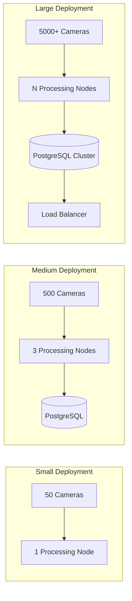

---

## 28. Product Roadmap

### Phase 1 — Foundation (Months 1–4)

- Camera gateway with RTSP ingestion
- AI detection engine with core object detection
- Event processor and basic rule engine
- Incident management with full lifecycle
- Evidence storage and access tracking
- Security Operations Dashboard v1
- Camera fleet management
- Role-based access control
- REST API and WebSocket streaming
- Docker-based deployment

### Phase 2 — Intelligence (Months 5–8)

- Advanced detection scenarios (intrusion patterns, loitering, crowd analysis)
- Multi-camera event correlation
- Custom rule builder UI
- Alert escalation and notification channels (email, SMS, webhook)
- Reporting and analytics module
- PostgreSQL production deployment support
- Mobile-responsive dashboard

### Phase 3 — Enterprise (Months 9–12)

- Access control system integration
- SIEM platform integration
- Multi-site management console
- SSO / SAML authentication
- Custom model training interface
- High availability and failover
- Performance optimization for 10,000+ camera fleets

### Phase 4 — Advanced AI Capabilities (Year 2)

- Face recognition with watchlist management
- License plate recognition and vehicle tracking
- Weapon detection and threat alerting
- Fire and smoke detection
- PPE compliance detection
- Crowd density analytics
- Behavior analytics and anomaly detection
- Edge AI deployment for on-camera inference

### Phase 5 — Enterprise Intelligence (Year 2–3)

- Predictive threat intelligence engine
- Digital twin integration for facility modeling
- Multi-site federation with centralized management
- Cloud SaaS platform for managed deployments
- Enterprise marketplace for detection models and integrations
- Plugin framework for custom analytics development
- Cross-platform mobile applications (iOS, Android)
- AI-assisted investigation and reporting

### Future Vision — Year 3+

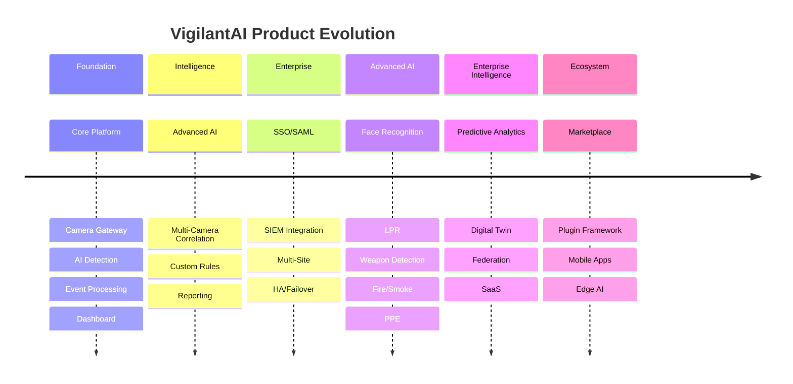

---

## 29. Success Metrics

| Metric                              | Target                          | Measurement Method               |
|--------------------------------------|----------------------------------|----------------------------------|
| Mean Time to Detect (MTTD)          | < 5 seconds from event occurrence | System telemetry                |
| False-Positive Rate                  | < 10% of total alerts           | Alert classification analytics   |
| Dashboard Load Time                  | < 2 seconds                     | Frontend performance monitoring  |
| Camera Ingestion Uptime              | 99.9% per camera stream         | Health monitoring                |
| Incident Resolution Time            | 40% reduction vs. baseline      | Incident management reporting    |
| User Adoption Rate                   | > 80% of licensed operators active weekly | Session analytics        |
| API Response Time (p95)             | < 200ms                         | API gateway metrics              |
| Evidence Retrieval Time              | < 10 seconds for any clip       | Storage performance monitoring   |
| System Availability                  | 99.95% uptime                   | Infrastructure monitoring        |
| Customer Pilot Deployments (Year 1) | ≥ 5 enterprise customers        | Sales / deployment tracking      |

---

## 30. Risks and Assumptions

### Risks

| Risk                                         | Likelihood | Impact | Mitigation                                      |
|----------------------------------------------|------------|--------|--------------------------------------------------|
| AI model accuracy insufficient for production | Medium     | High   | Continuous model evaluation, feedback loops, human-in-the-loop validation |
| Camera compatibility issues across vendors    | High       | Medium | RTSP standard compliance, vendor-specific testing matrix |
| Scalability limits under high camera counts   | Medium     | High   | Performance testing at target scale, horizontal scaling design |
| Regulatory requirements vary by geography     | Medium     | Medium | Modular compliance layer, configurable data retention policies |
| User adoption resistance from security teams  | Medium     | Medium | Phased rollout, training programs, operator-centric UX design |
| Dependency on upstream AI model availability  | Low        | High   | Model versioning, offline inference capability, fallback detection modes |

### Assumptions

- Target customers have existing IP camera infrastructure with RTSP-capable cameras
- Camera networks provide sufficient bandwidth for stream ingestion
- Customers have IT infrastructure to host Docker-based deployments
- Security operations teams are available for platform training and adoption
- Enterprise customers have standard network security controls (firewalls, VPNs)
- AI detection models will achieve acceptable accuracy for core use cases in MVP

---

## 31. Glossary

| Term                          | Definition                                                                 |
|-------------------------------|----------------------------------------------------------------------------|
| **ABAC**                      | Attribute-Based Access Control — permission model using attributes for access decisions |
| **AI Detection Engine**       | The computer vision component that analyzes video frames to detect and classify objects |
| **Camera Gateway**            | The ingestion service that connects to camera fleets via RTSP and manages stream lifecycle |
| **Chain of Custody**          | The documented, tamper-evident record of evidence handling from capture to presentation |
| **C4 Model**                  | A method for documenting software architecture at four levels: Context, Container, Component, Code |
| **Event**                     | A discrete occurrence generated by the event processor when rule conditions are met |
| **Evidence**                  | Video clips, snapshots, and metadata preserved for incident investigation  |
| **Incident**                  | A security occurrence that is tracked from detection through resolution    |
| **JWT**                       | JSON Web Token — compact, URL-safe token format for authentication claims |
| **MTTD**                      | Mean Time to Detect — average elapsed time between event occurrence and system detection |
| **OAuth 2.0**                 | An authorization framework that enables third-party applications to obtain limited access to user resources |
| **RBAC**                      | Role-Based Access Control — permission model restricting access based on assigned roles |
| **Restricted Zone**           | A configured area within a camera's field of view where unauthorized presence triggers an alert |
| **RTO**                       | Recovery Time Objective — maximum acceptable time to restore service after failure |
| **RPO**                       | Recovery Point Objective — maximum acceptable data loss measured in time |
| **Rule Engine**               | The component that evaluates detected events against configurable business rules |
| **RTSP**                      | Real Time Streaming Protocol — standard protocol for accessing live video streams from cameras |
| **SIEM**                      | Security Information and Event Management — enterprise platforms for aggregating and analyzing security events |
| **SOLID**                     | Five object-oriented design principles: Single Responsibility, Open/Closed, Liskov Substitution, Interface Segregation, Dependency Inversion |
| **VMS**                       | Video Management System — traditional software for recording, storing, and viewing surveillance video |
| **WebSocket**                 | A communication protocol providing full-duplex communication over a single TCP connection, used for real-time dashboard updates |
| **YOLO**                      | You Only Look Once — a real-time object detection neural network architecture |

---

## 32. References

| Reference                                      | Description                                         |
|------------------------------------------------|-----------------------------------------------------|
| ONVIF Profile S/SPEC                          | Standards for IP camera interoperability            |
| RTSP Protocol (RFC 2326)                      | Real Time Streaming Protocol specification          |
| YOLOv8 Documentation                          | Ultralytics YOLO model documentation                |
| Axum Web Framework                            | Rust web framework documentation                    |
| Tokio Runtime                                 | Asynchronous runtime for Rust                       |
| OWASP Top 10 (2021)                           | Web application security risks                      |
| OWASP Physical Security Guidelines            | Application security best practices                 |
| NIST SP 800-34                                | Contingency Planning Guide (system availability)    |
| C4 Architecture Model                         | Software architecture documentation method          |
| GDPR — Video Surveillance Guidance            | European data protection requirements for CCTV      |
| HIPAA Security Rule                           | Healthcare facility security requirements           |
| IEC 62443                                      | Industrial cybersecurity standard                   |
| SOLID Principles                               | Object-oriented design principles                   |
| Domain-Driven Design (Eric Evans)             | Software design approach for complex domains        |

---

*End of Document*
