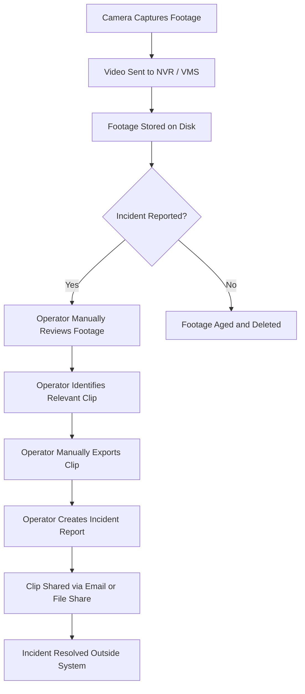
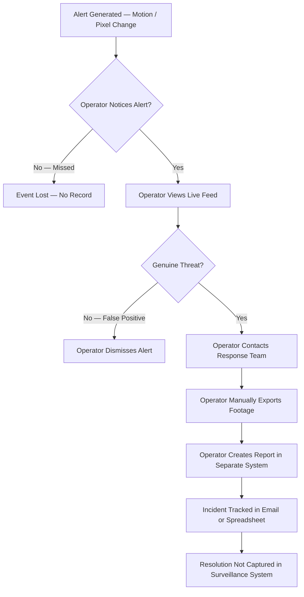
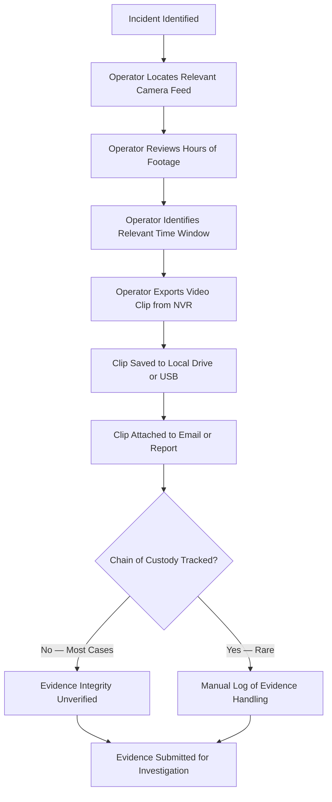
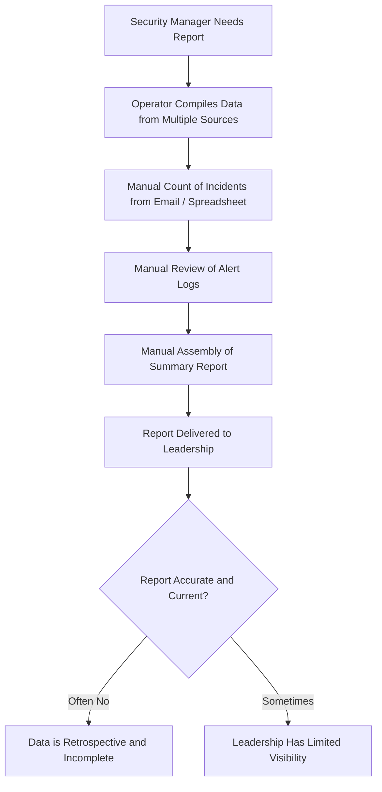
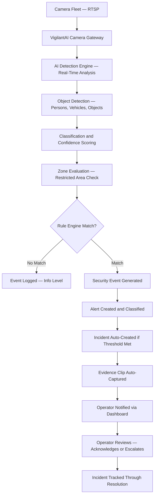
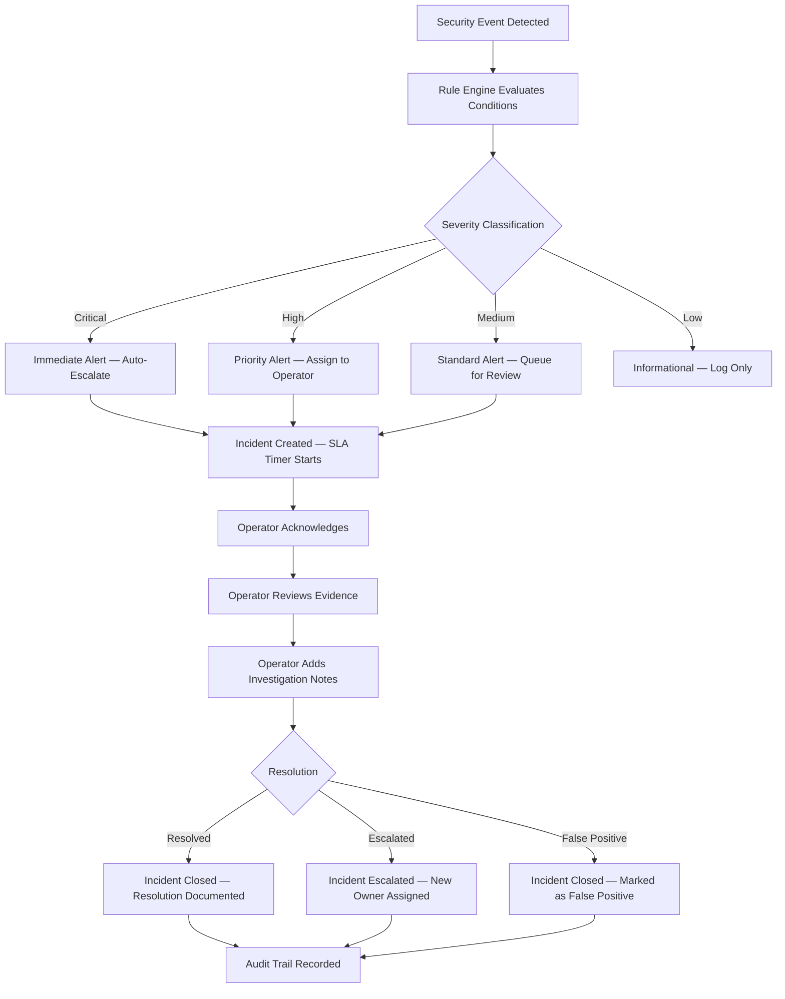
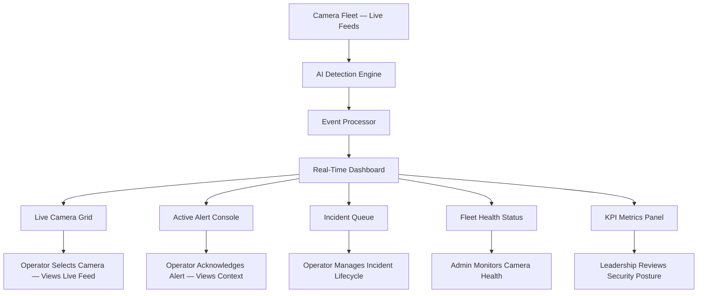
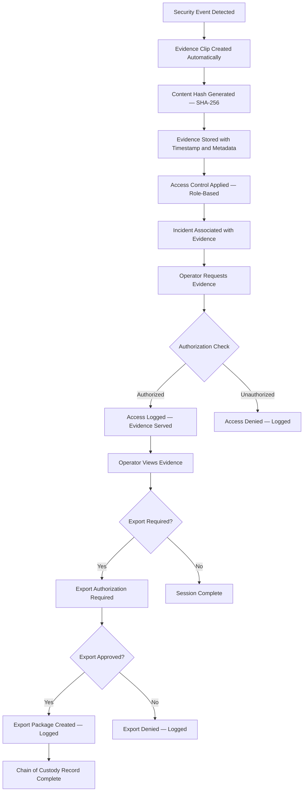

# VigilantAI — Business Requirements Document

> **Enterprise Security Intelligence Platform**
> Business Requirements Document — Version 1.0

---

## Table of Contents

| Section | Title                                           |
|---------|-------------------------------------------------|
| 1       | Document Control                                |
| 2       | Revision History                                |
| 3       | Purpose                                         |
| 4       | Business Background                             |
| 5       | Business Problem Statement                      |
| 6       | Business Opportunity                            |
| 7       | Vision Statement                                |
| 8       | Business Goals                                  |
| 9       | Business Objectives                             |
| 10      | Stakeholders                                    |
| 11      | Business Scope                                  |
| 12      | Current Business Process (AS-IS)                |
| 13      | Future Business Process (TO-BE)                 |
| 14      | Business Capabilities                           |
| 15      | User Personas                                   |
| 16      | Business Requirements                           |
| 17      | Business Rules                                  |
| 18      | Business Constraints                            |
| 19      | Assumptions                                     |
| 20      | Business Risks                                  |
| 21      | Key Performance Indicators                      |
| 22      | Success Criteria                                |
| 23      | Business Acceptance Criteria                    |
| 24      | Requirements Traceability Matrix                |
| 25      | Glossary                                        |
| 26      | Appendices                                      |

---

## 1. Document Control

| Field              | Value                                                     |
|--------------------|-----------------------------------------------------------|
| **Document Title** | Business Requirements Document                            |
| **Product Name**   | VigilantAI Enterprise Security Intelligence Platform      |
| **Document Type**  | Business Requirements Specification                       |
| **Version**        | 1.0                                                       |
| **Date**           | 2026-07-21                                                |
| **Classification** | Internal — Confidential                                   |
| **Owner**          | Product Management                                        |
| **Approved By**    | *[Pending Approval]*                                      |
| **Review Cycle**   | Quarterly                                                 |
| **Status**         | Draft — Pending Review                                    |
| **Distribution**   | CEO, CTO, CIO, Product Management, Engineering Leadership, Security Operations, Compliance, Executive Leadership |

---

## 2. Revision History

| Version | Date       | Author        | Changes                                         |
|---------|------------|---------------|-------------------------------------------------|
| 0.1     | 2026-07-21 | Product Team  | Initial draft — all sections                    |
| 1.0     | 2026-07-21 | Product Team  | First release — pending stakeholder review      |

---

## 3. Purpose

### 3.1 Document Objectives

This Business Requirements Document defines the business rationale, functional scope, and acceptance criteria for the VigilantAI Enterprise Security Intelligence Platform. It articulates the business problems that necessitate the platform, the operational goals it must achieve, and the measurable outcomes against which its success will be evaluated.

This document serves as the authoritative reference for business stakeholders, product managers, and engineering leadership to align on what VigilantAI must deliver, why it must deliver it, and how success will be determined.

### 3.2 Relationship to Executive Summary

This document is the natural extension of the Executive Summary (Document 01). Where the Executive Summary defines the product vision, positioning, architecture, and technology stack at a strategic level, this document translates those strategic directives into actionable business requirements with traceable acceptance criteria.

All terminology, stakeholder definitions, module references, business goals, and product scope described herein are consistent with and derived from the Executive Summary. In the event of ambiguity, the Executive Summary takes precedence.

### 3.3 Intended Audience

| Role                       | Use of This Document                                         |
|----------------------------|--------------------------------------------------------------|
| CEO / CIO                  | Strategic alignment, investment justification                |
| CTO                        | Technical feasibility validation, resource planning          |
| Product Managers           | Requirements baseline, scope management, prioritization      |
| Security Directors         | Operational requirements validation, adoption planning       |
| Operations Managers        | Workflow alignment, productivity targets                     |
| Compliance Officers        | Regulatory requirement mapping, audit readiness              |
| Engineering Leadership     | Acceptance criteria definition, implementation guidance       |

---

## 4. Business Background

### 4.1 Enterprise Security Landscape

The global enterprise security market is undergoing a fundamental transformation. Organizations across corporate, industrial, healthcare, government, and critical infrastructure sectors operate camera fleets that generate thousands of hours of video per day. Yet the intelligence extracted from this footage remains minimal — less than 5% of captured video is ever reviewed by a human operator.

Legacy Video Management Systems (VMS) were designed for recording and storage. They were not built for real-time analysis, event correlation, or automated incident response. As camera fleets scale from dozens to thousands of cameras, the gap between data capture and operational intelligence widens.

### 4.2 Growth of AI-Powered Surveillance

Advances in computer vision, object detection, and deep learning have reached production-grade maturity for physical security applications. Models such as YOLO can detect, classify, and track objects — persons, vehicles, restricted-zone intrusions — in real time from live camera feeds. The convergence of AI maturity, scalable cloud infrastructure, and declining GPU costs has made AI-powered surveillance technically and economically viable for the first time.

### 4.3 Enterprise Security Challenges

Despite increased investment in camera hardware, enterprises face persistent operational challenges:

- **Manual monitoring at scale is unsustainable.** A 200-camera facility produces over 4,800 hours of video per day. No Security Operations Center (SOC) can continuously review this volume. Operator fatigue sets in within minutes, and critical events are missed in real time.
- **Alert fatigue degrades response quality.** Motion-based and pixel-change detection generates enormous volumes of false alarms — shadows, weather effects, animals, lighting changes. Security teams learn to ignore alerts, creating a culture of desensitization that delays response to genuine threats.
- **Incident workflows are fragmented.** When an event is detected, operators must manually export footage, create incident reports, notify stakeholders, and track resolution across disconnected tools. This process is slow, error-prone, and creates gaps in the chain of custody for evidence.
- **Compliance requirements are escalating.** Regulations including GDPR, CCPA, HIPAA, and industry-specific standards impose strict requirements on video data handling, retention, access control, and audit trails. Legacy systems lack the granularity required to demonstrate compliance.

### 4.4 Digital Transformation in Physical Security

Physical security is following the same trajectory as cybersecurity — from reactive, hardware-centric models to proactive, software-defined, intelligence-driven operations. Organizations expect the same real-time visibility, automated response, and audit completeness from physical security that they have come to expect from their cyber defense platforms. This expectation creates both demand and urgency for platforms that can deliver intelligent security operations.

### 4.5 Industry Evolution

The competitive landscape spans legacy VMS vendors, cloud camera platforms, and AI analytics providers — but no existing solution combines real-time AI detection, configurable event processing, integrated incident management, evidence management with chain-of-custody tracking, and a unified Security Operations dashboard in a single platform. VigilantAI exists to fill this gap.

---

## 5. Business Problem Statement

### 5.1 Overview

Enterprise security operations face a convergence of challenges that legacy surveillance systems are structurally unable to address. These challenges are not isolated — they compound each other, creating systemic operational risk.

### 5.2 Detailed Problem Analysis

#### 5.2.1 Manual Camera Monitoring at Scale

A facility with 200 cameras produces over 4,800 hours of video per day. No security operations center can continuously monitor this volume. Operators experience fatigue within minutes, and critical events are missed in real time. As camera fleets grow — driven by expansion, new facilities, or regulatory requirements — the monitoring burden increases linearly while staffing budgets remain flat or decline.

#### 5.2.2 Alert Fatigue and False Positives

Legacy motion-based and pixel-change alerting generates enormous volumes of false alarms. Studies indicate that 80–95% of alerts from conventional systems are false positives — triggered by shadows, weather conditions, animals, lighting changes, or non-threatening human activity. Security teams learn to ignore alerts, creating a culture of desensitization that delays response to genuine threats. This is not a training problem — it is a systems design problem.

#### 5.2.3 Slow and Error-Prone Investigations

When an incident occurs, operators must manually identify relevant footage, export video clips, assemble incident reports, and track evidence through disconnected tools. This process takes hours when it should take minutes. The fragmented workflow creates gaps in the chain of custody, undermining the evidentiary value of footage for legal, regulatory, or internal proceedings.

#### 5.2.4 Evidence Management Issues

Evidence storage, access control, retention, and audit trails are critical requirements for enterprise security. Legacy systems provide no automated chain-of-custody tracking, no integrity verification, and no role-based access enforcement on evidence. Manual evidence management is labor-intensive, error-prone, and fails under regulatory scrutiny.

#### 5.2.5 Lack of Correlated Intelligence

Individual camera events exist in isolation. Without cross-camera correlation, pattern analysis, and contextual enrichment, security teams cannot identify coordinated threats, recurring patterns, or systemic vulnerabilities. A person crossing three cameras in sequence appears as three independent events, not a single coordinated movement.

#### 5.2.6 Compliance Complexity

Regulations including GDPR (video data handling, retention, access control), CCPA (data access and deletion rights), HIPAA (healthcare facility security), SOC 2 (audit trails, change management), and IEC 62443 (industrial cybersecurity) impose increasingly strict requirements. Legacy surveillance systems lack the granularity needed to demonstrate compliance during audits.

#### 5.2.7 Growing Camera Fleets and Operational Inefficiency

As camera fleets scale from dozens to thousands of cameras, the operational burden grows linearly — more cameras to monitor, more footage to review, more alerts to triage, more incidents to manage. Legacy systems offer no automation or intelligence to offset this scaling penalty. The result is declining security coverage per dollar invested.

#### 5.2.8 High Staffing Cost

Security operations are labor-intensive. Staffing a 24/7 monitoring operation for a 500-camera facility requires multiple shifts of trained operators. Labor costs represent 60–80% of physical security operating budgets. Without automation, cost reduction is impossible.

#### 5.2.9 Limited Visibility

Executives and security leadership lack real-time visibility into physical security posture. Status reports are manual, retrospective, and incomplete. There is no equivalent of the dashboards and metrics that cyber security teams use to understand their operational posture in real time.

### 5.3 Business Impact

| Problem Area                    | Business Impact                                                          |
|---------------------------------|--------------------------------------------------------------------------|
| Manual monitoring               | Missed incidents, delayed response, increased liability                  |
| False positives                 | Operator desensitization, wasted labor, eroded trust in the system      |
| Slow investigations             | Extended time-to-resolution, increased operational cost                  |
| Evidence management gaps        | Legal exposure, compliance violations, invalidated evidence              |
| Lack of correlation             | Inability to detect coordinated threats, systemic vulnerabilities missed |
| Compliance gaps                 | Regulatory fines, audit failures, reputational damage                    |
| Operational inefficiency        | Declining security coverage per dollar invested                          |
| High staffing costs             | Unsustainable cost trajectory as camera fleets grow                     |
| Limited visibility              | Strategic decision-making without current security posture data          |

---

## 6. Business Opportunity

### 6.1 Market Opportunity

The global video surveillance market is projected to exceed $80 billion by 2028. However, the intelligence layer on top of surveillance infrastructure remains significantly underpenetrated. Enterprises spend billions on camera hardware but capture less than 5% of the available security intelligence from their video feeds.

Three converging forces create a distinct market opportunity:

1. **AI maturity** — Computer vision models have reached production-grade accuracy for physical security use cases.
2. **Cloud infrastructure** — Scalable compute and storage eliminate the cost barriers that previously constrained on-premise AI deployment.
3. **Security operations burden** — Rising labor costs and staffing shortages make automation an operational necessity, not a luxury.

VigilantAI is positioned to capture the emerging **AI-powered Physical Security Intelligence** market segment — a category distinct from both legacy VMS and cloud-managed camera platforms.

### 6.2 Industry Demand

| Demand Driver                           | Evidence                                                        |
|-----------------------------------------|-----------------------------------------------------------------|
| Rising security staffing costs          | 60–80% of security budgets allocated to labor                  |
| Regulatory pressure                     | GDPR, CCPA, HIPAA compliance requirements expanding            |
| Camera fleet growth                     | Enterprise camera fleets growing 15–25% annually               |
| AI technology readiness                 | Computer vision models achieving >95% accuracy on core tasks   |
| Digital transformation in security      | Convergence of physical and cyber security operations          |
| Post-pandemic security requirements     | Increased demand for remote monitoring and automated response  |

### 6.3 Operational Improvements

| Current State                           | Future State with VigilantAI                                   |
|-----------------------------------------|----------------------------------------------------------------|
| Manual monitoring of live feeds         | AI-driven detection with operator escalation only for genuine events |
| 80–95% false positive rate              | AI-classified alerts with <10% false positive rate             |
| Hours to assemble evidence              | Seconds to retrieve correlated evidence packages               |
| Disconnected incident tracking          | Unified incident lifecycle from detection through resolution   |
| No cross-camera intelligence            | Correlated event timelines across camera fleet                 |
| Manual compliance reporting             | Automated audit trails and compliance dashboards               |
| No executive security visibility        | Real-time KPI dashboards for security leadership               |

### 6.4 Business Value

- **Reduced operational cost** — Automation reduces the number of operators required per facility.
- **Improved detection accuracy** — AI classification significantly reduces false-positive rates.
- **Faster investigations** — Correlated event timelines and evidence packaging accelerate post-incident analysis.
- **Compliance readiness** — Automated audit trails and evidence management support regulatory requirements.
- **Unified security view** — Single platform consolidates monitoring, incident management, and reporting.

### 6.5 Return on Investment (ROI)

| ROI Component                            | Expected Impact                                                  |
|------------------------------------------|------------------------------------------------------------------|
| Operator headcount reduction             | 30–50% reduction in monitoring staff per facility                |
| Investigation time reduction             | 40–60% faster time-to-resolution                                |
| False positive reduction                 | 80–90% fewer alerts requiring human triage                      |
| Compliance cost avoidance                | Elimination of manual audit preparation labor                   |
| Incident cost reduction                  | Earlier detection reduces damage and liability exposure          |

### 6.6 Competitive Advantage

No existing solution combines real-time AI detection, configurable event processing, integrated incident management, evidence management with chain-of-custody integrity, and a unified Security Operations dashboard in a single platform. Legacy vendors bolt AI onto VMS. Cloud platforms manage cameras but not intelligence. Analytics providers detect events but do not manage incidents. VigilantAI fills the gap between detection and response.

### 6.7 Customer Value

| Customer Segment           | Primary Value Delivered                                        |
|----------------------------|----------------------------------------------------------------|
| Corporate Offices          | After-hours intrusion detection, tailgating alerts, restricted area enforcement |
| Manufacturing              | PPE compliance, safety zone enforcement, equipment theft prevention |
| Healthcare                 | Patient area security, pharmacy access monitoring, infant protection |
| Government                 | Compliance-driven security, classified area protection          |
| Critical Infrastructure    | Perimeter defense, sabotage prevention, regulatory compliance   |

---

## 7. Vision Statement

### 7.1 Business Vision

VigilantAI exists to close the gap between passive video recording and active security intelligence. Most enterprise surveillance systems generate thousands of hours of footage that are never reviewed. Security teams are overwhelmed by alert fatigue, manual workflows, and the inability to correlate events across a distributed camera fleet. The result is delayed response times, missed incidents, and expensive post-incident forensic investigations.

### 7.2 Mission Alignment

The mission of VigilantAI is to provide enterprises with an intelligent security platform that automates threat detection, streamlines incident response, and delivers operational visibility across the entire camera fleet — reducing risk while lowering the operational burden on security teams.

### 7.3 Long-Term Direction

VigilantAI shifts the paradigm from *record and review* to *detect and respond*. By applying computer vision at the edge of the camera stream and orchestrating events through a centralized intelligence layer, the platform enables security teams to operate proactively rather than reactively.

### 7.4 Future Growth

The long-term vision positions VigilantAI as the intelligent fabric connecting physical security infrastructure with enterprise security operations — a platform where every camera becomes a sensor, every event becomes actionable intelligence, and every incident is tracked from detection through resolution.

---

## 8. Business Goals

### 8.1 Year 1 Goals

| Goal # | Goal                                              | Success Measure                                    |
|--------|----------------------------------------------------|----------------------------------------------------|
| G-01   | Deploy production instances across 3–5 enterprise pilot customers | ≥ 5 active customer deployments          |
| G-02   | Achieve measurable reduction in mean-time-to-detect (MTTD) for security incidents | MTTD < 5 seconds          |
| G-03   | Establish the platform as a viable alternative to legacy VMS for intelligent monitoring | Positive customer evaluations and renewals |

### 8.2 Year 2 Goals

| Goal # | Goal                                              | Success Measure                                    |
|--------|----------------------------------------------------|----------------------------------------------------|
| G-04   | Scale to 20+ enterprise deployments across multiple verticals | ≥ 20 active deployments                   |
| G-05   | Expand AI model coverage to support additional detection scenarios | ≥ 10 supported detection types           |
| G-06   | Build integration ecosystem with access control, HR, and SIEM platforms | ≥ 5 third-party integrations available  |

### 8.3 Year 3 Goals

| Goal # | Goal                                              | Success Measure                                    |
|--------|----------------------------------------------------|----------------------------------------------------|
| G-07   | Achieve market recognition as a category leader in AI-driven physical security | Analyst recognition, press coverage        |
| G-08   | Support 10,000+ camera deployments per customer instance | Demonstrated at ≥ 3 customer sites         |
| G-09   | Generate recurring revenue through SaaS and managed service offerings | Revenue target achieved                    |

---

## 9. Business Objectives

### 9.1 SMART Objectives

| Obj # | Objective                                                | Specific                                | Measurable                                     | Achievable | Relevant                       | Time-Bound  |
|-------|----------------------------------------------------------|-----------------------------------------|------------------------------------------------|------------|--------------------------------|-------------|
| OBJ-01 | Reduce mean time to detect security incidents            | AI-powered real-time detection          | MTTD reduced to < 5 seconds from baseline      | Yes        | Core product value proposition  | Phase 1     |
| OBJ-02 | Reduce false-positive alert rate                         | AI classification of detection events   | False-positive rate reduced to < 10%            | Yes        | Directly impacts operator trust | Phase 1     |
| OBJ-03 | Automate incident lifecycle management                   | Detection-to-resolution workflow         | 40% reduction in mean time to resolve          | Yes        | Operational efficiency          | Phase 1     |
| OBJ-04 | Eliminate manual evidence assembly                       | Automated evidence clip creation         | Evidence retrieval time < 10 seconds            | Yes        | Compliance and investigation    | Phase 1     |
| OBJ-05 | Deliver real-time operational visibility                 | Security Operations Dashboard            | Dashboard load time < 2 seconds                 | Yes        | Executive and operational needs | Phase 1     |
| OBJ-06 | Support enterprise camera fleet at scale                 | Scalable camera ingestion                | 50 to 10,000+ cameras per deployment            | Yes        | Enterprise customer requirement | Phase 1     |
| OBJ-07 | Deploy pilot customers                                   | Production deployments                   | ≥ 5 enterprise customers within 12 months       | Yes        | Market validation               | Year 1      |
| OBJ-08 | Expand detection scenarios                               | Additional AI model coverage             | ≥ 10 detection types within 18 months           | Yes        | Market differentiation          | Year 1–2    |
| OBJ-09 | Build integration ecosystem                              | Third-party integrations                 | ≥ 5 integrations (access control, SIEM, HR)     | Yes        | Enterprise adoption requirement | Year 2      |
| OBJ-10 | Achieve SaaS readiness                                   | Multi-tenant cloud platform              | SaaS offering operational within 24 months      | Yes        | Recurring revenue model         | Year 2      |

---

## 10. Stakeholders

### 10.1 Stakeholder Matrix

| Stakeholder                 | Role                                    | Responsibilities                                              | Influence | Interest | Success Criteria                                      |
|-----------------------------|-----------------------------------------|---------------------------------------------------------------|-----------|----------|-------------------------------------------------------|
| CEO                         | Executive Sponsor                       | Strategic direction, funding, organizational alignment        | High      | High     | ROI achieved, market position established             |
| CTO                         | Technical Executive Sponsor             | Technology strategy, architecture governance, build-vs-buy   | High      | High     | Platform meets performance and scalability targets    |
| CIO                         | IT Executive Sponsor                    | Infrastructure, deployment, integration with enterprise IT   | High      | Medium   | Deployment fits existing IT operations model          |
| Product Management          | Product Owner                           | Requirements, prioritization, roadmap, market fit            | High      | High     | Product delivers business value, customers adopt      |
| Engineering Leadership      | Technical Delivery                      | Architecture, implementation, quality, delivery timelines    | High      | High     | Platform built to spec, within budget and timeline    |
| Security Operations         | Primary End User                        | Platform operation, alert triage, incident management        | Medium    | High     | Platform reduces workload, improves response quality  |
| Security Director           | Operational Sponsor                     | Security strategy, team management, budget                   | High      | High     | Security posture measurably improved                  |
| Compliance Officer          | Regulatory Stakeholder                  | Regulatory alignment, audit preparation, policy enforcement  | Medium    | High     | Compliance requirements demonstrably met              |
| Operations Manager          | Workflow Owner                          | Operational process design, team productivity                | Medium    | High     | Operational efficiency targets achieved               |
| IT Administrator            | Technical Operator                      | Platform deployment, configuration, maintenance              | Medium    | Medium   | Platform operable with existing IT skills             |
| Incident Investigator       | Specialized End User                    | Post-incident forensics, evidence assembly, reporting        | Low       | High     | Investigation time significantly reduced             |
| Executive Leadership        | Strategic Audience                      | Security posture visibility, strategic risk assessment       | High      | Low      | Real-time visibility into security operations         |
| Legal Counsel               | Compliance Stakeholder                  | Legal risk assessment, evidence admissibility, data handling | Medium    | Medium   | Evidence and audit trails meet legal standards        |
| Facilities Manager          | Cross-functional Stakeholder            | Physical security integration with building operations       | Low       | Medium   | Security operations aligned with facility operations  |
| QA / Test Engineering       | Quality Gatekeeper                      | Platform validation, defect prevention, acceptance testing   | Medium    | High     | Platform meets quality and acceptance criteria        |
| DevOps / SRE                | Deployment and Operations               | Deployment, monitoring, uptime, scalability                  | Medium    | High     | 99.95% uptime achieved                                |

---

## 11. Business Scope

### 11.1 In Scope (MVP)

| Scope Item                                          | Description                                                                 |
|-----------------------------------------------------|-----------------------------------------------------------------------------|
| Live camera stream ingestion via RTSP               | Connect to IP camera fleets using industry-standard RTSP protocol          |
| AI object detection                                 | Detect persons, vehicles, and objects of interest in live video feeds       |
| Restricted zone monitoring                          | Detect unauthorized presence in configured restricted zones                 |
| Real-time event generation and classification       | Generate classified security events from AI detections                      |
| Incident creation and lifecycle management          | Create, assign, track, and resolve security incidents                      |
| Evidence storage with chain-of-custody tracking     | Preserve forensic evidence with timestamping, access tracking, and integrity verification |
| Configurable rule engine                            | Business rules governing event evaluation, filtering, escalation, and routing |
| Security Operations Dashboard                       | Real-time console for monitoring, alert management, and incident workflows  |
| Event timeline with filtering and search            | Temporal view of all events with filtering by camera, type, severity       |
| Camera fleet management and health monitoring       | Centralized camera registration, health monitoring, and fleet visibility   |
| Role-based access control                           | Role-based permissions across all platform modules                         |
| Audit logging                                       | Immutable audit trail for all user actions and system events               |
| REST API and WebSocket streaming                    | API access for integration and real-time data streaming                    |
| Docker-based deployment                             | Containerized deployment for environment consistency                       |

### 11.2 Out of Scope (MVP)

| Scope Item                                          | Reason                                                     |
|-----------------------------------------------------|-------------------------------------------------------------|
| On-premise hardware appliance offering              | Software-first approach; hardware in Phase 3                |
| Custom model training interface                     | Deferred to Phase 2; pre-trained models in MVP             |
| Video analytics marketplace / plugin architecture   | Deferred to Phase 3                                         |
| Mobile application                                  | Deferred to Phase 2; web dashboard mobile-responsive       |
| Multi-tenant SaaS control plane                     | Deferred to Phase 2                                         |
| Video management features (playback, export, NVR)   | Deferred to integration partners — not a VMS replacement   |
| Edge AI deployment (on-camera inference)            | Deferred to Phase 4                                         |
| Face recognition                                     | Deferred to Phase 4                                         |
| License plate recognition                           | Deferred to Phase 4                                         |
| Weapon detection                                    | Deferred to Phase 4                                         |

### 11.3 Future Scope (Phase 2–5)

| Scope Item                                          | Target Phase                                               |
|-----------------------------------------------------|-------------------------------------------------------------|
| Advanced detection scenarios (intrusion patterns, loitering, crowd analysis) | Phase 2                                     |
| Multi-camera event correlation                      | Phase 2                                                     |
| Custom rule builder UI                              | Phase 2                                                     |
| Alert escalation and notification channels          | Phase 2                                                     |
| Reporting and analytics module                      | Phase 2                                                     |
| PostgreSQL production deployment support            | Phase 2                                                     |
| Mobile-responsive dashboard                         | Phase 2                                                     |
| Access control system integration                   | Phase 3                                                     |
| SIEM platform integration                           | Phase 3                                                     |
| Multi-site management console                       | Phase 3                                                     |
| SSO / SAML authentication                           | Phase 3                                                     |
| High availability and failover                      | Phase 3                                                     |
| Face recognition with watchlist management           | Phase 4                                                     |
| License plate recognition and vehicle tracking       | Phase 4                                                     |
| Weapon detection and threat alerting                | Phase 4                                                     |
| Fire and smoke detection                            | Phase 4                                                     |
| PPE compliance detection                            | Phase 4                                                     |
| Crowd density analytics                             | Phase 4                                                     |
| Predictive threat intelligence engine               | Phase 5                                                     |
| Digital twin integration                            | Phase 5                                                     |
| Cloud SaaS platform for managed deployments         | Phase 5                                                     |

---

## 12. Current Business Process (AS-IS)

### 12.1 Current Surveillance Workflow

### 12.2 Current Incident Workflow

### 12.3 Current Evidence Workflow

### 12.4 Current Reporting Workflow

### 12.5 Key Pain Points in AS-IS State

| Process Area              | Pain Point                                                              |
|---------------------------|-------------------------------------------------------------------------|
| Monitoring                | Manual review of live feeds; operator fatigue; critical events missed   |
| Alerting                  | 80–95% false positives; operators desensitized                          |
| Incident Management       | Disconnected tracking across email, spreadsheets, and external tools   |
| Evidence Management       | Manual export; no chain of custody; no integrity verification          |
| Reporting                 | Manual assembly; retrospective data; incomplete and error-prone        |
| Cross-Camera Intelligence | None — each camera is an isolated data source                          |
| Compliance                | No automated audit trails; manual compliance reporting                  |

---

## 13. Future Business Process (TO-BE)

### 13.1 Future AI-Driven Monitoring Workflow

### 13.2 Automated Incident Handling Workflow

### 13.3 Real-Time Monitoring Dashboard Workflow

### 13.4 Evidence Automation Workflow

### 13.5 Key Improvements in TO-BE State

| Process Area              | Improvement                                                            |
|---------------------------|------------------------------------------------------------------------|
| Monitoring                | AI analyzes all cameras simultaneously; operators focus on genuine events |
| Alerting                  | AI-classified alerts with <10% false positive rate                     |
| Incident Management       | Unified lifecycle from detection through resolution in single platform |
| Evidence Management       | Automated capture, chain-of-custody tracking, integrity verification   |
| Reporting                 | Real-time dashboards and automated compliance reports                  |
| Cross-Camera Intelligence | Correlated event timelines across camera fleet                         |
| Compliance                | Automated audit trails, role-based access, retention policies          |

---

## 14. Business Capabilities

### 14.1 Business Capability Matrix

| Capability ID | Capability                        | Description                                                                 | Priority | Dependencies                      |
|---------------|-----------------------------------|-----------------------------------------------------------------------------|----------|-----------------------------------|
| CAP-01        | Camera Monitoring                 | Real-time monitoring of live camera feeds with AI-powered analysis          | Critical | Camera Gateway, AI Detection      |
| CAP-02        | Threat Detection                  | AI-based detection and classification of security threats in real time      | Critical | AI Detection Engine               |
| CAP-03        | AI Analytics                      | Computer vision analytics including object detection, classification, tracking | Critical | AI Detection Engine               |
| CAP-04        | Event Processing                  | Real-time event generation, classification, and correlation                | Critical | Event Processor, Rule Engine      |
| CAP-05        | Alert Management                  | Alert creation, classification, prioritization, and delivery               | High     | Event Processor, Alert Dispatcher |
| CAP-06        | Incident Management               | Incident lifecycle from creation through investigation, resolution, archival | High     | Incident Manager, Evidence Manager|
| CAP-07        | Evidence Management               | Automated evidence capture, storage, chain-of-custody, and retrieval       | High     | Evidence Manager, Camera Gateway  |
| CAP-08        | Rule Management                   | Configurable business rules for event evaluation, filtering, escalation    | High     | Rule Engine                       |
| CAP-09        | Security Operations Dashboard     | Real-time operational visibility through unified console                   | High     | All backend modules               |
| CAP-10        | Camera Fleet Management           | Centralized fleet registration, health monitoring, and configuration       | High     | Camera Fleet Manager              |
| CAP-11        | Reporting                         | Operational, compliance, and strategic security reporting                  | Medium   | Event Processor, Incident Manager |
| CAP-12        | Compliance                        | Regulatory compliance support including audit trails, retention, access control | Medium | Audit Service, Authorization     |
| CAP-13        | User Administration               | User management, role assignment, and permission enforcement               | Medium   | Authentication, Authorization     |
| CAP-14        | Audit                             | Immutable audit trail for all user and system actions                      | Medium   | Audit Service                     |
| CAP-15        | Integration                       | API-based integration with external systems (SIEM, access control, HR)     | Medium   | API Gateway                       |
| CAP-16        | Notification                      | Alert delivery via email, SMS, webhook, and dashboard                      | High     | Alert Dispatcher                  |

---

## 15. User Personas

### 15.1 Security Operator / Monitor

| Attribute              | Detail                                                           |
|------------------------|------------------------------------------------------------------|
| **Role**               | Security Operator / Monitor                                      |
| **Goals**              | Respond to genuine threats quickly; minimize false-positive burden; maintain situational awareness |
| **Responsibilities**   | Monitor live feeds, acknowledge alerts, triage incidents, respond to security events, escalate as needed |
| **Daily Activities**   | Review alert console, investigate flagged events, acknowledge or dismiss alerts, create incident notes, coordinate with response teams |
| **Pain Points**        | Alert fatigue from false positives; too many tools to monitor; manual evidence assembly; no cross-camera visibility |
| **Success Measures**   | Fast acknowledgment of genuine alerts; low false-positive dismissal rate; complete incident documentation |

### 15.2 Security Manager / Operations Manager

| Attribute              | Detail                                                           |
|------------------------|------------------------------------------------------------------|
| **Role**               | Security Manager / Operations Manager                            |
| **Goals**              | Ensure operational efficiency; meet security KPIs; manage team effectively |
| **Responsibilities**   | Oversee security operations, manage operator workflows, review performance metrics, allocate resources, report to leadership |
| **Daily Activities**   | Review KPI dashboard, monitor team performance, manage shift assignments, review open incidents, prepare reports for leadership |
| **Pain Points**        | Lack of real-time visibility into operations; manual reporting; difficulty correlating events across sites; staffing challenges |
| **Success Measures**   | Operational KPIs met; team productivity improved; security posture measurably enhanced |

### 15.3 Security Director

| Attribute              | Detail                                                           |
|------------------------|------------------------------------------------------------------|
| **Role**               | Security Director                                                |
| **Goals**              | Set security strategy; ensure regulatory compliance; manage security budget; demonstrate ROI |
| **Responsibilities**   | Define security policy, manage budget, review strategic risk metrics, liaise with executive leadership, ensure compliance |
| **Daily Activities**   | Review executive dashboard, assess risk posture, approve policy changes, meet with executive leadership, evaluate vendor solutions |
| **Pain Points**        | No real-time visibility into physical security posture; manual reporting is retrospective and incomplete; difficulty justifying security spend without data |
| **Success Measures**   | Security posture improved; compliance requirements met; budget efficiency demonstrated |

### 15.4 IT Administrator

| Attribute              | Detail                                                           |
|------------------------|------------------------------------------------------------------|
| **Role**               | IT / Systems Administrator                                       |
| **Goals**              | Deploy, configure, and maintain the platform; ensure system health and uptime |
| **Responsibilities**   | Platform deployment, configuration, integration with existing IT infrastructure, monitoring, troubleshooting, maintenance |
| **Daily Activities**   | Monitor system health, manage camera fleet configuration, handle user access requests, apply updates, troubleshoot issues |
| **Pain Points**        | Limited documentation; compatibility issues with diverse camera vendors; complex deployment procedures; integration challenges with existing systems |
| **Success Measures**   | Platform uptime meets SLA; deployment time minimized; integration issues resolved quickly |

### 15.5 Compliance Officer

| Attribute              | Detail                                                           |
|------------------------|------------------------------------------------------------------|
| **Role**               | Compliance Officer                                               |
| **Goals**              | Ensure regulatory adherence; prepare for audits; manage data governance |
| **Responsibilities**   | Review audit trails, generate compliance reports, ensure data handling meets regulatory requirements, prepare for external audits |
| **Daily Activities**   | Review access logs, monitor evidence retention policies, generate compliance reports, address audit findings, update compliance documentation |
| **Pain Points**        | Manual audit preparation is time-consuming; evidence chain-of-custody gaps; data retention policy enforcement is manual; regulatory requirements vary by geography |
| **Success Measures**   | Audit findings minimized; compliance reports generated on schedule; data governance requirements met |

### 15.6 Incident Investigator

| Attribute              | Detail                                                           |
|------------------------|------------------------------------------------------------------|
| **Role**               | Incident Investigator                                            |
| **Goals**              | Conduct thorough post-incident investigations; assemble complete evidence packages; determine root cause |
| **Responsibilities**   | Investigate security incidents, assemble evidence, reconstruct event timelines, produce investigation reports |
| **Daily Activities**   | Review incident details, retrieve evidence clips, analyze event timelines, cross-reference camera feeds, compile investigation reports |
| **Pain Points**        | Evidence scattered across systems; manual clip assembly; no chain-of-custody tracking; difficulty correlating events across multiple cameras and timeframes |
| **Success Measures**   | Complete evidence packages assembled quickly; root cause identified; investigation reports comprehensive and accurate |

### 15.7 Executive Leadership

| Attribute              | Detail                                                           |
|------------------------|------------------------------------------------------------------|
| **Role**               | Executive Leadership (CEO, CTO, CIO)                             |
| **Goals**              | Understand security posture; assess risk exposure; evaluate ROI of security investments |
| **Responsibilities**   | Review strategic risk metrics, approve security investments, assess organizational risk posture, make strategic decisions |
| **Daily Activities**   | Review executive dashboard, assess key risk indicators, review incident trends, evaluate security spending effectiveness |
| **Pain Points**        | Lack of real-time visibility; reporting is retrospective and manual; difficulty correlating physical security with business risk; no standardized metrics |
| **Success Measures**   | Real-time visibility into security posture; clear ROI metrics; risk exposure understood and managed |

---

## 16. Business Requirements

### 16.1 Monitoring Requirements

| Req ID   | Description                                                                         | Priority | Business Justification                                              | Acceptance Criteria                                                                 |
|----------|-------------------------------------------------------------------------------------|----------|---------------------------------------------------------------------|-------------------------------------------------------------------------------------|
| BR-001   | The platform shall ingest live video streams from IP cameras via RTSP               | Critical | Foundation for all AI-driven security capabilities                  | Platform connects to RTSP camera feeds and delivers frames for downstream processing |
| BR-002   | The platform shall display live camera feeds in the Security Operations Dashboard   | Critical | Operators require real-time visual monitoring capability            | Live feeds rendered in dashboard within 2 seconds of selection                      |
| BR-003   | The platform shall support concurrent monitoring of multiple camera feeds           | Critical | Operators must monitor multiple cameras simultaneously              | Dashboard supports minimum 4 simultaneous live feeds per operator session           |
| BR-004   | The platform shall monitor camera fleet health and report camera status             | High     | Degraded cameras reduce security coverage                           | Camera health status displayed in fleet management view; offline cameras flagged within 60 seconds |
| BR-005   | The platform shall support camera fleet organization by site, building, and zone    | High     | Enterprise deployments require hierarchical camera organization     | Cameras organized hierarchically; site/building/zone structure configurable         |

### 16.2 Alert Requirements

| Req ID   | Description                                                                         | Priority | Business Justification                                              | Acceptance Criteria                                                                 |
|----------|-------------------------------------------------------------------------------------|----------|---------------------------------------------------------------------|-------------------------------------------------------------------------------------|
| BR-006   | The platform shall generate real-time alerts when AI detection meets rule criteria   | Critical | Core value proposition — automated threat detection                 | Alerts generated within 5 seconds of detection event                                |
| BR-007   | The platform shall classify alerts by severity (Critical, High, Medium, Low)        | High     | Operators must prioritize response based on threat severity         | Every alert carries a severity classification; severity is configurable via rules    |
| BR-008   | The platform shall reduce false-positive alerts through AI-based classification      | Critical | Alert fatigue directly impacts operator response quality            | False-positive rate < 10% of total alerts after AI classification                   |
| BR-009   | The platform shall deliver alerts to the Security Operations Dashboard in real time  | Critical | Operators must see alerts immediately for rapid response            | Alerts rendered in dashboard console within 5 seconds of generation                 |
| BR-010   | The platform shall support alert acknowledgment by authorized operators             | High     | Every alert requires human review and acknowledgment                | Operators can acknowledge alerts; acknowledgment timestamp recorded                 |
| BR-011   | The platform shall provide alert filtering by camera, zone, severity, and time range| High     | Operators must focus on relevant alerts efficiently                 | Filter controls available on alert console; filters applied within 1 second         |
| BR-012   | The platform shall support alert escalation workflows                               | High     | Critical alerts require immediate escalation to supervisors         | Escalation rules configurable; escalation triggers notification to designated roles |

### 16.3 Incident Management Requirements

| Req ID   | Description                                                                         | Priority | Business Justification                                              | Acceptance Criteria                                                                 |
|----------|-------------------------------------------------------------------------------------|----------|---------------------------------------------------------------------|-------------------------------------------------------------------------------------|
| BR-013   | The platform shall create incidents automatically from correlated security events   | Critical | Automated incident creation reduces manual workflow burden          | Incidents created within 10 seconds of event correlation threshold being met        |
| BR-014   | The platform shall support manual incident creation by authorized operators         | High     | Operators must be able to create incidents from observed activity   | Manual incident creation form available; required fields enforced                   |
| BR-015   | The platform shall assign incidents to designated operators                         | High     | Every incident must have an owner for accountability                | Assignment functionality available; assignment recorded with timestamp              |
| BR-016   | The platform shall track incident status through its complete lifecycle             | Critical | Incidents must be tracked from creation through resolution          | Status transitions (Open → Acknowledged → Investigating → Resolved/Closed) tracked |
| BR-017   | The platform shall enforce SLA timers on incident response and resolution           | High     | Delayed response increases risk exposure                            | SLA timers configurable per severity; SLA breaches flagged to management            |
| BR-018   | The platform shall support investigation notes on incidents                         | High     | Investigators must document findings and observations               | Notes attached to incidents with author, timestamp, and content                     |
| BR-019   | The platform shall associate evidence clips with incidents                          | Critical | Evidence linking is essential for investigation and prosecution      | Evidence clips linked to incidents; linked evidence visible in incident detail      |
| BR-020   | The platform shall provide incident search and filtering                            | High     | Operators must locate incidents efficiently across large volumes    | Search by incident ID, status, severity, camera, date range; results paginated      |
| BR-021   | The platform shall generate incident summary reports                                | Medium   | Management requires visibility into incident volume and trends      | Summary reports available by time period, severity, status, and camera/site         |

### 16.4 Evidence Management Requirements

| Req ID   | Description                                                                         | Priority | Business Justification                                              | Acceptance Criteria                                                                 |
|----------|-------------------------------------------------------------------------------------|----------|---------------------------------------------------------------------|-------------------------------------------------------------------------------------|
| BR-022   | The platform shall automatically capture evidence clips when security events occur  | Critical | Manual evidence assembly is slow and creates chain-of-custody gaps  | Evidence clips captured within 5 seconds of event trigger; clip includes pre- and post-event footage |
| BR-023   | The platform shall generate content hash (SHA-256) for every evidence clip          | High     | Evidence integrity must be verifiable for legal and compliance use   | SHA-256 hash generated at clip creation; hash stored with metadata                  |
| BR-024   | The platform shall enforce role-based access control on evidence                    | Critical | Evidence access must be restricted to authorized personnel only     | Unauthorized access attempts denied and logged                                      |
| BR-025   | The platform shall record chain-of-custody metadata for all evidence                | Critical | Legal and compliance requirements demand complete evidence handling records | Every evidence access logged with user, timestamp, and action type           |
| BR-026   | The platform shall support configurable evidence retention policies                 | High     | Retention requirements vary by regulation and organization policy   | Retention policies configurable per site or incident type; expired evidence archived or deleted per policy |
| BR-027   | The platform shall provide evidence retrieval within 10 seconds                     | High     | Slow evidence retrieval delays investigations                       | Any evidence clip retrievable within 10 seconds of request                          |
| BR-028   | The platform shall support evidence export with authorization                       | High     | Evidence must be exportable for legal proceedings and external sharing | Export requires authorization; export action logged in audit trail                  |

### 16.5 Dashboard Requirements

| Req ID   | Description                                                                         | Priority | Business Justification                                              | Acceptance Criteria                                                                 |
|----------|-------------------------------------------------------------------------------------|----------|---------------------------------------------------------------------|-------------------------------------------------------------------------------------|
| BR-029   | The platform shall provide a unified Security Operations Dashboard                  | Critical | Single pane of glass for all security operations activities         | Dashboard displays live feeds, alerts, incidents, fleet status, and KPIs           |
| BR-030   | The platform shall render the dashboard within 2 seconds of login                   | High     | Slow dashboard load impairs operator response capability            | Dashboard fully loaded within 2 seconds on standard network connection              |
| BR-031   | The platform shall display real-time KPI metrics                                   | High     | Leadership requires visibility into security operational performance | KPIs including MTTD, alert volume, incident count, and SLA compliance displayed    |
| BR-032   | The platform shall support customizable dashboard views per user role               | Medium   | Different roles require different operational views                 | Dashboard layout configurable per role; role-appropriate widgets displayed          |
| BR-033   | The platform shall display event timeline with filtering and search                 | High     | Operators must correlate events temporally for investigation        | Timeline view available; filterable by camera, event type, severity, time range    |

### 16.6 User Management Requirements

| Req ID   | Description                                                                         | Priority | Business Justification                                              | Acceptance Criteria                                                                 |
|----------|-------------------------------------------------------------------------------------|----------|---------------------------------------------------------------------|-------------------------------------------------------------------------------------|
| BR-034   | The platform shall enforce role-based access control across all modules             | Critical | Security and compliance require controlled access to platform functions | Role-based permissions enforced; unauthorized access denied and logged     |
| BR-035   | The platform shall support predefined user roles (Operator, Supervisor, Administrator, System Admin) | High | Consistent permission model across enterprise deployments | Predefined roles available; permissions per role clearly defined                |
| BR-036   | The platform shall support custom role creation                                     | Medium   | Enterprise customers require flexible permission models             | Custom roles definable with granular module and resource permissions              |
| BR-037   | The platform shall enforce authentication on all platform access                    | Critical | Unauthenticated access creates unacceptable security risk          | All access points require valid authentication; unauthenticated requests rejected |
| BR-038   | The platform shall enforce password policies (complexity, expiration, lockout)      | High     | Weak passwords are a primary attack vector                          | Configurable password policies; lockout after configurable failed attempt threshold |

### 16.7 Administration Requirements

| Req ID   | Description                                                                         | Priority | Business Justification                                              | Acceptance Criteria                                                                 |
|----------|-------------------------------------------------------------------------------------|----------|---------------------------------------------------------------------|-------------------------------------------------------------------------------------|
| BR-039   | The platform shall provide administrative interface for system configuration        | High     | Administrators require centralized configuration management        | Admin console accessible to authorized administrators; all configurations manageable |
| BR-040   | The platform shall support camera registration and configuration                    | Critical | Camera fleet must be manageable through the platform                | Cameras registerable with site, zone, and configuration metadata                    |
| BR-041   | The platform shall support rule configuration through administrative interface      | High     | Business rules must be configurable without code changes            | Rule configuration UI available; rules saveable and activatable without restart     |
| BR-042   | The platform shall support user account management                                  | High     | User lifecycle must be manageable through the platform              | User creation, modification, deactivation, and role assignment available            |

### 16.8 Reporting Requirements

| Req ID   | Description                                                                         | Priority | Business Justification                                              | Acceptance Criteria                                                                 |
|----------|-------------------------------------------------------------------------------------|----------|---------------------------------------------------------------------|-------------------------------------------------------------------------------------|
| BR-043   | The platform shall generate operational reports (alerts, incidents, SLA performance) | High     | Management requires data-driven decision support                    | Operational reports available by configurable time period and dimensions            |
| BR-044   | The platform shall generate compliance reports (audit trails, access logs, evidence handling) | High | Regulatory compliance requires documented evidence of security controls | Compliance reports generated on demand; cover audit, access, and evidence dimensions |
| BR-045   | The platform shall support report export in standard formats                        | Medium   | Reports must be shareable with external auditors and stakeholders   | Reports exportable in PDF and CSV formats                                           |
| BR-046   | The platform shall provide trend analysis on incident volume and severity           | Medium   | Trend data enables proactive security posture management           | Trend reports available; visualized over configurable time periods                  |

### 16.9 Compliance Requirements

| Req ID   | Description                                                                         | Priority | Business Justification                                              | Acceptance Criteria                                                                 |
|----------|-------------------------------------------------------------------------------------|----------|---------------------------------------------------------------------|-------------------------------------------------------------------------------------|
| BR-047   | The platform shall maintain immutable audit trails for all user and system actions  | Critical | Regulatory compliance and legal defensibility require complete audit records | Every action logged with user, timestamp, action type, and affected resource; logs tamper-evident |
| BR-048   | The platform shall enforce data retention policies per configurable policy          | High     | GDPR, CCPA, and other regulations require enforced retention periods | Retention policies configurable; expired data handled per policy                    |
| BR-049   | The platform shall support data access rights (right to access, right to deletion) | Medium   | GDPR and CCPA require data subject access and deletion rights       | Data access and deletion requests processable through administrative workflow       |
| BR-050   | The platform shall support configurable encryption at rest and in transit           | High     | Data protection regulations require encryption of sensitive data    | AES-256 encryption at rest; TLS 1.3 encryption in transit; configurable per deployment |

### 16.10 Notification Requirements

| Req ID   | Description                                                                         | Priority | Business Justification                                              | Acceptance Criteria                                                                 |
|----------|-------------------------------------------------------------------------------------|----------|---------------------------------------------------------------------|-------------------------------------------------------------------------------------|
| BR-051   | The platform shall deliver real-time notifications to the dashboard                  | Critical | Operators must receive alerts immediately in their primary workspace | Dashboard notifications delivered within 5 seconds of event generation              |
| BR-052   | The platform shall support email notifications for alerts and escalations           | High     | Off-hours and escalation scenarios require out-of-band notification | Email notifications sent within 60 seconds of trigger condition                    |
| BR-053   | The platform shall support configurable notification rules per severity and role    | High     | Notification routing must align with organizational response models  | Notification rules configurable; routing based on severity, role, and time of day  |
| BR-054   | The platform shall support webhook notifications for system integration             | Medium   | Enterprise customers require integration with existing notification infrastructure | Webhook notifications delivered to configured endpoints with retry logic          |

### 16.11 Audit Requirements

| Req ID   | Description                                                                         | Priority | Business Justification                                              | Acceptance Criteria                                                                 |
|----------|-------------------------------------------------------------------------------------|----------|---------------------------------------------------------------------|-------------------------------------------------------------------------------------|
| BR-055   | The platform shall record every user action in an immutable audit log               | Critical | Every action must be traceable for compliance and security          | Audit log captures user, timestamp, action, resource, and outcome for every action  |
| BR-056   | The platform shall record all system events (service startup, errors, configuration changes) | High | System events must be auditable for operational forensics | System events logged with timestamp, component, event type, and details          |
| BR-057   | The platform shall support audit log query and filtering                            | High     | Auditors and investigators must be able to search audit records      | Audit logs searchable by user, date range, action type, and resource               |
| BR-058   | The platform shall enforce tamper-evident audit log storage                         | Critical | Audit integrity is a compliance requirement                         | Audit logs cryptographically signed or hashed; tampering detectable                |

### 16.12 Analytics Requirements

| Req ID   | Description                                                                         | Priority | Business Justification                                              | Acceptance Criteria                                                                 |
|----------|-------------------------------------------------------------------------------------|----------|---------------------------------------------------------------------|-------------------------------------------------------------------------------------|
| BR-059   | The platform shall provide detection analytics by camera, zone, and time            | High     | Security teams need visibility into detection patterns              | Analytics dashboard showing detection volume, distribution, and trends             |
| BR-060   | The platform shall provide camera utilization analytics (uptime, alert density)     | Medium   | Fleet management requires camera performance visibility             | Camera utilization metrics available; uptime and alert density reported            |
| BR-061   | The platform shall provide operator performance analytics                           | Medium   | Management requires visibility into operator productivity           | Operator metrics including acknowledgment time, resolution time, and workload       |
| BR-062   | The platform shall support custom date range selection for analytics                | Medium   | Analysis requires flexibility in time period selection              | Date range picker available across all analytics views                              |

---

## 17. Business Rules

### 17.1 Business Rules Register

| Rule ID  | Rule Description                                                                     | Category       | Enforcement |
|----------|---------------------------------------------------------------------------------------|----------------|-------------|
| BR-R01   | Only authenticated and authorized users may access the platform                       | Access Control | Mandatory   |
| BR-R02   | Every security alert must be acknowledged by an authorized operator                   | Alert Mgmt     | Mandatory   |
| BR-R03   | Every security incident must have an assigned owner                                   | Incident Mgmt  | Mandatory   |
| BR-R04   | Critical-severity incidents must be escalated to supervisor within 5 minutes          | Escalation     | Mandatory   |
| BR-R05   | High-severity incidents must be acknowledged within 15 minutes                        | Escalation     | Mandatory   |
| BR-R06   | Evidence retention policies must be enforced regardless of system state               | Compliance     | Mandatory   |
| BR-R07   | Every user action must be recorded in the audit log                                   | Audit          | Mandatory   |
| BR-R08   | Evidence access must be restricted to users with appropriate role permissions          | Evidence Mgmt  | Mandatory   |
| BR-R09   | Rules defined in the Rule Engine cannot be bypassed by operators                       | Rule Mgmt      | Mandatory   |
| BR-R10   | Incident SLA timers are non-deferrable and track continuous time                      | Incident Mgmt  | Mandatory   |
| BR-R11   | Evidence content hashes must be verified on every access                              | Evidence Mgmt  | Mandatory   |
| BR-R12   | Camera health status must be checked at least every 60 seconds                        | Fleet Mgmt     | Mandatory   |
| BR-R13   | System availability must be maintained at 99.95% or higher                             | Operations     | Mandatory   |
| BR-R14   | User accounts must be deactivated immediately upon role change or termination         | Access Control | Mandatory   |
| BR-R15   | Audit logs must be tamper-evident and retained for a minimum of 12 months             | Compliance     | Mandatory   |

---

## 18. Business Constraints

### 18.1 Budget Constraints

| Constraint                          | Description                                                              |
|--------------------------------------|--------------------------------------------------------------------------|
| Capital expenditure limits          | Platform development must operate within approved engineering budget    |
| Operational expenditure limits      | Ongoing platform costs (compute, storage, networking) must be within operational budget |
| Licensing costs                     | Third-party dependencies (AI models, databases) must be cost-effective  |
| Pilot deployment budget             | Initial enterprise pilots must be delivered within allocated project budget |

### 18.2 Timeline Constraints

| Constraint                          | Description                                                              |
|--------------------------------------|--------------------------------------------------------------------------|
| MVP delivery timeline               | MVP must be delivered within Phase 1 timeline (4 months)                |
| Pilot customer commitments          | Production deployments must meet committed customer timelines           |
| Market window                       | Competitive positioning requires delivery before key market events      |
| Regulatory deadlines                | Compliance features must be available before customer audit cycles      |

### 18.3 Existing Infrastructure Constraints

| Constraint                          | Description                                                              |
|--------------------------------------|--------------------------------------------------------------------------|
| Camera fleet diversity              | Enterprise customers operate cameras from multiple vendors (Axis, Hanwha, Hikvision, etc.) |
| Network architecture                | Camera networks are often segmented from application networks           |
| IT governance                       | Deployments must comply with enterprise IT security policies            |
| Integration requirements            | Must integrate with existing SIEM, access control, and HR systems      |

### 18.4 Compliance Constraints

| Constraint                          | Description                                                              |
|--------------------------------------|--------------------------------------------------------------------------|
| GDPR compliance                     | Video data handling, retention, access, and deletion must comply with GDPR |
| CCPA compliance                     | Data access and deletion rights must be supportable                     |
| HIPAA compliance                    | Healthcare deployments must meet HIPAA security requirements            |
| SOC 2 compliance                    | Audit trails, access controls, and change management must meet SOC 2    |
| IEC 62443 compliance               | Industrial deployments must meet IEC 62443 cybersecurity requirements   |

### 18.5 Network Constraints

| Constraint                          | Description                                                              |
|--------------------------------------|--------------------------------------------------------------------------|
| Bandwidth limitations               | Camera stream ingestion must operate within available network bandwidth  |
| Latency requirements                | Real-time detection-to-alert latency must be < 5 seconds               |
| Network segmentation                | Platform must operate across segmented network architectures            |
| Firewall restrictions               | Deployment must work within standard enterprise firewall configurations |

### 18.6 Resource Constraints

| Constraint                          | Description                                                              |
|--------------------------------------|--------------------------------------------------------------------------|
| Engineering team size               | Development team capacity limits feature velocity                       |
| Specialized skills                  | AI/ML engineering skills are scarce and must be allocated strategically |
| Operational staffing                | Enterprise customers have limited security operations staff              |
| Training capacity                   | User training must be achievable within deployment timelines            |

---

## 19. Assumptions

| Assumption ID | Assumption                                                                              |
|---------------|-----------------------------------------------------------------------------------------|
| A-01          | Target customers have existing IP camera infrastructure with RTSP-capable cameras        |
| A-02          | Camera networks provide sufficient bandwidth for stream ingestion at required FPS       |
| A-03          | Customers have IT infrastructure capable of hosting Docker-based deployments             |
| A-04          | Security operations teams are available for platform training and adoption activities   |
| A-05          | Enterprise customers have standard network security controls (firewalls, VPNs)           |
| A-06          | AI detection models will achieve acceptable accuracy for core use cases in MVP           |
| A-07          | GPU resources are available for AI inference at scale                                    |
| A-08          | Enterprise customers have budget allocated for security intelligence platform investment |
| A-09          | Regulatory requirements for target markets are well-defined and stable                  |
| A-10          | Existing camera infrastructure will remain in place during platform adoption             |
| A-11          | Customers will provide adequate access to camera fleet for integration testing          |
| A-12          | Market demand for AI-powered physical security intelligence will continue to grow        |

---

## 20. Business Risks

### 20.1 Enterprise Risk Register

| Risk ID  | Risk                                                    | Description                                                                                     | Probability | Impact  | Owner               | Mitigation                                                                                   | Status  |
|----------|---------------------------------------------------------|-------------------------------------------------------------------------------------------------|-------------|---------|----------------------|----------------------------------------------------------------------------------------------|---------|
| BRK-01   | AI model accuracy insufficient for production           | Detection models may not achieve required accuracy levels, leading to excessive false positives or missed detections | Medium | High    | AI/ML Team           | Continuous model evaluation; human-in-the-loop validation; feedback loop from operators       | Open    |
| BRK-02   | Camera compatibility issues across vendors              | Diverse camera vendors may have inconsistent RTSP implementations, causing stream failures      | High        | Medium  | Engineering          | RTSP standard compliance; vendor-specific testing matrix; proactive vendor engagement        | Open    |
| BRK-03   | Scalability limits under high camera counts             | Platform may not meet performance targets at 10,000+ camera scale                               | Medium      | High    | Engineering          | Performance testing at target scale; horizontal scaling design; load testing programs        | Open    |
| BRK-04   | User adoption resistance from security teams            | Operators may resist transition from familiar tools to new platform                             | Medium      | Medium  | Product Management   | Phased rollout; operator-centric UX design; training programs; demonstrate quick wins         | Open    |
| BRK-05   | Regulatory requirements vary by geography               | GDPR, CCPA, and other regulations have conflicting requirements across markets                 | Medium      | Medium  | Compliance           | Modular compliance layer; configurable data retention policies; legal review per market      | Open    |
| BRK-06   | Dependency on upstream AI model availability            | Open-source model availability or licensing may change                                          | Low         | High    | AI/ML Team           | Model versioning; offline inference capability; fallback detection modes; model ownership    | Open    |
| BRK-07   | Competitive response from established VMS vendors      | Legacy vendors may accelerate AI integration or acquire AI analytics companies                  | Medium      | Medium  | Product Management   | Differentiate on integrated platform; speed of innovation; customer value delivery           | Open    |
| BRK-08   | Data privacy backlash from AI-powered surveillance     | Public or regulatory concern about AI-based video surveillance may create adoption barriers     | Medium      | High    | Legal / Compliance   | Privacy-by-design; transparent data handling; opt-out mechanisms; compliance-first approach  | Open    |
| BRK-09   | Talent acquisition for AI/ML engineering                | Difficulty hiring and retaining specialized AI/ML engineers                                     | Medium      | Medium  | Engineering          | Competitive compensation; open-source contributions; academic partnerships                   | Open    |
| BRK-10   | Pilot customer failure to achieve expected ROI          | Pilot customers may not realize expected operational improvements                               | Low         | High    | Product Management   | Success metric tracking; proactive customer success engagement; iterative improvement       | Open    |

---

## 21. Key Performance Indicators

### 21.1 Operational KPIs

| KPI ID  | KPI Name                    | Definition                                                                              | Target            | Measurement Method                    |
|---------|-----------------------------|-----------------------------------------------------------------------------------------|--------------------|---------------------------------------|
| KPI-01  | Mean Time to Detect (MTTD)  | Average time from event occurrence to system detection                                  | < 5 seconds       | System telemetry                      |
| KPI-02  | Mean Time to Respond (MTTR) | Average time from alert generation to operator acknowledgment                           | < 30 seconds      | Alert management reporting            |
| KPI-03  | Mean Time to Resolve        | Average time from incident creation to resolution                                       | 40% reduction vs. baseline | Incident management reporting |
| KPI-04  | False-Positive Rate         | Percentage of alerts classified as false positive                                       | < 10%             | Alert classification analytics        |
| KPI-05  | Alert Acknowledgment Rate   | Percentage of alerts acknowledged within SLA                                            | > 95%             | Alert management reporting            |

### 21.2 System KPIs

| KPI ID  | KPI Name                    | Definition                                                                              | Target            | Measurement Method                    |
|---------|-----------------------------|-----------------------------------------------------------------------------------------|--------------------|---------------------------------------|
| KPI-06  | System Availability         | Percentage of time system is operational and accessible                                 | 99.95%            | Infrastructure monitoring             |
| KPI-07  | Camera Ingestion Uptime     | Percentage of time camera streams are actively ingested                                 | 99.9% per stream  | Health monitoring                     |
| KPI-08  | Dashboard Load Time         | Time from page request to fully rendered dashboard                                      | < 2 seconds       | Frontend performance monitoring       |
| KPI-09  | API Response Time (p95)     | 95th percentile API response time                                                       | < 200ms           | API gateway metrics                   |
| KPI-10  | Evidence Retrieval Time     | Time to retrieve any evidence clip on request                                           | < 10 seconds      | Storage performance monitoring        |

### 21.3 Business KPIs

| KPI ID  | KPI Name                    | Definition                                                                              | Target            | Measurement Method                    |
|---------|-----------------------------|-----------------------------------------------------------------------------------------|--------------------|---------------------------------------|
| KPI-11  | Operator Productivity       | Incidents handled per operator per shift                                                | 30% improvement    | Operational reporting                 |
| KPI-12  | User Adoption Rate          | Percentage of licensed operators actively using the platform weekly                     | > 80%             | Session analytics                     |
| KPI-13  | Customer Satisfaction       | Net Promoter Score or equivalent customer satisfaction measure                          | > 40 NPS          | Customer surveys                      |
| KPI-14  | System Adoption Rate        | Percentage of camera fleet actively monitored through the platform                      | > 90%             | Fleet utilization analytics           |
| KPI-15  | Compliance Score            | Audit finding resolution rate and compliance checklist completion                       | 100%              | Compliance reporting                  |

---

## 22. Success Criteria

### 22.1 Deployment Success

| Criterion                       | Measurement                                                       | Target             |
|---------------------------------|--------------------------------------------------------------------|--------------------|
| MVP delivered on schedule       | Phase 1 delivery within 4-month timeline                           | On-time            |
| Pilot customers deployed        | Production deployments at enterprise pilot customers               | ≥ 5 customers      |
| Camera fleet coverage           | Cameras actively monitored through the platform                    | > 90% of registered cameras |
| Core functionality operational  | All Critical-priority business requirements implemented            | 100%               |

### 22.2 Operational Success

| Criterion                       | Measurement                                                       | Target             |
|---------------------------------|--------------------------------------------------------------------|--------------------|
| MTTD achieved                   | Mean time to detect reduced from baseline                          | < 5 seconds        |
| False-positive rate achieved    | False-positive alerts as percentage of total alerts                 | < 10%              |
| Incident resolution improved    | Mean time to resolve reduced from baseline                          | 40% reduction      |
| Evidence retrieval              | Time to retrieve any evidence clip                                  | < 10 seconds       |
| Dashboard performance           | Time to full dashboard render                                       | < 2 seconds        |

### 22.3 Customer Success

| Criterion                       | Measurement                                                       | Target             |
|---------------------------------|--------------------------------------------------------------------|--------------------|
| Customer adoption               | Operators actively using platform weekly                            | > 80%              |
| Customer satisfaction           | Net Promoter Score or equivalent                                    | > 40 NPS           |
| Customer retention              | Pilot customers converting to annual contracts                      | > 80%              |
| Reference customers             | Customers willing to provide references                             | ≥ 3 customers      |

### 22.4 Business Success

| Criterion                       | Measurement                                                       | Target             |
|---------------------------------|--------------------------------------------------------------------|--------------------|
| Market validation               | Enterprise customers across multiple verticals                      | ≥ 3 verticals      |
| Revenue trajectory              | Recurring revenue run rate                                          | Per business plan  |
| Competitive win rate            | Win rate against incumbent solutions                                | > 50%              |
| Analyst recognition             | Mention in relevant analyst reports                                 | Within 18 months   |

---

## 23. Business Acceptance Criteria

### 23.1 Business Acceptance Conditions

Before the business formally accepts the VigilantAI platform for production deployment, the following conditions must be met:

| Acceptance ID | Condition                                                                               | Verification Method                    |
|---------------|-----------------------------------------------------------------------------------------|----------------------------------------|
| BAC-01        | All Critical-priority business requirements (BR-001 through BR-062) are implemented     | Requirements review and demonstration  |
| BAC-02        | MTTD target of < 5 seconds is achieved and sustained over a 30-day evaluation period   | System telemetry and reporting         |
| BAC-03        | False-positive rate of < 10% is achieved and sustained over a 30-day evaluation period | Alert analytics                        |
| BAC-04        | System availability of 99.95% is achieved during the pilot evaluation period           | Infrastructure monitoring              |
| BAC-05        | Dashboard load time of < 2 seconds is consistently achieved                            | Performance testing                    |
| BAC-06        | All evidence management requirements (chain-of-custody, access control, retention) are demonstrated | Compliance review               |
| BAC-07        | All audit trail requirements are met and verified by compliance review                  | Audit log review                       |
| BAC-08        | Role-based access control is functional across all modules                              | Security testing                       |
| BAC-09        | Security operations operators confirm usability and workflow alignment                   | User acceptance testing                |
| BAC-10        | Security management confirms operational visibility and KPI reporting meets requirements| Management review                      |
| BAC-11        | Compliance officer confirms audit trail and evidence management compliance               | Compliance sign-off                    |
| BAC-12        | No Critical or High-severity defects remain unresolved                                  | Defect management report               |
| BAC-13        | All pilot customer success metrics are tracked and reported                             | Customer success dashboard             |
| BAC-14        | Platform deployment and operation documented for ongoing operations                     | Operations runbook review              |

---

## 24. Requirements Traceability Matrix

### 24.1 Traceability: Business Goal → Objective → Requirement → Metric

| Business Goal | Business Objective | Business Requirement(s) | Success Metric |
|---------------|---------------------|-------------------------|----------------|
| G-01: Deploy 3–5 pilot customers | OBJ-07: Deploy pilot customers | BR-001, BR-006, BR-013, BR-022, BR-029 | ≥ 5 active customer deployments |
| G-02: Reduce MTTD | OBJ-01: Reduce mean time to detect | BR-006, BR-009, BR-051 | MTTD < 5 seconds |
| G-03: Viable alternative to legacy VMS | OBJ-02: Reduce false-positive rate | BR-008, BR-010, BR-030 | False-positive rate < 10% |
| G-04: Scale to 20+ deployments | OBJ-06: Support enterprise camera fleet | BR-001, BR-004, BR-005, BR-040 | 50–10,000+ cameras per deployment |
| G-05: Expand AI model coverage | OBJ-08: Expand detection scenarios | BR-002, BR-003, BR-006 | ≥ 10 supported detection types |
| G-06: Build integration ecosystem | OBJ-09: Build integrations | BR-015, BR-054, BR-012 | ≥ 5 third-party integrations |
| G-07: Market recognition | OBJ-10: Achieve SaaS readiness | BR-029, BR-031, BR-043 | Analyst recognition |
| G-08: 10,000+ cameras per customer | OBJ-06: Support enterprise camera fleet | BR-001, BR-004, BR-005 | Demonstrated at ≥ 3 sites |
| G-09: Recurring revenue | OBJ-10: SaaS readiness | All platform requirements | Revenue target achieved |
| — | OBJ-03: Automate incident lifecycle | BR-013, BR-014, BR-015, BR-016, BR-017, BR-018, BR-019, BR-020 | 40% reduction in MTTR |
| — | OBJ-04: Eliminate manual evidence assembly | BR-022, BR-023, BR-024, BR-025, BR-026, BR-027, BR-028 | Evidence retrieval < 10 seconds |
| — | OBJ-05: Deliver operational visibility | BR-029, BR-030, BR-031, BR-032, BR-033 | Dashboard load < 2 seconds |
| — | — | BR-034, BR-035, BR-036, BR-037, BR-038 | 100% authenticated access |
| — | — | BR-047, BR-055, BR-056, BR-057, BR-058 | Audit trail completeness |
| — | — | BR-048, BR-049, BR-050 | Compliance score 100% |
| — | — | BR-051, BR-052, BR-053, BR-054 | Notifications delivered within SLA |

---

## 25. Glossary

| Term                          | Definition                                                                 |
|-------------------------------|----------------------------------------------------------------------------|
| **AI Detection Engine**       | The computer vision component that analyzes video frames to detect and classify objects |
| **Alert**                     | A notification generated when a security event meets configured rule criteria |
| **Camera Fleet**              | The complete set of IP cameras managed through the VigilantAI platform     |
| **Camera Gateway**            | The ingestion service that connects to camera fleets via RTSP and manages stream lifecycle |
| **Chain of Custody**          | The documented, tamper-evident record of evidence handling from capture to presentation |
| **Event**                     | A discrete occurrence generated by the event processor when rule conditions are met |
| **Evidence**                  | Video clips, snapshots, and metadata preserved for incident investigation  |
| **Evidence Integrity**        | The verifiable authenticity and completeness of evidence, maintained through content hashing |
| **False Positive**            | An alert triggered by non-threatening activity (shadows, animals, lighting changes) |
| **Incident**                  | A security occurrence that is tracked from detection through resolution    |
| **Mean Time to Detect (MTTD)** | Average elapsed time between event occurrence and system detection        |
| **Mean Time to Resolve (MTTR)** | Average elapsed time from incident creation to resolution                |
| **Operator**                  | A security operations team member who monitors alerts and manages incidents |
| **Restricted Zone**           | A configured area within a camera's field of view where unauthorized presence triggers an alert |
| **Rule Engine**               | The component that evaluates detected events against configurable business rules |
| **RTSP**                      | Real Time Streaming Protocol — standard protocol for accessing live video streams from cameras |
| **Security Event**            | A classified occurrence detected by the AI engine that may require operator attention |
| **Security Operations Dashboard** | The unified real-time console for monitoring, alert management, and incident workflows |
| **SIEM**                      | Security Information and Event Management — enterprise platforms for aggregating and analyzing security events |
| **SLA**                       | Service Level Agreement — defined response and resolution time commitments |
| **VMS**                       | Video Management System — traditional software for recording, storing, and viewing surveillance video |

---

## 26. Appendices

### 26.1 Abbreviations

| Abbreviation | Full Form                                       |
|--------------|--------------------------------------------------|
| ABAC         | Attribute-Based Access Control                   |
| AES          | Advanced Encryption Standard                     |
| AI           | Artificial Intelligence                          |
| CCPA         | California Consumer Privacy Act                  |
| CIO          | Chief Information Officer                        |
| CTO          | Chief Technology Officer                         |
| GDPR         | General Data Protection Regulation               |
| HIPAA        | Health Insurance Portability and Accountability Act |
| HTTP         | Hypertext Transfer Protocol                      |
| HTTPS        | Hypertext Transfer Protocol Secure               |
| IEC          | International Electrotechnical Commission        |
| IT           | Information Technology                           |
| JWT          | JSON Web Token                                   |
| KPI          | Key Performance Indicator                        |
| MTTD         | Mean Time to Detect                              |
| MTTR         | Mean Time to Resolve                             |
| MVP          | Minimum Viable Product                           |
| NPS          | Net Promoter Score                               |
| NVR          | Network Video Recorder                           |
| RBAC         | Role-Based Access Control                        |
| ROI          | Return on Investment                             |
| RPO          | Recovery Point Objective                         |
| RTO          | Recovery Time Objective                          |
| RTSP         | Real Time Streaming Protocol                     |
| SaaS         | Software as a Service                            |
| SIEM         | Security Information and Event Management        |
| SLA          | Service Level Agreement                          |
| SOC          | Security Operations Center                       |
| SOC 2        | Service Organization Control 2                   |
| TLS          | Transport Layer Security                         |
| VMS          | Video Management System                          |

### 26.2 Reference Documents

| Document                                           | Description                                          |
|----------------------------------------------------|------------------------------------------------------|
| VigilantAI Executive Summary (Document 01)         | Product vision, architecture, and strategic overview |
| OWASP Top 10 (2021)                                | Web application security risks                       |
| GDPR — Video Surveillance Guidance                 | European data protection requirements for CCTV       |
| HIPAA Security Rule                                | Healthcare facility security requirements            |
| IEC 62443                                          | Industrial cybersecurity standard                    |
| NIST SP 800-34                                     | Contingency Planning Guide                           |
| SOC 2 Trust Services Criteria                      | Security, availability, processing integrity, confidentiality, and privacy controls |

### 26.3 Related Documents

| Document                                           | Description                                          |
|----------------------------------------------------|------------------------------------------------------|
| Technical Architecture Document                    | Detailed system architecture and component design    |
| API Specification                                  | REST API and WebSocket API reference documentation   |
| Deployment Guide                                   | Platform installation and configuration procedures   |
| User Guide                                         | End-user documentation for operators and administrators |
| Security Architecture Document                     | Detailed security controls and compliance mapping    |

### 26.4 Business References

| Reference                                           | Description                                         |
|-----------------------------------------------------|-----------------------------------------------------|
| Global Video Surveillance Market Analysis (2024–2028) | Market sizing and growth projections              |
| Enterprise Security Operations Benchmark            | Industry benchmarks for security operations metrics |
| Physical Security ROI Study                         | ROI analysis for intelligent surveillance platforms |

---

*End of Document*
