# VigilantAI — Software Architecture Document

> **Enterprise Security Intelligence Platform**
> Software Architecture Document — Version 1.0

---

## Table of Contents

| Section | Title                                           |
|---------|-------------------------------------------------|
| 1       | Document Control                                |
| 2       | Revision History                                |
| 3       | Introduction                                    |
| 4       | Architectural Goals                             |
| 5       | Architectural Principles                        |
| 6       | Technology Stack                                |
| 7       | System Context                                  |
| 8       | High-Level Architecture                         |
| 9       | C4 Context Diagram                              |
| 10      | C4 Container Diagram                            |
| 11      | Component Architecture                          |
| 12      | Rust Backend Architecture                       |
| 13      | AI Service Architecture                         |
| 14      | Frontend Architecture                           |
| 15      | Database Architecture                           |
| 16      | Communication Architecture                      |
| 17      | Data Flow                                       |
| 18      | Sequence Diagrams                               |
| 19      | Security Architecture                           |
| 20      | Scalability Strategy                            |
| 21      | Reliability and Fault Tolerance                 |
| 22      | Performance Strategy                            |
| 23      | Logging and Observability                       |
| 24      | Deployment Architecture                         |
| 25      | Architecture Decision Records                   |
| 26      | Risks and Trade-offs                            |
| 27      | Future Architecture Roadmap                     |
| 28      | Glossary                                        |
| 29      | Appendices                                      |

---

## 1. Document Control

| Field              | Value                                                     |
|--------------------|-----------------------------------------------------------|
| **Document Title** | Software Architecture Document                            |
| **Product Name**   | VigilantAI Enterprise Security Intelligence Platform      |
| **Document Type**  | Software Architecture Specification                       |
| **Version**        | 1.0                                                       |
| **Date**           | 2026-07-22                                                |
| **Classification** | Internal — Confidential                                   |
| **Owner**          | Engineering — Architecture                               |
| **Approved By**    | *[Pending Approval]*                                      |
| **Review Cycle**   | Quarterly                                                 |
| **Status**         | Draft — Pending Review                                    |
| **Distribution**   | Software Architects, Backend Engineers, AI/ML Engineers, DevOps/SRE, Engineering Leadership |

---

## 2. Revision History

| Version | Date       | Author          | Changes                                         |
|---------|------------|-----------------|-------------------------------------------------|
| 0.1     | 2026-07-22 | Engineering     | Initial draft — all sections                    |
| 1.0     | 2026-07-22 | Engineering     | First release — pending stakeholder review      |

---

## 3. Introduction

### 3.1 Purpose

This Software Architecture Document defines the technical architecture of the VigilantAI Enterprise Security Intelligence Platform. It describes how the system is structured, how components interact, which technologies are used and why, and the architectural decisions that govern the platform's design.

This document translates the functional and non-functional requirements defined in the System Requirements Specification (Document 03) into a concrete technical architecture. It is technology-specific and provides the authoritative reference for engineers, architects, and technical leads responsible for implementation.

### 3.2 Scope

This document covers:

- Architectural goals, principles, and quality attributes
- Technology stack selection and rationale
- System context and component architecture
- Backend, AI, frontend, database, and communication architectures
- Data flow, security, scalability, reliability, and deployment strategies
- Architecture decision records for major design choices

This document does not cover source code, API endpoint definitions, database schemas, or implementation tutorials. These are addressed in the API Specification (Document 05) and Database Design (Document 06).

### 3.3 References

| Reference                                           | Description                                          |
|-----------------------------------------------------|------------------------------------------------------|
| VigilantAI Executive Summary (Document 01)          | Product vision, architecture, and strategic overview |
| VigilantAI Business Requirements (Document 02)      | Business rationale, goals, and acceptance criteria   |
| VigilantAI System Requirements Specification (Document 03) | Functional and non-functional system requirements |
| C4 Architecture Model                               | Software architecture documentation method           |
| Microsoft Azure Architecture Center                 | Enterprise architecture reference patterns           |
| AWS Well-Architected Framework                      | Cloud architecture best practices                    |

### 3.4 Architecture Overview

VigilantAI is composed of five architectural layers that process camera data from ingestion through intelligent response:

1. **Ingestion Layer** — Camera Gateway establishes RTSP connections, extracts frames, and normalizes streams for downstream processing.

2. **Inference Layer** — AI Detection Engine applies YOLO object detection to frames, producing classified detections with bounding boxes, confidence scores, and tracking identifiers.

3. **Intelligence Layer** — Event Processor and Rule Engine evaluate detections against configurable business rules, generating classified security events and triggering alerts when conditions are met.

4. **Operations Layer** — Incident Manager, Evidence Manager, and Notification subsystems manage the complete lifecycle from event detection through investigation, resolution, and evidence preservation.

5. **Presentation Layer** — Security Operations Dashboard and API Gateway deliver real-time visibility, alert management, incident workflows, and integration APIs to end users and external systems.

Cross-cutting concerns — authentication, authorization, audit logging, and observability — are applied uniformly across all layers through middleware and shared services.

---

## 4. Architectural Goals

### 4.1 Business Alignment

The architecture must directly support the business objectives defined in Document 02:

| Business Objective | Architectural Implication                                              |
|--------------------|------------------------------------------------------------------------|
| MTTD < 5 seconds  | End-to-end pipeline from camera frame to dashboard alert under 5 seconds |
| False-positive rate < 10% | AI inference pipeline must deliver classification accuracy sufficient to filter non-threats |
| Evidence retrieval < 10 seconds | Storage architecture must support fast clip retrieval with integrity verification |
| 50 to 10,000+ cameras per deployment | Horizontally scalable ingestion and processing layers |
| 99.95% availability | Redundancy, health checking, and graceful degradation at every layer |
| GDPR / HIPAA / SOC 2 compliance | Encryption, audit logging, access control, and data retention built into architecture |

### 4.2 Quality Attributes

| Quality Attribute | Target                                        | Measurement                                  |
|-------------------|-----------------------------------------------|----------------------------------------------|
| Performance       | p95 API latency < 200ms; detection-to-alert < 5s | Request/response timing; pipeline latency    |
| Availability      | 99.95% annual uptime for critical services    | Uptime monitoring; health check frequency    |
| Scalability       | 50 to 10,000+ cameras per deployment          | Camera count vs. throughput                  |
| Reliability       | Zero event loss under normal operations       | Event generation vs. persistence delta       |
| Security          | OWASP Top 10 compliant; zero unauthenticated access paths | Security audit; penetration testing |
| Maintainability   | Bug fix to production < 4 hours               | Deployment pipeline metrics                  |
| Observability     | All components emit structured logs and metrics | Log completeness; metric coverage            |

### 4.3 Scalability

The platform must scale across three deployment profiles:

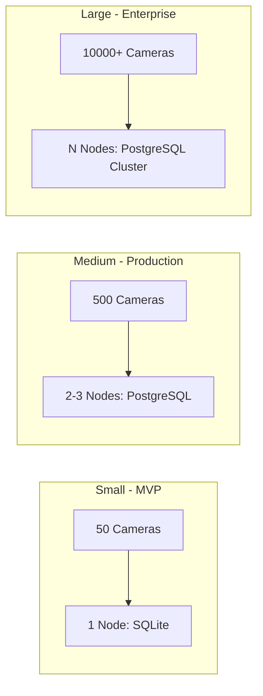

Horizontal scaling is achieved by adding processing nodes to the event processing and API layers. Camera ingestion scales through connection pooling and stream distribution. The AI inference layer scales through GPU acceleration and model batching.

### 4.4 Performance

Performance budgets are allocated per architectural layer:

| Layer            | Budget        | Rationale                                         |
|------------------|---------------|---------------------------------------------------|
| Camera Ingestion | < 100ms       | Frame extraction and normalization must not bottleneck downstream |
| AI Inference     | < 200ms/frame | YOLO detection must keep pace with frame rate      |
| Event Processing | < 100ms/rule  | Rule evaluation must not delay alert generation    |
| API Response     | < 200ms (p95) | Dashboard and integration responsiveness          |
| WebSocket Push   | < 1s          | Real-time alert delivery to dashboard              |

### 4.5 Security

Security is a non-negotiable architectural constraint. Every design decision considers the security implications:

- Authentication enforced on all access paths; fail-closed default
- Role-based access control evaluated at middleware layer before request processing
- All data encrypted in transit (TLS 1.3) and at rest (AES-256)
- Immutable audit trails for every user action and system event
- Evidence integrity verified through SHA-256 content hashing
- No hardcoded secrets; environment-variable-based secrets management

### 4.6 Maintainability

The architecture must support rapid iteration:

- Modular component boundaries enable independent development and deployment
- Database abstraction layer (SQLx) enables SQLite-to-PostgreSQL migration without code changes
- Configuration-driven behavior (rules, retention, notifications) without redeployment
- Structured logging and correlation IDs enable efficient debugging

### 4.7 Availability

Availability is achieved through defense in depth:

- Health checks on all services at 30-second intervals
- Automatic restart on container failure (Docker restart policies)
- Camera stream reconnection with exponential backoff
- Event queue buffering during downstream component unavailability
- Graceful degradation: detection continues when database is unreachable

### 4.8 Extensibility

The architecture must accommodate the Phase 2-5 roadmap without re-architecture:

- New detection models plug into the AI inference pipeline via model registry
- New notification channels (email, SMS, webhook) integrate through a notification dispatcher abstraction
- New API versions deployed alongside existing versions via URL-based routing
- New UI modules added to the dashboard through component-based frontend architecture
- External system integrations (SIEM, access control) connect through the API Gateway

---

## 5. Architectural Principles

| #  | Principle                      | Description                                                                                       |
|----|--------------------------------|---------------------------------------------------------------------------------------------------|
| 1  | **Loose Coupling**             | Modules interact through well-defined interfaces and events, never through direct implementation references. Changes in one module do not cascade to others. |
| 2  | **High Cohesion**              | Related functionality is grouped within module boundaries. Each module has a clear, single purpose with minimal external dependencies. |
| 3  | **Modularity**                 | The platform is composed of independently identifiable modules with distinct ownership. |
| 4  | **Defense in Depth**           | Security controls are applied at every architectural layer. No single control failure compromises the system. |
| 5  | **Observability**              | Every component emits structured logs, metrics, and health signals. System internal state can be inferred from external outputs. |
| 6  | **Reliability**                | The system is designed for graceful degradation. Component failures are isolated, retried, and recovered without data loss. |
| 7  | **Scalability**                | Architecture supports horizontal scaling by adding processing nodes. |
| 8  | **Separation of Concerns**     | Each architectural layer owns a distinct responsibility. Cross-cutting concerns are applied through middleware. |
| 9  | **API-First Design**           | All platform functionality is exposed through defined APIs before UI implementation. APIs are versioned and documented. |
| 10 | **Event-Driven Decoupling**   | High-throughput data paths communicate through internal event channels, decoupling producers from consumers. |
| 11 | **Fail-Closed Security**       | When authentication or authorization services are unavailable, access is denied by default. |
| 12 | **Immutable Evidence**         | Evidence records, once written, are never modified in place. Any change creates a new record with an audit trail. |

---

## 6. Technology Stack

### 6.1 Backend — Rust

| Component    | Selection | Rationale                                                                                   |
|--------------|-----------|---------------------------------------------------------------------------------------------|
| Language     | Rust      | Memory safety without garbage collection; zero-cost abstractions; fearless concurrency; predictable latency for always-on security processing. |
| Web Framework| Axum      | Ergonomic, type-safe request handling built on Tokio and Tower. First-class WebSocket support. Middleware architecture aligns with Tower's layer model. |
| Async Runtime| Tokio     | Industry-standard async runtime for Rust. Work-stealing scheduler handles thousands of concurrent connections on a single process. |
| Database     | SQLx      | Compile-time checked SQL queries against SQLite and PostgreSQL. Async connection pooling. Enables transparent database migration. |
| Serialization| Serde     | De-serialization framework for API request/response handling, configuration parsing, and inter-service message passing. |
| Middleware   | Tower     | Composable middleware layer for rate limiting, timeout, retry, and authorization. |
| Observability| Tracing   | Structured, context-propagating logging and distributed tracing. Integrates with OpenTelemetry. |

**Why Rust for this platform:**

VigilantAI processes video streams from potentially thousands of cameras simultaneously. Each camera produces 5-15 frames per second, each requiring extraction, normalization, and forwarding to the AI pipeline. The event processor must evaluate rules against every detection event within 100 milliseconds. WebSocket connections must push alerts to dozens of concurrent dashboard users within 1 second of event generation.

These requirements demand:
- **Predictable latency** — No garbage collection pauses. Rust delivers consistent sub-millisecond response times.
- **Memory efficiency** — A single processing node handles hundreds of concurrent camera streams. Rust's ownership model eliminates memory leaks.
- **Concurrency** — Tokio's work-stealing scheduler manages thousands of async tasks without thread pool exhaustion.
- **Reliability** — Memory safety guarantees eliminate entire bug categories that cause production crashes in security-critical systems.

### 6.2 AI Service — Python

| Component    | Selection | Rationale                                                                                   |
|--------------|-----------|---------------------------------------------------------------------------------------------|
| Language     | Python    | Dominant language for computer vision and machine learning. Extensive library ecosystem.     |
| Detection    | YOLO      | Real-time object detection architecture. Production-grade accuracy for persons, vehicles, and custom objects. |
| Vision       | OpenCV    | Industry-standard computer vision library. Frame processing, color space conversion, resize, and format normalization. |

**Why Python for AI inference:**

The AI Detection Engine operates as a separate process communicating with the Rust backend through well-defined interfaces. Python provides access to the mature computer vision ecosystem without requiring the Rust backend to depend on C++ vision libraries. The performance-critical path (frame extraction, stream management, event processing, API serving) runs in Rust. The inference path runs in Python with GPU acceleration.

This separation enables:
- Independent scaling of inference and event processing workloads
- Model updates without restarting the Rust backend
- GPU resource isolation between AI and API workloads
- A/B testing of model versions without affecting event processing

### 6.3 Frontend

| Component    | Selection | Rationale                                                                                   |
|--------------|-----------|---------------------------------------------------------------------------------------------|
| Framework    | Next.js   | React-based framework with server-side rendering and optimized static export. Delivers fast dashboard load times. |
| UI Library   | React     | Component-based UI architecture. Declarative rendering for real-time dashboard updates.     |
| Language     | TypeScript| Type safety eliminates runtime UI errors. Compile-time validation of API response shapes.    |
| Styling      | Tailwind CSS | Utility-first CSS framework. Rapid UI development with consistent design tokens.          |

### 6.4 Database

| Component    | Selection | Rationale                                                                                   |
|--------------|-----------|---------------------------------------------------------------------------------------------|
| MVP          | SQLite    | Zero-configuration embedded database. Single-file deployment. Sufficient for single-node MVP with 50-200 cameras. |
| Production   | PostgreSQL| Enterprise-grade relational database. Concurrent read/write access. Replication for high availability. Advanced indexing for time-series queries. |

### 6.5 Deployment

| Component    | Selection | Rationale                                                                                   |
|--------------|-----------|---------------------------------------------------------------------------------------------|
| Containers   | Docker    | Consistent runtime environment across development, staging, and production. Image-based deployment. |
| Orchestration| Docker Compose | Multi-container deployment for MVP. Service definitions, networking, volumes in a single configuration file. |

---

## 7. System Context

The System Context diagram shows VigilantAI and its relationships with external actors and systems:

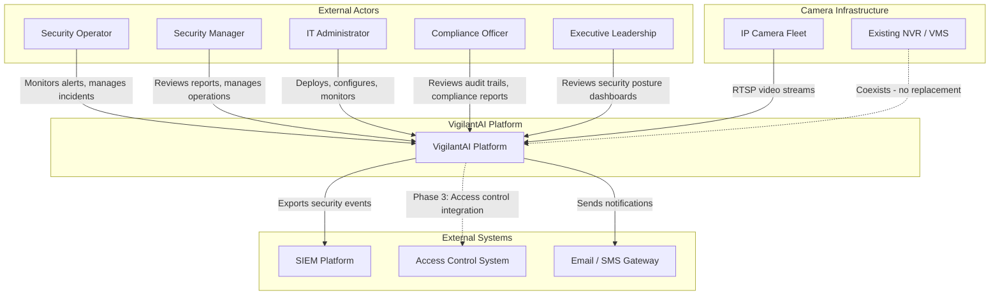

**Key Observations:**

- VigilantAI does not replace the existing NVR or VMS. It operates alongside existing recording infrastructure, adding an intelligence layer on top of camera streams.
- The platform is the sole consumer of RTSP camera feeds for analysis purposes.
- External system integrations (SIEM, access control) are API-driven and implemented through the API Gateway, allowing phased delivery.

---

## 8. High-Level Architecture

The platform is organized into five processing layers with cross-cutting platform services:

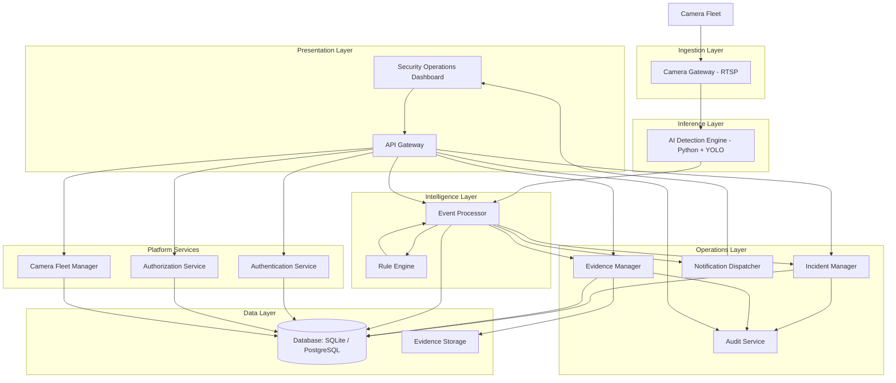

### 8.1 Layer Responsibilities

| Layer            | Components                      | Responsibility                                                  |
|------------------|---------------------------------|-----------------------------------------------------------------|
| Ingestion        | Camera Gateway                  | RTSP connection management, frame extraction, stream health     |
| Inference        | AI Detection Engine             | YOLO object detection, classification, tracking, zone evaluation|
| Intelligence     | Event Processor, Rule Engine    | Event generation, rule evaluation, alert triggering             |
| Operations       | Incident Manager, Evidence Manager, Notification Dispatcher | Incident lifecycle, evidence chain-of-custody, alert delivery |
| Presentation     | Dashboard, API Gateway          | User interface, REST API, WebSocket streaming                   |
| Platform Services| Authentication, Authorization, Audit, Fleet Manager | Identity, access control, audit trails, camera fleet         |
| Data Layer       | Database, Evidence Storage      | Persistent storage for events, incidents, evidence, configuration |

### 8.2 Data Flow Summary

Camera RTSP streams enter through the Camera Gateway, which extracts and normalizes frames. Frames are forwarded to the AI Detection Engine, which runs YOLO inference to produce detection results (object class, bounding box, confidence, tracking ID, zone status).

Detection results flow to the Event Processor, which evaluates them against active rules from the Rule Engine. When rule conditions are met, the Event Processor generates security events, triggers alerts, creates incidents, captures evidence clips, and persists all records to the database.

The Notification Dispatcher pushes real-time alerts to the Dashboard via WebSocket. The Dashboard renders live camera feeds, alert consoles, incident management interfaces, and KPI metrics.

---

## 9. C4 Context Diagram

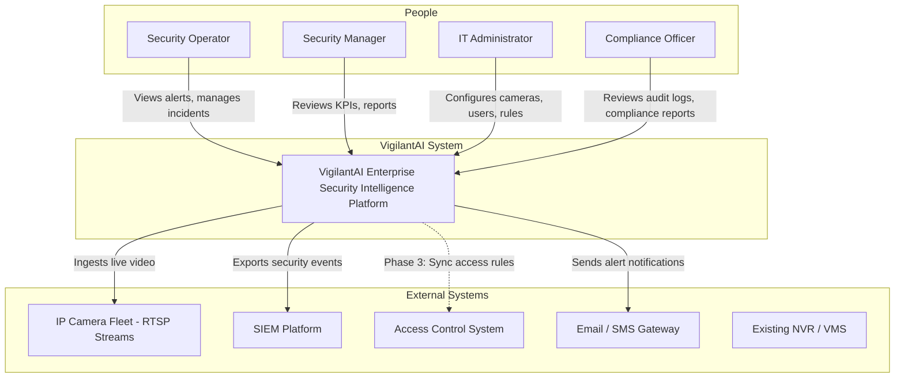

---

## 10. C4 Container Diagram

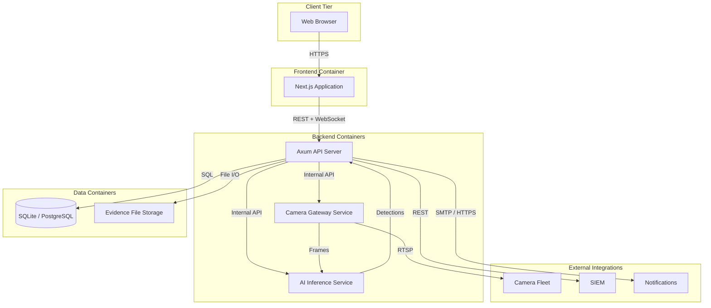

### 10.1 Container Specifications

| Container            | Technology               | Responsibility                                              | Scaling Model        |
|----------------------|--------------------------|-------------------------------------------------------------|-----------------------|
| Next.js Application  | React, TypeScript, Tailwind | Dashboard UI, real-time feeds, alert console              | Static export, CDN    |
| Axum API Server      | Rust, Axum, Tokio, SQLx  | REST API, WebSocket, authentication, authorization, audit   | Horizontal (stateless)|
| AI Inference Service | Python, YOLO, OpenCV     | Object detection, classification, tracking                  | GPU vertical, horizontal |
| Camera Gateway       | Rust, Tokio              | RTSP ingestion, frame extraction, connection management     | Horizontal (per-group)|
| SQLite / PostgreSQL  | Embedded / Server        | Persistent storage for events, incidents, users, config     | PostgreSQL clustering |
| Evidence Storage     | File system / Object store | Video clips, snapshots, evidence metadata                 | Disk expansion        |

---

## 11. Component Architecture

### 11.1 Camera Gateway Components

| Component           | Responsibility                                                      |
|---------------------|---------------------------------------------------------------------|
| Connection Manager  | Establishes and maintains RTSP connections; handles reconnection with exponential backoff |
| Frame Extractor     | Decodes RTSP streams; extracts frames at configurable FPS; normalizes frame format |
| Stream Buffer       | Buffers frames during downstream unavailability; prevents frame loss |
| Health Monitor      | Monitors connection health; reports camera status to Fleet Manager  |

### 11.2 AI Detection Engine Components

| Component           | Responsibility                                                      |
|---------------------|---------------------------------------------------------------------|
| Model Manager       | Loads YOLO model weights; manages model versions; supports rollback |
| Detection Pipeline  | Pre-processes frames; runs YOLO inference; post-processes detections |
| Object Tracker      | Assigns tracking IDs to detected objects; maintains tracks across frames |
| Zone Evaluator      | Evaluates detected objects against configured restricted zones      |

### 11.3 Event Processor Components

| Component           | Responsibility                                                      |
|---------------------|---------------------------------------------------------------------|
| Event Generator     | Creates security events from detection results with classification and severity |
| Rule Evaluator      | Evaluates events against active rules from the Rule Engine         |
| Correlation Engine  | Links related events across cameras into unified timelines         |
| Event Enricher      | Adds contextual data (camera location, zone, time context) to events|

### 11.4 Incident Manager Components

| Component           | Responsibility                                                      |
|---------------------|---------------------------------------------------------------------|
| Incident Creator    | Creates incidents automatically from correlated events or manually by operators |
| Lifecycle Manager   | Manages status transitions: Open, Acknowledged, Investigating, Resolved, Closed |
| Assignment Engine   | Assigns incidents to operators; auto-assigns critical incidents     |
| SLA Tracker         | Tracks SLA timers; flags breaches to management                    |

### 11.5 Evidence Manager Components

| Component           | Responsibility                                                      |
|---------------------|---------------------------------------------------------------------|
| Clip Creator        | Captures evidence clips from camera gateway with pre/post-event footage |
| Integrity Service   | Generates SHA-256 content hashes; verifies hashes on every access   |
| Retention Engine    | Enforces configurable retention policies; archives or deletes expired evidence |
| Custody Recorder    | Records chain-of-custody metadata for every evidence access and action |

### 11.6 Platform Services Components

| Component           | Responsibility                                                      |
|---------------------|---------------------------------------------------------------------|
| Authentication      | User credential verification (bcrypt); JWT token issuance; session management |
| Authorization       | RBAC permission evaluation; data scope filtering; role management   |
| Audit Service       | Immutable audit trail recording; tamper-evident log storage         |
| Fleet Manager       | Camera registration; hierarchical organization; health monitoring   |
| Notification Dispatcher | Real-time dashboard alerts; email delivery; webhook delivery    |
| Reporting Engine    | Operational and compliance report generation; PDF and CSV export   |

---

## 12. Rust Backend Architecture

### 12.1 Project Structure

The Rust backend follows a layered architecture organized by domain concern:

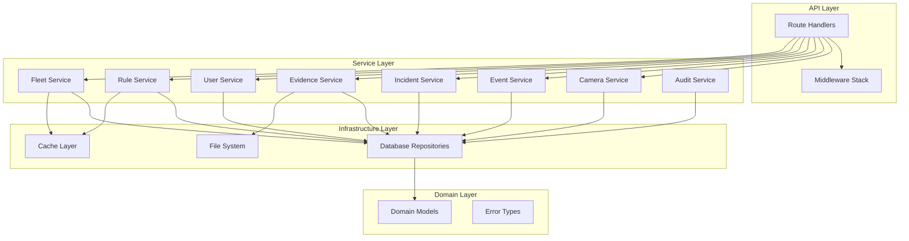

### 12.2 Layered Architecture

| Layer              | Responsibility                                                      | Dependencies             |
|--------------------|---------------------------------------------------------------------|--------------------------|
| API Layer          | HTTP request routing, WebSocket management, request validation      | Service Layer            |
| Service Layer      | Business logic orchestration, transaction management, validation    | Domain + Infrastructure  |
| Domain Layer       | Entity definitions, value objects, error types, business rules      | None (innermost layer)   |
| Infrastructure     | Database access (SQLx), file system operations, cache, external calls| Domain models            |

**Dependency Rule:** Dependencies point inward. The API Layer depends on Services. Services depend on Domain and Infrastructure. The Domain Layer depends on nothing outside itself. Infrastructure depends only on Domain models.

### 12.3 Request Lifecycle

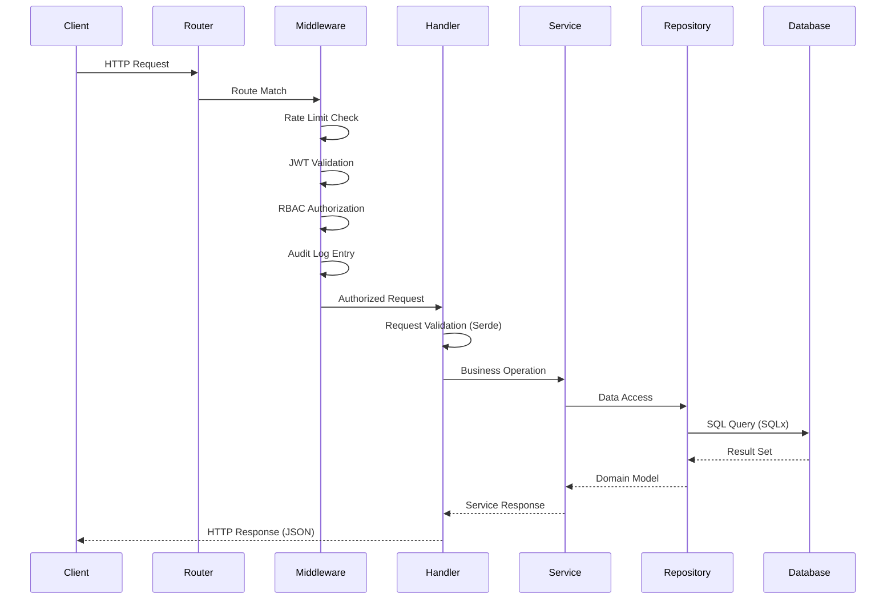

### 12.4 Dependency Injection

All dependencies are injected through Axum's state management. The application state is constructed at startup with concrete implementations of all repositories and services:

- **Database pools** — SQLx connection pool passed as shared state
- **Services** — Instantiated with repository dependencies; shared across request handlers
- **Configuration** — Parsed from environment variables and configuration files; passed as typed structs
- **Cache** — In-memory or Redis-backed; injected into services that require caching

This approach enables:
- Unit testing with mock repositories
- Swapping database backends (SQLite to PostgreSQL) without changing service code
- Replacing cache implementations without modifying business logic

### 12.5 Async Processing Model

The Tokio runtime manages all async operations:

| Task Type              | Concurrency Model                                                  |
|------------------------|---------------------------------------------------------------------|
| API requests           | One Tokio task per request; work-stealing across CPU cores         |
| WebSocket connections  | Long-lived tasks with message broadcasting via broadcast channels  |
| Camera streams         | One Tokio task per camera; connection state machine per stream     |
| Event processing       | Channel-fed workers; bounded backpressure on event queue           |
| Background jobs        | Tokio spawned tasks with interval-based scheduling                 |

### 12.6 Concurrency Model

Rust's ownership system enforces thread safety at compile time:

- **Shared state** uses Arc for reference-counted sharing across async tasks
- **Mutable state** uses tokio::sync::RwLock or tokio::sync::Mutex for concurrent access
- **Event channels** use tokio::sync::mpsc for bounded, backpressure-aware message passing
- **Broadcast channels** use tokio::sync::broadcast for fan-out to multiple WebSocket subscribers

### 12.7 Error Handling Strategy

The backend uses Rust's type system for explicit error handling:

- **Service errors** — Domain-specific error enums with thiserror for each service boundary
- **API errors** — Unified error response format mapped from service errors at the handler layer
- **Database errors** — SQLx errors mapped to domain errors; connection pool errors trigger retry
- **No panics in production** — All error paths handled explicitly; unwrap() prohibited in service and handler code

### 12.8 Logging Strategy

Structured logging via the tracing crate:

- **Correlation IDs** — Generated per request; propagated across all log entries within a request scope
- **Structured fields** — All log entries include camera_id, event_id, user_id, and operation context
- **Log levels** — Configurable per module; default info level for production, debug for development
- **Output format** — JSON for production; human-readable for development

### 12.9 Configuration Management

Configuration is loaded from multiple sources with precedence:

1. **Environment variables** — Highest precedence; used for secrets and deployment-specific values
2. **Configuration file** — YAML or TOML; used for non-secret application configuration
3. **Defaults** — Compiled defaults for all optional configuration values

All configuration is validated at startup. Invalid configuration causes immediate startup failure with descriptive error messages.

---

## 13. AI Service Architecture

### 13.1 Processing Pipeline

```mermaid
graph LR
    subgraph "Input"
        FRAMES[Frame Stream]
    end

    subgraph "Pre-Processing"
        RESIZE[Resize/Normalize]
        COLOR[Color Space]
    end

    subgraph "Inference"
        YOLO[YOLO Model]
    end

    subgraph "Post-Processing"
        NMS[Non-Max Suppression]
        CLASS[Classification]
        CONF[Confidence Scoring]
        TRACK[Object Tracking]
        ZONE[Zone Evaluation]
    end

    subgraph "Output"
        DETECTIONS[Detection Results JSON]
    end

    FRAMES --> RESIZE --> COLOR --> YOLO --> NMS --> CLASS --> CONF --> TRACK --> ZONE --> DETECTIONS
```

### 13.2 Component Responsibilities

| Component          | Input                         | Processing                                      | Output                          |
|--------------------|-------------------------------|--------------------------------------------------|----------------------------------|
| Frame Receiver     | Raw RTSP frames               | Accept frames via IPC from Camera Gateway        | Frame buffer                     |
| Pre-Processor      | Raw frames                    | Resize to model input dimensions; normalize pixel values | Normalized tensors         |
| YOLO Inference     | Normalized tensors            | Run YOLO forward pass; detect objects             | Raw bounding boxes + classes     |
| Post-Processor     | Raw detections                | Non-max suppression; confidence filtering        | Filtered detections              |
| Object Tracker     | Filtered detections           | Assign tracking IDs; associate across frames     | Tracked objects with IDs         |
| Zone Evaluator     | Tracked objects + zone config | Evaluate if objects are within restricted zones  | Zone violation flags             |
| Result Formatter   | All detection metadata        | Serialize to JSON with camera_id, timestamp, detections, zone status | Detection result JSON |

### 13.3 Communication with Backend

**Mode 1: Inter-Process Communication (MVP)**
- Camera Gateway sends frames to the Python process via stdin/JSON pipes
- Detection results returned via stdout as JSON
- Low latency; no network overhead; suitable for single-node deployment

**Mode 2: HTTP API (Production)**
- AI service exposes an internal HTTP endpoint
- Camera Gateway posts frames; receives detection results
- Enables horizontal scaling of inference across multiple GPU nodes
- Load balancing via internal service discovery

### 13.4 Model Management

| Aspect              | Implementation                                                        |
|---------------------|-----------------------------------------------------------------------|
| Model loading       | YOLO weights loaded at startup; configurable model path              |
| Version management  | Multiple model versions stored; active version selectable            |
| Rollback            | Previous model activatable within seconds on current version failure |
| Health reporting    | Model status (loaded, degraded, unavailable) reported to Fleet Manager|
| Fallback            | Motion detection activates if AI model unavailable                   |

---

## 14. Frontend Architecture

### 14.1 Application Structure

| Area                  | Responsibility                                                      |
|-----------------------|---------------------------------------------------------------------|
| Dashboard Layout      | Sidebar navigation, header, alert badge, user menu                 |
| Live Monitoring       | Camera grid view, live feed rendering, camera selection             |
| Alert Console         | Real-time alert list, severity badges, acknowledge/dismiss actions  |
| Incident Management   | Incident list, detail view, status transitions, notes, evidence links|
| Event Timeline        | Chronological event view with filtering by camera, type, severity   |
| Camera Fleet          | Camera registration, health status, hierarchical organization       |
| Administration        | User management, rule configuration, system settings                |
| Reporting             | Report generation, trend analytics, export functionality            |

### 14.2 State Management

| State Type           | Mechanism                                                           |
|----------------------|---------------------------------------------------------------------|
| Server state         | SWR (stale-while-revalidate) for data fetching with automatic cache invalidation |
| Client state         | React Context for UI state (sidebar, modals, filters)              |
| Real-time state      | WebSocket connection for live alerts, incident updates, camera status |
| Authentication state | JWT stored in httpOnly cookie; refresh handled transparently       |

### 14.3 Authentication Flow

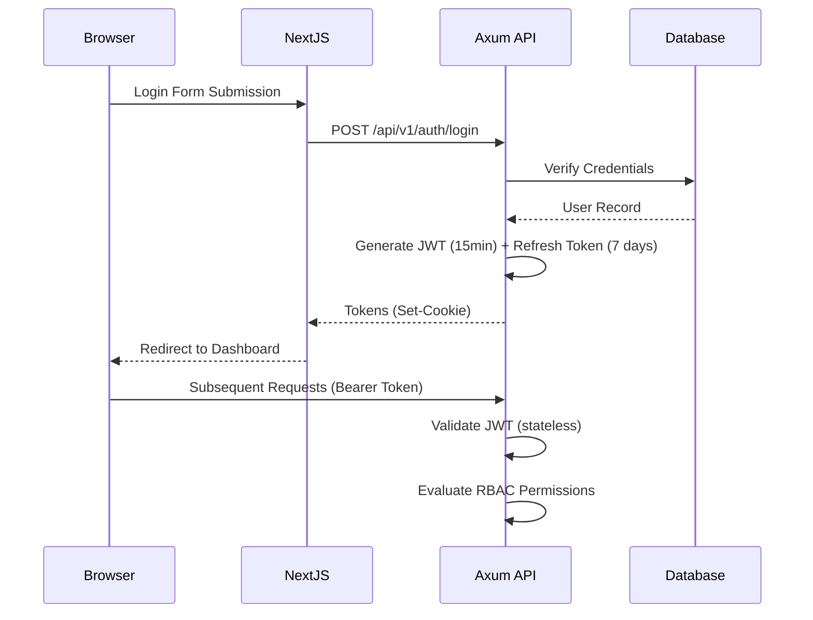

### 14.4 Real-Time WebSocket Updates

The Dashboard maintains a persistent WebSocket connection to the Axum API server. The server pushes relevant updates to each connected client based on their subscription scope (site, camera group, role):

- **Alert Console** — Receives new alerts, alert status changes, and escalation events
- **Incident Queue** — Receives new incidents, status transitions, and assignment notifications
- **Fleet Status** — Receives camera health changes, online/offline transitions
- **KPI Metrics** — Receives aggregated metrics updates at configurable intervals

On disconnect, the client automatically reconnects and synchronizes state by requesting the latest snapshot of all subscribed channels.

---

## 15. Database Architecture

### 15.1 Dual-Database Strategy

| Aspect              | SQLite (MVP)                             | PostgreSQL (Production)                      |
|---------------------|------------------------------------------|----------------------------------------------|
| Deployment          | Embedded; single file; zero config       | Server-based; requires provisioning          |
| Concurrency         | Single-writer; serialized writes         | Full concurrent read/write                   |
| Scaling             | Single-node only                         | Read replicas; connection pooling            |
| Features            | Standard SQL; JSON support               | Full-text search; partitioning; extensions   |
| Use case            | 50 to 200 cameras; single operator node  | 500 to 10,000+ cameras; multi-user deployment|

### 15.2 Repository Pattern

All database access flows through repository interfaces defined in the Domain Layer. Services depend only on repository traits (interfaces). The concrete implementation is selected at application startup based on configuration:

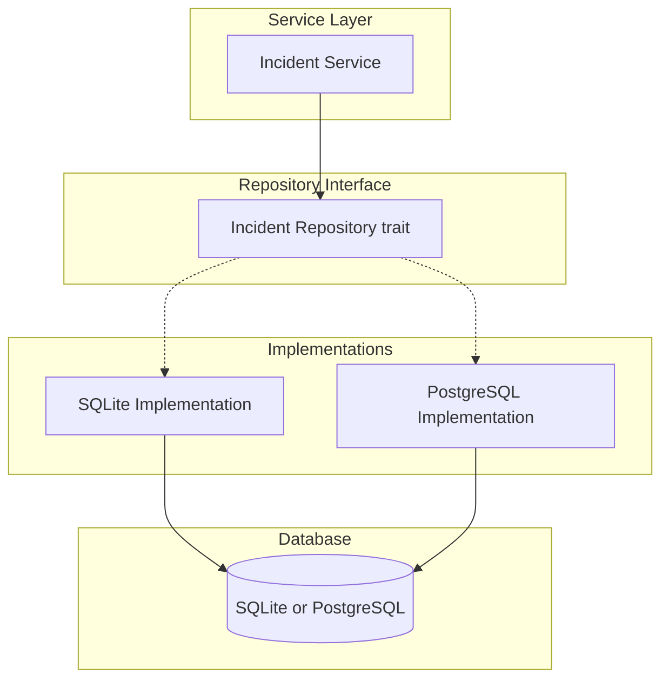

This enables:
- Transparent migration from SQLite to PostgreSQL
- Unit testing with in-memory repositories
- Future support for alternative storage backends

### 15.3 Data Consistency

| Strategy              | Application                                                       |
|-----------------------|-------------------------------------------------------------------|
| Transaction scope     | Multi-table writes wrapped in database transactions               |
| Optimistic locking    | Version fields on mutable entities prevent lost updates           |
| Event sourcing (audit)| Audit log append-only; never modified; serves as event store      |
| Evidence immutability | Evidence records marked immutable after creation; modifications create new records |

### 15.4 Connection Pooling

| Parameter              | SQLite Default    | PostgreSQL Default  |
|------------------------|-------------------|---------------------|
| Max connections        | 1 (single-writer) | 20                  |
| Min idle connections   | 1                 | 5                   |
| Connection timeout     | 5 seconds         | 5 seconds           |
| Idle timeout           | 10 minutes        | 10 minutes          |

---

## 16. Communication Architecture

### 16.1 External Communication

| Protocol | Direction    | Usage                                          | Implementation          |
|----------|-------------|------------------------------------------------|--------------------------|
| RTSP     | Inbound     | Camera stream ingestion                        | Camera Gateway (Rust)    |
| HTTPS    | Bidirectional | Dashboard to API; External system to API      | Axum with TLS termination|
| WebSocket| Bidirectional | Real-time alerts, incident updates            | Axum WebSocket upgrade   |
| SMTP     | Outbound    | Email notifications                            | Notification Dispatcher  |
| HTTPS    | Outbound    | Webhook notifications; SIEM integration        | Notification Dispatcher  |

### 16.2 Internal Communication

| Pattern                | Usage                                          | Implementation                  |
|------------------------|------------------------------------------------|----------------------------------|
| Function calls         | Service to Repository within same process       | Rust trait method calls          |
| Channel messaging      | Event Processor to Alert Dispatcher             | tokio::sync::mpsc bounded channels |
| Broadcast              | Event updates to WebSocket subscribers          | tokio::sync::broadcast channels |
| IPC (stdin/stdout)     | Camera Gateway to AI Detection Engine (MVP)     | JSON pipes                       |
| HTTP (internal)        | Backend to AI Detection Engine (production)     | Axum internal endpoints          |

### 16.3 Request Lifecycle (End-to-End)

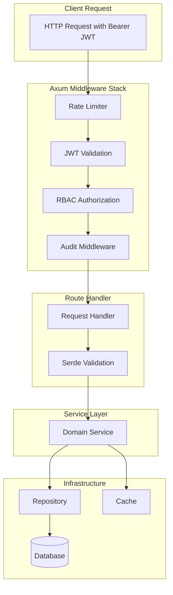

---

## 17. Data Flow

### 17.1 Primary Data Flow — Camera to Dashboard

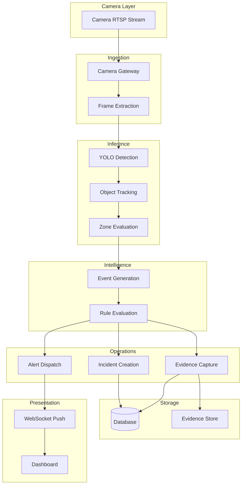

### 17.2 End-to-End Timing

| Stage                | Maximum Latency | Cumulative    |
|----------------------|-----------------|---------------|
| Frame extraction     | 50ms            | 50ms          |
| AI inference         | 200ms           | 250ms         |
| Event processing     | 100ms           | 350ms         |
| Rule evaluation      | 100ms           | 450ms         |
| Alert generation     | 50ms            | 500ms         |
| WebSocket push       | 200ms           | 700ms         |
| Dashboard render     | 300ms           | 1000ms        |
| **Total**            |                 | **< 5s (NFR)**|

---

## 18. Sequence Diagrams

### 18.1 Camera Detection Flow

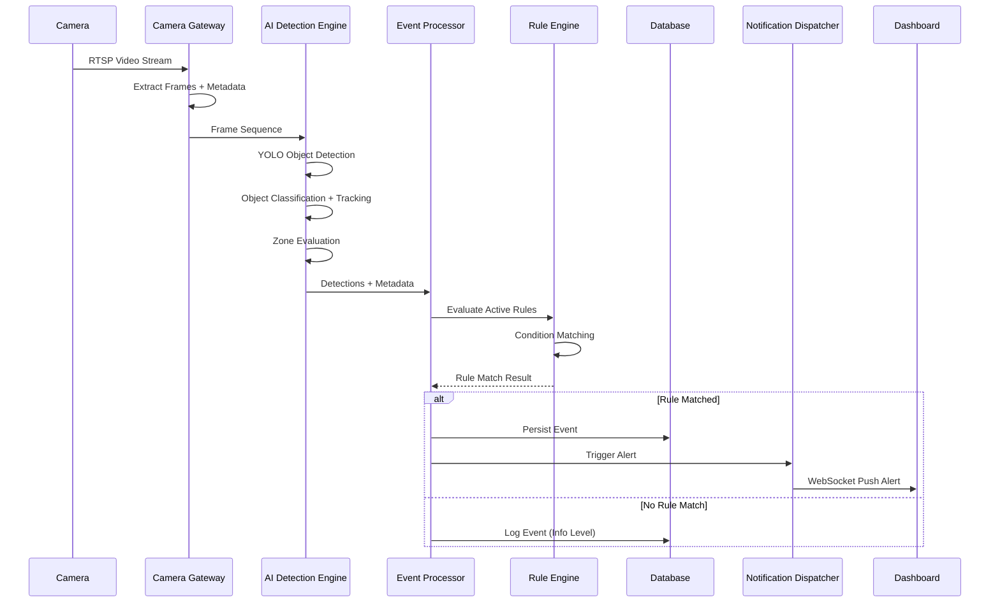

### 18.2 Incident Creation Flow

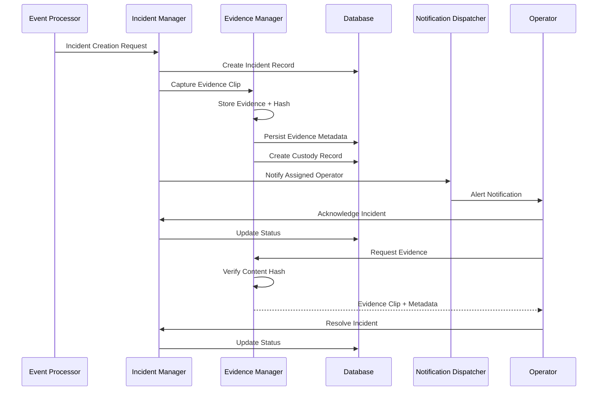

### 18.3 User Login Flow

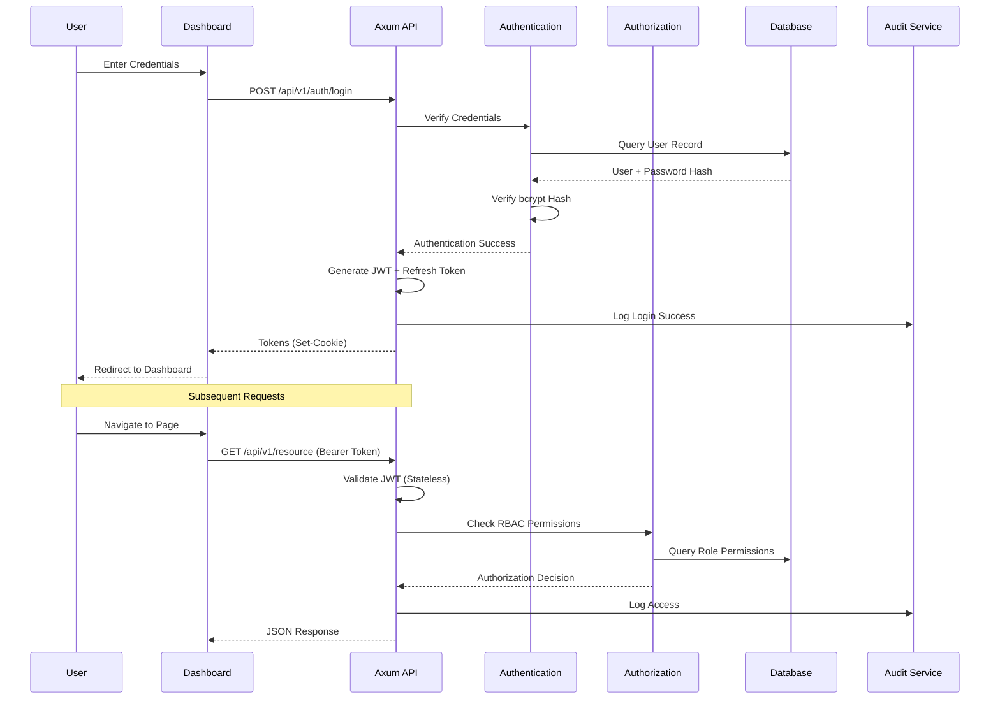

### 18.4 Alert Notification Flow

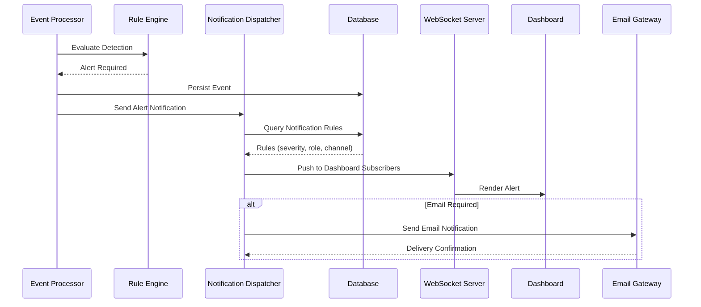

---

## 19. Security Architecture

### 19.1 Authentication Architecture

| Component              | Implementation                                                          |
|------------------------|-------------------------------------------------------------------------|
| Primary Auth           | Username/password with bcrypt hashing                                  |
| Token Model            | JWT access tokens (15 min) + refresh tokens (7 days)                   |
| Token Validation       | Stateless validation using public key cryptography                     |
| Session Management     | Server-side session tracking for revocation capability                 |
| Brute Force Protection | Progressive delays after failed attempts; account lockout after threshold |

### 19.2 Authorization Architecture

| Component                  | Implementation                                                      |
|----------------------------|---------------------------------------------------------------------|
| Access Control Model       | Role-Based Access Control (RBAC) for MVP                           |
| Permission Scope           | Module-level + resource-level permissions                           |
| Role Hierarchy             | Operator, Supervisor, Administrator, System Admin                  |
| Data Scope                 | Site-based and camera-group-based data filtering                    |
| Enforcement Point          | Middleware on all API endpoints and WebSocket connections            |
| Fail-Closed                | Authorization service unavailability results in access denial       |

### 19.3 Encryption Architecture

| Layer                   | Implementation                                                      |
|-------------------------|---------------------------------------------------------------------|
| Encryption at Rest      | AES-256 for evidence storage; database-level encryption for sensitive fields |
| Encryption in Transit   | TLS 1.3 for all external connections                               |
| Secrets Management      | Environment variables; Docker secrets; no hardcoded credentials    |
| Evidence Integrity      | SHA-256 content hash generated on clip creation; verified on access |

### 19.4 API Security

| Control                 | Implementation                                                      |
|-------------------------|---------------------------------------------------------------------|
| Authentication          | Bearer token required on all API endpoints                         |
| Rate Limiting           | Configurable per-endpoint; default 100 requests/minute per user    |
| Input Validation        | Request schema validation; reject malformed payloads               |
| CORS Policy             | Configurable origin whitelist; restrictive defaults                |
| Security Headers        | Content-Security-Policy, X-Frame-Options, HSTS                    |

### 19.5 Audit Trail Architecture

| Event Category            | Logged Data                                                      |
|---------------------------|------------------------------------------------------------------|
| Authentication Events     | Login attempts, successes, failures, lockouts, token refresh     |
| Authorization Events      | Access grants, denials, permission changes                       |
| Data Access Events        | Evidence viewing, export, modification, deletion attempts        |
| Incident Events           | Creation, assignment, status changes, resolution, notes          |
| System Events             | Service startup/shutdown, configuration changes, errors          |
| API Events                | Request metadata, response codes, processing time                |

### 19.6 Compliance Readiness

| Regulation           | Relevant Capabilities                                            |
|----------------------|------------------------------------------------------------------|
| GDPR                 | Data retention policies, right-to-access support, audit trails  |
| CCPA                 | Data access and deletion capabilities, consent tracking         |
| HIPAA                | Access controls, audit logging, encryption at rest and in transit |
| SOC 2                | Comprehensive audit trails, access controls, change management  |

---

## 20. Scalability Strategy

### 20.1 Horizontal Scaling

| Component              | Scaling Strategy                                                  |
|------------------------|-------------------------------------------------------------------|
| API Server             | Stateless; scale by adding Axum instances behind a load balancer |
| Event Processor        | Stateless; scale by adding processing nodes                     |
| Camera Gateway         | Partition cameras across gateway instances by site or camera group |
| AI Inference           | Scale by adding GPU nodes; load balance inference requests       |

### 20.2 Vertical Scaling

| Component              | Scaling Strategy                                                  |
|------------------------|-------------------------------------------------------------------|
| AI Inference           | GPU acceleration; model quantization; batch processing           |
| Database               | PostgreSQL connection tuning; read replicas for read-heavy workloads |
| Evidence Storage       | Tiered storage (hot/warm/cold) with automated lifecycle management |

### 20.3 Camera Fleet Scaling

| Fleet Size       | Architecture                                                     |
|------------------|------------------------------------------------------------------|
| 50-200 cameras   | Single node; SQLite; single AI instance                         |
| 200-1,000 cameras| 2-3 nodes; PostgreSQL; event processor scaling                  |
| 1,000-5,000 cameras| Multiple gateway + event processor instances; PostgreSQL cluster |
| 5,000-10,000+ cameras| Distributed architecture; load balancing; read replicas       |

---

## 21. Reliability and Fault Tolerance

### 21.1 Retry Strategy

| Failure Scenario           | Retry Policy                                                    |
|---------------------------|-----------------------------------------------------------------|
| Camera connection loss    | Exponential backoff: 10s, 30s, 60s, 120s; max 5 retries        |
| Database connection loss  | Exponential backoff: 1s, 2s, 4s, 8s; max 10 retries           |
| AI service unavailable    | Skip frames; retry on next cycle; alert after 30s              |
| External API failure      | Exponential backoff: 5s, 15s, 45s; circuit breaker after 5 failures |
| Email delivery failure    | Exponential backoff: 30s, 60s, 300s; max 3 retries             |

### 21.2 Circuit Breaker Pattern

External service calls (AI inference, email delivery, SIEM integration) are wrapped in circuit breakers:

| State       | Behavior                                                              |
|-------------|-----------------------------------------------------------------------|
| Closed      | Requests pass through; failures counted                              |
| Open        | Requests rejected immediately; fallback behavior activated           |
| Half-Open   | Limited requests pass through to test recovery                       |

### 21.3 Graceful Degradation

| Component Failure          | Degraded Behavior                                                    |
|---------------------------|-----------------------------------------------------------------------|
| AI service down           | Camera Gateway buffers frames; motion detection fallback             |
| Database unreachable      | Event queue buffers events; detection continues; alerts queued       |
| Dashboard unavailable     | Backend processes continue; alerts queued for delivery on recovery   |
| Single camera failure     | Other cameras continue processing; camera flagged for investigation  |
| Evidence store full       | Alert generated; oldest evidence flagged for archival                |

### 21.4 Health Checks

| Service               | Check Method                                                       | Interval |
|-----------------------|--------------------------------------------------------------------|----------|
| Axum API Server       | HTTP GET /health returning service status and component health     | 30s      |
| Camera Gateway        | Connection count, active streams, error rate                       | 30s      |
| AI Inference Service  | Model loaded status, inference latency, GPU utilization            | 60s      |
| Database              | Connection pool status, query latency, replication lag            | 30s      |
| Evidence Storage      | Disk usage, write throughput, integrity check status               | 60s      |

---

## 22. Performance Strategy

### 22.1 Async I/O

All I/O operations in the Rust backend are non-blocking:

- Database queries via SQLx async driver
- File system operations via tokio::fs
- Network calls via tokio::net
- HTTP requests via reqwest (async)

### 22.2 Connection Pooling

| Resource               | Pool Configuration                                                |
|------------------------|-------------------------------------------------------------------|
| Database connections   | Configurable min/max; SQLx pool with async acquisition            |
| Camera RTSP streams    | Connection pool per gateway instance; lazy connect                |
| WebSocket connections  | Managed pool with heartbeat-based cleanup                         |

### 22.3 Caching Strategy

| Cache Target           | Implementation                                                    | Invalidation         |
|------------------------|-------------------------------------------------------------------|----------------------|
| Active rules           | In-memory cache; refreshed on rule change event                   | Rule update triggers |
| User permissions       | In-memory cache per session; TTL-based expiry                     | Role change triggers |
| Camera fleet config    | In-memory cache; refreshed on configuration change                | Config update triggers |
| Dashboard metrics      | Aggregated in application memory; computed on interval            | Periodic refresh     |

### 22.4 Memory Management

| Strategy                | Implementation                                                   |
|-------------------------|------------------------------------------------------------------|
| Frame buffer pooling    | Reuse allocated frame buffers to reduce allocation pressure     |
| Stream buffer limits    | Configurable buffer size per camera stream; drop oldest frames  |
| Evidence clip streaming | Stream evidence clips to storage without buffering entire clip  |
| Database result limits  | Paginated queries; no unbounded result sets                     |

---

## 23. Logging and Observability

### 23.1 Structured Logging

All components emit JSON-structured logs via the tracing crate:

```json
{
  "timestamp": "2026-07-22T10:30:00Z",
  "level": "info",
  "module": "event_processor",
  "correlation_id": "req-abc-123",
  "camera_id": "cam-042",
  "event_id": "evt-789",
  "message": "Security event generated",
  "event_type": "intrusion",
  "severity": "high"
}
```

### 23.2 Metrics

| Metric Category         | Metrics                                                             |
|------------------------|---------------------------------------------------------------------|
| API                    | Request rate, latency (p50/p95/p99), error rate, active connections |
| Detection              | Frames processed/sec, detections/sec, inference latency            |
| Event Processing       | Events generated/sec, rules evaluated/sec, alert queue depth       |
| Camera Gateway         | Active streams, frame drop rate, reconnection attempts             |
| Database               | Query latency, connection pool utilization, write throughput       |
| System                 | CPU usage, memory usage, disk usage, network I/O                  |

### 23.3 Distributed Tracing

Correlation IDs propagate across all service boundaries:

- Generated at API Gateway on each inbound request
- Propagated to all downstream services via headers and log context
- Included in every log entry, metric tag, and trace span
- Retained in database records for post-hoc analysis

### 23.4 Health Endpoints

| Endpoint            | Response                                                          |
|---------------------|-------------------------------------------------------------------|
| /health             | Overall system status; aggregated from all component health checks|
| /health/live        | Liveness probe; returns 200 if process is running                |
| /health/ready       | Readiness probe; returns 200 if all dependencies are available   |

---

## 24. Deployment Architecture

### 24.1 Docker Deployment Topology

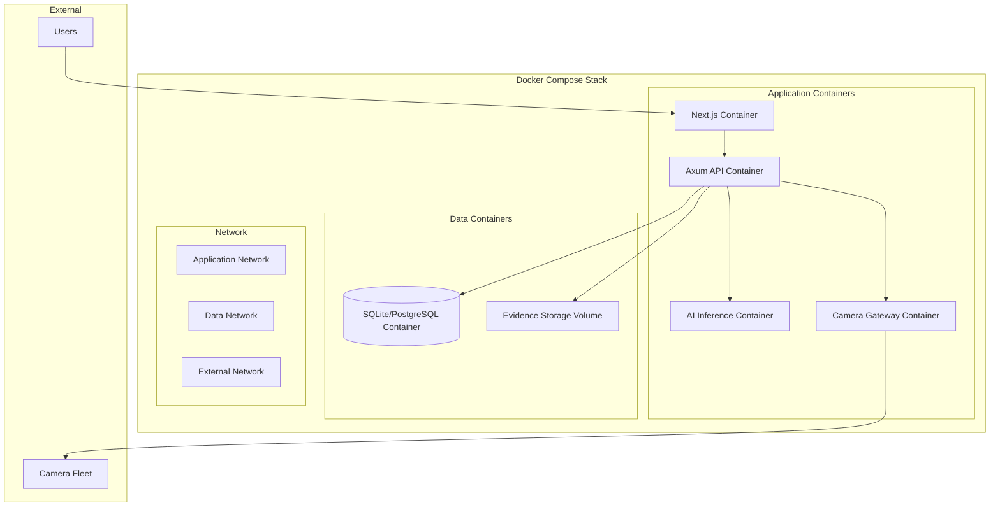

### 24.2 Container Configuration

| Container           | Ports              | Volumes                    | Environment Variables           |
|---------------------|--------------------|-----------------------------|---------------------------------|
| Next.js             | 3000               | None (static export)        | NEXT_PUBLIC_API_URL             |
| Axum API            | 8080               | Evidence storage mount      | DATABASE_URL, JWT_SECRET, CORS_ORIGIN |
| AI Inference        | 8081 (internal)    | Model weights mount         | MODEL_PATH, DEVICE              |
| Camera Gateway      | None (outbound)    | Frame buffer mount          | CAMERA_CONFIG_PATH              |
| PostgreSQL          | 5432               | Data volume                 | POSTGRES_DB, POSTGRES_USER, POSTGRES_PASSWORD |

### 24.3 Environment Variables

| Variable              | Description                                        | Required |
|-----------------------|----------------------------------------------------|----------|
| DATABASE_URL          | Database connection string                         | Yes      |
| JWT_SECRET            | Secret key for JWT signing                         | Yes      |
| CORS_ORIGIN           | Allowed CORS origin for dashboard                  | Yes      |
| MODEL_PATH            | Path to YOLO model weights                         | Yes      |
| DEVICE                | AI inference device (cpu, cuda:0)                  | No       |
| LOG_LEVEL             | Logging level (debug, info, warn, error)           | No       |
| RTSP_PORT             | RTSP port for camera connections                   | No       |

### 24.4 Deployment Profiles

| Profile         | Containers                                | Use Case                      |
|-----------------|-------------------------------------------|-------------------------------|
| Development     | All containers; debug logging; hot reload | Local development             |
| Staging         | All containers; production config; test data | Pre-production validation   |
| Production      | All containers; hardened config; monitoring | Enterprise deployment       |
| Minimal (MVP)   | API + Gateway + AI + SQLite; single node   | Small deployment; 50 cameras  |

---

## 25. Architecture Decision Records

### ADR-001: Backend Language Selection

| Field           | Value                                                           |
|-----------------|-----------------------------------------------------------------|
| **Decision**    | Rust for backend services                                       |
| **Status**      | Accepted                                                        |
| **Context**     | Platform requires real-time processing of thousands of camera streams with predictable latency and high reliability. |
| **Options**     | Rust, Go, Java, C++                                            |
| **Rationale**   | Rust provides memory safety without garbage collection, zero-cost abstractions for high performance, fearless concurrency via the ownership model, and predictable latency critical for a 24/7 security platform. Go's garbage collector introduces latency spikes. Java's runtime overhead is excessive for frame-level processing. C++ lacks memory safety guarantees. |
| **Trade-offs**  | Steeper learning curve than Go or Python. Smaller ecosystem than Java. Requires careful lifetime management. |

### ADR-002: Web Framework Selection

| Field           | Value                                                           |
|-----------------|-----------------------------------------------------------------|
| **Decision**    | Axum as the web framework                                       |
| **Status**      | Accepted                                                        |
| **Context**     | Need a type-safe, async-native web framework with WebSocket support and middleware extensibility. |
| **Options**     | Axum, Actix-web, Warp, Rocket                                  |
| **Rationale**   | Axum is built on Tokio and Tower, providing first-class async support and composable middleware. Tower's middleware layer enables uniform application of authentication, authorization, rate limiting, and audit logging. Strong WebSocket support for real-time dashboard updates. Active community and production use. |
| **Trade-offs**  | Younger ecosystem than Actix-web. Fewer third-party middleware compared to mature frameworks. |

### ADR-003: Database Abstraction

| Field           | Value                                                           |
|-----------------|-----------------------------------------------------------------|
| **Decision**    | SQLx with compile-time checked queries supporting SQLite and PostgreSQL |
| **Status**      | Accepted                                                        |
| **Context**     | MVP requires simple deployment (SQLite), but production requires concurrent access, replication, and advanced features (PostgreSQL). |
| **Options**     | Diesel, SeaORM, SQLx, Raw SQL                                  |
| **Rationale**   | SQLx provides compile-time checked SQL against both SQLite and PostgreSQL. Async connection pooling built-in. Enables transparent migration between database backends without changing query code. No macro-heavy ORM; SQL stays visible and testable. |
| **Trade-offs**  | Less abstraction than a full ORM. Manual query writing required. Schema migrations managed separately. |

### ADR-004: AI Inference Language Separation

| Field           | Value                                                           |
|-----------------|-----------------------------------------------------------------|
| **Decision**    | Python for AI inference, Rust for everything else               |
| **Status**      | Accepted                                                        |
| **Context**     | AI inference requires YOLO, OpenCV, and the Python ML ecosystem. Backend requires Rust for performance and reliability. |
| **Options**     | All-Rust (with ONNX Runtime), Python + Rust, All-Python        |
| **Rationale**   | Python provides the mature computer vision ecosystem (YOLO, OpenCV) without requiring the Rust backend to depend on C++ vision libraries. The performance-critical path (stream management, event processing, API serving) runs in Rust. The inference path runs in Python with GPU acceleration. IPC or internal HTTP enables clean separation. |
| **Trade-offs**  | Two language runtimes to deploy and monitor. IPC overhead. Python GIL limits CPU-bound inference parallelism. |

### ADR-005: Frontend Framework

| Field           | Value                                                           |
|-----------------|-----------------------------------------------------------------|
| **Decision**    | Next.js with React, TypeScript, and Tailwind CSS               |
| **Status**      | Accepted                                                        |
| **Context**     | Dashboard must deliver fast load times, real-time updates, and responsive UI for security operators. |
| **Options**     | Next.js, Remix, Vue/Nuxt, Plain React                           |
| **Rationale**   | Next.js provides optimized static export for fast dashboard loading. React component architecture supports complex dashboard layouts. TypeScript eliminates runtime UI errors. Tailwind CSS enables rapid, consistent UI development. Strong ecosystem for data visualization and WebSocket integration. |
| **Trade-offs**  | Next.js SSR complexity unnecessary for SPA dashboard (mitigated by static export). Bundle size larger than lightweight alternatives. |

### ADR-006: Deployment Strategy

| Field           | Value                                                           |
|-----------------|-----------------------------------------------------------------|
| **Decision**    | Docker Compose for MVP; Kubernetes for Phase 3                  |
| **Status**      | Accepted                                                        |
| **Context**     | MVP requires simple deployment at enterprise pilot customers. Production requires orchestration, scaling, and high availability. |
| **Options**     | Docker Compose, Kubernetes, Bare Metal, VMs                    |
| **Rationale**   | Docker Compose provides multi-container deployment with a single configuration file. Simple enough for enterprise IT teams to operate. Docker images ensure environment consistency. Kubernetes migration in Phase 3 when multi-node scaling and HA are required. |
| **Trade-offs**  | Docker Compose lacks native clustering, auto-scaling, and rolling updates. Manual scaling required. |

---

## 26. Risks and Trade-offs

### 26.1 Technical Risks

| Risk                                         | Likelihood | Impact | Mitigation                                      |
|----------------------------------------------|------------|--------|--------------------------------------------------|
| Rust learning curve slows development        | Medium     | Medium | Team training; incremental adoption; comprehensive documentation |
| Python-Rust IPC overhead at scale            | Low        | Medium | HTTP API mode for production; benchmark before MVP deadline |
| SQLite concurrency limitations at scale      | High       | Medium | PostgreSQL migration path tested in Phase 1; performance benchmarks |
| YOLO model accuracy insufficient             | Medium     | High   | Model versioning; fallback detection; human-in-the-loop validation |
| Camera vendor RTSP compatibility issues      | High       | Medium | Vendor-specific testing matrix; RTSP standard compliance testing |

### 26.2 Performance Risks

| Risk                                         | Likelihood | Impact | Mitigation                                      |
|----------------------------------------------|------------|--------|--------------------------------------------------|
| AI inference latency exceeds 200ms budget    | Medium     | High   | GPU acceleration; model quantization; batch processing; frame sampling |
| WebSocket fan-out degrades at scale          | Low        | Medium | Subscription scoping; message batching; connection limits |
| Database write throughput bottleneck         | Medium     | High   | Event queue buffering; batch writes; PostgreSQL for production |

### 26.3 Security Risks

| Risk                                         | Likelihood | Impact | Mitigation                                      |
|----------------------------------------------|------------|--------|--------------------------------------------------|
| JWT secret compromise                        | Low        | Critical | Environment variables; no hardcoded secrets; key rotation |
| Evidence tampering                           | Low        | Critical | SHA-256 integrity hashing; tamper-evident audit logs |
| API abuse (rate limiting bypass)             | Medium     | Medium | Middleware rate limiting; IP-based throttling; request size limits |

### 26.4 Operational Risks

| Risk                                         | Likelihood | Impact | Mitigation                                      |
|----------------------------------------------|------------|--------|--------------------------------------------------|
| Docker deployment complexity at customer sites | Medium   | Medium | Comprehensive deployment documentation; deployment scripts; customer IT training |
| Monitoring gaps in early deployments         | Medium     | Medium | Health checks from day one; structured logging; metrics from day one |
| Evidence storage growth exceeds capacity     | Medium     | Medium | Retention policy enforcement; storage monitoring; tiered storage |

---

## 27. Future Architecture Roadmap

### Phase 2 — Intelligence Enhancements

| Component              | Enhancement                                                          |
|------------------------|-----------------------------------------------------------------------|
| AI Engine              | Multi-camera event correlation; advanced detection scenarios (loitering, crowd analysis) |
| Event Processor        | Complex event processing (CEP); temporal pattern detection            |
| Rule Engine            | Visual rule builder UI; time-based scheduling; conditional rule chains|
| Notification           | Email, SMS, webhook notification channels                             |
| Reporting              | Operational analytics module; trend reporting                         |
| Database               | Full PostgreSQL production deployment                                 |

### Phase 3 — Enterprise Integration

| Component              | Enhancement                                                          |
|------------------------|-----------------------------------------------------------------------|
| Authentication         | OAuth 2.0 / OIDC; SAML SSO; MFA support                             |
| Integration            | Access control system integration; SIEM platform integration         |
| Deployment             | Kubernetes orchestration; Helm charts; auto-scaling                   |
| Caching                | Redis for distributed caching; session storage; rule caching          |
| API                    | GraphQL support; webhook management; developer portal                |
| Architecture           | High availability and failover; multi-site management                |

### Phase 4 — Advanced AI

| Component              | Enhancement                                                          |
|------------------------|-----------------------------------------------------------------------|
| AI Engine              | Face recognition; license plate recognition; weapon detection; fire/smoke detection; PPE compliance |
| Architecture           | Edge inference deployment; on-camera processing                      |
| Analytics              | Behavior analytics; anomaly detection; crowd density analytics       |

### Phase 5 — Enterprise Intelligence

| Component              | Enhancement                                                          |
|------------------------|-----------------------------------------------------------------------|
| Platform               | Multi-tenant SaaS control plane; cloud deployment; multi-region      |
| AI                     | Predictive threat intelligence engine                                |
| Integration            | Digital twin integration; marketplace for detection models           |
| Architecture           | Microservices decomposition; event streaming (Kafka); service mesh   |

---

## 28. Glossary

| Term                          | Definition                                                                 |
|-------------------------------|----------------------------------------------------------------------------|
| **ADR**                       | Architecture Decision Record — documents significant architectural choices |
| **Axum**                      | Ergonomic Rust web framework built on Tokio and Tower                      |
| **C4 Model**                  | Architecture documentation method: Context, Container, Component, Code     |
| **Camera Gateway**            | Service that ingests RTSP camera streams and extracts frames               |
| **Circuit Breaker**           | Pattern that prevents cascading failures by short-circuiting calls to failing services |
| **Chain of Custody**          | Tamper-evident record of evidence handling from capture to presentation    |
| **Docker Compose**            | Multi-container Docker deployment tool using YAML configuration           |
| **Event Processor**           | Service that evaluates detections against rules and generates events       |
| **Graceful Degradation**      | System maintains critical functions when non-critical components fail      |
| **JWT**                       | JSON Web Token — compact, URL-safe token format for authentication claims |
| **NVR**                       | Network Video Recorder — hardware for recording IP camera video            |
| **RBAC**                      | Role-Based Access Control — permission model based on assigned roles      |
| **Rule Engine**               | Component that evaluates detection events against configurable business rules |
| **RTSP**                      | Real Time Streaming Protocol — standard for accessing live video from cameras |
| **SQLx**                      | Async Rust library for compile-time checked SQL queries                    |
| **Tokio**                     | Industry-standard async runtime for Rust                                  |
| **Tower**                     | Composable middleware framework for Rust services                         |
| **Tracing**                   | Rust crate for structured, context-propagating logging                    |
| **VMS**                       | Video Management System — software for recording and viewing surveillance  |
| **YOLO**                      | You Only Look Once — real-time object detection neural network            |

---

## 29. Appendices

### Appendix A: Architecture Document Map

| Document | Title                              | Relationship to This Document                            |
|----------|------------------------------------|----------------------------------------------------------|
| Doc 01   | Executive Summary                  | Strategic vision; module definitions; technology rationale|
| Doc 02   | Business Requirements              | Business goals, objectives, and acceptance criteria      |
| Doc 03   | System Requirements Specification  | Functional and non-functional requirements               |
| Doc 04   | Software Architecture (this doc)   | Technical architecture and design decisions               |
| Doc 05   | API Specification                  | REST and WebSocket endpoint definitions (forthcoming)    |
| Doc 06   | Database Design                    | Schema definitions and data model (forthcoming)          |

### Appendix B: Technology Version Targets

| Technology        | Version Target        | Notes                                              |
|-------------------|-----------------------|-----------------------------------------------------|
| Rust              | 1.75+                 | Latest stable with async trait support               |
| Axum              | 0.7+                  | Latest stable with Tower integration                |
| Tokio             | 1.x                   | Async runtime                                        |
| SQLx              | 0.7+                  | Async database driver                               |
| Python            | 3.11+                 | AI inference service                                |
| YOLO              | YOLOv8+               | Object detection model                              |
| OpenCV            | 4.x                   | Computer vision library                             |
| Next.js           | 14+                   | React framework                                     |
| TypeScript        | 5.x                   | Type-safe JavaScript                                |
| Tailwind CSS      | 3.x                   | Utility-first CSS                                   |
| Docker            | 24.0+                 | Container runtime                                   |
| Docker Compose    | 2.20+                 | Multi-container orchestration                       |
| PostgreSQL        | 16+                   | Production database (when applicable)               |

### Appendix C: Mermaid Diagram Index

| Diagram                    | Section | Description                                             |
|----------------------------|---------|---------------------------------------------------------|
| Scalability Profiles       | 4.3     | Three deployment profiles (small, medium, large)        |
| System Context             | 7       | External actors and systems                             |
| High-Level Architecture    | 8       | Five-layer architecture with data flow                  |
| C4 Context                 | 9       | Platform in enterprise environment                      |
| C4 Container               | 10      | Runtime containers and communication                    |
| Backend Architecture       | 12.1    | Layered Rust backend structure                          |
| Request Lifecycle          | 12.3    | HTTP request through middleware stack                    |
| AI Processing Pipeline     | 13.1    | Frame to detection result pipeline                      |
| Authentication Flow        | 14.3    | User login through JWT                                  |
| Repository Pattern         | 15.2    | Database abstraction via repository interfaces           |
| Request Lifecycle (E2E)    | 16.3    | End-to-end request flow through infrastructure          |
| Data Flow                  | 17.1    | Camera to dashboard data flow                           |
| Camera Detection           | 18.1    | Detection sequence from camera to alert                 |
| Incident Creation          | 18.2    | Incident lifecycle sequence                             |
| User Login                 | 18.3    | Authentication sequence                                 |
| Alert Notification         | 18.4    | Alert dispatch sequence                                 |
| Deployment Architecture    | 24.1    | Docker Compose deployment topology                      |

---

*End of Document 04: Software Architecture*
