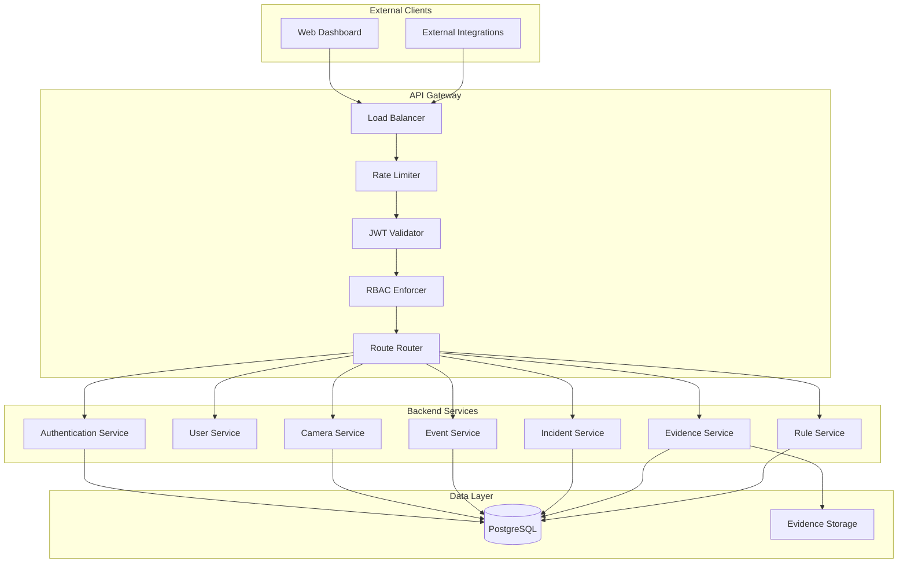
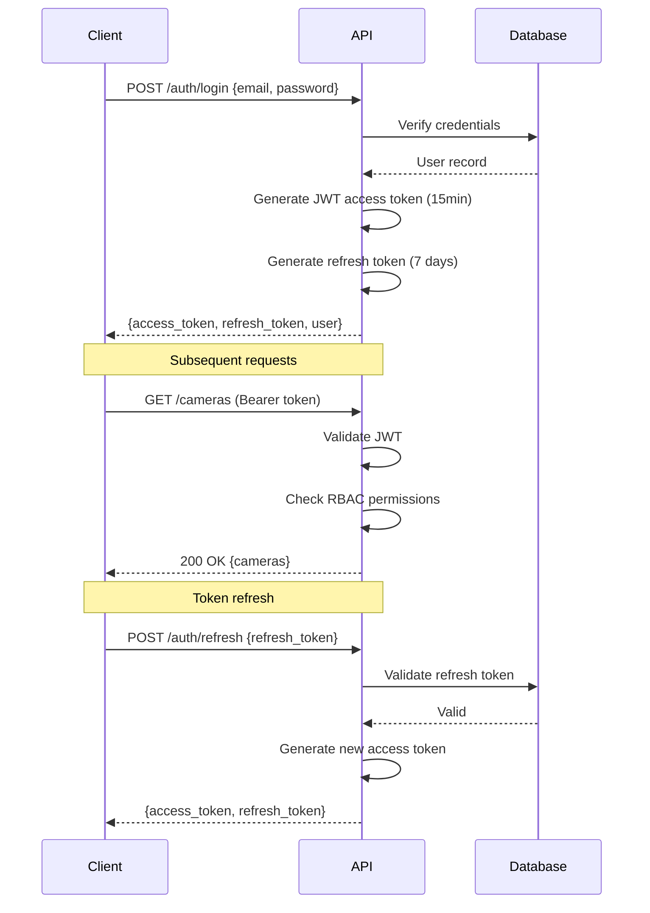
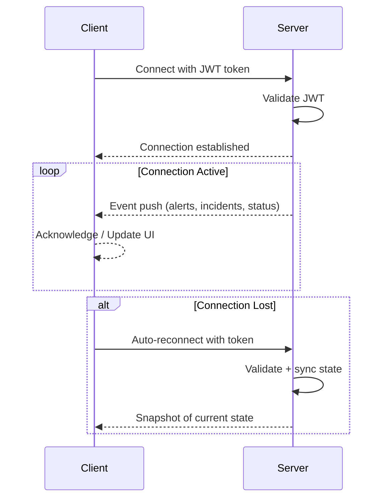
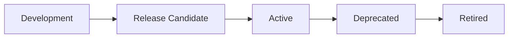

# VigilantAI — API Specification

> **Enterprise Security Intelligence Platform**
> API Specification Document — Version 1.0

---

## Table of Contents

| Section | Title                                           |
|---------|-------------------------------------------------|
| 1       | Document Control                                |
| 2       | Revision History                                |
| 3       | Introduction                                    |
| 4       | API Design Principles                           |
| 5       | API Architecture                                |
| 6       | API Standards                                   |
| 7       | Authentication                                  |
| 8       | Authorization                                   |
| 9       | API Versioning                                  |
| 10      | Request Standards                               |
| 11      | Response Standards                              |
| 12      | Error Handling                                  |
| 13      | Rate Limiting                                   |
| 14      | Common Headers                                  |
| 15      | Authentication APIs                             |
| 16      | User APIs                                       |
| 17      | Role APIs                                       |
| 18      | Site APIs                                       |
| 19      | Camera APIs                                     |
| 20      | Camera Group APIs                               |
| 21      | Rule APIs                                       |
| 22      | Detection APIs                                  |
| 23      | Incident APIs                                   |
| 24      | Evidence APIs                                   |
| 25      | Notification APIs                               |
| 26      | Dashboard APIs                                  |
| 27      | Report APIs                                     |
| 28      | Audit APIs                                      |
| 29      | Health APIs                                     |
| 30      | AI Internal APIs                                |
| 31      | Integration APIs                                |
| 32      | WebSocket APIs                                  |
| 33      | WebSocket Events                                |
| 34      | Request and Response Schemas                    |
| 35      | Pagination                                      |
| 36      | Filtering                                       |
| 37      | Sorting                                         |
| 38      | Search                                          |
| 39      | Security Requirements                           |
| 40      | Performance Requirements                        |
| 41      | API Lifecycle                                   |
| 42      | Future APIs                                     |
| 43      | Glossary                                        |
| 44      | References                                      |
| 45      | Appendices                                      |

---

## 1. Document Control

| Field              | Value                                                     |
|--------------------|-----------------------------------------------------------|
| **Document Title** | API Specification                                         |
| **Product Name**   | VigilantAI Enterprise Security Intelligence Platform      |
| **Document Type**  | Technical API Contract Specification                      |
| **Version**        | 1.0                                                       |
| **Date**           | 2026-07-22                                                |
| **Classification** | Internal — Confidential                                   |
| **Owner**          | Engineering — API Platform                                |
| **Approved By**    | *[Pending Approval]*                                      |
| **Review Cycle**   | Quarterly                                                 |
| **Status**         | Draft — Pending Review                                    |
| **Distribution**   | Backend Engineers, Frontend Engineers, Integration Partners, QA Engineers, Technical Writers |

---

## 2. Revision History

| Version | Date       | Author          | Changes                                         |
|---------|------------|-----------------|-------------------------------------------------|
| 0.1     | 2026-07-22 | Engineering     | Initial draft — all sections                    |
| 1.0     | 2026-07-22 | Engineering     | First release — pending stakeholder review      |

---

## 3. Introduction

### 3.1 Purpose

This API Specification defines the complete set of REST, WebSocket, and internal API contracts for the VigilantAI Enterprise Security Intelligence Platform. It serves as the authoritative reference for all client-server and service-to-service communication interfaces.

This document translates the functional requirements defined in the System Requirements Specification (Document 03) and the software architecture defined in the Software Architecture Document (Document 04) into precise, implementable API contracts.

### 3.2 Scope

This document covers:

- REST API endpoint definitions for all platform modules
- WebSocket event streaming for real-time data delivery
- Internal API contracts between platform services
- Request and response schemas with JSON examples
- Authentication, authorization, and security requirements
- Pagination, filtering, sorting, and search conventions
- Error handling, rate limiting, and performance requirements
- API versioning and lifecycle management

This document does not cover:

- Internal database schemas or data access patterns (covered in Document 05)
- User interface design or interaction patterns
- Deployment architecture or infrastructure configuration
- AI model training or inference internals

### 3.3 References

| Reference                                           | Description                                          |
|-----------------------------------------------------|------------------------------------------------------|
| VigilantAI Executive Summary (Document 01)          | Product vision, architecture, and strategic overview |
| VigilantAI Business Requirements (Document 02)      | Business rationale, goals, and acceptance criteria   |
| VigilantAI System Requirements Specification (Document 03) | Functional and non-functional system requirements |
| VigilantAI Software Architecture (Document 04)      | Technology stack, component architecture, and design decisions |
| VigilantAI Database Design (Document 05)            | Entity definitions, relationships, and data model    |
| OpenAPI Specification 3.1                           | API documentation standard                          |
| RFC 7231 (HTTP/1.1)                                 | HTTP semantics                                       |
| RFC 7519 (JWT)                                      | JSON Web Token specification                         |
| RFC 6455 (WebSocket)                                | WebSocket protocol                                   |

---

## 4. API Design Principles

| #  | Principle                      | Description                                                                                       |
|----|--------------------------------|---------------------------------------------------------------------------------------------------|
| 1  | **RESTful Resource Modeling**  | APIs are organized around resources (nouns) with standard HTTP methods (verbs). URIs represent resource hierarchies. |
| 2  | **Consistent Conventions**     | All endpoints follow identical patterns for pagination, filtering, sorting, error responses, and field naming. |
| 3  | **Versioned Contracts**       | All APIs are versioned via URL path prefix. Breaking changes require new versions. Deprecation follows a defined lifecycle. |
| 4  | **Security by Default**       | Every endpoint requires authentication unless explicitly marked as public. Authorization is enforced at the middleware layer. |
| 5  | **Idempotency**              | PUT, DELETE, and PATCH operations are idempotent. POST operations support idempotency keys for safe retries. |
| 6  | **Schema-Driven**            | All request and response payloads are defined by JSON schemas. Validation occurs at the API gateway. |
| 7  | **Fail-Closed Security**     | If authentication or authorization services are unavailable, all requests are rejected by default. |
| 8  | **Observable by Default**    | All API calls generate structured log entries with correlation IDs, user context, and timing metrics. |
| 9  | **Backward Compatibility**   | Additive changes (new fields, new endpoints) do not require version bumps. Removing or renaming fields requires a new version. |

---

## 5. API Architecture

### 5.1 API Gateway Position

The API Gateway is the sole entry point for all external API communication. It handles request routing, authentication, authorization, rate limiting, and response transformation.



### 5.2 Base URLs

| Environment     | REST API Base URL                              | WebSocket Base URL                               |
|-----------------|------------------------------------------------|--------------------------------------------------|
| Production      | `https://{host}/api/v1`                        | `wss://{host}/ws/v1`                             |
| Development     | `http://localhost:8080/api/v1`                  | `ws://localhost:8080/ws/v1`                       |
| Internal        | `http://localhost:{port}/internal/v1`           | N/A                                              |

### 5.3 API Categories

| Category              | Base Path                    | Description                                      |
|-----------------------|------------------------------|--------------------------------------------------|
| REST API              | `/api/v1`                    | External REST API for clients and integrations   |
| WebSocket API         | `/ws/v1`                     | Real-time event streaming                        |
| Internal API          | `/internal/v1`               | Service-to-service communication                 |

---

## 6. API Standards

### 6.1 HTTP Methods

| Method   | Idempotent | Usage                                          | Request Body | Response Body |
|----------|------------|------------------------------------------------|--------------|---------------|
| `GET`    | Yes        | Retrieve resources or a single resource         | No           | Yes           |
| `POST`   | No         | Create a new resource                           | Yes          | Yes           |
| `PUT`    | Yes        | Replace a resource entirely                     | Yes          | Yes           |
| `PATCH`  | Yes        | Partially update a resource                     | Yes          | Yes           |
| `DELETE` | Yes        | Remove a resource                               | No           | No (204)      |

### 6.2 HTTP Status Codes

| Code  | Usage                                                                |
|-------|----------------------------------------------------------------------|
| `200` | Successful request with response body                                |
| `201` | Resource successfully created                                        |
| `204` | Successful request with no response body (e.g., DELETE)              |
| `400` | Bad request — invalid parameters, missing required fields            |
| `401` | Unauthorized — missing or invalid authentication token               |
| `403` | Forbidden — authenticated but not authorized for this action         |
| `404` | Not found — resource does not exist                                  |
| `409` | Conflict — resource state conflict (e.g., duplicate, version mismatch)|
| `422` | Unprocessable entity — valid JSON but semantically invalid            |
| `429` | Too many requests — rate limit exceeded                              |
| `500` | Internal server error                                                |
| `503` | Service unavailable — temporary outage or maintenance                |

### 6.3 URI Conventions

- All URIs are lowercase and use hyphens as word separators.
- Resources are plural nouns: `/cameras`, `/incidents`, `/users`.
- Sub-resources are nested: `/sites/{site_id}/cameras`.
- IDs are UUIDs in path parameters: `/cameras/{camera_id}`.
- Query parameters use snake_case: `?page_size=20&sort_by=created_at`.
- Actions are represented as sub-resources: `/incidents/{id}/acknowledge`.

### 6.4 Content Types

| Content Type              | Usage                                              |
|---------------------------|----------------------------------------------------|
| `application/json`        | Default for all request and response bodies        |
| `application/octet-stream`| Binary downloads (evidence export)                 |
| `multipart/form-data`     | File uploads (evidence upload)                     |

---

## 7. Authentication

### 7.1 Authentication Model

VigilantAI uses JWT (JSON Web Token) based authentication. Upon successful login, the client receives:

- **Access Token** — Short-lived (15 minutes), carries user identity and roles. Sent as `Authorization: Bearer {token}` header.
- **Refresh Token** — Long-lived (7 days), used to obtain new access tokens without re-authentication. Stored securely by the client.



### 7.2 Token Payload

The JWT access token payload contains:

```json
{
  "sub": "user-uuid",
  "email": "operator@example.com",
  "roles": ["security_analyst"],
  "site_ids": ["site-uuid-1", "site-uuid-2"],
  "iat": 1690000000,
  "exp": 1690000900,
  "iss": "vigilantai"
}
```

### 7.3 Refresh Token Rotation

When a refresh token is used, it is invalidated and a new refresh token is issued. This prevents token reuse attacks. If a revoked refresh token is presented, all tokens for that user session are invalidated.

---

## 8. Authorization

### 8.1 Role-Based Access Control (RBAC)

All API endpoints enforce RBAC. Every authenticated request is evaluated against the user's assigned roles and the endpoint's required permissions.

### 8.2 Predefined Roles

| Role                 | Description                                                      |
|----------------------|------------------------------------------------------------------|
| `system_admin`       | Full system access. Manages users, roles, system configuration.  |
| `security_admin`     | Manages security operations. Configures rules, cameras, sites.   |
| `security_analyst`   | Investigates incidents, manages evidence, reviews detections.    |
| `operator`           | Monitors alerts, acknowledges events, triages incidents.         |
| `viewer`             | Read-only access to dashboards and reports.                      |
| `api_integration`    | Programmatic access for external system integrations.            |

### 8.3 Permission Model

Permissions are defined as `{resource}:{action}` pairs:

| Resource           | Actions                                                |
|--------------------|--------------------------------------------------------|
| `users`            | `create`, `read`, `update`, `delete`, `list`          |
| `roles`            | `create`, `read`, `update`, `delete`, `list`          |
| `sites`            | `create`, `read`, `update`, `delete`, `list`          |
| `cameras`          | `create`, `read`, `update`, `delete`, `list`          |
| `camera_groups`    | `create`, `read`, `update`, `delete`, `list`          |
| `rules`            | `create`, `read`, `update`, `delete`, `list`, `toggle`|
| `detection_events` | `read`, `list`                                         |
| `incidents`        | `create`, `read`, `update`, `list`, `assign`, `notes` |
| `evidence`         | `read`, `list`, `download`, `upload`                  |
| `alerts`           | `read`, `list`, `acknowledge`, `resolve`              |
| `notifications`    | `read`, `list`, `create`, `delete`                    |
| `audit_logs`       | `read`, `list`, `export`                              |
| `reports`          | `create`, `read`, `list`, `export`                    |
| `dashboard`        | `read`                                                 |
| `system_config`    | `read`, `update`                                       |

### 8.4 Role-Permission Matrix

| Permission            | system_admin | security_admin | security_analyst | operator | viewer | api_integration |
|-----------------------|:------------:|:--------------:|:----------------:|:--------:|:------:|:---------------:|
| users:create          | Y            | Y              | -                | -        | -      | -               |
| users:read            | Y            | Y              | Y (own)          | Y (own)  | -      | -               |
| users:update          | Y            | Y              | -                | -        | -      | -               |
| users:delete          | Y            | -              | -                | -        | -      | -               |
| sites:create          | Y            | Y              | -                | -        | -      | -               |
| sites:read            | Y            | Y              | Y                | Y        | Y      | Y               |
| cameras:create        | Y            | Y              | -                | -        | -      | -               |
| cameras:read          | Y            | Y              | Y                | Y        | Y      | Y               |
| cameras:update        | Y            | Y              | -                | -        | -      | -               |
| rules:create          | Y            | Y              | -                | -        | -      | -               |
| rules:toggle          | Y            | Y              | -                | -        | -      | -               |
| incidents:create      | Y            | Y              | Y                | Y        | -      | Y               |
| incidents:read        | Y            | Y              | Y                | Y        | Y      | Y               |
| incidents:update      | Y            | Y              | Y                | Y        | -      | -               |
| incidents:assign      | Y            | Y              | -                | -        | -      | -               |
| evidence:read         | Y            | Y              | Y                | Y        | -      | Y               |
| evidence:download     | Y            | Y              | Y                | -        | -      | Y               |
| alerts:read           | Y            | Y              | Y                | Y        | Y      | Y               |
| alerts:acknowledge    | Y            | Y              | Y                | Y        | -      | -               |
| audit_logs:read       | Y            | Y              | Y                | -        | -      | -               |
| audit_logs:export     | Y            | Y              | -                | -        | -      | -               |
| reports:create        | Y            | Y              | Y                | -        | -      | Y               |
| reports:export        | Y            | Y              | Y                | -        | -      | Y               |
| system_config:read    | Y            | Y              | -                | -        | -      | -               |
| system_config:update  | Y            | -              | -                | -        | -      | -               |

### 8.5 Data Scope Filtering

Users are assigned to specific sites through site access permissions. API queries are automatically scoped to return only data belonging to the user's authorized sites. System admins have global access across all sites.

---

## 9. API Versioning

### 9.1 Versioning Strategy

APIs are versioned via URL path prefix: `/api/v1/`, `/api/v2/`. The current version is **v1**.

### 9.2 Version Lifecycle

| Phase        | Duration       | Description                                                    |
|--------------|----------------|----------------------------------------------------------------|
| Active       | Ongoing        | Current version. Full support, new features added.            |
| Deprecated   | 6 months       | Still functional. Sunset header returned.                      |
| Retired      | After deprecation | Returns 410 Gone. Removed from production.                 |

### 9.3 Deprecation Headers

When an API is deprecated, all responses include:

```
Deprecation: Sat, 01 Jan 2028 00:00:00 GMT
Sunset: Mon, 01 Jul 2028 00:00:00 GMT
Link: </api/v2/docs>; rel="successor-version"
```

---

## 10. Request Standards

### 10.1 Query Parameter Encoding

All query parameters must be URL-encoded. Reserved characters in parameter values must be percent-encoded.

### 10.2 Request Body Validation

All request bodies must be valid JSON. The API gateway validates:

- Content-Type is `application/json` (or `multipart/form-data` for uploads)
- JSON is well-formed
- Required fields are present
- Field types match the schema
- Enum values are within allowed sets

### 10.3 Idempotency Keys

For `POST` operations that may be retried, clients can supply an `Idempotency-Key` header. The server caches the response for 24 hours and returns the same response for duplicate requests with the same key.

---

## 11. Response Standards

### 11.1 Success Response Envelope

All successful responses follow a consistent envelope:

**Single Resource:**

```json
{
  "data": {
    "id": "550e8400-e29b-41d4-a716-446655440000",
    "name": "Main Lobby Camera",
    "status": "online",
    "created_at": "2026-07-22T10:00:00Z"
  }
}
```

**Collection (Paginated):**

```json
{
  "data": [
    { "id": "...", "name": "Camera 1" },
    { "id": "...", "name": "Camera 2" }
  ],
  "pagination": {
    "page": 1,
    "page_size": 20,
    "total_items": 150,
    "total_pages": 8
  },
  "links": {
    "self": "/api/v1/cameras?page=1&page_size=20",
    "next": "/api/v1/cameras?page=2&page_size=20",
    "last": "/api/v1/cameras?page=8&page_size=20"
  }
}
```

### 11.2 Field Naming

All response fields use snake_case: `created_at`, `camera_id`, `is_enabled`.

### 11.3 Timestamps

All timestamps are in ISO 8601 UTC format: `2026-07-22T10:00:00Z`.

### 11.4 UUIDs

All resource identifiers are UUIDs v4: `550e8400-e29b-41d4-a716-446655440000`.

---

## 12. Error Handling

### 12.1 Error Response Format

All error responses follow a consistent format:

```json
{
  "error": {
    "code": "VALIDATION_ERROR",
    "message": "The request body contains invalid fields.",
    "details": [
      {
        "field": "email",
        "code": "INVALID_FORMAT",
        "message": "Must be a valid email address"
      }
    ],
    "request_id": "req-550e8400-e29b-41d4",
    "timestamp": "2026-07-22T10:00:00Z"
  }
}
```

### 12.2 Error Codes

| Code                       | HTTP Status | Description                                     |
|----------------------------|-------------|-------------------------------------------------|
| `VALIDATION_ERROR`         | 400         | Request body or query parameters invalid        |
| `AUTHENTICATION_REQUIRED`  | 401         | No authentication token provided                |
| `INVALID_TOKEN`            | 401         | Token is expired, malformed, or invalid         |
| `INSUFFICIENT_PERMISSIONS` | 403         | Authenticated but not authorized                |
| `RESOURCE_NOT_FOUND`       | 404         | Requested resource does not exist               |
| `RESOURCE_CONFLICT`        | 409         | Resource state conflict                         |
| `RATE_LIMIT_EXCEEDED`      | 429         | Too many requests                               |
| `INTERNAL_ERROR`           | 500         | Unexpected server error                         |
| `SERVICE_UNAVAILABLE`      | 503         | Temporary outage or maintenance                 |


---

## 13. Rate Limiting

### 13.1 Default Limits

| Tier                 | Requests/Minute | Requests/Hour | Burst        |
|----------------------|-----------------|---------------|--------------|
| Standard User        | 100             | 3,000         | 20/sec       |
| API Integration      | 300             | 10,000        | 50/sec       |
| System Admin         | 200             | 6,000         | 30/sec       |

### 13.2 Rate Limit Headers

Every response includes rate limit headers:

```
X-RateLimit-Limit: 100
X-RateLimit-Remaining: 95
X-RateLimit-Reset: 1690000060
```

### 13.3 Exceeded Rate Limits

When rate limits are exceeded, the API returns `429 Too Many Requests` with:

```json
{
  "error": {
    "code": "RATE_LIMIT_EXCEEDED",
    "message": "Rate limit exceeded. Try again in 30 seconds.",
    "retry_after": 30
  }
}
```

---

## 14. Common Headers

### 14.1 Request Headers

| Header                 | Required | Description                                      |
|------------------------|----------|--------------------------------------------------|
| `Authorization`        | Yes      | `Bearer {access_token}`                          |
| `Content-Type`         | Yes*     | `application/json` (required for POST/PUT/PATCH) |
| `Accept`               | No       | `application/json` (default)                     |
| `X-Correlation-ID`     | No       | Client-provided correlation ID for tracing       |
| `Idempotency-Key`      | No       | Unique key for POST idempotency                  |
| `If-None-Match`        | No       | ETag for conditional GET (caching)               |

### 14.2 Response Headers

| Header                 | Description                                           |
|------------------------|-------------------------------------------------------|
| `Content-Type`         | `application/json`                                    |
| `X-Correlation-ID`     | Server-generated or echoed correlation ID             |
| `X-Request-ID`         | Unique identifier for this request                    |
| `X-RateLimit-Limit`    | Maximum requests allowed per window                   |
| `X-RateLimit-Remaining`| Remaining requests in current window                  |
| `X-RateLimit-Reset`    | Unix timestamp when rate limit window resets          |
| `ETag`                 | Entity tag for conditional requests                   |
| `Deprecation`          | Deprecation notice (if applicable)                    |
| `Sunset`               | Sunset date for deprecated endpoints                  |


---

## 15. Authentication APIs

### 15.1 Login

```
POST /api/v1/auth/login
```

**Request Body:**

```json
{
  "email": "operator@company.com",
  "password": "secure_password"
}
```

**Response (200):**

```json
{
  "data": {
    "access_token": "eyJhbGciOiJIUzI1NiIs...",
    "refresh_token": "dGhpcyBpcyBhIHJlZnJl...",
    "token_type": "Bearer",
    "expires_in": 900,
    "user": {
      "id": "550e8400-e29b-41d4-a716-446655440000",
      "email": "operator@company.com",
      "display_name": "John Operator",
      "roles": ["operator"],
      "site_ids": ["site-uuid-1"]
    }
  }
}
```

**Error Responses:**

| Status | Code                    | Condition                          |
|--------|-------------------------|------------------------------------|
| 401    | `INVALID_CREDENTIALS`   | Wrong email or password            |
| 423    | `ACCOUNT_LOCKED`        | Too many failed login attempts     |
| 422    | `VALIDATION_ERROR`      | Missing or malformed fields        |

### 15.2 Refresh Token

```
POST /api/v1/auth/refresh
```

**Request Body:**

```json
{
  "refresh_token": "dGhpcyBpcyBhIHJlZnJl..."
}
```

**Response (200):**

```json
{
  "data": {
    "access_token": "eyJhbGciOiJIUzI1NiIs...",
    "refresh_token": "bmV3IHJlZnJlc2ggdG9r...",
    "token_type": "Bearer",
    "expires_in": 900
  }
}
```

### 15.3 Logout

```
POST /api/v1/auth/logout
Authorization: Bearer {access_token}
```

**Response:** `204 No Content`

Invalidates the current access token and associated refresh token.

### 15.4 Forgot Password

```
POST /api/v1/auth/forgot-password
```

**Request Body:**

```json
{
  "email": "operator@company.com"
}
```

**Response:** `202 Accepted`

Always returns success regardless of whether the email exists (prevents user enumeration).

### 15.5 Reset Password

```
POST /api/v1/auth/reset-password
```

**Request Body:**

```json
{
  "token": "reset-token-from-email",
  "new_password": "new_secure_password"
}
```

**Response:** `200 OK`

### 15.6 Get Current User Profile

```
GET /api/v1/auth/me
Authorization: Bearer {access_token}
```

**Response (200):**

```json
{
  "data": {
    "id": "550e8400-e29b-41d4-a716-446655440000",
    "email": "operator@company.com",
    "display_name": "John Operator",
    "phone": "+1-555-0100",
    "roles": ["operator"],
    "site_ids": ["site-uuid-1"],
    "mfa_enabled": false,
    "last_login_at": "2026-07-22T09:30:00Z",
    "created_at": "2026-01-15T00:00:00Z"
  }
}
```

### 15.7 List Active Sessions

```
GET /api/v1/auth/sessions
Authorization: Bearer {access_token}
```

**Response (200):**

```json
{
  "data": [
    {
      "id": "session-uuid",
      "ip_address": "192.168.1.100",
      "user_agent": "Mozilla/5.0...",
      "created_at": "2026-07-22T09:00:00Z",
      "last_activity_at": "2026-07-22T10:30:00Z",
      "expires_at": "2026-07-29T09:00:00Z"
    }
  ]
}
```

---

## 16. User APIs

### 16.1 List Users

```
GET /api/v1/users?page=1&page_size=20&role=operator&status=active
Authorization: Bearer {access_token}
Required Permission: users:list
```

**Query Parameters:**

| Parameter    | Type   | Required | Description                              |
|--------------|--------|----------|------------------------------------------|
| `page`       | int    | No       | Page number (default: 1)                 |
| `page_size`  | int    | No       | Items per page (default: 20, max: 100)  |
| `role`       | string | No       | Filter by role name                      |
| `status`     | string | No       | Filter by status (active, inactive)      |
| `search`     | string | No       | Search by name or email                  |
| `sort_by`    | string | No       | Sort field (default: created_at)         |
| `sort_order` | string | No       | asc or desc (default: desc)              |

**Response (200):** Paginated user list (see Section 11.1 for envelope format).

### 16.2 Get User

```
GET /api/v1/users/{user_id}
Authorization: Bearer {access_token}
Required Permission: users:read
```

**Response (200):**

```json
{
  "data": {
    "id": "550e8400-e29b-41d4-a716-446655440000",
    "email": "operator@company.com",
    "display_name": "John Operator",
    "phone": "+1-555-0100",
    "status": "active",
    "roles": [
      {
        "id": "role-uuid",
        "name": "operator",
        "description": "Security Operator"
      }
    ],
    "site_ids": ["site-uuid-1"],
    "mfa_enabled": false,
    "last_login_at": "2026-07-22T09:30:00Z",
    "created_at": "2026-01-15T00:00:00Z",
    "updated_at": "2026-07-20T12:00:00Z"
  }
}
```

### 16.3 Create User

```
POST /api/v1/users
Authorization: Bearer {access_token}
Required Permission: users:create
```

**Request Body:**

```json
{
  "email": "newuser@company.com",
  "display_name": "New Operator",
  "phone": "+1-555-0101",
  "password": "initial_password",
  "role_ids": ["role-uuid-operator"],
  "site_ids": ["site-uuid-1"]
}
```

**Response:** `201 Created` with user object.

### 16.4 Update User

```
PATCH /api/v1/users/{user_id}
Authorization: Bearer {access_token}
Required Permission: users:update
```

**Request Body (partial update):**

```json
{
  "display_name": "John Smith",
  "phone": "+1-555-0199",
  "role_ids": ["role-uuid-analyst"],
  "site_ids": ["site-uuid-1", "site-uuid-2"]
}
```

**Response:** `200 OK` with updated user object.

### 16.5 Delete User (Deactivate)

```
DELETE /api/v1/users/{user_id}
Authorization: Bearer {access_token}
Required Permission: users:delete
```

**Response:** `204 No Content`

Performs soft deletion. User is deactivated, not permanently removed. All active sessions are invalidated.

---

## 17. Role APIs

### 17.1 List Roles

```
GET /api/v1/roles
Authorization: Bearer {access_token}
Required Permission: roles:list
```

**Response (200):**

```json
{
  "data": [
    {
      "id": "role-uuid",
      "name": "operator",
      "description": "Security Operator - monitors alerts and manages incidents",
      "is_system_role": true,
      "user_count": 15,
      "created_at": "2026-01-01T00:00:00Z"
    }
  ]
}
```

### 17.2 Get Role

```
GET /api/v1/roles/{role_id}
Authorization: Bearer {access_token}
Required Permission: roles:read
```

**Response (200):** Role object with full permission list.

### 17.3 Create Role

```
POST /api/v1/roles
Authorization: Bearer {access_token}
Required Permission: roles:create
```

**Request Body:**

```json
{
  "name": "custom_analyst",
  "description": "Custom analyst with limited permissions",
  "permission_ids": ["perm-uuid-1", "perm-uuid-2"]
}
```

**Response:** `201 Created` with role object.

### 17.4 Update Role

```
PATCH /api/v1/roles/{role_id}
Authorization: Bearer {access_token}
Required Permission: roles:update
```

**Request Body:** Partial update. System roles can only have their description updated.

### 17.5 Get Role Permissions

```
GET /api/v1/roles/{role_id}/permissions
Authorization: Bearer {access_token}
Required Permission: roles:read
```

**Response (200):**

```json
{
  "data": [
    {
      "id": "perm-uuid",
      "resource": "incidents",
      "action": "create",
      "description": "Create new incidents"
    }
  ]
}
```

### 17.6 Update Role Permissions

```
PUT /api/v1/roles/{role_id}/permissions
Authorization: Bearer {access_token}
Required Permission: roles:update
```

**Request Body:**

```json
{
  "permission_ids": ["perm-uuid-1", "perm-uuid-2", "perm-uuid-3"]
}
```

Replaces all permissions for the role. System role permissions cannot be modified.

---

## 18. Site APIs

### 18.1 List Sites

```
GET /api/v1/sites?page=1&page_size=20&status=active
Authorization: Bearer {access_token}
Required Permission: sites:list
```

**Response (200):** Paginated site list.

### 18.2 Get Site

```
GET /api/v1/sites/{site_id}
Authorization: Bearer {access_token}
Required Permission: sites:read
```

**Response (200):**

```json
{
  "data": {
    "id": "site-uuid-1",
    "name": "Corporate HQ",
    "address": "123 Main Street",
    "city": "San Francisco",
    "state": "CA",
    "country": "US",
    "timezone": "America/Los_Angeles",
    "latitude": 37.7749,
    "longitude": -122.4194,
    "status": "active",
    "camera_count": 45,
    "camera_group_count": 5,
    "metadata": {},
    "created_at": "2026-01-01T00:00:00Z",
    "updated_at": "2026-07-20T12:00:00Z"
  }
}
```

### 18.3 Create Site

```
POST /api/v1/sites
Authorization: Bearer {access_token}
Required Permission: sites:create
```

**Request Body:**

```json
{
  "name": "Warehouse West",
  "address": "456 Industrial Blvd",
  "city": "Oakland",
  "state": "CA",
  "country": "US",
  "timezone": "America/Los_Angeles",
  "latitude": 37.8044,
  "longitude": -122.2712,
  "metadata": {
    "building_type": "warehouse",
    "square_footage": 50000
  }
}
```

**Response:** `201 Created` with site object.

### 18.4 Update Site

```
PATCH /api/v1/sites/{site_id}
Authorization: Bearer {access_token}
Required Permission: sites:update
```

### 18.5 Delete Site

```
DELETE /api/v1/sites/{site_id}
Authorization: Bearer {access_token}
Required Permission: sites:delete
```

**Response:** `204 No Content`. Fails if site has active cameras.

### 18.6 Get Site Hierarchy

```
GET /api/v1/sites/{site_id}/hierarchy
Authorization: Bearer {access_token}
Required Permission: sites:read
```

**Response (200):**

```json
{
  "data": {
    "site": {
      "id": "site-uuid-1",
      "name": "Corporate HQ"
    },
    "camera_groups": [
      {
        "id": "group-uuid-1",
        "name": "Main Lobby",
        "cameras": [
          { "id": "cam-uuid-1", "name": "Lobby Front", "status": "online" },
          { "id": "cam-uuid-2", "name": "Lobby Rear", "status": "online" }
        ]
      }
    ]
  }
}
```

---

## 19. Camera APIs

### 19.1 List Cameras

```
GET /api/v1/cameras?site_id={site_id}&group_id={group_id}&status=online&page=1&page_size=20
Authorization: Bearer {access_token}
Required Permission: cameras:list
```

**Query Parameters:**

| Parameter    | Type   | Required | Description                              |
|--------------|--------|----------|------------------------------------------|
| `site_id`    | uuid   | No       | Filter by site                           |
| `group_id`   | uuid   | No       | Filter by camera group                   |
| `status`     | string | No       | Filter by status (online, offline, maintenance) |
| `search`     | string | No       | Search by camera name                    |
| `page`       | int    | No       | Page number (default: 1)                 |
| `page_size`  | int    | No       | Items per page (default: 20, max: 100)  |

### 19.2 Get Camera

```
GET /api/v1/cameras/{camera_id}
Authorization: Bearer {access_token}
Required Permission: cameras:read
```

**Response (200):**

```json
{
  "data": {
    "id": "cam-uuid-1",
    "site_id": "site-uuid-1",
    "camera_group_id": "group-uuid-1",
    "name": "Main Lobby Camera",
    "rtsp_url": "rtsp://192.168.10.101:554/stream1",
    "status": "online",
    "fps": 15,
    "resolution_width": 1920,
    "resolution_height": 1080,
    "night_vision_enabled": true,
    "motion_detection_enabled": true,
    "storage_mode": "continuous",
    "health": {
      "status": "healthy",
      "fps_actual": 15,
      "bitrate_kbps": 4096,
      "latency_ms": 50,
      "packet_loss_percent": 0,
      "last_checked_at": "2026-07-22T10:30:00Z"
    },
    "metadata": {},
    "created_at": "2026-01-15T00:00:00Z",
    "updated_at": "2026-07-20T12:00:00Z"
  }
}
```

### 19.3 Create Camera

```
POST /api/v1/cameras
Authorization: Bearer {access_token}
Required Permission: cameras:create
```

**Request Body:**

```json
{
  "site_id": "site-uuid-1",
  "camera_group_id": "group-uuid-1",
  "name": "Parking Lot Camera",
  "rtsp_url": "rtsp://192.168.10.102:554/stream1",
  "fps": 15,
  "resolution_width": 1920,
  "resolution_height": 1080,
  "night_vision_enabled": true,
  "motion_detection_enabled": true,
  "storage_mode": "motion",
  "metadata": {}
}
```

**Response:** `201 Created` with camera object.

### 19.4 Update Camera

```
PATCH /api/v1/cameras/{camera_id}
Authorization: Bearer {access_token}
Required Permission: cameras:update
```

### 19.5 Get Camera Health

```
GET /api/v1/cameras/{camera_id}/health?period=24h
Authorization: Bearer {access_token}
Required Permission: cameras:read
```

**Response (200):**

```json
{
  "data": {
    "current": {
      "status": "online",
      "fps_actual": 15,
      "bitrate_kbps": 4096,
      "latency_ms": 50,
      "packet_loss_percent": 0
    },
    "uptime_percent": 99.8,
    "health_history": [
      {
        "recorded_at": "2026-07-22T10:00:00Z",
        "status": "online",
        "fps_actual": 15
      }
    ]
  }
}
```

### 19.6 Delete Camera

```
DELETE /api/v1/cameras/{camera_id}
Authorization: Bearer {access_token}
Required Permission: cameras:delete
```

**Response:** `204 No Content`. Camera stream is disconnected and decommissioned.

---

## 20. Camera Group APIs

### 20.1 List Camera Groups

```
GET /api/v1/camera-groups?site_id={site_id}
Authorization: Bearer {access_token}
Required Permission: camera_groups:list
```

### 20.2 Get Camera Group

```
GET /api/v1/camera-groups/{group_id}
Authorization: Bearer {access_token}
Required Permission: camera_groups:read
```

**Response (200):**

```json
{
  "data": {
    "id": "group-uuid-1",
    "site_id": "site-uuid-1",
    "name": "Main Lobby",
    "description": "Cameras covering main entrance and lobby area",
    "status": "active",
    "camera_count": 4,
    "cameras": [
      { "id": "cam-uuid-1", "name": "Lobby Front", "status": "online" },
      { "id": "cam-uuid-2", "name": "Lobby Rear", "status": "online" },
      { "id": "cam-uuid-3", "name": "Elevator Hall", "status": "online" },
      { "id": "cam-uuid-4", "name": "Stairwell", "status": "offline" }
    ],
    "created_at": "2026-01-15T00:00:00Z"
  }
}
```

### 20.3 Create Camera Group

```
POST /api/v1/camera-groups
Authorization: Bearer {access_token}
Required Permission: camera_groups:create
```

**Request Body:**

```json
{
  "site_id": "site-uuid-1",
  "name": "Parking Garage",
  "description": "All cameras in parking structure B1-B3"
}
```

### 20.4 Update Camera Group

```
PATCH /api/v1/camera-groups/{group_id}
Authorization: Bearer {access_token}
Required Permission: camera_groups:update
```

### 20.5 Delete Camera Group

```
DELETE /api/v1/camera-groups/{group_id}
Authorization: Bearer {access_token}
Required Permission: camera_groups:delete
```

**Response:** `204 No Content`. Cameras are unassigned but not deleted.

---

## 21. Rule APIs

### 21.1 List Rules

```
GET /api/v1/rules?site_id={site_id}&is_enabled=true&rule_type=intrusion&page=1&page_size=20
Authorization: Bearer {access_token}
Required Permission: rules:list
```

**Query Parameters:**

| Parameter    | Type   | Required | Description                              |
|--------------|--------|----------|------------------------------------------|
| `site_id`    | uuid   | No       | Filter by site                           |
| `is_enabled` | bool   | No       | Filter by enabled status                 |
| `rule_type`  | string | No       | Filter by type (intrusion, motion, zone, schedule) |
| `severity`   | string | No       | Filter by severity level                 |
| `search`     | string | No       | Search by rule name                      |

### 21.2 Get Rule

```
GET /api/v1/rules/{rule_id}
Authorization: Bearer {access_token}
Required Permission: rules:read
```

**Response (200):**

```json
{
  "data": {
    "id": "rule-uuid-1",
    "site_id": "site-uuid-1",
    "name": "After-Hours Intrusion Detection",
    "description": "Detect unauthorized person presence between 6PM and 6AM",
    "rule_type": "intrusion",
    "conditions": {
      "object_classes": ["person"],
      "time_schedule": {
        "type": "daily",
        "start_time": "18:00",
        "end_time": "06:00",
        "timezone": "America/Los_Angeles"
      },
      "min_confidence": 0.7,
      "duration_seconds": 10
    },
    "actions": {
      "create_incident": true,
      "alert_severity": "high",
      "notification_channels": ["dashboard", "email"]
    },
    "severity": "high",
    "is_enabled": true,
    "priority": 1,
    "created_at": "2026-03-15T00:00:00Z",
    "updated_at": "2026-07-20T12:00:00Z"
  }
}
```

### 21.3 Create Rule

```
POST /api/v1/rules
Authorization: Bearer {access_token}
Required Permission: rules:create
```

**Request Body:**

```json
{
  "site_id": "site-uuid-1",
  "name": "Restricted Zone - Server Room",
  "description": "Alert when any person enters the server room zone",
  "rule_type": "zone",
  "conditions": {
    "object_classes": ["person"],
    "zone_ids": ["zone-server-room"],
    "min_confidence": 0.8
  },
  "actions": {
    "create_incident": true,
    "alert_severity": "critical",
    "notification_channels": ["dashboard", "email", "webhook"]
  },
  "severity": "critical",
  "priority": 1
}
```

### 21.4 Update Rule

```
PATCH /api/v1/rules/{rule_id}
Authorization: Bearer {access_token}
Required Permission: rules:update
```

### 21.5 Toggle Rule

```
POST /api/v1/rules/{rule_id}/toggle
Authorization: Bearer {access_token}
Required Permission: rules:toggle
```

**Response (200):**

```json
{
  "data": {
    "id": "rule-uuid-1",
    "is_enabled": false,
    "updated_at": "2026-07-22T10:30:00Z"
  }
}
```

### 21.6 Delete Rule

```
DELETE /api/v1/rules/{rule_id}
Authorization: Bearer {access_token}
Required Permission: rules:delete
```

**Response:** `204 No Content`. Default safety rules cannot be deleted.


---

## 22. Detection APIs

### 22.1 List Detection Events

```
GET /api/v1/detections?camera_id={id}&event_type=person&severity=high&from=2026-07-01T00:00:00Z&to=2026-07-22T23:59:59Z&page=1&page_size=20
Authorization: Bearer {access_token}
Required Permission: detection_events:list
```

**Query Parameters:**

| Parameter     | Type     | Required | Description                                    |
|---------------|----------|----------|------------------------------------------------|
| `camera_id`   | uuid     | No       | Filter by camera                              |
| `site_id`     | uuid     | No       | Filter by site                                |
| `event_type`  | string   | No       | Filter (person, vehicle, object, intrusion)    |
| `severity`    | string   | No       | Filter (critical, high, medium, low)          |
| `from`        | datetime | No       | Start of time range (ISO 8601)                |
| `to`          | datetime | No       | End of time range (ISO 8601)                  |
| `rule_id`     | uuid     | No       | Filter by triggering rule                     |

**Response (200):**

```json
{
  "data": [
    {
      "id": "event-uuid-1",
      "camera_id": "cam-uuid-1",
      "camera_name": "Main Lobby Camera",
      "rule_id": "rule-uuid-1",
      "event_type": "person",
      "severity": "high",
      "confidence_score": 0.92,
      "detected_objects": [
        {
          "class": "person",
          "confidence": 0.92,
          "bounding_box": { "x": 120, "y": 80, "width": 200, "height": 400 },
          "tracking_id": "track-001"
        }
      ],
      "zone_id": "zone-lobby",
      "processing_status": "completed",
      "detected_at": "2026-07-22T22:15:00Z",
      "created_at": "2026-07-22T22:15:01Z"
    }
  ],
  "pagination": { "page": 1, "page_size": 20, "total_items": 342, "total_pages": 18 }
}
```

### 22.2 Get Detection Event

```
GET /api/v1/detections/{event_id}
Authorization: Bearer {access_token}
Required Permission: detection_events:read
```

### 22.3 Detection Statistics

```
GET /api/v1/detections/statistics?site_id={id}&from=2026-07-01T00:00:00Z&to=2026-07-22T23:59:59Z
Authorization: Bearer {access_token}
Required Permission: detection_events:list
```

**Response (200):**

```json
{
  "data": {
    "total_detections": 15420,
    "by_type": {
      "person": 9200,
      "vehicle": 4100,
      "object": 2120
    },
    "by_severity": {
      "critical": 45,
      "high": 320,
      "medium": 1800,
      "low": 13255
    },
    "by_camera": [
      { "camera_id": "cam-uuid-1", "camera_name": "Lobby Front", "count": 3200 }
    ],
    "hourly_distribution": [
      { "hour": 0, "count": 120 },
      { "hour": 1, "count": 85 }
    ],
    "average_confidence": 0.87
  }
}
```

---

## 23. Incident APIs

### 23.1 List Incidents

```
GET /api/v1/incidents?status=open&severity=high&assigned_to={user_id}&page=1&page_size=20
Authorization: Bearer {access_token}
Required Permission: incidents:list
```

**Query Parameters:**

| Parameter      | Type     | Required | Description                                    |
|----------------|----------|----------|------------------------------------------------|
| `status`       | string   | No       | Filter (open, acknowledged, investigating, resolved, closed) |
| `severity`     | string   | No       | Filter (critical, high, medium, low)          |
| `priority`     | string   | No       | Filter (p1, p2, p3, p4)                       |
| `assigned_to`  | uuid     | No       | Filter by assigned user                       |
| `site_id`      | uuid     | No       | Filter by site                                |
| `from`         | datetime | No       | Start of time range                           |
| `to`           | datetime | No       | End of time range                             |

**Response (200):**

```json
{
  "data": [
    {
      "id": "inc-uuid-1",
      "title": "Unauthorized Access - Server Room",
      "severity": "critical",
      "priority": "p1",
      "status": "open",
      "site_id": "site-uuid-1",
      "site_name": "Corporate HQ",
      "detection_event_id": "event-uuid-1",
      "assigned_user": {
        "id": "user-uuid-1",
        "display_name": "Jane Analyst"
      },
      "evidence_count": 3,
      "note_count": 2,
      "acknowledged_at": null,
      "resolved_at": null,
      "created_at": "2026-07-22T22:15:05Z",
      "updated_at": "2026-07-22T22:15:05Z"
    }
  ],
  "pagination": { "page": 1, "page_size": 20, "total_items": 47, "total_pages": 3 }
}
```

### 23.2 Get Incident

```
GET /api/v1/incidents/{incident_id}
Authorization: Bearer {access_token}
Required Permission: incidents:read
```

**Response (200):** Full incident object including evidence list, notes, and timeline.

### 23.3 Create Incident

```
POST /api/v1/incidents
Authorization: Bearer {access_token}
Required Permission: incidents:create
```

**Request Body:**

```json
{
  "title": "Suspicious Activity - Parking Garage",
  "description": "Multiple persons detected in restricted parking area after hours",
  "severity": "high",
  "priority": "p2",
  "site_id": "site-uuid-1",
  "detection_event_id": "event-uuid-5",
  "assigned_user_id": "user-uuid-1"
}
```

**Response:** `201 Created` with incident object.

### 23.4 Update Incident

```
PATCH /api/v1/incidents/{incident_id}
Authorization: Bearer {access_token}
Required Permission: incidents:update
```

**Request Body (partial):**

```json
{
  "status": "investigating",
  "priority": "p1"
}
```

**Status Transitions:**

| From          | Allowed Next States                              |
|---------------|--------------------------------------------------|
| `open`        | `acknowledged`, `investigating`, `resolved`, `closed` |
| `acknowledged`| `investigating`, `resolved`, `closed`            |
| `investigating`| `resolved`, `closed`                            |
| `resolved`    | `closed`, `open` (re-open)                       |
| `closed`      | `open` (re-open)                                 |

### 23.5 Add Incident Note

```
POST /api/v1/incidents/{incident_id}/notes
Authorization: Bearer {access_token}
Required Permission: incidents:notes
```

**Request Body:**

```json
{
  "content": "Reviewed footage. Two individuals entered through side door at 22:12. Badge not visible. Security team dispatched.",
  "note_type": "investigation"
}
```

**Response:** `201 Created` with note object. Notes are immutable after creation.

### 23.6 Get Incident Timeline

```
GET /api/v1/incidents/{incident_id}/timeline
Authorization: Bearer {access_token}
Required Permission: incidents:read
```

**Response (200):**

```json
{
  "data": [
    {
      "timestamp": "2026-07-22T22:15:00Z",
      "type": "detection",
      "description": "Person detected in restricted zone",
      "actor": null
    },
    {
      "timestamp": "2026-07-22T22:15:05Z",
      "type": "incident_created",
      "description": "Incident auto-created from detection event",
      "actor": null
    },
    {
      "timestamp": "2026-07-22T22:16:30Z",
      "type": "acknowledged",
      "description": "Incident acknowledged by Jane Analyst",
      "actor": { "id": "user-uuid-1", "display_name": "Jane Analyst" }
    },
    {
      "timestamp": "2026-07-22T22:18:00Z",
      "type": "note_added",
      "description": "Investigation note added",
      "actor": { "id": "user-uuid-1", "display_name": "Jane Analyst" }
    },
    {
      "timestamp": "2026-07-22T22:20:00Z",
      "type": "status_changed",
      "description": "Status changed to investigating",
      "actor": { "id": "user-uuid-1", "display_name": "Jane Analyst" }
    }
  ]
}
```

---

## 24. Evidence APIs

### 24.1 List Evidence

```
GET /api/v1/evidence?incident_id={id}&camera_id={id}&page=1&page_size=20
Authorization: Bearer {access_token}
Required Permission: evidence:list
```

**Response (200):**

```json
{
  "data": [
    {
      "id": "evidence-uuid-1",
      "incident_id": "inc-uuid-1",
      "camera_id": "cam-uuid-1",
      "camera_name": "Main Lobby Camera",
      "evidence_type": "video_clip",
      "file_name": "cam-1_2026-07-22_22-14-50.mp4",
      "mime_type": "video/mp4",
      "file_size_bytes": 15728640,
      "duration_seconds": 30,
      "captured_at": "2026-07-22T22:14:50Z",
      "hash_verified": true,
      "created_at": "2026-07-22T22:15:05Z"
    }
  ],
  "pagination": { "page": 1, "page_size": 20, "total_items": 3, "total_pages": 1 }
}
```

### 24.2 Get Evidence

```
GET /api/v1/evidence/{evidence_id}
Authorization: Bearer {access_token}
Required Permission: evidence:read
```

**Response (200):** Full evidence object with hash details and chain-of-custody log.

### 24.3 Upload Evidence

```
POST /api/v1/evidence
Authorization: Bearer {access_token}
Required Permission: evidence:upload
Content-Type: multipart/form-data
```

**Form Fields:**

| Field          | Type   | Required | Description                        |
|----------------|--------|----------|------------------------------------|
| `file`         | file   | Yes      | Video clip, image, or document     |
| `incident_id`  | uuid   | Yes      | Associated incident                |
| `camera_id`    | uuid   | No       | Source camera                      |
| `evidence_type`| string | No       | Type (video_clip, image, document) |
| `description`  | string | No       | Human-readable description         |

**Response:** `201 Created` with evidence object including SHA-256 hash.

### 24.4 Download Evidence

```
GET /api/v1/evidence/{evidence_id}/download
Authorization: Bearer {access_token}
Required Permission: evidence:download
```

**Response:** `200 OK` with `Content-Type: video/mp4` (or appropriate type). Access is logged in chain-of-custody.

### 24.5 Verify Evidence Integrity

```
GET /api/v1/evidence/{evidence_id}/verify
Authorization: Bearer {access_token}
Required Permission: evidence:read
```

**Response (200):**

```json
{
  "data": {
    "evidence_id": "evidence-uuid-1",
    "hash_algorithm": "SHA-256",
    "stored_hash": "a1b2c3d4e5f6...",
    "computed_hash": "a1b2c3d4e5f6...",
    "verified": true,
    "verified_at": "2026-07-22T10:30:00Z"
  }
}
```

---

## 25. Notification APIs

### 25.1 List Notification History

```
GET /api/v1/notifications?page=1&page_size=20&status=delivered&channel=email
Authorization: Bearer {access_token}
Required Permission: notifications:list
```

**Query Parameters:**

| Parameter   | Type   | Required | Description                              |
|-------------|--------|----------|------------------------------------------|
| `channel`   | string | No       | Filter (dashboard, email, webhook)       |
| `status`    | string | No       | Filter (sent, delivered, failed)         |
| `incident_id`| uuid  | No       | Filter by associated incident            |

**Response (200):**

```json
{
  "data": [
    {
      "id": "notif-uuid-1",
      "rule_id": "nrule-uuid-1",
      "rule_name": "Critical Alert Email",
      "channel": "email",
      "recipient": "operator@company.com",
      "subject": "Critical Incident: Unauthorized Access",
      "status": "delivered",
      "incident_id": "inc-uuid-1",
      "sent_at": "2026-07-22T22:15:10Z",
      "delivered_at": "2026-07-22T22:15:12Z"
    }
  ],
  "pagination": { "page": 1, "page_size": 20, "total_items": 890, "total_pages": 45 }
}
```

### 25.2 List Notification Rules

```
GET /api/v1/notification-rules
Authorization: Bearer {access_token}
Required Permission: notifications:list
```

**Response (200):**

```json
{
  "data": [
    {
      "id": "nrule-uuid-1",
      "name": "Critical Alert Email",
      "event_type": "incident_created",
      "severity": "critical",
      "channel": "email",
      "recipients": ["manager@company.com", "director@company.com"],
      "is_enabled": true,
      "created_at": "2026-01-15T00:00:00Z"
    }
  ]
}
```

### 25.3 Create Notification Rule

```
POST /api/v1/notification-rules
Authorization: Bearer {access_token}
Required Permission: notifications:create
```

**Request Body:**

```json
{
  "name": "SLA Breach Webhook",
  "event_type": "sla_breach",
  "severity": "high",
  "channel": "webhook",
  "webhook_url": "https://hooks.slack.com/services/T00/B00/xxx",
  "is_enabled": true
}
```

### 25.4 Delete Notification Rule

```
DELETE /api/v1/notification-rules/{rule_id}
Authorization: Bearer {access_token}
Required Permission: notifications:delete
```

---

## 26. Dashboard APIs

### 26.1 KPI Summary

```
GET /api/v1/dashboard/kpis?site_id={id}&period=24h
Authorization: Bearer {access_token}
Required Permission: dashboard:read
```

**Response (200):**

```json
{
  "data": {
    "active_cameras": 45,
    "online_cameras": 43,
    "offline_cameras": 2,
    "total_detections_24h": 1250,
    "critical_alerts": 3,
    "open_incidents": 12,
    "avg_response_time_seconds": 180,
    "sla_compliance_percent": 96.5,
    "detection_trend": "+5.2%"
  }
}
```

### 26.2 Live Stats

```
GET /api/v1/dashboard/live-stats
Authorization: Bearer {access_token}
Required Permission: dashboard:read
```

**Response (200):**

```json
{
  "data": {
    "detections_per_minute": 8.5,
    "active_alerts": 5,
    "cameras_streaming": 43,
    "event_queue_depth": 12,
    "system_health": "healthy",
    "updated_at": "2026-07-22T10:30:00Z"
  }
}
```

### 26.3 Alert Trend

```
GET /api/v1/dashboard/alert-trends?site_id={id}&from=2026-07-15T00:00:00Z&to=2026-07-22T23:59:59Z&interval=1h
Authorization: Bearer {access_token}
Required Permission: dashboard:read
```

**Response (200):**

```json
{
  "data": {
    "interval": "1h",
    "series": [
      {
        "timestamp": "2026-07-22T00:00:00Z",
        "critical": 0,
        "high": 2,
        "medium": 8,
        "low": 15
      }
    ]
  }
}
```

### 26.4 Incident Summary by Status

```
GET /api/v1/dashboard/incidents-summary?site_id={id}
Authorization: Bearer {access_token}
Required Permission: dashboard:read
```

**Response (200):**

```json
{
  "data": {
    "open": 12,
    "acknowledged": 5,
    "investigating": 8,
    "resolved": 45,
    "closed": 320,
    "avg_resolution_time_minutes": 245,
    "overdue_count": 3
  }
}
```

---

## 27. Report APIs

### 27.1 Generate Operational Report

```
POST /api/v1/reports
Authorization: Bearer {access_token}
Required Permission: reports:create
```

**Request Body:**

```json
{
  "report_type": "operational_summary",
  "site_id": "site-uuid-1",
  "from": "2026-07-01T00:00:00Z",
  "to": "2026-07-22T23:59:59Z",
  "format": "pdf"
}
```

**Response:** `202 Accepted`

```json
{
  "data": {
    "report_id": "report-uuid-1",
    "status": "generating",
    "estimated_completion": "2026-07-22T10:31:00Z"
  }
}
```

### 27.2 Get Report Status

```
GET /api/v1/reports/{report_id}
Authorization: Bearer {access_token}
Required Permission: reports:read
```

**Response (200):**

```json
{
  "data": {
    "id": "report-uuid-1",
    "report_type": "operational_summary",
    "status": "completed",
    "format": "pdf",
    "file_size_bytes": 524288,
    "download_url": "/api/v1/reports/report-uuid-1/download",
    "generated_at": "2026-07-22T10:30:45Z",
    "expires_at": "2026-07-29T10:30:45Z"
  }
}
```

### 27.3 Download Report

```
GET /api/v1/reports/{report_id}/download
Authorization: Bearer {access_token}
Required Permission: reports:export
```

**Response:** `200 OK` with file download.

### 27.4 List Reports

```
GET /api/v1/reports?site_id={id}&report_type=operational_summary&page=1&page_size=20
Authorization: Bearer {access_token}
Required Permission: reports:list
```

---

## 28. Audit APIs

### 28.1 List Audit Logs

```
GET /api/v1/audit-logs?user_id={id}&action=update&entity_type=incident&from=2026-07-01T00:00:00Z&page=1&page_size=20
Authorization: Bearer {access_token}
Required Permission: audit_logs:list
```

**Query Parameters:**

| Parameter     | Type     | Required | Description                                    |
|---------------|----------|----------|------------------------------------------------|
| `user_id`     | uuid     | No       | Filter by user                                |
| `action`      | string   | No       | Filter by action (create, update, delete, login, logout) |
| `entity_type` | string   | No       | Filter by entity type (user, camera, incident, etc.) |
| `from`        | datetime | No       | Start of time range                           |
| `to`          | datetime | No       | End of time range                             |

**Response (200):**

```json
{
  "data": [
    {
      "id": "audit-uuid-1",
      "user_id": "user-uuid-1",
      "user_email": "analyst@company.com",
      "entity_type": "incident",
      "entity_id": "inc-uuid-1",
      "action": "update",
      "old_values": { "status": "open" },
      "new_values": { "status": "investigating" },
      "ip_address": "192.168.1.100",
      "created_at": "2026-07-22T22:18:00Z"
    }
  ],
  "pagination": { "page": 1, "page_size": 20, "total_items": 12500, "total_pages": 625 }
}
```

### 28.2 Export Audit Logs

```
POST /api/v1/audit-logs/export
Authorization: Bearer {access_token}
Required Permission: audit_logs:export
```

**Request Body:**

```json
{
  "from": "2026-07-01T00:00:00Z",
  "to": "2026-07-22T23:59:59Z",
  "format": "csv",
  "entity_type": "incident"
}
```

**Response:** `202 Accepted` with report_id for async generation.

---

## 29. Health APIs

### 29.1 System Health

```
GET /api/v1/health
```

**Response (200):** No authentication required.

```json
{
  "data": {
    "status": "healthy",
    "version": "1.0.0",
    "uptime_seconds": 864000,
    "services": {
      "database": { "status": "healthy", "latency_ms": 2 },
      "cache": { "status": "healthy", "latency_ms": 1 },
      "ai_engine": { "status": "healthy", "latency_ms": 150 },
      "camera_gateway": { "status": "healthy", "active_streams": 43 },
      "evidence_store": { "status": "healthy", "used_gb": 250 }
    }
  }
}
```

### 29.2 Readiness Check

```
GET /api/v1/health/ready
```

**Response:** `200 OK` if ready, `503 Service Unavailable` if not.

### 29.3 Liveness Check

```
GET /api/v1/health/live
```

**Response:** `200 OK` if alive.

---

## 30. AI Internal APIs

These endpoints are used for service-to-service communication between the Camera Gateway, AI Detection Engine, and Event Processor. They are exposed on the internal port and not accessible externally.

### 30.1 Submit Detections

```
POST /internal/v1/detections
X-Service-Key: {internal_service_key}
```

**Request Body:**

```json
{
  "camera_id": "cam-uuid-1",
  "frame_timestamp": "2026-07-22T22:15:00.123Z",
  "detections": [
    {
      "class": "person",
      "confidence": 0.92,
      "bounding_box": { "x": 120, "y": 80, "width": 200, "height": 400 },
      "tracking_id": "track-001"
    }
  ],
  "zone_violations": [
    {
      "zone_id": "zone-lobby",
      "object_class": "person",
      "tracking_id": "track-001"
    }
  ],
  "inference_time_ms": 45,
  "model_version": "yolov8n-v1.2"
}
```

### 30.2 Report Camera Health

```
POST /internal/v1/cameras/{camera_id}/health
X-Service-Key: {internal_service_key}
```

**Request Body:**

```json
{
  "status": "online",
  "fps_actual": 15,
  "bitrate_kbps": 4096,
  "latency_ms": 50,
  "packet_loss_percent": 0,
  "diagnostics": {}
}
```

### 30.3 AI Model Status

```
GET /internal/v1/ai/status
X-Service-Key: {internal_service_key}
```

**Response (200):**

```json
{
  "data": {
    "model_loaded": true,
    "model_version": "yolov8n-v1.2",
    "gpu_available": true,
    "gpu_memory_used_mb": 2048,
    "inference_latency_ms": 45,
    "frames_processed_total": 5000000,
    "status": "healthy"
  }
}
```

---

## 31. Integration APIs

### 31.1 SIEM Event Export

```
POST /api/v1/integrations/siem/events
Authorization: Bearer {access_token}
Required Permission: api_integration
```

**Request Body:**

```json
{
  "from": "2026-07-22T00:00:00Z",
  "to": "2026-07-22T23:59:59Z",
  "event_types": ["person", "vehicle"],
  "min_severity": "high",
  "format": "cef"
}
```

**Response:** `202 Accepted` with export job ID.

### 31.2 Webhook Registration

```
POST /api/v1/integrations/webhooks
Authorization: Bearer {access_token}
Required Permission: api_integration
```

**Request Body:**

```json
{
  "name": "SIEM Integration",
  "url": "https://siem.company.com/api/events",
  "events": ["incident.created", "alert.triggered", "evidence.created"],
  "secret": "webhook_signing_secret",
  "is_enabled": true
}
```

### 31.3 List Webhooks

```
GET /api/v1/integrations/webhooks
Authorization: Bearer {access_token}
Required Permission: api_integration
```

### 31.4 API Key Management

```
POST /api/v1/integrations/api-keys
Authorization: Bearer {access_token}
Required Permission: api_integration
```

**Request Body:**

```json
{
  "name": "SIEM Integration Key",
  "scopes": ["incidents:read", "evidence:read", "alerts:read"],
  "expires_at": "2027-07-22T00:00:00Z"
}
```

**Response (201):**

```json
{
  "data": {
    "id": "key-uuid-1",
    "name": "SIEM Integration Key",
    "key_prefix": "vka_",
    "key": "vka_full_api_key_returned_once_only",
    "scopes": ["incidents:read", "evidence:read", "alerts:read"],
    "expires_at": "2027-07-22T00:00:00Z",
    "created_at": "2026-07-22T10:30:00Z"
  }
}
```

**Note:** The full API key is returned only once at creation. Store it securely.


---

## 32. WebSocket APIs

### 32.1 Connection

```
wss://{host}/ws/v1?token={access_token}
```

Alternatively, the access token can be passed via the `Authorization` header during the WebSocket handshake.

### 32.2 Connection Lifecycle



### 32.3 Subscribe to Channels

After connection, the client subscribes to specific channels:

```json
{
  "type": "subscribe",
  "channels": ["alerts", "incidents", "fleet_status", "kpi_metrics"],
  "filters": {
    "site_ids": ["site-uuid-1"],
    "severity": ["critical", "high"]
  }
}
```

**Available Channels:**

| Channel          | Description                                      | Event Types                      |
|------------------|--------------------------------------------------|----------------------------------|
| `alerts`         | Real-time alert notifications                    | alert.new, alert.acknowledged, alert.resolved |
| `incidents`      | Incident lifecycle updates                       | incident.new, incident.updated, incident.assigned |
| `fleet_status`   | Camera health and connectivity changes           | camera.online, camera.offline, camera.degraded |
| `kpi_metrics`    | Periodic KPI metric updates (configurable interval) | kpi.update                    |
| `detections`     | Live detection events (high-volume)              | detection.new                    |

### 32.4 Unsubscribe

```json
{
  "type": "unsubscribe",
  "channels": ["detections"]
}
```

### 32.5 Connection Heartbeat

The server sends ping frames every 30 seconds. The client must respond with pong. If no pong is received within 10 seconds, the server closes the connection.

### 32.6 State Synchronization on Reconnect

After reconnection, the client sends a sync request to receive any events missed during disconnection:

```json
{
  "type": "sync",
  "last_event_id": "event-uuid-500",
  "channels": ["alerts", "incidents"]
}
```

The server responds with all events since `last_event_id` for the requested channels, up to a maximum of 500 events.

---

## 33. WebSocket Events

### 33.1 Alert Events

**New Alert:**

```json
{
  "type": "alert.new",
  "timestamp": "2026-07-22T22:15:05Z",
  "data": {
    "id": "alert-uuid-1",
    "severity": "critical",
    "message": "Intrusion detected in Server Room",
    "camera_id": "cam-uuid-1",
    "camera_name": "Server Room Camera",
    "site_id": "site-uuid-1",
    "rule_id": "rule-uuid-1",
    "rule_name": "Server Room Zone Violation",
    "detection_event_id": "event-uuid-1",
    "incident_id": "inc-uuid-1",
    "context": {
      "object_class": "person",
      "confidence": 0.92,
      "zone_name": "Server Room"
    }
  }
}
```

**Alert Acknowledged:**

```json
{
  "type": "alert.acknowledged",
  "timestamp": "2026-07-22T22:16:30Z",
  "data": {
    "id": "alert-uuid-1",
    "acknowledged_by": {
      "id": "user-uuid-1",
      "display_name": "Jane Analyst"
    }
  }
}
```

### 33.2 Incident Events

**New Incident:**

```json
{
  "type": "incident.new",
  "timestamp": "2026-07-22T22:15:05Z",
  "data": {
    "id": "inc-uuid-1",
    "title": "Unauthorized Access - Server Room",
    "severity": "critical",
    "priority": "p1",
    "status": "open",
    "site_id": "site-uuid-1",
    "assigned_user_id": "user-uuid-1"
  }
}
```

**Incident Updated:**

```json
{
  "type": "incident.updated",
  "timestamp": "2026-07-22T22:20:00Z",
  "data": {
    "id": "inc-uuid-1",
    "status": "investigating",
    "previous_status": "acknowledged",
    "updated_by": {
      "id": "user-uuid-1",
      "display_name": "Jane Analyst"
    }
  }
}
```

### 33.3 Fleet Status Events

**Camera Offline:**

```json
{
  "type": "camera.offline",
  "timestamp": "2026-07-22T22:30:00Z",
  "data": {
    "camera_id": "cam-uuid-4",
    "camera_name": "Stairwell Camera",
    "site_id": "site-uuid-1",
    "site_name": "Corporate HQ",
    "group_id": "group-uuid-1",
    "last_online_at": "2026-07-22T22:29:55Z",
    "reason": "stream_timeout"
  }
}
```

**Camera Online:**

```json
{
  "type": "camera.online",
  "timestamp": "2026-07-22T22:35:00Z",
  "data": {
    "camera_id": "cam-uuid-4",
    "camera_name": "Stairwell Camera",
    "site_id": "site-uuid-1"
  }
}
```

### 33.4 KPI Metrics Events

Sent at a configurable interval (default: 60 seconds):

```json
{
  "type": "kpi.update",
  "timestamp": "2026-07-22T10:30:00Z",
  "data": {
    "active_cameras": 43,
    "detections_per_minute": 8.5,
    "open_incidents": 12,
    "critical_alerts": 3,
    "avg_response_time_seconds": 180,
    "sla_compliance_percent": 96.5
  }
}
```

---

## 34. Request and Response Schemas

### 34.1 Common Types

| Type       | Format                                           | Example                                  |
|------------|--------------------------------------------------|------------------------------------------|
| `uuid`     | UUID v4                                          | `550e8400-e29b-41d4-a716-446655440000`  |
| `datetime` | ISO 8601 UTC                                     | `2026-07-22T10:00:00Z`                  |
| `email`    | RFC 5322 email                                   | `user@company.com`                       |
| `enum`     | Predefined string values                         | `critical`, `high`, `medium`, `low`     |
| `json`     | Arbitrary JSON object                            | `{ "key": "value" }`                    |
| `file`     | Binary file upload                               | `multipart/form-data`                   |

### 34.2 Entity Schemas

#### User

| Field          | Type     | Required | Description                          |
|----------------|----------|----------|--------------------------------------|
| `id`           | uuid     | Read-only| Unique identifier                    |
| `email`        | string   | Yes      | Email address (unique)               |
| `display_name` | string   | Yes      | Full display name                    |
| `phone`        | string   | No       | Phone number                         |
| `password`     | string   | Write    | Password (never returned in responses)|
| `role_ids`     | uuid[]   | Yes      | Assigned role IDs                    |
| `site_ids`     | uuid[]   | Yes      | Authorized site IDs                  |
| `status`       | enum     | Read-only| `active`, `inactive`                 |
| `mfa_enabled`  | boolean  | Read-only| MFA status                           |
| `last_login_at`| datetime | Read-only| Last login timestamp                 |
| `created_at`   | datetime | Read-only| Creation timestamp                   |
| `updated_at`   | datetime | Read-only| Last modification timestamp          |

#### Camera

| Field                  | Type     | Required | Description                    |
|------------------------|----------|----------|--------------------------------|
| `id`                   | uuid     | Read-only| Unique identifier              |
| `site_id`              | uuid     | Yes      | Parent site ID                 |
| `camera_group_id`      | uuid     | No       | Camera group ID                |
| `name`                 | string   | Yes      | Camera display name            |
| `rtsp_url`             | string   | Yes      | RTSP stream URL                |
| `status`               | enum     | Read-only| `online`, `offline`, `maintenance` |
| `fps`                  | integer  | No       | Target frames per second       |
| `resolution_width`     | integer  | No       | Horizontal resolution          |
| `resolution_height`    | integer  | No       | Vertical resolution            |
| `night_vision_enabled` | boolean  | No       | Night vision capability        |
| `motion_detection_enabled` | boolean | No    | Motion detection active        |
| `storage_mode`         | enum     | No       | `continuous`, `motion`, `alert`|
| `metadata`             | json     | No       | Custom key-value data          |

#### Incident

| Field                | Type     | Required | Description                          |
|----------------------|----------|----------|--------------------------------------|
| `id`                 | uuid     | Read-only| Unique identifier                    |
| `title`              | string   | Yes      | Incident title                       |
| `description`        | string   | No       | Detailed description                 |
| `severity`           | enum     | Yes      | `critical`, `high`, `medium`, `low`  |
| `priority`           | enum     | Yes      | `p1`, `p2`, `p3`, `p4`              |
| `status`             | enum     | Read-only| Current status                       |
| `site_id`            | uuid     | Yes      | Site where incident occurred         |
| `detection_event_id` | uuid     | No       | Triggering detection event           |
| `assigned_user_id`   | uuid     | No       | Assigned operator                    |
| `evidence_count`     | integer  | Read-only| Number of evidence items             |
| `note_count`         | integer  | Read-only| Number of investigation notes        |
| `acknowledged_at`    | datetime | Read-only| Acknowledgment timestamp             |
| `resolved_at`        | datetime | Read-only| Resolution timestamp                 |
| `created_at`         | datetime | Read-only| Creation timestamp                   |
| `updated_at`         | datetime | Read-only| Last modification timestamp          |

#### Rule

| Field         | Type     | Required | Description                          |
|---------------|----------|----------|--------------------------------------|
| `id`          | uuid     | Read-only| Unique identifier                    |
| `site_id`     | uuid     | Yes      | Site this rule applies to            |
| `name`        | string   | Yes      | Rule display name                    |
| `description` | string   | No       | Rule description                     |
| `rule_type`   | enum     | Yes      | `intrusion`, `motion`, `zone`, `schedule` |
| `conditions`  | json     | Yes      | Rule evaluation conditions           |
| `actions`     | json     | Yes      | Actions on rule match                |
| `severity`    | enum     | Yes      | Alert severity when triggered        |
| `is_enabled`  | boolean  | Yes      | Whether rule is active               |
| `priority`    | integer  | No       | Evaluation priority (lower = higher) |

#### Evidence

| Field            | Type     | Required | Description                    |
|------------------|----------|----------|--------------------------------|
| `id`             | uuid     | Read-only| Unique identifier              |
| `incident_id`    | uuid     | Yes      | Associated incident            |
| `camera_id`      | uuid     | No       | Source camera                  |
| `evidence_type`  | enum     | Yes      | `video_clip`, `image`, `document` |
| `file_name`      | string   | Read-only| Original file name             |
| `mime_type`      | string   | Read-only| MIME type                      |
| `file_size_bytes`| integer  | Read-only| File size                      |
| `duration_seconds`| integer | Read-only| Clip duration (video)          |
| `captured_at`    | datetime | Read-only| Capture timestamp              |
| `hash_algorithm` | string   | Read-only| Hash algorithm (SHA-256)       |
| `hash_value`     | string   | Read-only| Content hash                   |

---

## 35. Pagination

### 35.1 Pagination Parameters

| Parameter    | Type   | Default | Max  | Description              |
|--------------|--------|---------|------|--------------------------|
| `page`       | int    | 1       | -    | Page number (1-indexed)  |
| `page_size`  | int    | 20      | 100  | Items per page           |

### 35.2 Pagination Response

```json
{
  "pagination": {
    "page": 1,
    "page_size": 20,
    "total_items": 150,
    "total_pages": 8
  },
  "links": {
    "self": "/api/v1/cameras?page=1&page_size=20",
    "next": "/api/v1/cameras?page=2&page_size=20",
    "prev": null,
    "last": "/api/v1/cameras?page=8&page_size=20"
  }
}
```

### 35.3 Cursor-Based Pagination (Alternative)

For high-volume endpoints (detections, audit logs), cursor-based pagination is supported as an alternative:

```
GET /api/v1/detections?cursor={opaque_cursor}&limit=20
```

The `cursor` value is opaque and returned in the response. It encodes the position and is not meant to be constructed by clients.

---

## 36. Filtering

### 36.1 Standard Filters

All list endpoints support these filtering patterns:

| Pattern          | Example                              | Description                   |
|------------------|--------------------------------------|-------------------------------|
| Equality         | `?status=active`                     | Exact match                   |
| Multi-value      | `?severity=high,critical`            | OR match (comma-separated)    |
| Range            | `?from=2026-07-01&to=2026-07-31`     | Date or numeric range         |
| Boolean          | `?is_enabled=true`                   | True/false match              |
| Contains         | `?search=lobby`                      | Substring match on name/email |

### 36.2 Nested Filters

| Pattern               | Example                                        | Description               |
|-----------------------|------------------------------------------------|---------------------------|
| Related resource      | `?site_id={uuid}`                              | Filter by parent resource |
| Related resource name | `?camera_name=lobby`                           | Filter by related name    |

---

## 37. Sorting

### 37.1 Sort Parameters

| Parameter    | Type   | Default      | Description              |
|--------------|--------|--------------|--------------------------|
| `sort_by`    | string | `created_at` | Field to sort by         |
| `sort_order` | string | `desc`       | `asc` or `desc`          |

### 37.2 Multi-Field Sorting

```
GET /api/v1/incidents?sort_by=severity,created_at&sort_order=asc,desc
```

Primary sort by severity (ascending = critical first), secondary sort by creation time (descending = newest first).

---

## 38. Search

### 38.1 Full-Text Search

```
GET /api/v1/incidents?search=server%20room
```

The `search` parameter performs case-insensitive full-text matching across:

| Resource    | Searchable Fields                              |
|-------------|------------------------------------------------|
| Users       | `email`, `display_name`                        |
| Cameras     | `name`, `rtsp_url`                             |
| Incidents   | `title`, `description`                         |
| Rules       | `name`, `description`                          |
| Sites       | `name`, `address`, `city`                      |

### 38.2 Search Response

Search results are returned in the standard paginated format. Relevance-based sorting is applied when `sort_by` is not specified.


---

## 39. Security Requirements

### 39.1 Transport Security

- All external API communication must use TLS 1.3 (HTTPS/WSS).
- HTTP connections are rejected with a redirect to HTTPS.
- Internal service communication uses mTLS (mutual TLS) in production.

### 39.2 Token Security

- Access tokens expire after 15 minutes.
- Refresh tokens expire after 7 days with rotation on use.
- Tokens are cryptographically signed with RS256 (RSA with SHA-256).
- Token revocation is immediate upon user deactivation or logout.
- Refresh token reuse (after rotation) invalidates the entire token family.

### 39.3 Password Requirements

| Rule                   | Minimum Requirement                     |
|------------------------|-----------------------------------------|
| Length                 | 12 characters                           |
| Uppercase              | At least 1                              |
| Lowercase              | At least 1                              |
| Number                 | At least 1                              |
| Special character      | At least 1                              |
| Complexity             | Cannot match email or display name      |
| History                | Cannot reuse last 12 passwords          |
| Expiration             | Configurable (default: 90 days)         |

### 39.4 Brute-Force Protection

| Attempt Threshold | Action                                      |
|-------------------|----------------------------------------------|
| 5 failures        | 5-minute account lockout                     |
| 10 failures       | 30-minute lockout + admin notification       |
| 15 failures       | 2-hour lockout + mandatory password reset    |
| IP-based          | 100 failures/hour per IP triggers IP block   |

### 39.5 API Key Security

- API keys are hashed (SHA-256) before storage. The raw key is returned only at creation.
- API keys support scoped permissions (subset of the owning user's permissions).
- API keys have configurable expiration dates.
- Revoked API keys are immediately invalidated.

### 39.6 CORS Policy

```
Access-Control-Allow-Origin: https://dashboard.vigilantai.com
Access-Control-Allow-Methods: GET, POST, PUT, PATCH, DELETE
Access-Control-Allow-Headers: Authorization, Content-Type, X-Correlation-ID
Access-Control-Max-Age: 86400
```

### 39.7 Request Size Limits

| Content Type        | Maximum Size                              |
|---------------------|-------------------------------------------|
| JSON body           | 1 MB                                      |
| File upload         | 500 MB                                    |
| Query string        | 2,048 characters                          |

### 39.8 Security Headers

| Header                    | Value                                       |
|---------------------------|----------------------------------------------|
| `Strict-Transport-Security` | `max-age=31536000; includeSubDomains`      |
| `X-Content-Type-Options`  | `nosniff`                                   |
| `X-Frame-Options`         | `DENY`                                      |
| `X-XSS-Protection`        | `0`                                         |
| `Content-Security-Policy`  | `default-src 'none'; frame-ancestors 'none'`|
| `Referrer-Policy`          | `strict-origin-when-cross-origin`           |

---

## 40. Performance Requirements

### 40.1 API Response Times

| Metric                          | Target            | Measurement            |
|---------------------------------|-------------------|------------------------|
| REST API p50 latency           | < 50ms           | Request to response    |
| REST API p95 latency           | < 200ms          | Request to response    |
| REST API p99 latency           | < 500ms          | Request to response    |
| WebSocket message delivery      | < 1s             | Event generation to client |
| Dashboard page load             | < 2s             | Page request to render |
| Evidence clip retrieval         | < 10s            | Request to clip ready  |

### 40.2 Throughput

| Metric                          | Target            | Measurement            |
|---------------------------------|-------------------|------------------------|
| Concurrent API connections      | 1,000+            | Per API instance       |
| Concurrent WebSocket connections| 500+              | Per API instance       |
| Detection events per second     | 500+              | System-wide            |
| Alert delivery rate             | 100/sec           | System-wide            |

### 40.3 Availability

| Metric                          | Target            | Measurement            |
|---------------------------------|-------------------|------------------------|
| API uptime                      | 99.95%           | Monthly                |
| WebSocket uptime                | 99.9%            | Monthly                |
| Health check interval           | 30 seconds       | Continuous             |

---

## 41. API Lifecycle

### 41.1 Version Lifecycle



### 41.2 Breaking Changes Requiring New Version

- Removing or renaming a response field
- Changing the type of a response field
- Removing an endpoint
- Changing the semantics of an existing endpoint
- Modifying error codes for existing error conditions
- Changing authentication requirements

### 41.3 Non-Breaking Changes (Same Version)

- Adding new optional request fields
- Adding new response fields
- Adding new endpoints
- Adding new enum values to existing fields
- Improving error messages

### 41.4 Deprecation Process

1. Mark endpoint as deprecated (returns `Deprecation` header)
2. Publish migration guide in API documentation
3. Notify integration partners
4. Monitor usage of deprecated endpoint
5. After 6 months, return `410 Gone` with migration guidance
6. Remove endpoint from production

---

## 42. Future APIs

### 42.1 Phase 2 APIs

| API                       | Description                                      |
|---------------------------|--------------------------------------------------|
| Custom Model Management   | Upload, version, and deploy custom detection models |
| Multi-Camera Correlation  | Cross-camera event correlation and tracking      |
| Advanced Rule Builder     | Visual rule creation with complex condition chains |
| Mobile Push Notifications | Push notification delivery to mobile devices     |
| Report Scheduling         | Automated report generation and delivery         |

### 42.2 Phase 3 APIs

| API                       | Description                                      |
|---------------------------|--------------------------------------------------|
| Access Control Integration| Bidirectional sync with access control systems   |
| SIEM Integration          | Bidirectional event forwarding with SIEM platforms |
| Multi-Site Management     | Hierarchical site management across regions      |
| SSO/SAML Authentication   | Enterprise SSO integration                       |
| GraphQL API               | Flexible query API for complex data requirements |

### 42.3 Phase 4 APIs

| API                       | Description                                      |
|---------------------------|--------------------------------------------------|
| Face Recognition          | Watchlist management and face matching           |
| License Plate Recognition | Vehicle identification and tracking             |
| Weapon Detection          | Threat detection and alerting                    |
| PPE Compliance            | Personal protective equipment monitoring         |

---

## 43. Glossary

| Term                    | Definition                                                           |
|-------------------------|----------------------------------------------------------------------|
| **Access Token**        | Short-lived JWT credential for API authentication (15 min expiry)    |
| **Alert**               | Notification triggered when a detection event matches a rule         |
| **Camera Group**        | Logical grouping of cameras within a site                            |
| **Chain of Custody**    | Immutable log of all evidence access and handling actions            |
| **Detection Event**     | AI-generated detection of an object, person, or behavior in video    |
| **Evidence**            | Video clip, image, or document preserved for forensic purposes       |
| **Incident**            | Operational response to a significant security event                 |
| **RBAC**                | Role-Based Access Control                                            |
| **Refresh Token**       | Long-lived credential for obtaining new access tokens (7 day expiry) |
| **Rule**                | Configurable business logic that evaluates detection events          |
| **Site**                | Physical location monitored by the platform                         |
| **WebSocket**           | Full-duplex protocol for real-time event streaming                   |

---

## 44. References

| Reference                                           | Description                                          |
|-----------------------------------------------------|------------------------------------------------------|
| VigilantAI Document 01 — Executive Summary          | Product vision and architecture overview              |
| VigilantAI Document 02 — Business Requirements      | Business goals and acceptance criteria               |
| VigilantAI Document 03 — System Requirements        | Functional and non-functional requirements           |
| VigilantAI Document 04 — Software Architecture      | Technology stack and component design                |
| VigilantAI Document 05 — Database Design            | Entity model and data architecture                   |
| OpenAPI Specification 3.1                           | REST API documentation standard                      |
| RFC 7231 — HTTP/1.1 Semantics and Content           | HTTP method and status code definitions              |
| RFC 7519 — JSON Web Token                           | JWT token structure and validation                   |
| RFC 6455 — The WebSocket Protocol                   | WebSocket connection and framing                     |
| OWASP API Security Top 10 (2023)                    | API security risk categories                         |
| Microsoft Graph API Guidelines                      | Enterprise API design reference                      |
| Stripe API Reference                                | API consistency and versioning reference             |
| GitHub REST API Documentation                       | API documentation and pagination reference           |
| CrowdStrike Falcon API Documentation                | Security platform API reference                      |

---

## 45. Appendices

### Appendix A: Complete Endpoint Summary

| Method   | Endpoint                                    | Auth Required | Permission Required      |
|----------|---------------------------------------------|---------------|--------------------------|
| POST     | `/api/v1/auth/login`                        | No            | -                        |
| POST     | `/api/v1/auth/refresh`                      | No            | -                        |
| POST     | `/api/v1/auth/logout`                       | Yes           | -                        |
| POST     | `/api/v1/auth/forgot-password`              | No            | -                        |
| POST     | `/api/v1/auth/reset-password`               | No            | -                        |
| GET      | `/api/v1/auth/me`                           | Yes           | -                        |
| GET      | `/api/v1/auth/sessions`                     | Yes           | -                        |
| GET      | `/api/v1/users`                             | Yes           | users:list               |
| GET      | `/api/v1/users/{id}`                        | Yes           | users:read               |
| POST     | `/api/v1/users`                             | Yes           | users:create             |
| PATCH    | `/api/v1/users/{id}`                        | Yes           | users:update             |
| DELETE   | `/api/v1/users/{id}`                        | Yes           | users:delete             |
| GET      | `/api/v1/roles`                             | Yes           | roles:list               |
| GET      | `/api/v1/roles/{id}`                        | Yes           | roles:read               |
| POST     | `/api/v1/roles`                             | Yes           | roles:create             |
| PATCH    | `/api/v1/roles/{id}`                        | Yes           | roles:update             |
| GET      | `/api/v1/roles/{id}/permissions`            | Yes           | roles:read               |
| PUT      | `/api/v1/roles/{id}/permissions`            | Yes           | roles:update             |
| GET      | `/api/v1/sites`                             | Yes           | sites:list               |
| GET      | `/api/v1/sites/{id}`                        | Yes           | sites:read               |
| POST     | `/api/v1/sites`                             | Yes           | sites:create             |
| PATCH    | `/api/v1/sites/{id}`                        | Yes           | sites:update             |
| DELETE   | `/api/v1/sites/{id}`                        | Yes           | sites:delete             |
| GET      | `/api/v1/sites/{id}/hierarchy`              | Yes           | sites:read               |
| GET      | `/api/v1/cameras`                           | Yes           | cameras:list             |
| GET      | `/api/v1/cameras/{id}`                      | Yes           | cameras:read             |
| POST     | `/api/v1/cameras`                           | Yes           | cameras:create           |
| PATCH    | `/api/v1/cameras/{id}`                      | Yes           | cameras:update           |
| GET      | `/api/v1/cameras/{id}/health`               | Yes           | cameras:read             |
| DELETE   | `/api/v1/cameras/{id}`                      | Yes           | cameras:delete           |
| GET      | `/api/v1/camera-groups`                     | Yes           | camera_groups:list       |
| GET      | `/api/v1/camera-groups/{id}`                | Yes           | camera_groups:read       |
| POST     | `/api/v1/camera-groups`                     | Yes           | camera_groups:create     |
| PATCH    | `/api/v1/camera-groups/{id}`                | Yes           | camera_groups:update     |
| DELETE   | `/api/v1/camera-groups/{id}`                | Yes           | camera_groups:delete     |
| GET      | `/api/v1/rules`                             | Yes           | rules:list               |
| GET      | `/api/v1/rules/{id}`                        | Yes           | rules:read               |
| POST     | `/api/v1/rules`                             | Yes           | rules:create             |
| PATCH    | `/api/v1/rules/{id}`                        | Yes           | rules:update             |
| POST     | `/api/v1/rules/{id}/toggle`                 | Yes           | rules:toggle             |
| DELETE   | `/api/v1/rules/{id}`                        | Yes           | rules:delete             |
| GET      | `/api/v1/detections`                        | Yes           | detection_events:list    |
| GET      | `/api/v1/detections/{id}`                   | Yes           | detection_events:read    |
| GET      | `/api/v1/detections/statistics`             | Yes           | detection_events:list    |
| GET      | `/api/v1/incidents`                         | Yes           | incidents:list           |
| GET      | `/api/v1/incidents/{id}`                    | Yes           | incidents:read           |
| POST     | `/api/v1/incidents`                         | Yes           | incidents:create         |
| PATCH    | `/api/v1/incidents/{id}`                    | Yes           | incidents:update         |
| POST     | `/api/v1/incidents/{id}/notes`              | Yes           | incidents:notes          |
| GET      | `/api/v1/incidents/{id}/timeline`           | Yes           | incidents:read           |
| GET      | `/api/v1/evidence`                          | Yes           | evidence:list            |
| GET      | `/api/v1/evidence/{id}`                     | Yes           | evidence:read            |
| POST     | `/api/v1/evidence`                          | Yes           | evidence:upload          |
| GET      | `/api/v1/evidence/{id}/download`            | Yes           | evidence:download        |
| GET      | `/api/v1/evidence/{id}/verify`              | Yes           | evidence:read            |
| GET      | `/api/v1/notifications`                     | Yes           | notifications:list       |
| GET      | `/api/v1/notification-rules`                | Yes           | notifications:list       |
| POST     | `/api/v1/notification-rules`                | Yes           | notifications:create     |
| DELETE   | `/api/v1/notification-rules/{id}`           | Yes           | notifications:delete     |
| GET      | `/api/v1/dashboard/kpis`                    | Yes           | dashboard:read           |
| GET      | `/api/v1/dashboard/live-stats`              | Yes           | dashboard:read           |
| GET      | `/api/v1/dashboard/alert-trends`            | Yes           | dashboard:read           |
| GET      | `/api/v1/dashboard/incidents-summary`       | Yes           | dashboard:read           |
| POST     | `/api/v1/reports`                           | Yes           | reports:create           |
| GET      | `/api/v1/reports/{id}`                      | Yes           | reports:read             |
| GET      | `/api/v1/reports/{id}/download`             | Yes           | reports:export           |
| GET      | `/api/v1/reports`                           | Yes           | reports:list             |
| GET      | `/api/v1/audit-logs`                        | Yes           | audit_logs:list          |
| POST     | `/api/v1/audit-logs/export`                 | Yes           | audit_logs:export        |
| GET      | `/api/v1/health`                            | No            | -                        |
| GET      | `/api/v1/health/ready`                      | No            | -                        |
| GET      | `/api/v1/health/live`                       | No            | -                        |
| GET      | `wss://{host}/ws/v1`                        | Yes (query)   | -                        |
| POST     | `/api/v1/integrations/webhooks`             | Yes           | api_integration          |
| GET      | `/api/v1/integrations/webhooks`             | Yes           | api_integration          |
| POST     | `/api/v1/integrations/api-keys`             | Yes           | api_integration          |
| POST     | `/api/v1/integrations/siem/events`          | Yes           | api_integration          |

### Appendix B: HTTP Status Code Reference

| Code  | Meaning                   | When Used                                                |
|-------|---------------------------|----------------------------------------------------------|
| 200   | OK                        | Successful GET, PUT, PATCH                               |
| 201   | Created                   | Successful POST creating a resource                      |
| 204   | No Content                | Successful DELETE                                        |
| 202   | Accepted                  | Async operation accepted (reports, exports)              |
| 400   | Bad Request               | Malformed JSON, missing required fields                  |
| 401   | Unauthorized              | Missing or invalid authentication token                  |
| 403   | Forbidden                 | Authenticated but insufficient permissions               |
| 404   | Not Found                 | Resource does not exist                                  |
| 409   | Conflict                  | Duplicate resource, version conflict                     |
| 422   | Unprocessable Entity      | Valid JSON but semantically invalid                      |
| 429   | Too Many Requests         | Rate limit exceeded                                      |
| 500   | Internal Server Error     | Unexpected server failure                                |
| 503   | Service Unavailable       | Maintenance or temporary outage                          |

### Appendix C: Error Code Reference

| Error Code                | HTTP Status | Description                                    |
|---------------------------|-------------|------------------------------------------------|
| `VALIDATION_ERROR`        | 400         | Request validation failed                      |
| `MALFORMED_JSON`          | 400         | Request body is not valid JSON                 |
| `AUTHENTICATION_REQUIRED` | 401         | No authentication token provided               |
| `INVALID_TOKEN`           | 401         | Token is invalid or expired                    |
| `TOKEN_EXPIRED`           | 401         | Access token has expired                       |
| `INSUFFICIENT_PERMISSIONS`| 403         | User lacks required permission                 |
| `RESOURCE_NOT_FOUND`      | 404         | Requested resource does not exist              |
| `RESOURCE_CONFLICT`       | 409         | Resource already exists or state conflict      |
| `VALIDATION_FAILED`       | 422         | Request semantically invalid                   |
| `RATE_LIMIT_EXCEEDED`     | 429         | Too many requests                              |
| `INTERNAL_ERROR`          | 500         | Unexpected server error                        |
| `SERVICE_UNAVAILABLE`     | 503         | Service temporarily unavailable                |
| `INVALID_CREDENTIALS`     | 401         | Wrong email or password                        |
| `ACCOUNT_LOCKED`          | 423         | Account locked due to failed login attempts    |
| `EVIDENCE_TAMPERED`       | 409         | Evidence hash verification failed              |

### Appendix D: WebSocket Event Type Reference

| Event Type              | Channel        | Description                                |
|-------------------------|----------------|--------------------------------------------|
| `alert.new`             | `alerts`       | New alert triggered                        |
| `alert.acknowledged`    | `alerts`       | Alert acknowledged by operator             |
| `alert.resolved`        | `alerts`       | Alert resolved                             |
| `incident.new`          | `incidents`    | New incident created                       |
| `incident.updated`      | `incidents`    | Incident status or assignment changed      |
| `incident.assigned`     | `incidents`    | Incident assigned to operator              |
| `camera.online`         | `fleet_status` | Camera came online                         |
| `camera.offline`        | `fleet_status` | Camera went offline                        |
| `camera.degraded`       | `fleet_status` | Camera stream quality degraded             |
| `kpi.update`            | `kpi_metrics`  | Periodic KPI metrics refresh               |
| `detection.new`         | `detections`   | New detection event                        |

### Appendix E: Version Target Summary

| Version | Target Date    | Key Changes                                        |
|---------|----------------|----------------------------------------------------|
| v1.0    | 2026-07-22     | Initial API release — all MVP endpoints            |
| v1.1    | 2026-Q4        | Report scheduling, advanced analytics endpoints    |
| v2.0    | 2027-Q1        | Custom model management, multi-camera correlation  |
| v3.0    | 2027-Q3        | Access control integration, SSO/SAML, GraphQL      |
| v4.0    | 2028-Q1        | Face recognition, LPR, weapon detection APIs       |

