# VigilantAI — Security Architecture

> **Enterprise Security Intelligence Platform**
> Security Architecture Document — Version 1.0

---

## Table of Contents

| Section | Title                                     |
| ------- | ----------------------------------------- |
| 1       | Document Control                          |
| 2       | Revision History                          |
| 3       | Introduction                              |
| 4       | Security Objectives                       |
| 5       | Security Principles                       |
| 6       | Enterprise Security Architecture          |
| 7       | Threat Model                              |
| 8       | Identity Management                       |
| 9       | Authentication                            |
| 10      | Authorization                             |
| 11      | API Security                              |
| 12      | WebSocket Security                        |
| 13      | Backend Security                          |
| 14      | AI Service Security                       |
| 15      | Database Security                         |
| 16      | Evidence Security                         |
| 17      | Cryptography                              |
| 18      | Secrets Management                        |
| 19      | Network Security                          |
| 20      | Infrastructure Security                   |
| 21      | Logging and Auditing                      |
| 22      | Monitoring and Threat Detection           |
| 23      | Vulnerability Management                  |
| 24      | Incident Response                         |
| 25      | Business Continuity and Disaster Recovery |
| 26      | Compliance                                |
| 27      | Security Testing                          |
| 28      | Security Governance                       |
| 29      | Security Roadmap                          |
| 30      | Glossary                                  |
| 31      | Appendices                                |

---

## 1. Document Control

| Field                    | Value                                                                                                                  |
| ------------------------ | ---------------------------------------------------------------------------------------------------------------------- |
| **Document Title** | Security Architecture                                                                                                  |
| **Product Name**   | VigilantAI Enterprise Security Intelligence Platform                                                                   |
| **Document Type**  | Security Architecture Specification                                                                                    |
| **Version**        | 1.0                                                                                                                    |
| **Date**           | 2026-07-22                                                                                                             |
| **Classification** | Confidential — Internal Engineering                                                                                   |
| **Owner**          | Security Architecture                                                                                                  |
| **Approved By**    | *[Pending Approval]*                                                                                                 |
| **Review Cycle**   | Quarterly or upon material change                                                                                      |
| **Status**         | Draft — Pending Review                                                                                                |
| **Distribution**   | Security Architects, Security Engineers, Engineering Leadership, DevOps/SRE, Compliance Officers, Enterprise Customers |

---

## 2. Revision History

| Version | Date       | Author                | Changes                                     |
| ------- | ---------- | --------------------- | ------------------------------------------- |
| 0.1     | 2026-07-22 | Security Architecture | Initial draft — all sections               |
| 1.0     | 2026-07-22 | Security Architecture | First release — pending stakeholder review |

---

## 3. Introduction

### 3.1 Purpose

This document defines the complete security architecture of the VigilantAI Enterprise Security Intelligence Platform. It establishes the security controls, mechanisms, and design decisions that protect the platform's users, data, APIs, services, infrastructure, and compliance posture against internal and external threats.

This document serves as the authoritative security reference for security architects, security engineers, backend engineers, DevOps engineers, QA engineers, compliance officers, and enterprise customers responsible for implementing, operating, auditing, or evaluating the platform's security posture.

### 3.2 Audience

| Role                 | Use of This Document                                                |
| -------------------- | ------------------------------------------------------------------- |
| Security Architects  | Security control design, threat modeling, risk assessment           |
| Security Engineers   | Implementation guidance, security control configuration             |
| Backend Engineers    | Secure coding guidance, authentication/authorization implementation |
| DevOps / SRE         | Infrastructure hardening, secrets management, monitoring            |
| QA Engineers         | Security test design, vulnerability validation                      |
| Compliance Officers  | Regulatory alignment, audit preparation                             |
| Enterprise Customers | Security evaluation, risk assessment, compliance validation         |
| Executive Leadership | Security posture overview, risk management                          |

### 3.3 Scope

This document covers:

- Zero Trust architecture and defense-in-depth strategy
- Identity management, authentication, and authorization
- API, WebSocket, backend, AI, database, and evidence security
- Cryptography, secrets management, and key lifecycle
- Network segmentation and infrastructure hardening
- Logging, monitoring, threat detection, and incident response
- Business continuity, disaster recovery, and compliance
- Security testing, governance, and roadmap

This document does not cover:

- Source code implementation (covered in Document 04)
- API endpoint definitions (covered in Document 06)
- Database schema design (covered in Document 05)
- Physical security of data center facilities
- Third-party vendor security assessments

### 3.4 References

| Reference                                                    | Description                                                    |
| ------------------------------------------------------------ | -------------------------------------------------------------- |
| VigilantAI Executive Summary (Document 01)                   | Product vision, architecture, and strategic overview           |
| VigilantAI Business Requirements (Document 02)               | Business rationale, goals, and acceptance criteria             |
| VigilantAI System Requirements Specification (Document 03)   | Functional and non-functional system requirements              |
| VigilantAI Software Architecture (Document 04)               | Technology stack, component architecture, and design decisions |
| VigilantAI Database Design (Document 05)                     | Entity definitions, relationships, and data model              |
| VigilantAI API Specification (Document 06)                   | API contracts, authentication, and security headers            |
| NIST Cybersecurity Framework (CSF) 2.0                       | Security control framework                                     |
| NIST SP 800-53 (Rev. 5)                                      | Security and privacy controls                                  |
| OWASP Application Security Verification Standard (ASVS) v4.0 | Application security requirements                              |
| OWASP API Security Top 10 (2023)                             | API security risk categories                                   |
| ISO/IEC 27001:2022                                           | Information security management systems                        |
| CIS Benchmarks                                               | System and container hardening guidelines                      |
| MITRE ATT&CK Framework                                       | Adversarial tactics and techniques                             |

---

## 4. Security Objectives

The VigilantAI security architecture is designed to achieve the following objectives, measured against enterprise security standards:

### 4.1 Confidentiality

Protect all data from unauthorized disclosure across every layer of the platform:

| Data Type        | Classification | Protection Mechanism                               |
| ---------------- | -------------- | -------------------------------------------------- |
| User credentials | RESTRICTED     | bcrypt password hashing, AES-256 encrypted storage |
| JWT secrets      | RESTRICTED     | Environment variables, HSM-backed key storage      |
| API keys         | RESTRICTED     | SHA-256 hashed at rest, returned once at creation  |
| Evidence clips   | CONFIDENTIAL   | AES-256 encryption at rest, RBAC access control    |
| Audit logs       | CONFIDENTIAL   | Append-only storage, tamper-evident hashing        |
| Incident details | CONFIDENTIAL   | Role-based access, site-scoped data filtering      |
| Camera streams   | INTERNAL       | RTSP with credentials, network segmentation        |
| Detection data   | INTERNAL       | RBAC, site-based scoping                           |
| Health metrics   | INTERNAL       | Internal API authentication                        |

### 4.2 Integrity

Ensure data cannot be modified without detection:

| Mechanism               | Scope                                                       |
| ----------------------- | ----------------------------------------------------------- |
| SHA-256 content hashing | Every evidence clip computed at capture, verified at access |
| Immutable audit logs    | Append-only; no UPDATE or DELETE at database level          |
| JWT signing             | RS256 (RSA + SHA-256) prevents token forgery                |
| Request validation      | Schema validation at API gateway rejects malformed data     |
| Optimistic locking      | Version fields on mutable entities prevent lost updates     |
| Database constraints    | Foreign keys, unique constraints, CHECK constraints         |

### 4.3 Availability

Maintain platform availability for mission-critical security operations:

| Metric                     | Target              | Measurement                           |
| -------------------------- | ------------------- | ------------------------------------- |
| API uptime                 | 99.95%              | Monthly, planned maintenance excluded |
| WebSocket uptime           | 99.9%               | Monthly                               |
| Camera stream availability | 99.9% per stream    | Continuous monitoring                 |
| Health check frequency     | 30 seconds          | All services                          |
| Recovery Time Objective    | 1 hour (production) | Component failure to restoration      |
| Recovery Point Objective   | 0 (production)      | Zero data loss target                 |

### 4.4 Privacy

Protect personal data in accordance with GDPR, CCPA, and enterprise privacy requirements:

- Personal data (email, phone, IP addresses) encrypted at rest and in transit
- Right to erasure supported via soft deletion with configurable hard deletion
- Data minimization: collect only what is operationally required
- Data masking applied to non-production environments
- Audit trail tracks all personal data access
- Consent management for notification preferences

### 4.5 Safety

Ensure the security platform itself does not introduce risk:

- No single point of failure in authentication or authorization path
- Fail-closed design: unavailable security services deny all access
- Evidence integrity verified before legal or compliance reliance
- No hardcoded credentials or secrets in source code or configuration
- Graceful degradation preserves core security functions during partial outages

### 4.6 Compliance

Embed regulatory compliance into the platform architecture:

| Regulation  | Applicable Controls                                        |
| ----------- | ---------------------------------------------------------- |
| GDPR        | Data retention, right to erasure, audit trails, encryption |
| CCPA        | Data access, deletion workflows, consent tracking          |
| HIPAA       | Access controls, audit logging, encryption, BAAs           |
| SOC 2       | Audit trails, change management, access controls           |
| ISO 27001   | ISMS alignment, risk management, continuous improvement    |
| NIST 800-53 | Security controls catalog, continuous monitoring           |

---

## 5. Security Principles

The VigilantAI security architecture is governed by ten foundational security principles that inform every design decision:

| #  | Principle                      | Description                                                                                                                                                                                       |
| -- | ------------------------------ | ------------------------------------------------------------------------------------------------------------------------------------------------------------------------------------------------- |
| 1  | **Zero Trust**           | Never trust, always verify. Every request is authenticated and authorized regardless of origin. No implicit trust based on network location.                                                      |
| 2  | **Defense in Depth**     | Security controls are layered across every architectural tier. No single control failure compromises the system. An attacker must defeat multiple independent controls to reach protected assets. |
| 3  | **Least Privilege**      | Every user, service, and process operates with the minimum permissions required to perform its function. Permissions are reviewed regularly and revoked when no longer needed.                    |
| 4  | **Need-to-Know**         | Access to information is restricted to individuals and systems with a demonstrated operational necessity. Data scope filtering enforces this at the database level.                               |
| 5  | **Fail Secure**          | When a security control fails, the system defaults to a deny posture. Unavailable authentication or authorization services reject all requests.                                                   |
| 6  | **Secure by Default**    | Out-of-the-box configuration is the most restrictive. Features, ports, and permissions are enabled only when explicitly configured.                                                               |
| 7  | **Security by Design**   | Security is a foundational architectural concern, not an afterthought. Threat modeling drives design. Security controls are designed alongside functional requirements.                           |
| 8  | **Separation of Duties** | Critical operations require multiple parties. No single individual can compromise the entire security posture. System configuration changes require admin approval.                               |
| 9  | **Auditability**         | Every security-relevant action is logged, timestamped, attributed to an identity, and protected from tampering. The audit trail enables forensic investigation and compliance demonstration.      |
| 10 | **Immutability**         | Security-critical records — evidence, audit logs, detection events — are append-only. Modification requires creating a new record with full history preserved.                                  |

---

## 6. Enterprise Security Architecture

### 6.1 Overall Architecture

The VigilantAI security architecture implements a layered defense-in-depth model where each architectural tier enforces its own security controls independently. A breach at one layer does not grant access to other layers.

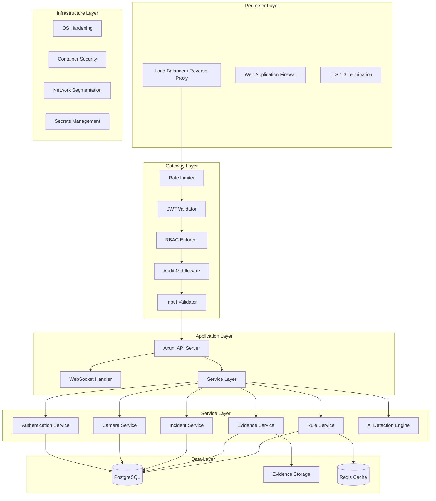
```mermaid
graph TB
    subgraph "Perimeter Layer"
        LB[Load Balancer / Reverse Proxy]
        WAF[Web Application Firewall]
        TLS[TLS 1.3 Termination]
    end

    subgraph "Gateway Layer"
        RL[Rate Limiter]
        AUTH_MW[JWT Validator]
        AUTHZ_MW[RBAC Enforcer]
        AUDIT_MW[Audit Middleware]
        INPUT[Input Validator]
    end

    subgraph "Application Layer"
        API[Axum API Server]
        WS[WebSocket Handler]
        SVC[Service Layer]
    end

    subgraph "Service Layer"
        AUTH_SVC[Authentication Service]
        CAM_SVC[Camera Service]
        INC_SVC[Incident Service]
        EVD_SVC[Evidence Service]
        RULE_SVC[Rule Service]
        AI_SVC[AI Detection Engine]
    end

    subgraph "Data Layer"
        DB[(PostgreSQL)]
        STORE[Evidence Storage]
        CACHE[(Redis Cache)]
    end

    subgraph "Infrastructure Layer"
        OS[OS Hardening]
        CONTAINER[Container Security]
        NET[Network Segmentation]
        SECRETS[Secrets Management]
    end

    LB --> RL --> AUTH_MW --> AUTHZ_MW --> AUDIT_MW --> INPUT --> API
    API --> WS
    API --> SVC
    SVC --> AUTH_SVC
    SVC --> CAM_SVC
    SVC --> INC_SVC
    SVC --> EVD_SVC
    SVC --> RULE_SVC
    SVC --> AI_SVC
    AUTH_SVC --> DB
    CAM_SVC --> DB
    INC_SVC --> DB
    EVD_SVC --> DB
    EVD_SVC --> STORE
    RULE_SVC --> DB
    RULE_SVC --> CACHE
```

### 6.2 Trust Boundaries

The platform defines five distinct trust boundaries. Cross-boundary communication requires explicit authentication and authorization:

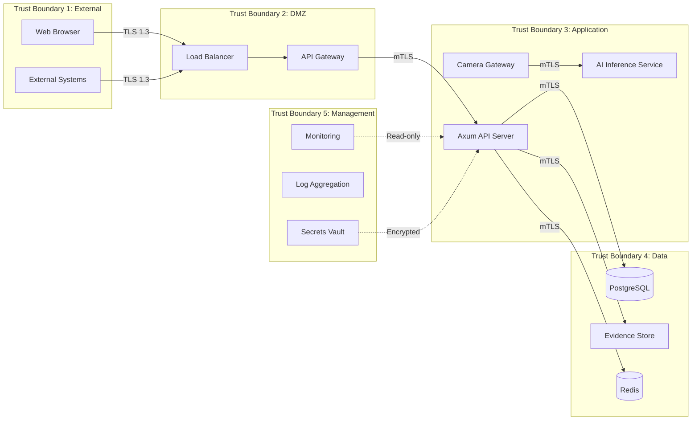
```mermaid
graph LR
    subgraph "Trust Boundary 1: External"
        BROWSER[Web Browser]
        EXT[External Systems]
    end

    subgraph "Trust Boundary 2: DMZ"
        LB2[Load Balancer]
        API_GW[API Gateway]
    end

    subgraph "Trust Boundary 3: Application"
        AXUM[Axum API Server]
        AI[AI Inference Service]
        GW[Camera Gateway]
    end

    subgraph "Trust Boundary 4: Data"
        PG[(PostgreSQL)]
        STORE2[Evidence Store]
        REDIS[(Redis)]
    end

    subgraph "Trust Boundary 5: Management"
        MONITOR[Monitoring]
        LOGS[Log Aggregation]
        VAULT[Secrets Vault]
    end

    BROWSER -->|TLS 1.3| LB2
    EXT -->|TLS 1.3| LB2
    LB2 --> API_GW
    API_GW -->|mTLS| AXUM
    AXUM -->|mTLS| PG
    AXUM -->|mTLS| STORE2
    AXUM -->|mTLS| REDIS
    GW -->|mTLS| AI
    MONITOR -.->|Read-only| AXUM
    VAULT -.->|Encrypted| AXUM
```

| Boundary           | Trust Level  | Controls                                                    |
| ------------------ | ------------ | ----------------------------------------------------------- |
| External (Browser) | Untrusted    | TLS 1.3, CORS, CSP headers, rate limiting                   |
| DMZ                | Semi-trusted | WAF, load balancing, TLS termination, DDoS protection       |
| Application        | Controlled   | mTLS, service authentication, input validation, RBAC        |
| Data               | Restricted   | mTLS, database RBAC, encryption at rest, connection pooling |
| Management         | High-trust   | mTLS, restricted access, audit logging, secrets management  |

### 6.3 Security Zones

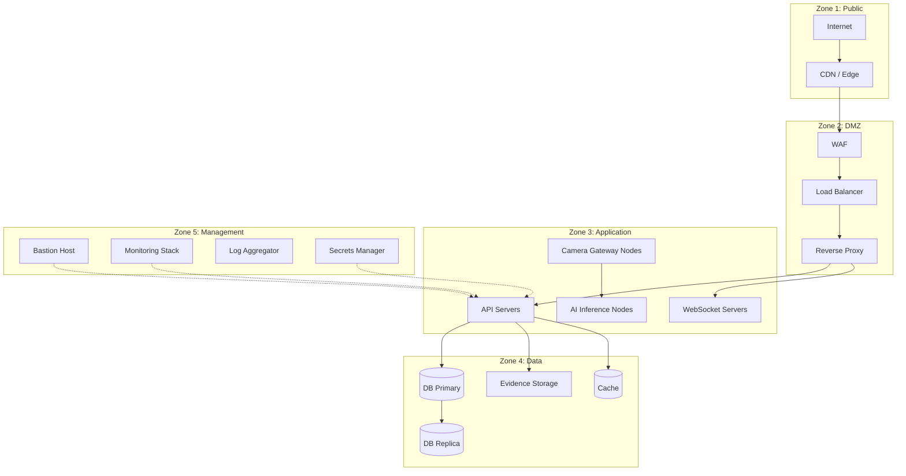
```mermaid
graph TB
    subgraph "Zone 1: Public"
        INTERNET[Internet]
        CDN[CDN / Edge]
    end

    subgraph "Zone 2: DMZ"
        LB3[Load Balancer]
        REVERSE_PROXY[Reverse Proxy]
        WAF2[WAF]
    end

    subgraph "Zone 3: Application"
        API_SVR[API Servers]
        WS_SVR[WebSocket Servers]
        AI_NODE[AI Inference Nodes]
        GW_NODE[Camera Gateway Nodes]
    end

    subgraph "Zone 4: Data"
        DB_PRIMARY[(DB Primary)]
        DB_REPLICA[(DB Replica)]
        EVIDENCE_STR[Evidence Storage]
        CACHE_STR[(Cache)]
    end

    subgraph "Zone 5: Management"
        BASTION[Bastion Host]
        MONITORING[Monitoring Stack]
        LOG_AGG[Log Aggregator]
        SECRET_MGR[Secrets Manager]
    end

    INTERNET --> CDN --> WAF2 --> LB3 --> REVERSE_PROXY
    REVERSE_PROXY --> API_SVR
    REVERSE_PROXY --> WS_SVR
    API_SVR --> DB_PRIMARY
    API_SVR --> EVIDENCE_STR
    API_SVR --> CACHE_STR
    GW_NODE --> AI_NODE
    DB_PRIMARY --> DB_REPLICA
    BASTION -.-> API_SVR
    MONITORING -.-> API_SVR
    SECRET_MGR -.-> API_SVR
```

| Zone        | Subnet       | Purpose                            | Ingress Rules                           | Egress Rules                 |
| ----------- | ------------ | ---------------------------------- | --------------------------------------- | ---------------------------- |
| Public      | Internet     | User access, camera RTSP ingestion | HTTP/HTTPS (443), RTSP (554)            | To DMZ only                  |
| DMZ         | 10.0.10.0/24 | TLS termination, load balancing    | From Public zone                        | To Application zone only     |
| Application | 10.0.20.0/24 | API processing, AI inference       | From DMZ (mTLS)                         | To Data zone (mTLS)          |
| Data        | 10.0.30.0/24 | Database, evidence, cache          | From Application zone (mTLS)            | No outbound                  |
| Management  | 10.0.40.0/24 | Monitoring, logging, secrets       | From Application zone (mTLS, read-only) | To external SIEM (encrypted) |

### 6.4 Security Domains

| Domain            | Components                                    | Primary Threats                        | Key Controls                                                    |
| ----------------- | --------------------------------------------- | -------------------------------------- | --------------------------------------------------------------- |
| Identity & Access | Users, roles, permissions, sessions, API keys | Credential theft, privilege escalation | MFA (roadmap), RBAC, session management, brute-force protection |
| Perimeter         | Load balancer, WAF, reverse proxy             | DDoS, injection, reconnaissance        | Rate limiting, WAF rules, TLS termination                       |
| Application       | Axum API, WebSocket, service layer            | Injection, XSS, business logic bypass  | Input validation, output encoding, RBAC middleware              |
| Data              | PostgreSQL, evidence storage, cache           | Data breach, tampering, exfiltration   | Encryption at rest/transit, RBAC, audit logging                 |
| AI/ML             | AI Detection Engine, model storage            | Model poisoning, adversarial inputs    | Internal API auth, input validation, model integrity checks     |
| Infrastructure    | Docker containers, host OS, network           | Container escape, lateral movement     | Container hardening, network segmentation, least privilege      |
| Operations        | Monitoring, logging, secrets, backup          | Log tampering, secret exposure         | Tamper-evident logs, encrypted secrets, immutable backups       |
| Compliance        | Audit trails, retention policies, access logs | Compliance violations, audit failures  | Automated retention, integrity verification, regular audits     |

### 6.5 Defense-in-Depth Layers

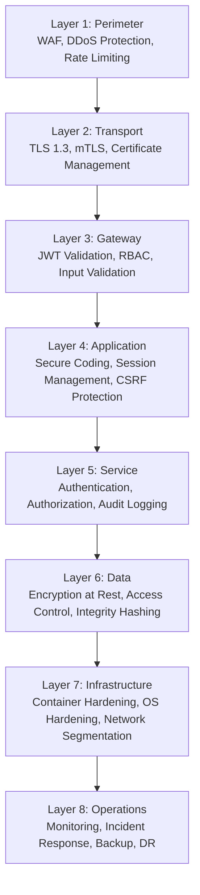
```mermaid
graph TB
    L1["Layer 1: Perimeter\nWAF, DDoS Protection, Rate Limiting"]
    L2["Layer 2: Transport\nTLS 1.3, mTLS, Certificate Management"]
    L3["Layer 3: Gateway\nJWT Validation, RBAC, Input Validation"]
    L4["Layer 4: Application\nSecure Coding, Session Management, CSRF Protection"]
    L5["Layer 5: Service\nAuthentication, Authorization, Audit Logging"]
    L6["Layer 6: Data\nEncryption at Rest, Access Control, Integrity Hashing"]
    L7["Layer 7: Infrastructure\nContainer Hardening, OS Hardening, Network Segmentation"]
    L8["Layer 8: Operations\nMonitoring, Incident Response, Backup, DR"]

    L1 --> L2 --> L3 --> L4 --> L5 --> L6 --> L7 --> L8
```

| Layer | Focus          | Key Mechanisms                                                |
| ----- | -------------- | ------------------------------------------------------------- |
| 1     | Perimeter      | WAF, DDoS mitigation, rate limiting, IP filtering             |
| 2     | Transport      | TLS 1.3, mTLS for internal, certificate rotation              |
| 3     | Gateway        | JWT validation, RBAC enforcement, request schema validation   |
| 4     | Application    | Output encoding, CSRF protection, session management          |
| 5     | Service        | Service-to-service auth, permission evaluation, audit logging |
| 6     | Data           | AES-256 encryption, SHA-256 integrity, database RBAC          |
| 7     | Infrastructure | Container isolation, OS hardening, network policies           |
| 8     | Operations     | SIEM, incident response, backup, disaster recovery            |

---

## 7. Threat Model

### 7.1 Critical Assets

| Asset                | Classification | Impact if Compromised                         |
| -------------------- | -------------- | --------------------------------------------- |
| User credentials     | RESTRICTED     | Full account takeover, privilege escalation   |
| JWT signing keys     | RESTRICTED     | Token forgery, unauthorized platform access   |
| Evidence clips       | CONFIDENTIAL   | Legal exposure, chain-of-custody breach       |
| Audit logs           | CONFIDENTIAL   | Compliance violation, forensic integrity loss |
| Detection events     | INTERNAL       | Missed threats, false security posture        |
| Camera streams       | INTERNAL       | Surveillance blind spots, privacy violation   |
| Incident data        | CONFIDENTIAL   | Operational disruption, legal liability       |
| API keys             | RESTRICTED     | Unauthorized integration access               |
| System configuration | HIGH           | Platform-wide security degradation            |
| AI model weights     | INTERNAL       | Detection capability loss, model theft        |

### 7.2 Threat Actors

| Actor Category        | Motivation                          | Capability Level | Primary Targets                              |
| --------------------- | ----------------------------------- | ---------------- | -------------------------------------------- |
| External Attacker     | Data theft, disruption, ransom      | High             | APIs, auth system, evidence storage          |
| Malicious Insider     | Data exfiltration, sabotage         | High             | Audit logs, evidence, user data              |
| Compromised Account   | Lateral movement, persistence       | Medium           | APIs, incident data, user records            |
| Automated Bot         | Credential stuffing, DDoS           | Medium           | Auth endpoints, API rate limits              |
| Supply Chain Attacker | Backdoor insertion, model tampering | High             | AI models, dependencies, containers          |
| Nation-State Actor    | Surveillance disruption, intel      | Critical         | Camera feeds, detection data, infrastructure |

### 7.3 Attack Surface

| Surface                  | Entry Points                                   | Controls                                        |
| ------------------------ | ---------------------------------------------- | ----------------------------------------------- |
| Web Dashboard            | Browser (Next.js)                              | CSP, XSS protection, CORS                       |
| REST API                 | 70+ endpoints across 15 resource groups        | JWT auth, RBAC, rate limiting, input validation |
| WebSocket API            | Real-time event streams                        | JWT auth, subscription scoping, heartbeat       |
| Internal APIs            | Service-to-service (Camera Gateway, AI Engine) | Service key auth, network isolation             |
| Authentication Endpoints | Login, refresh, password reset                 | Brute-force protection, token rotation          |
| File Upload              | Evidence upload (multipart/form-data)          | File type validation, size limits               |
| RTSP Ingestion           | Camera stream connections                      | Credential-based access, network segmentation   |
| Health Endpoints         | /api/v1/health, /ready, /live                  | No auth required (informational only)           |

### 7.4 STRIDE Analysis

| Threat Category                  | Threat Description                                         | Affected Assets      | Mitigation Strategy                                          | Residual Risk |
| -------------------------------- | ---------------------------------------------------------- | -------------------- | ------------------------------------------------------------ | ------------- |
| **Spoofing**               | Attacker forges JWT tokens to impersonate users            | All API resources    | RS256 JWT signing, 15-min token expiry, refresh rotation     | Low           |
| **Spoofing**               | Attacker steals session cookies for session hijacking      | User sessions        | httpOnly cookies, secure flag, same-site policy              | Low           |
| **Tampering**              | Attacker modifies evidence clips to destroy forensic value | Evidence storage     | SHA-256 content hashing verified on every access             | Low           |
| **Tampering**              | Attacker modifies audit logs to cover tracks               | Audit logs           | Append-only database, REVOKE UPDATE/DELETE, integrity checks | Low           |
| **Tampering**              | Attacker injects malicious detection data via internal API | Detection events     | Internal API service key auth, input validation              | Low           |
| **Repudiation**            | User denies performing a security action                   | Audit trail          | Immutable audit logs with user, timestamp, IP, action        | Negligible    |
| **Repudiation**            | Operator denies acknowledging an alert                     | Alert state          | Timestamped acknowledgment with user identity logged         | Negligible    |
| **Information Disclosure** | Attacker extracts user PII from API responses              | User data            | Field filtering, RBAC, response envelope                     | Low           |
| **Information Disclosure** | Attacker intercepts camera streams                         | Video data           | Network segmentation, RTSP credentials, TLS for relay        | Medium        |
| **Information Disclosure** | Attacker dumps database via SQL injection                  | All database data    | Parameterized queries (SQLx), input validation               | Low           |
| **Denial of Service**      | Attacker floods API with requests                          | API availability     | Rate limiting (100/min standard), burst protection           | Low           |
| **Denial of Service**      | Attacker exhausts WebSocket connections                    | Real-time updates    | Connection limits, heartbeat timeout, subscription scoping   | Low           |
| **Denial of Service**      | Attacker fills evidence storage                            | Evidence integrity   | Storage quotas, retention policies, monitoring               | Medium        |
| **Elevation of Privilege** | Attacker exploits broken RBAC to access admin functions    | System configuration | Permission evaluation at middleware, role-permission matrix  | Low           |
| **Elevation of Privilege** | Attacker escalates from operator to admin                  | User management      | Role assignment requires security_admin or system_admin      | Low           |
| **Elevation of Privilege** | Attacker accesses other sites' data                        | Site-scoped data     | Data scope filtering at repository and database level        | Low           |

### 7.5 Attack Tree — Unauthorized Evidence Access

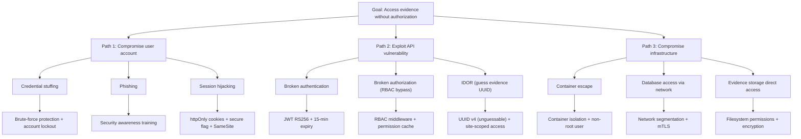
```mermaid
graph TB
    ROOT["Goal: Access evidence without authorization"] --> A["Path 1: Compromise user account"]
    ROOT --> B["Path 2: Exploit API vulnerability"]
    ROOT --> C["Path 3: Compromise infrastructure"]

    A --> A1["Credential stuffing"]
    A --> A2["Phishing"]
    A --> A3["Session hijacking"]

    B --> B1["Broken authentication"]
    B --> B2["Broken authorization (RBAC bypass)"]
    B --> B3["IDOR (guess evidence UUID)"]

    C --> C1["Container escape"]
    C --> C2["Database access via network"]
    C --> C3["Evidence storage direct access"]

    A1 --> M1["Brute-force protection + account lockout"]
    A2 --> M2["Security awareness training"]
    A3 --> M3["httpOnly cookies + secure flag + SameSite"]

    B1 --> M4["JWT RS256 + 15-min expiry"]
    B2 --> M5["RBAC middleware + permission cache"]
    B3 --> M6["UUID v4 (unguessable) + site-scoped access"]

    C1 --> M7["Container isolation + non-root user"]
    C2 --> M8["Network segmentation + mTLS"]
    C3 --> M9["Filesystem permissions + encryption"]
```

### 7.6 Risk Assessment Matrix

| Risk ID | Threat                               | Likelihood | Impact   | Risk Level | Mitigation                              | Residual |
| ------- | ------------------------------------ | ---------- | -------- | ---------- | --------------------------------------- | -------- |
| R-01    | JWT secret compromise                | Low        | Critical | High       | Env vars, HSM, 30-day rotation          | Low      |
| R-02    | Evidence tampering                   | Low        | Critical | High       | SHA-256 hashing, append-only logs       | Low      |
| R-03    | API abuse (rate limiting bypass)     | Medium     | Medium   | Medium     | Middleware rate limiting, IP throttling | Low      |
| R-04    | Database breach                      | Low        | Critical | High       | Encryption, RBAC, network isolation     | Low      |
| R-05    | Insider threat (audit log tampering) | Low        | High     | Medium     | Append-only DB, REVOKE permissions      | Low      |
| R-06    | Supply chain attack                  | Low        | Critical | High       | Dependency scanning, container signing  | Medium   |
| R-07    | Camera stream interception           | Medium     | Medium   | Medium     | Network segmentation, RTSP credentials  | Low      |
| R-08    | AI model poisoning                   | Low        | High     | Medium     | Model integrity checks, internal auth   | Low      |
| R-09    | Credential stuffing                  | High       | Medium   | High       | Brute-force protection, account lockout | Low      |
| R-10    | DDoS on API                          | Medium     | High     | High       | Rate limiting, WAF, load balancing      | Low      |

### 7.7 MITRE ATT&CK Mapping

| ATT&CK Technique             | Applicable Controls                                         |
| ---------------------------- | ----------------------------------------------------------- |
| T1078 - Valid Accounts       | RBAC, session management, brute-force protection            |
| T1110 - Brute Force          | Account lockout, progressive delays, IP blocking            |
| T1059 - Command Injection    | Input validation, parameterized queries, no eval            |
| T1190 - Exploit Public App   | OWASP Top 10 mitigation, WAF, input validation              |
| T1048 - Exfiltration Over C2 | Network segmentation, egress monitoring, DLP policies       |
| T1565 - Data Manipulation    | SHA-256 integrity, immutable audit logs, optimistic locking |
| T1070 - Indicator Removal    | Tamper-evident logs, append-only storage, monitoring        |
| T1021 - Remote Services      | mTLS for internal, bastion host, VPN                        |
| T1496 - Resource Hijacking   | Rate limiting, resource quotas, monitoring                  |
| T1195 - Supply Chain         | Dependency scanning, SBOM generation, container signing     |

---

## 8. Identity Management

### 8.1 User Identity Lifecycle

| Lifecycle Stage | Operations                       | Responsible Role             | Audit Requirement                 |
| --------------- | -------------------------------- | ---------------------------- | --------------------------------- |
| Provisioning    | Create user, assign initial role | system_admin, security_admin | Audit log with creator identity   |
| Assignment      | Grant roles (0-N per user)       | security_admin               | Audit log with grantor identity   |
| Modification    | Change roles, update profile     | User (self), security_admin  | Audit log with modifier identity  |
| Suspension      | Soft-disable (is_active = false) | security_admin               | Audit log with suspender identity |
| Deletion        | Hard delete (GDPR compliance)    | system_admin                 | Audit log with deleter identity   |

### 8.2 User Record Structure

| Field              | Type                 | Description                                 |
| ------------------ | -------------------- | ------------------------------------------- |
| id                 | UUID                 | Primary key, immutable                      |
| email              | VARCHAR(255), UNIQUE | Login identifier, normalized to lowercase   |
| password_hash      | VARCHAR(255)         | bcrypt/Argon2id hash, NEVER returned by API |
| first_name         | VARCHAR(100)         | Profile display name                        |
| last_name          | VARCHAR(100)         | Profile display name                        |
| is_active          | BOOLEAN              | Soft-disable flag, default true             |
| last_login_at      | TIMESTAMPTZ          | Last successful authentication timestamp    |
| failed_login_count | INTEGER              | Incremented on failure, reset on success    |
| locked_until       | TIMESTAMPTZ          | Account locked until this timestamp         |
| created_at         | TIMESTAMPTZ          | Record creation timestamp                   |
| updated_at         | TIMESTAMPTZ          | Last modification timestamp                 |

### 8.3 Password Policy

| Policy Parameter      | Requirement                             |
| --------------------- | --------------------------------------- |
| Minimum length        | 12 characters                           |
| Maximum length        | 128 characters                          |
| Complexity            | Uppercase + lowercase + digit + special |
| Hash algorithm        | Argon2id (preferred) or bcrypt          |
| Argon2id parameters   | t=3, m=65536, p=4                       |
| bcrypt cost           | 12                                      |
| Password history      | Last 5 passwords rejected               |
| Expiry                | 90 days (configurable, admin override)  |
| Breach database check | Have I Been Pwned k-anonymity API       |

### 8.4 Account Lockout Policy

| Trigger                   | Threshold               | Duration           | Reset Condition          |
| ------------------------- | ----------------------- | ------------------ | ------------------------ |
| Failed login attempts     | 5 within 15 min         | 30 minutes         | Auto-expire or admin     |
| Suspicious IP activity    | 10 within 1 hour        | 2 hours            | Manual review required   |
| Multiple account lockouts | 3 accounts from same IP | 24 hours           | IP block + investigation |
| Admin-forced lock         | Manual trigger          | Until admin unlock | Admin action             |

### 8.5 OAuth 2.0 / OIDC Integration (Future)

| Provider  | Use Case             | Flow               | Token Storage   |
| --------- | -------------------- | ------------------ | --------------- |
| Microsoft | Enterprise SSO       | Authorization Code | httpOnly cookie |
| Google    | Google Workspace SSO | Authorization Code | httpOnly cookie |
| Okta      | Enterprise SSO       | Authorization Code | httpOnly cookie |
| GitHub    | Developer access     | Authorization Code | httpOnly cookie |

### 8.6 MFA Architecture (Planned)

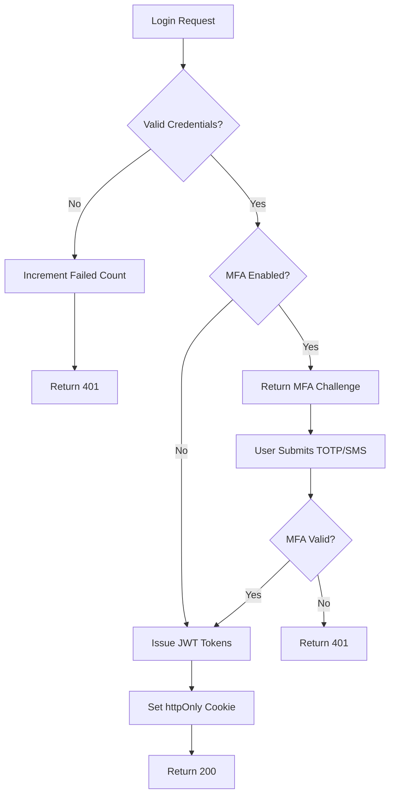
```mermaid
graph TD
    A[Login Request] --> B{Valid Credentials?}
    B -->|No| C[Increment Failed Count]
    C --> D[Return 401]
    B -->|Yes| E{MFA Enabled?}
    E -->|No| F[Issue JWT Tokens]
    E -->|Yes| G[Return MFA Challenge]
    G --> H[User Submits TOTP/SMS]
    H --> I{MFA Valid?}
    I -->|No| J[Return 401]
    I -->|Yes| F
    F --> K[Set httpOnly Cookie]
    K --> L[Return 200]
```

---

## 9. Authentication

### 9.1 Authentication Flow

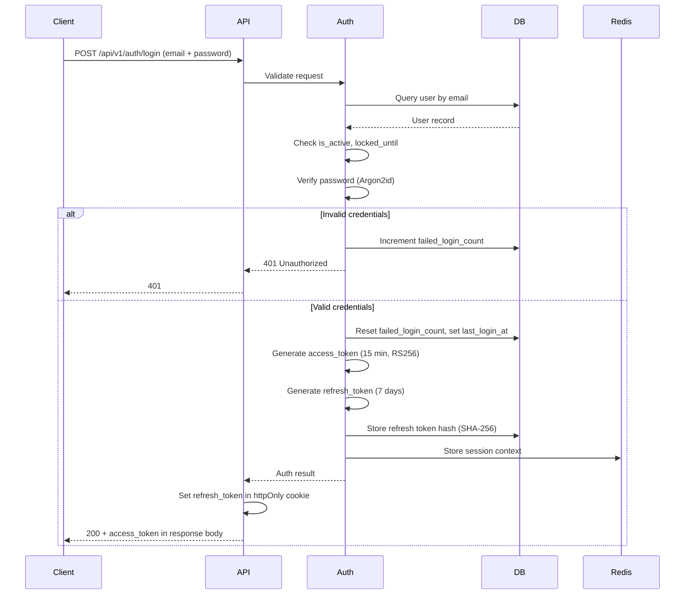
```mermaid
sequenceDiagram
    participant Client
    participant API
    participant Auth
    participant DB
    participant Redis

    Client->>API: POST /api/v1/auth/login (email + password)
    API->>Auth: Validate request
    Auth->>DB: Query user by email
    DB-->>Auth: User record
    Auth->>Auth: Check is_active, locked_until
    Auth->>Auth: Verify password (Argon2id)
    alt Invalid credentials
        Auth->>DB: Increment failed_login_count
        Auth-->>API: 401 Unauthorized
        API-->>Client: 401
    else Valid credentials
        Auth->>DB: Reset failed_login_count, set last_login_at
        Auth->>Auth: Generate access_token (15 min, RS256)
        Auth->>Auth: Generate refresh_token (7 days)
        Auth->>DB: Store refresh token hash (SHA-256)
        Auth->>Redis: Store session context
        Auth-->>API: Auth result
        API->>API: Set refresh_token in httpOnly cookie
        API-->>Client: 200 + access_token in response body
    end
```

### 9.2 JWT Token Specification

| Parameter      | Access Token                                                   | Refresh Token                            |
| -------------- | -------------------------------------------------------------- | ---------------------------------------- |
| Algorithm      | RS256 (RSA + SHA-256)                                          | RS256                                    |
| Expiry         | 15 minutes                                                     | 7 days                                   |
| Claims         | sub, email, roles, sites, permissions, iss, aud, iat, exp, jti | sub, jti, iss, iat, exp                  |
| Rotation       | New token on each refresh                                      | Single use, rotation on refresh          |
| Storage        | Response body (client memory)                                  | httpOnly, Secure, SameSite=Strict cookie |
| Revocation     | Blocked list in Redis                                          | Database deletion                        |
| JTI (Token ID) | UUID v4                                                        | UUID v4                                  |

### 9.3 JWT Access Token Claims

```json
{
  "sub": "uuid-of-user",
  "email": "admin@vigilantai.com",
  "roles": ["security_admin"],
  "sites": ["uuid-of-assigned-site"],
  "permissions": [
    "incidents.read",
    "incidents.update",
    "evidence.read",
    "alerts.read",
    "alerts.update"
  ],
  "iss": "vigilantai",
  "aud": "vigilantai-api",
  "iat": 1719200000,
  "exp": 1719200900,
  "jti": "uuid-of-token"
}
```

### 9.4 JWT Lifecycle

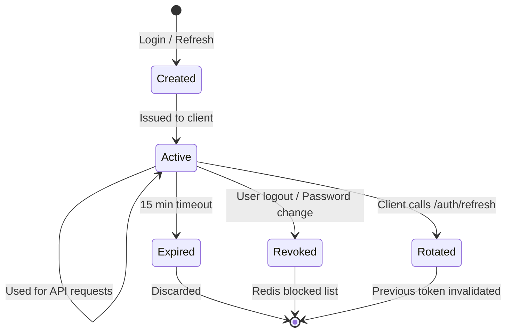
```mermaid
stateDiagram-v2
    [*] --> Created: Login / Refresh
    Created --> Active: Issued to client
    Active --> Active: Used for API requests
    Active --> Expired: 15 min timeout
    Active --> Revoked: User logout / Password change
    Active --> Rotated: Client calls /auth/refresh
    Expired --> [*]: Discarded
    Revoked --> [*]: Redis blocked list
    Rotated --> [*]: Previous token invalidated
```

### 9.5 Refresh Token Rotation

| Step | Action                                   | State After                |
| ---- | ---------------------------------------- | -------------------------- |
| 1    | Client sends expired access_token        | 401 response               |
| 2    | Client sends refresh_token (from cookie) | Refresh token validated    |
| 3    | Server hashes refresh_token, checks DB   | Match found, not revoked   |
| 4    | Server generates new access_token        | New access token issued    |
| 5    | Server generates new refresh_token       | New refresh token issued   |
| 6    | Old refresh_token marked as revoked      | Previous token invalidated |
| 7    | New refresh_token set in httpOnly cookie | Session continues          |

### 9.6 Authentication Endpoints

| Endpoint                  | Method | Auth Required | Rate Limit      | Description          |
| ------------------------- | ------ | ------------- | --------------- | -------------------- |
| `/api/v1/auth/login`    | POST   | No            | 5/15min per IP  | Authenticate user    |
| `/api/v1/auth/refresh`  | POST   | Cookie only   | 20/min per user | Refresh access token |
| `/api/v1/auth/logout`   | POST   | Yes           | 20/min per user | Revoke session       |
| `/api/v1/auth/password` | PUT    | Yes           | 5/hour per user | Change password      |

### 9.7 Session Management

| Feature                     | Implementation                         |
| --------------------------- | -------------------------------------- |
| Active session tracking     | Redis session store per user           |
| Maximum concurrent sessions | 5 per user (configurable)              |
| Session invalidation        | Logout, password change, admin force   |
| Idle timeout                | 30 minutes of inactivity               |
| Absolute timeout            | 24 hours regardless of activity        |
| IP binding                  | Optional (configurable per deployment) |
| Device fingerprinting       | User-Agent + Accept-Language hash      |

### 9.8 Brute-Force Protection

| Layer                      | Mechanism                                          |
| -------------------------- | -------------------------------------------------- |
| Per-account                | 5 failed attempts → 30-minute lockout             |
| Per-IP                     | 20 failed attempts across accounts → 1-hour block |
| Progressive delay          | 1s, 2s, 4s, 8s, 16s between attempts               |
| CAPTCHA                    | After 3 failures (UI layer, not API enforced)      |
| Credential stuffing detect | >100 failures from single IP in 15 min → alert    |

### 9.9 Password Reset Flow (Future)

| Step | Action                                                 | Security Control                  |
| ---- | ------------------------------------------------------ | --------------------------------- |
| 1    | User requests reset via`/api/v1/auth/password/reset` | Rate limit: 3/hour per email      |
| 2    | System generates reset token (1-hour expiry)           | Token stored as SHA-256 hash      |
| 3    | System sends reset link via email                      | Single-use token                  |
| 4    | User follows link, enters new password                 | Token validated, password updated |
| 5    | All active sessions invalidated                        | Security measure post-reset       |

---

## 10. Authorization

### 10.1 RBAC Architecture

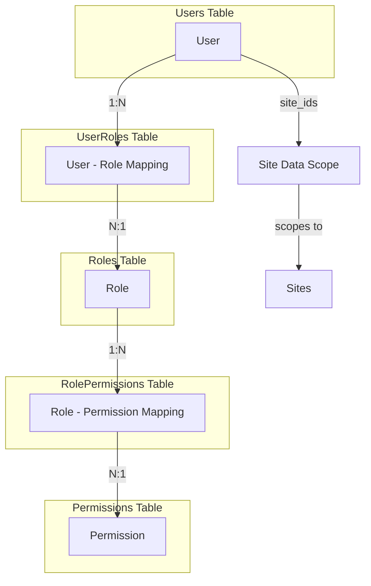
```mermaid
graph TD
    subgraph "Users Table"
        U[User]
    end

    subgraph "UserRoles Table"
        UR[User - Role Mapping]
    end

    subgraph "Roles Table"
        R[Role]
    end

    subgraph "RolePermissions Table"
        RP[Role - Permission Mapping]
    end

    subgraph "Permissions Table"
        P[Permission]
    end

    U -->|1:N| UR
    UR -->|N:1| R
    R -->|1:N| RP
    RP -->|N:1| P

    U -->|site_ids| SDS[Site Data Scope]
    SDS -->|scopes to| S[Sites]
```

### 10.2 Role Definitions

| Role                 | Description                               | Scope Level    |
| -------------------- | ----------------------------------------- | -------------- |
| `system_admin`     | Full platform administration              | All sites      |
| `security_admin`   | Security operations management            | All sites      |
| `security_analyst` | Alert monitoring, incident investigation  | Assigned sites |
| `operator`         | Dashboard monitoring, rule management     | Assigned sites |
| `viewer`           | Read-only access to dashboard and reports | Assigned sites |
| `api_integration`  | API access for third-party integrations   | Assigned sites |

### 10.3 Permission Matrix

| Permission                      | system_admin | security_admin | security_analyst | operator | viewer | api_integration |
| ------------------------------- | :----------: | :------------: | :--------------: | :------: | :----: | :-------------: |
| **User Management**       |              |                |                  |          |        |                |
| users.read                      |      ✅      |       ✅       |        ❌        |    ❌    |   ❌   |       ❌       |
| users.create                    |      ✅      |       ❌       |        ❌        |    ❌    |   ❌   |       ❌       |
| users.update                    |      ✅      |       ❌       |        ❌        |    ❌    |   ❌   |       ❌       |
| users.delete                    |      ✅      |       ❌       |        ❌        |    ❌    |   ❌   |       ❌       |
| **Role Management**       |              |                |                  |          |        |                |
| roles.read                      |      ✅      |       ✅       |        ❌        |    ❌    |   ❌   |       ❌       |
| roles.create                    |      ✅      |       ❌       |        ❌        |    ❌    |   ❌   |       ❌       |
| roles.update                    |      ✅      |       ❌       |        ❌        |    ❌    |   ❌   |       ❌       |
| roles.delete                    |      ✅      |       ❌       |        ❌        |    ❌    |   ❌   |       ❌       |
| **Site Management**       |              |                |                  |          |        |                |
| sites.read                      |      ✅      |       ✅       |        ✅        |    ✅    |   ✅   |       ✅       |
| sites.create                    |      ✅      |       ✅       |        ❌        |    ❌    |   ❌   |       ❌       |
| sites.update                    |      ✅      |       ✅       |        ❌        |    ❌    |   ❌   |       ❌       |
| sites.delete                    |      ✅      |       ❌       |        ❌        |    ❌    |   ❌   |       ❌       |
| **Camera Management**     |              |                |                  |          |        |                |
| cameras.read                    |      ✅      |       ✅       |        ✅        |    ✅    |   ✅   |       ✅       |
| cameras.create                  |      ✅      |       ✅       |        ❌        |    ❌    |   ❌   |       ❌       |
| cameras.update                  |      ✅      |       ✅       |        ❌        |    ✅    |   ❌   |       ❌       |
| cameras.delete                  |      ✅      |       ✅       |        ❌        |    ❌    |   ❌   |       ❌       |
| **Detection Events**      |              |                |                  |          |        |                |
| events.read                     |      ✅      |       ✅       |        ✅        |    ✅    |   ✅   |       ✅       |
| events.create                   |      ✅      |       ✅       |        ❌        |    ❌    |   ❌   |       ✅       |
| events.update                   |      ✅      |       ✅       |        ✅        |    ❌    |   ❌   |       ❌       |
| events.delete                   |      ✅      |       ❌       |        ❌        |    ❌    |   ❌   |       ❌       |
| **Alerts**                |              |                |                  |          |        |                |
| alerts.read                     |      ✅      |       ✅       |        ✅        |    ✅    |   ✅   |       ✅       |
| alerts.create                   |      ✅      |       ✅       |        ✅        |    ✅    |   ❌   |       ✅       |
| alerts.update                   |      ✅      |       ✅       |        ✅        |    ✅    |   ❌   |       ❌       |
| alerts.acknowledge              |      ✅      |       ✅       |        ✅        |    ✅    |   ❌   |       ❌       |
| **Incidents**             |              |                |                  |          |        |                |
| incidents.read                  |      ✅      |       ✅       |        ✅        |    ❌    |   ❌   |       ✅       |
| incidents.create                |      ✅      |       ✅       |        ✅        |    ❌    |   ❌   |       ✅       |
| incidents.update                |      ✅      |       ✅       |        ✅        |    ❌    |   ❌   |       ❌       |
| incidents.close                 |      ✅      |       ✅       |        ✅        |    ❌    |   ❌   |       ❌       |
| **Evidence**              |              |                |                  |          |        |                |
| evidence.read                   |      ✅      |       ✅       |        ✅        |    ❌    |   ❌   |       ✅       |
| evidence.create                 |      ✅      |       ✅       |        ✅        |    ✅    |   ❌   |       ✅       |
| evidence.delete                 |      ✅      |       ❌       |        ❌        |    ❌    |   ❌   |       ❌       |
| **Rules**                 |              |                |                  |          |        |                |
| rules.read                      |      ✅      |       ✅       |        ✅        |    ✅    |   ✅   |       ✅       |
| rules.create                    |      ✅      |       ✅       |        ✅        |    ✅    |   ❌   |       ✅       |
| rules.update                    |      ✅      |       ✅       |        ✅        |    ✅    |   ❌   |       ❌       |
| rules.delete                    |      ✅      |       ✅       |        ❌        |    ✅    |   ❌   |       ❌       |
| **Dashboard / Reports**   |              |                |                  |          |        |                |
| dashboard.read                  |      ✅      |       ✅       |        ✅        |    ✅    |   ✅   |       ✅       |
| reports.generate                |      ✅      |       ✅       |        ✅        |    ✅    |   ✅   |       ❌       |
| **Audit & Configuration** |              |                |                  |          |        |                |
| audit.read                      |      ✅      |       ✅       |        ❌        |    ❌    |   ❌   |       ❌       |
| config.read                     |      ✅      |       ❌       |        ❌        |    ❌    |   ❌   |       ❌       |
| config.update                   |      ✅      |       ❌       |        ❌        |    ❌    |   ❌   |       ❌       |

### 10.4 Authorization Middleware

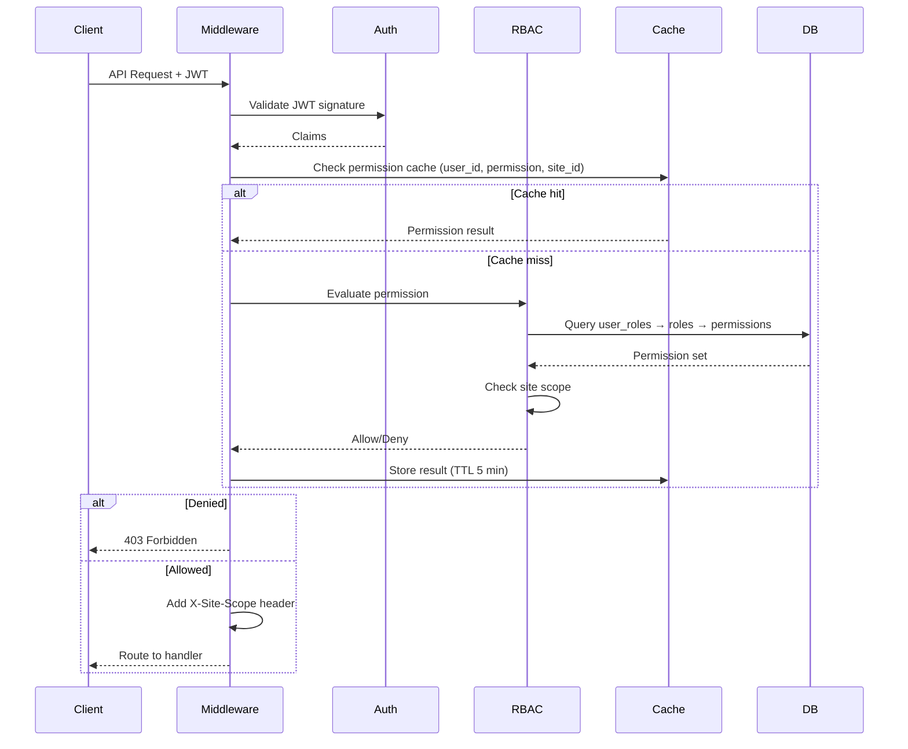
```mermaid
sequenceDiagram
    participant Client
    participant Middleware
    participant Auth
    participant RBAC
    participant Cache
    participant DB

    Client->>Middleware: API Request + JWT
    Middleware->>Auth: Validate JWT signature
    Auth-->>Middleware: Claims
    Middleware->>Cache: Check permission cache (user_id, permission, site_id)
    alt Cache hit
        Cache-->>Middleware: Permission result
    else Cache miss
        Middleware->>RBAC: Evaluate permission
        RBAC->>DB: Query user_roles → roles → permissions
        DB-->>RBAC: Permission set
        RBAC->>RBAC: Check site scope
        RBAC-->>Middleware: Allow/Deny
        Middleware->>Cache: Store result (TTL 5 min)
    end
    alt Denied
        Middleware-->>Client: 403 Forbidden
    else Allowed
        Middleware->>Middleware: Add X-Site-Scope header
        Middleware-->>Client: Route to handler
    end
```

### 10.5 Site-Scoped Data Access

| Operation             | Data Scope Enforcement                            |
| --------------------- | ------------------------------------------------- |
| List resources        | WHERE site_id IN (user's assigned sites)          |
| Get single resource   | Check resource.site_id IN (user's assigned sites) |
| Create resource       | Validate site_id in user's assigned sites         |
| Update resource       | Check resource.site_id IN (user's assigned sites) |
| Delete resource       | Check resource.site_id IN (user's assigned sites) |
| Dashboard aggregation | Filter data to user's assigned sites only         |

### 10.6 Authorization Cache

| Parameter            | Value                                             |
| -------------------- | ------------------------------------------------- |
| Cache backend        | Redis                                             |
| Cache key format     | `perm:{user_id}:{permission}:{site_id}`         |
| Cache TTL            | 5 minutes                                         |
| Invalidation trigger | Role change, permission change, user deactivation |
| Cache warming        | On first request after login                      |

---

## 11. API Security

### 11.1 API Security Architecture

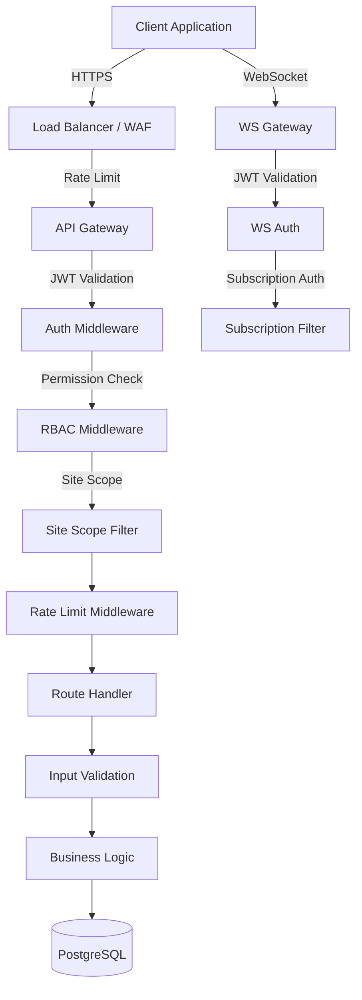
```mermaid
graph TD
    Client[Client Application] -->|HTTPS| LB[Load Balancer / WAF]
    LB -->|Rate Limit| GW[API Gateway]
    GW -->|JWT Validation| Auth[Auth Middleware]
    Auth -->|Permission Check| RBAC[RBAC Middleware]
    RBAC -->|Site Scope| SiteScope[Site Scope Filter]
    SiteScope --> RateLimit[Rate Limit Middleware]
    RateLimit --> Handler[Route Handler]
    Handler --> Validate[Input Validation]
    Validate --> Business[Business Logic]
    Business --> DB[(PostgreSQL)]

    Client -->|WebSocket| WSGW[WS Gateway]
    WSGW -->|JWT Validation| WSAuth[WS Auth]
    WSAuth -->|Subscription Auth| SubAuth[Subscription Filter]
```

### 11.2 Rate Limiting

| Tier           | Requests/min | Burst | Applies To                  |
| -------------- | ------------ | ----- | --------------------------- |
| Standard       | 100          | 20    | All authenticated endpoints |
| Read-heavy     | 200          | 40    | GET list endpoints          |
| Write-heavy    | 60           | 10    | POST/PUT/DELETE endpoints   |
| Auth endpoints | 5            | 3     | `/api/v1/auth/*`          |
| Health         | 300          | 50    | `/api/v1/health`          |
| Internal       | 500          | 100   | `internal/v1/*`           |
| API Key        | 500          | 100   | Per API key (configurable)  |

### 11.3 Input Validation

| Validation Type     | Implementation                                       |
| ------------------- | ---------------------------------------------------- |
| Request body schema | axum-extract with serde deserialize                  |
| Query parameters    | axum Query extractor with validation                 |
| Path parameters     | Validated UUID format, non-empty strings             |
| Content-Type        | Enforced per endpoint (JSON, multipart/form-data)    |
| Content-Length      | Max 10 MB for JSON, 100 MB for file uploads          |
| SQL injection       | SQLx parameterized queries (no string interpolation) |
| XSS                 | Input sanitization, output encoding                  |
| Path traversal      | Canonical path validation for file operations        |

### 11.4 CORS Policy

| Header                           | Value                                     |
| -------------------------------- | ----------------------------------------- |
| Access-Control-Allow-Origin      | `{dashboard_origin}` (configurable)     |
| Access-Control-Allow-Methods     | GET, POST, PUT, DELETE, OPTIONS           |
| Access-Control-Allow-Headers     | Authorization, Content-Type, X-Request-ID |
| Access-Control-Allow-Credentials | true                                      |
| Access-Control-Max-Age           | 86400                                     |

### 11.5 Security Headers

| Header                    | Value                                                                   |
| ------------------------- | ----------------------------------------------------------------------- |
| X-Content-Type-Options    | nosniff                                                                 |
| X-Frame-Options           | DENY                                                                    |
| X-XSS-Protection          | 0 (rely on CSP instead)                                                 |
| Strict-Transport-Security | max-age=63072000; includeSubDomains; preload                            |
| Content-Security-Policy   | default-src 'self'; script-src 'self'; style-src 'self' 'unsafe-inline' |
| Referrer-Policy           | strict-origin-when-cross-origin                                         |
| Permissions-Policy        | camera=(), microphone=(), geolocation=()                                |
| Cache-Control             | no-store, no-cache, must-revalidate (API responses)                     |

### 11.6 API Versioning Strategy

| Version      | Status     | Sunset Date | Migration Path  |
| ------------ | ---------- | ----------- | --------------- |
| `/api/v1/` | Active     | N/A         | Current stable  |
| `/api/v2/` | Deprecated | 2026-12-31  | Migrate from v1 |

### 11.7 API Key Management

| Feature     | Implementation                                    |
| ----------- | ------------------------------------------------- |
| Key format  | `vka_` prefix + 32-byte random hex              |
| Storage     | SHA-256 hash in database (key never stored plain) |
| Scope       | Configurable per API key (read, write, admin)     |
| Rate limits | Configurable per key (default: 500/min)           |
| Expiry      | Configurable (default: 90 days)                   |
| Rotation    | Manual rotation via security_admin                |
| Revocation  | Immediate via security_admin                      |

### 11.8 WebSocket Authentication

| Phase              | Security Control                                |
| ------------------ | ----------------------------------------------- |
| Connection upgrade | JWT validated from first message or query param |
| Subscription       | Permission checked per channel                  |
| Message delivery   | Site scope filtering applied                    |
| Heartbeat          | 30-second interval, connection closed if missed |
| Reconnection       | JWT re-validated on each reconnect              |
| Message integrity  | No tampering (WebSocket framing)                |
| Max connections    | 100 per user, configurable                      |
| Max subscriptions  | 20 per connection, configurable                 |

### 11.9 API Error Handling

| Error Code | HTTP Status | Description                   | Response Body                                           |
| ---------- | ----------- | ----------------------------- | ------------------------------------------------------- |
| 400        | 400         | Invalid request body/schema   | `{ "error": "Bad Request", "message": "..." }`        |
| 401        | 401         | Missing/invalid/expired JWT   | `{ "error": "Unauthorized" }`                         |
| 403        | 403         | Insufficient permissions      | `{ "error": "Forbidden" }`                            |
| 404        | 404         | Resource not found            | `{ "error": "Not Found" }`                            |
| 409        | 409         | Resource conflict (duplicate) | `{ "error": "Conflict" }`                             |
| 422        | 422         | Validation error              | `{ "error": "Validation Error", "details": [...] }`   |
| 429        | 429         | Rate limit exceeded           | `{ "error": "Too Many Requests", "retry_after": 60 }` |
| 500        | 500         | Internal server error         | `{ "error": "Internal Server Error" }`                |

### 11.10 API Security Checklist

| #  | Security Control                         | Status |
| -- | ---------------------------------------- | ------ |
| 1  | HTTPS only (TLS 1.3)                     | ✅     |
| 2  | JWT RS256 signature validation           | ✅     |
| 3  | JWT expiry enforcement (15 min)          | ✅     |
| 4  | Refresh token rotation                   | ✅     |
| 5  | RBAC middleware on all endpoints         | ✅     |
| 6  | Site-scoped data access                  | ✅     |
| 7  | Rate limiting (per-user, per-IP)         | ✅     |
| 8  | Input validation (schema + sanitization) | ✅     |
| 9  | SQL injection prevention (parameterized) | ✅     |
| 10 | CORS policy                              | ✅     |
| 11 | Security headers (HSTS, CSP, etc.)       | ✅     |
| 12 | Error message sanitization               | ✅     |
| 13 | Request ID tracking                      | ✅     |
| 14 | API versioning                           | ✅     |
| 15 | Audit logging                            | ✅     |

---

## 12. WebSocket Security

### 12.1 WebSocket Authentication Flow

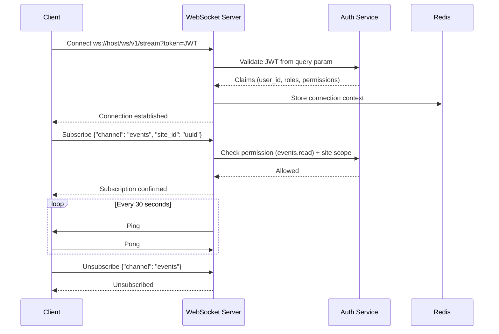
```mermaid
sequenceDiagram
    participant Client
    participant WS as WebSocket Server
    participant Auth as Auth Service
    participant Redis

    Client->>WS: Connect ws://host/ws/v1/stream?token=JWT
    WS->>Auth: Validate JWT from query param
    Auth-->>WS: Claims (user_id, roles, permissions)
    WS->>Redis: Store connection context
    WS-->>Client: Connection established
  
    Client->>WS: Subscribe {"channel": "events", "site_id": "uuid"}
    WS->>Auth: Check permission (events.read) + site scope
    Auth-->>WS: Allowed
    WS-->>Client: Subscription confirmed
  
    loop Every 30 seconds
        WS->>Client: Ping
        Client->>WS: Pong
    end
  
    Client->>WS: Unsubscribe {"channel": "events"}
    WS-->>Client: Unsubscribed
```

### 12.2 WebSocket Security Controls

| Control                    | Implementation                                           |
| -------------------------- | -------------------------------------------------------- |
| Authentication             | JWT validated on connection + re-validation on reconnect |
| Authorization              | Permission check per subscription channel                |
| Site scoping               | All messages filtered by site_id                         |
| Heartbeat                  | 30-second ping/pong, disconnect on 3 missed              |
| Max connections per user   | 100 (configurable)                                       |
| Max subscriptions per conn | 20 (configurable)                                        |
| Message size limit         | 64 KB per message                                        |
| Message rate limit         | 100 messages/second per connection                       |
| TLS                        | wss:// required in production                            |
| Origin validation          | Verify Origin header against whitelist                   |
| Path traversal             | Validate subscription channel names                      |

### 12.3 WebSocket Channel Permissions

| Channel        | Permission Required | Data Scope  |
| -------------- | ------------------- | ----------- |
| `events`     | `events.read`     | Site-scoped |
| `alerts`     | `alerts.read`     | Site-scoped |
| `incidents`  | `incidents.read`  | Site-scoped |
| `system`     | `dashboard.read`  | User-scoped |
| `ai-events`  | `events.read`     | Site-scoped |
| `detections` | `events.read`     | Site-scoped |
| `cameras`    | `cameras.read`    | Site-scoped |
| `rules`      | `rules.read`      | Site-scoped |

---

## 13. Backend Service Security

### 13.1 Service-to-Service Authentication

| Service Pair                     | Auth Method             | Details                              |
| -------------------------------- | ----------------------- | ------------------------------------ |
| Dashboard → API                 | JWT + RBAC              | User-scoped tokens                   |
| API → Database                  | TLS client certificates | Per-service DB credentials           |
| API → Redis                     | TLS + AUTH command      | Password-based Redis auth            |
| AI Engine → API (internal)      | Service key             | Internal API key in env vars         |
| Camera Gateway → API (internal) | Service key             | Internal API key in env vars         |
| AI Engine → Database            | TLS client certificates | Read-only access to detection_events |

### 13.2 Internal API Security

| Control                    | Implementation                                     |
| -------------------------- | -------------------------------------------------- |
| Network binding            | `127.0.0.1:{port}` only (no external exposure)   |
| Service key authentication | `X-Service-Key` header validated against env var |
| No RBAC                    | Internal services operate at elevated privilege    |
| Audit logging              | All internal API calls logged                      |
| Rate limiting              | 500 requests/minute per service                    |
| TLS                        | Required for non-loopback communication            |

### 13.3 Dependency Security

| Layer                 | Tool/Approach                                    |
| --------------------- | ------------------------------------------------ |
| Rust crates           | `cargo audit`, `cargo deny`                  |
| Python packages       | `pip-audit`, `safety`                        |
| npm packages          | `npm audit`, `Snyk`                          |
| Container base images | `Trivy`, `Grype` scanning                    |
| SBOM generation       | `syft` (CycloneDX format)                      |
| License compliance    | `cargo deny` (Rust), `license-checker` (npm) |

### 13.4 Container Security

| Control         | Implementation                                |
| --------------- | --------------------------------------------- |
| Base image      | Distroless (non-root, no shell)               |
| User            | `USER 1000:1000` (non-root)                 |
| Filesystem      | Read-only where possible, tmpfs for temp      |
| Capabilities    | Drop ALL, add only NET_BIND_SERVICE if needed |
| Resource limits | CPU and memory limits per container           |
| Health checks   | Liveness and readiness probes                 |
| Image scanning  | CI/CD pipeline scan on build                  |
| Image signing   | Cosign / Sigstore (planned)                   |

### 13.5 Environment Security

| Secret Type             | Storage Location                             |
| ----------------------- | -------------------------------------------- |
| JWT signing key         | Environment variable (not in code or config) |
| Database password       | Environment variable                         |
| Redis password          | Environment variable                         |
| API key (internal)      | Environment variable                         |
| CORS origins            | Environment variable                         |
| Encryption key          | Environment variable (32-byte hex)           |
| Camera RTSP credentials | Environment variable                         |
| SMTP credentials        | Environment variable                         |

---

## 14. AI Service Security

### 14.1 AI Engine Security Architecture

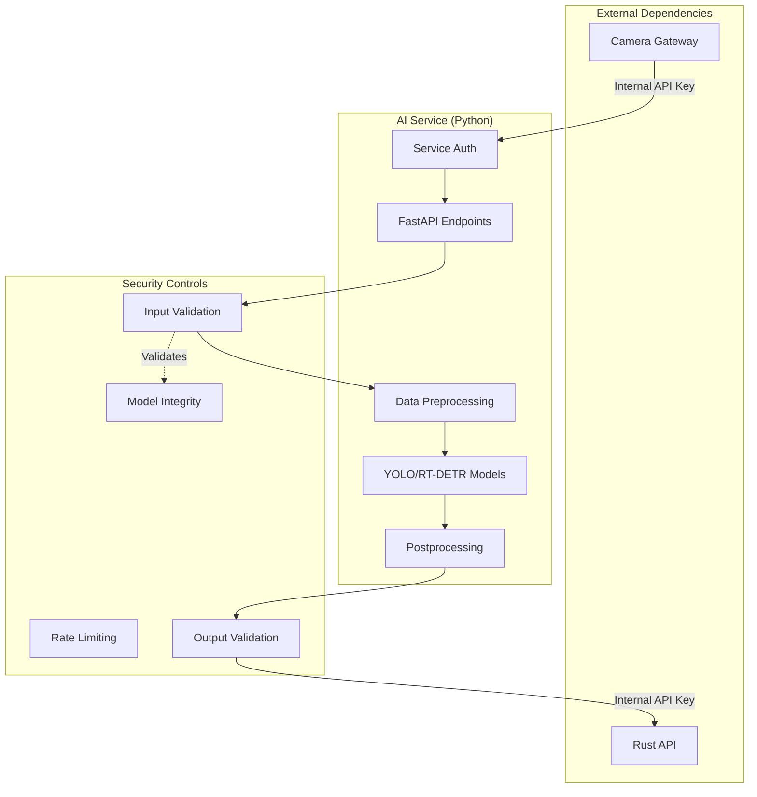
```mermaid
graph TD
    subgraph "AI Service (Python)"
        API[FastAPI Endpoints]
        Auth[Service Auth]
        Preprocess[Data Preprocessing]
        Model[YOLO/RT-DETR Models]
        Postprocess[Postprocessing]
    end

    subgraph "External Dependencies"
        CameraGW[Camera Gateway]
        RustAPI[Rust API]
    end

    subgraph "Security Controls"
        InputVal[Input Validation]
        RateLimit[Rate Limiting]
        ModelInteg[Model Integrity]
        OutVal[Output Validation]
    end

    CameraGW -->|Internal API Key| Auth
    Auth --> API
    API --> InputVal
    InputVal --> Preprocess
    Preprocess --> Model
    Model --> Postprocess
    Postprocess --> OutVal
    OutVal -->|Internal API Key| RustAPI

    InputVal -.->|Validates| ModelInteg
```

### 14.2 AI Service Threats and Mitigations

| Threat                     | Risk Level | Mitigation                                   |
| -------------------------- | ---------- | -------------------------------------------- |
| Model poisoning            | Medium     | Model integrity checks, signed model weights |
| Adversarial input          | Medium     | Input validation, clip duration limits       |
| Resource exhaustion        | High       | Rate limiting, GPU memory limits, timeouts   |
| Data exfiltration          | Medium     | Network isolation, no external egress        |
| Model theft                | Low        | Container isolation, no model export API     |
| Supply chain (Python deps) | Medium     | Dependency scanning, lockfile, SBOM          |
| Insecure deserialization   | High       | No pickle, only ONNX/TorchScript for models  |
| Excessive output           | Low        | Output validation, max detections per frame  |

### 14.3 AI Model Security

| Control           | Implementation                                   |
| ----------------- | ------------------------------------------------ |
| Model format      | ONNX or TorchScript (no pickle)                  |
| Model loading     | Verify checksum before loading                   |
| Model storage     | Local filesystem, no external registry           |
| Input validation  | Frame size limits, color format validation       |
| Output validation | Confidence threshold, max detection count        |
| GPU memory        | Per-model GPU memory allocation                  |
| Inference timeout | 30 seconds max per inference request             |
| Model versioning  | Version tracked in metadata, not in model binary |

---

## 15. Database Security

### 15.1 Database Security Architecture

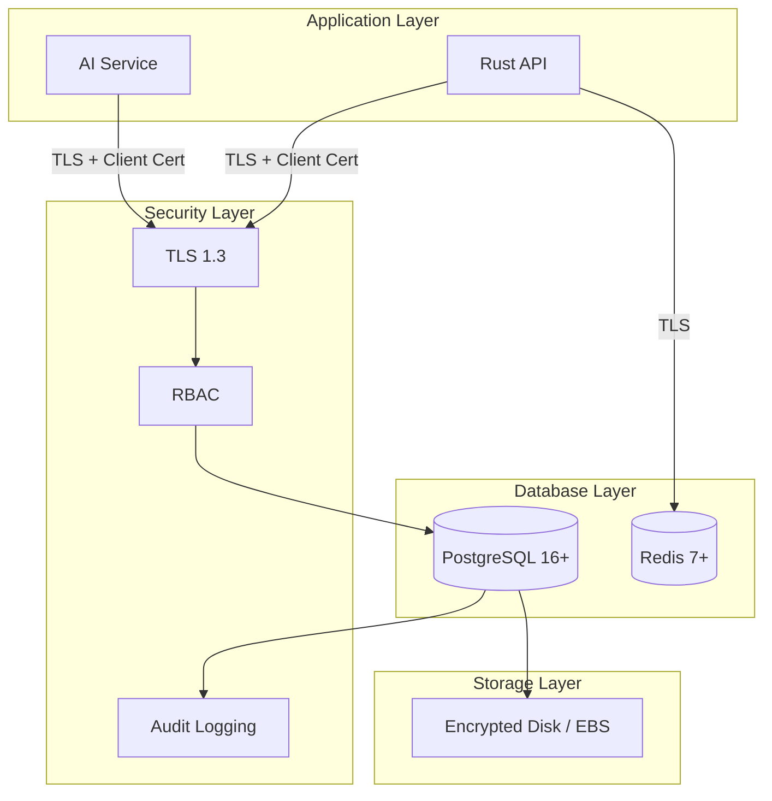
```mermaid
graph TD
    subgraph "Application Layer"
        API[Rust API]
        AI[AI Service]
    end

    subgraph "Security Layer"
        TLS1[TLS 1.3]
        RBAC1[RBAC]
        Audit1[Audit Logging]
    end

    subgraph "Database Layer"
        PG[(PostgreSQL 16+)]
        Redis[(Redis 7+)]
    end

    subgraph "Storage Layer"
        Disk[Encrypted Disk / EBS]
    end

    API -->|TLS + Client Cert| TLS1
    AI -->|TLS + Client Cert| TLS1
    TLS1 --> RBAC1
    RBAC1 --> PG
    PG --> Audit1
    API -->|TLS| Redis
    PG --> Disk
```

### 15.2 Database Access Controls

| Control                  | Implementation                                               |
| ------------------------ | ------------------------------------------------------------ |
| Connection encryption    | TLS 1.3 required for all connections                         |
| Authentication           | SCRAM-SHA-256 (PostgreSQL native)                            |
| Role separation          | Separate DB roles for API and AI service                     |
| Least privilege          | API role: CRUD on application tables                         |
|                          | AI role: READ on detection_events, WRITE on detection_events |
|                          | Read-only role: SELECT only (for reporting)                  |
| Network isolation        | PostgreSQL on private network only                           |
| Connection pooling       | SQLx built-in pool (max 20 connections)                      |
| Statement timeout        | 30 seconds maximum per query                                 |
| Idle transaction timeout | 10 seconds                                                   |

### 15.3 Table-Level Access Control

| Table                | API Role    | AI Role | Read-Only Role | System Admin |
| -------------------- | ----------- | ------- | -------------- | ------------ |
| users                | CRUD        | None    | SELECT         | Full         |
| roles                | CRUD        | None    | SELECT         | Full         |
| user_roles           | CRUD        | None    | SELECT         | Full         |
| permissions          | CRUD        | None    | SELECT         | Full         |
| role_permissions     | CRUD        | None    | SELECT         | Full         |
| sites                | CRUD        | None    | SELECT         | Full         |
| cameras              | CRUD        | None    | SELECT         | Full         |
| camera_groups        | CRUD        | None    | SELECT         | Full         |
| detection_events     | CRUD        | CRUD    | SELECT         | Full         |
| rules                | CRUD        | READ    | SELECT         | Full         |
| alerts               | CRUD        | CRUD    | SELECT         | Full         |
| incidents            | CRUD        | None    | SELECT         | Full         |
| incident_alerts      | CRUD        | None    | SELECT         | Full         |
| evidence             | CRUD        | None    | SELECT         | Full         |
| evidence_access_log  | CRUD        | None    | SELECT         | Full         |
| audit_logs           | SELECT only | None    | SELECT         | Full         |
| notification_rules   | CRUD        | None    | SELECT         | Full         |
| notification_history | CRUD        | None    | SELECT         | Full         |
| sessions             | CRUD        | None    | None           | Full         |

### 15.4 Data-at-Rest Encryption

| Layer             | Mechanism                                                 |
| ----------------- | --------------------------------------------------------- |
| PostgreSQL TDE    | Not available in community edition — use disk-level      |
| Disk encryption   | LUKS (Linux) / EBS encryption (AWS) / BitLocker (Windows) |
| Evidence storage  | AES-256-GCM encryption per file                           |
| Redis persistence | Redis RDB/AOF on encrypted volume                         |
| Backup encryption | AES-256-GCM before upload to S3                           |

### 15.5 Database Audit Logging

| Event Category          | Logged Data                                          |
| ----------------------- | ---------------------------------------------------- |
| Connection              | User, timestamp, source IP, TLS status               |
| DDL changes             | CREATE/ALTER/DROP statements with user and timestamp |
| DML on sensitive tables | INSERT/UPDATE/DELETE on users, roles, audit_logs     |
| Permission changes      | GRANT/REVOKE statements                              |
| Failed queries          | Query error with user context                        |

### 15.6 SQL Injection Prevention

| Control               | Implementation                                        |
| --------------------- | ----------------------------------------------------- |
| Parameterized queries | SQLx`sqlx::query!()` with bind parameters           |
| Input validation      | Request schema validation via serde                   |
| ORM avoidance         | Direct SQL with parameterized queries                 |
| Stored procedures     | Not used (avoid SQL injection surface)                |
| Dynamic SQL           | Never used — all queries are static or parameterized |
| Error handling        | Generic error messages (no SQL details leaked)        |

---

## 16. Evidence Security

### 16.1 Evidence Chain of Custody

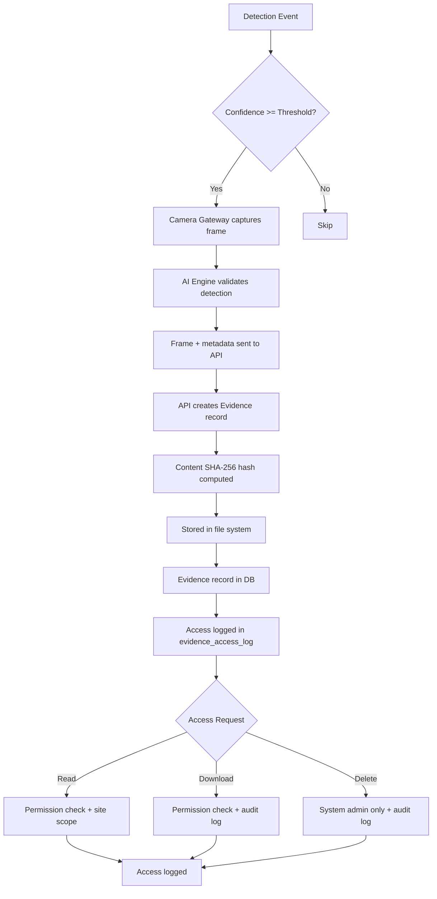
```mermaid
graph TD
    A[Detection Event] --> B{Confidence >= Threshold?}
    B -->|Yes| C[Camera Gateway captures frame]
    B -->|No| D[Skip]
    C --> E[AI Engine validates detection]
    E --> F[Frame + metadata sent to API]
    F --> G[API creates Evidence record]
    G --> H[Content SHA-256 hash computed]
    H --> I[Stored in file system]
    I --> J[Evidence record in DB]
    J --> K[Access logged in evidence_access_log]

    K --> L{Access Request}
    L -->|Read| M[Permission check + site scope]
    L -->|Download| N[Permission check + audit log]
    L -->|Delete| O[System admin only + audit log]

    M --> P[Access logged]
    N --> P
    O --> P
```

### 16.2 Evidence Integrity Controls

| Control               | Implementation                                    |
| --------------------- | ------------------------------------------------- |
| Content hashing       | SHA-256 computed on evidence creation             |
| Hash verification     | Verified on every access/download                 |
| Tamper detection      | Hash mismatch triggers alert + access denial      |
| Storage location      | File system (S3/GCS future) with restricted perms |
| File permissions      | 0644 (read-only) for application service          |
| Directory permissions | 0755 for evidence storage directories             |
| Naming convention     | `{site_id}/{date}/{uuid}.{ext}`                 |
| Max file size         | 10 MB per evidence clip                           |
| Allowed formats       | JPEG, PNG, MP4                                    |
| Cleanup policy        | Auto-delete after retention period (configurable) |

### 16.3 Evidence Access Control

| Operation         | Permission Required        | Audit Requirement                |
| ----------------- | -------------------------- | -------------------------------- |
| View evidence     | evidence.read              | Log user, timestamp, evidence_id |
| Download evidence | evidence.read              | Log user, timestamp, evidence_id |
| Upload evidence   | evidence.create            | Log user, timestamp, hash        |
| Delete evidence   | system_admin only          | Log user, timestamp, evidence_id |
| Access audit log  | evidence.read + audit.read | Log accessor identity            |

### 16.4 Evidence Retention Policy

| Retention Period      | Action                                    |
| --------------------- | ----------------------------------------- |
| 0-90 days             | Full retention, no restrictions           |
| 91-365 days           | Move to cold storage (S3 Glacier)         |
| 365+ days             | Delete unless legal hold applied          |
| Legal hold            | Retain indefinitely until hold released   |
| GDPR right to erasure | Delete within 30 days (unless legal hold) |

---

## 17. Cryptography

### 17.1 Cryptographic Standards

| Algorithm     | Use Case                          | Key Size    | Notes                              |
| ------------- | --------------------------------- | ----------- | ---------------------------------- |
| AES-256-GCM   | Data at rest encryption           | 256-bit     | Authenticated encryption           |
| RSA (RS256)   | JWT token signing                 | 2048-bit    | RSA + SHA-256                      |
| SHA-256       | Content hashing, password hashing | 256-bit     | Evidence integrity, refresh tokens |
| bcrypt        | Password hashing                  | N/A         | Cost factor 12                     |
| Argon2id      | Password hashing (preferred)      | N/A         | t=3, m=65536, p=4                  |
| TLS 1.3       | Transport encryption              | 128-256 bit | All API communication              |
| SCRAM-SHA-256 | Database authentication           | 256-bit     | PostgreSQL native                  |

### 17.2 Key Management

| Key Type                | Algorithm   | Rotation Period | Storage Location         | Access Scope        |
| ----------------------- | ----------- | --------------- | ------------------------ | ------------------- |
| JWT signing key         | RS256       | 30 days         | Environment variable     | Auth service only   |
| JWT verification key    | RS256       | 30 days         | Derives from private key | All API instances   |
| Evidence encryption key | AES-256-GCM | 90 days         | Environment variable     | API service only    |
| Database password       | N/A         | 90 days         | Environment variable     | API + AI services   |
| Redis password          | N/A         | 90 days         | Environment variable     | API service only    |
| API key (internal)      | Random      | 30 days         | Environment variable     | Inter-service only  |
| Camera RTSP credentials | N/A         | As needed       | Environment variable     | Camera Gateway only |
| TLS certificates        | ECDSA P-256 | 365 days        | OS certificate store     | All services        |

### 17.3 Key Rotation Procedure

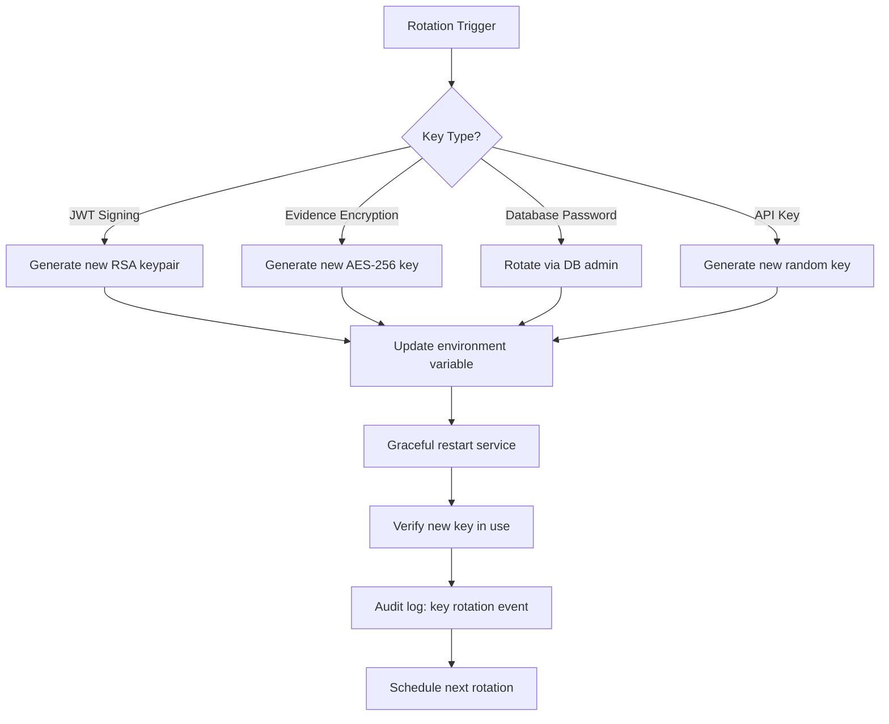
```mermaid
graph TD
    A[Rotation Trigger] --> B{Key Type?}
    B -->|JWT Signing| C[Generate new RSA keypair]
    B -->|Evidence Encryption| D[Generate new AES-256 key]
    B -->|Database Password| E[Rotate via DB admin]
    B -->|API Key| F[Generate new random key]

    C --> G[Update environment variable]
    D --> G
    E --> G
    F --> G

    G --> H[Graceful restart service]
    H --> I[Verify new key in use]
    I --> J[Audit log: key rotation event]
    J --> K[Schedule next rotation]
```

### 17.4 Encryption Architecture

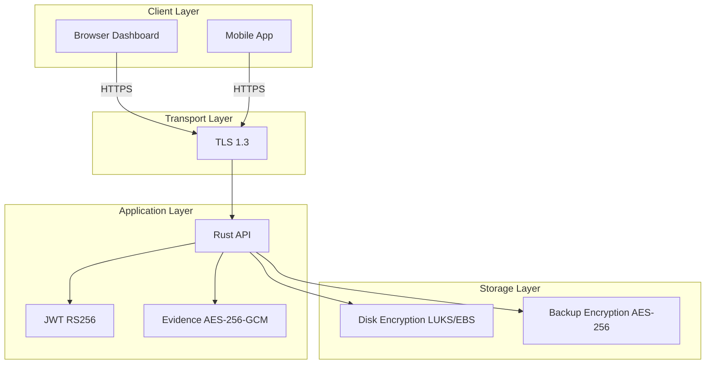
```mermaid
graph TD
    subgraph "Client Layer"
        Browser[Browser Dashboard]
        Mobile[Mobile App]
    end

    subgraph "Transport Layer"
        TLS[TLS 1.3]
    end

    subgraph "Application Layer"
        API[Rust API]
        JWT[JWT RS256]
        Evidence[Evidence AES-256-GCM]
    end

    subgraph "Storage Layer"
        Disk[Disk Encryption LUKS/EBS]
        Backup[Backup Encryption AES-256]
    end

    Browser -->|HTTPS| TLS
    Mobile -->|HTTPS| TLS
    TLS --> API
    API --> JWT
    API --> Evidence
    API --> Disk
    API --> Backup
```

### 17.5 Password Hashing

| Algorithm | Parameters                        | Use Case              |
| --------- | --------------------------------- | --------------------- |
| Argon2id  | t=3, m=65536, p=4, 32-byte output | New user registration |
| bcrypt    | Cost 12, 60-byte output           | Legacy migration      |
| SHA-256   | Salted (32-byte random salt)      | Refresh tokens only   |

### 17.6 TLS Configuration

| Setting                  | Value                                                |
| ------------------------ | ---------------------------------------------------- |
| Minimum version          | TLS 1.3                                              |
| Supported cipher suites  | TLS_AES_256_GCM_SHA384, TLS_CHACHA20_POLY1305_SHA256 |
| Certificate type         | ECDSA P-256 (preferred) or RSA 2048                  |
| HSTS                     | max-age=63072000; includeSubDomains; preload         |
| Certificate transparency | Required for public certificates                     |

---

## 18. Secrets Management

### 18.1 Secrets Inventory

| Secret            | Format                | Rotation  | Storage              |
| ----------------- | --------------------- | --------- | -------------------- |
| JWT_PRIVATE_KEY   | RSA PEM (PKCS8)       | 30 days   | Environment variable |
| JWT_PUBLIC_KEY    | RSA PEM               | 30 days   | Environment variable |
| DATABASE_URL      | Connection string     | 90 days   | Environment variable |
| DATABASE_PASSWORD | String (32+ chars)    | 90 days   | Environment variable |
| REDIS_URL         | Connection string     | 90 days   | Environment variable |
| REDIS_PASSWORD    | String (32+ chars)    | 90 days   | Environment variable |
| ENCRYPTION_KEY    | Hex string (64 chars) | 90 days   | Environment variable |
| INTERNAL_API_KEY  | String (32+ chars)    | 30 days   | Environment variable |
| RTSP_USERNAME     | String                | As needed | Environment variable |
| RTSP_PASSWORD     | String                | As needed | Environment variable |
| SMTP_USERNAME     | String                | As needed | Environment variable |
| SMTP_PASSWORD     | String                | As needed | Environment variable |
| CORS_ORIGINS      | Comma-separated URL   | As needed | Environment variable |
| RUST_LOG          | Log level string      | N/A       | Environment variable |

### 18.2 Secrets Management Rules

| Rule                                    | Enforcement                             |
| --------------------------------------- | --------------------------------------- |
| Never commit secrets to version control | Pre-commit hooks, CI scanning           |
| Never log secrets                       | Structured logging with field filtering |
| Never return secrets in API responses   | Response serialization excludes secrets |
| Never hardcode secrets in source code   | Environment variables only              |
| Rotate secrets on schedule              | Calendar reminders, automation          |
| Rotate secrets on compromise            | Immediate rotation + audit              |
| Least privilege access                  | Service-specific env vars               |
| Encrypted at rest                       | OS-level disk encryption                |
| No secrets in Docker images             | Runtime environment injection           |

### 18.3 Secrets Management Architecture

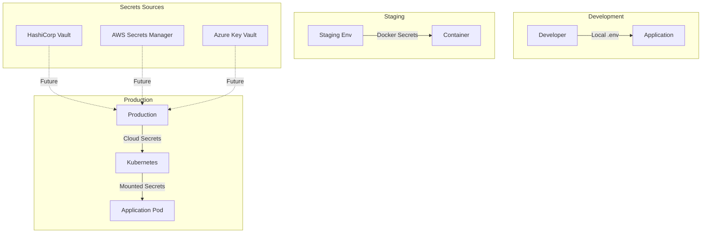
```mermaid
graph TD
    subgraph "Development"
        Dev[Developer] -->|Local .env| App[Application]
    end

    subgraph "Staging"
        Stage[Staging Env] -->|Docker Secrets| DockerApp[Container]
    end

    subgraph "Production"
        Prod[Production] -->|Cloud Secrets| K8sApp[Kubernetes]
        K8sApp -->|Mounted Secrets| Pod[Application Pod]
    end

    subgraph "Secrets Sources"
        Vault[HashiCorp Vault] -.->|Future| Prod
        AWS_Secrets[AWS Secrets Manager] -.->|Future| Prod
        Azure_KV[Azure Key Vault] -.->|Future| Prod
    end
```

### 18.4 Deployment Secrets Injection

| Environment    | Method                                       | Notes              |
| -------------- | -------------------------------------------- | ------------------ |
| Local dev      | `.env` file (gitignored)                   | Manual setup       |
| Docker Compose | `env_file` directive in docker-compose.yml | Not for production |
| Kubernetes     | Secrets + env vars in Deployment spec        | Base64 encoded     |
| Cloud (future) | External Secrets Operator / Vault Agent      | Automated rotation |

---

## 19. Network Security

### 19.1 Network Architecture

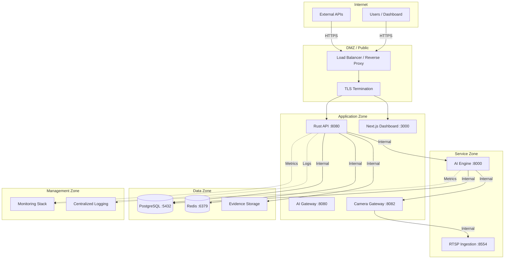
```mermaid
graph TB
    subgraph "Internet"
        User[Users / Dashboard]
        ExtAPI[External APIs]
    end

    subgraph "DMZ / Public"
        LB[Load Balancer / Reverse Proxy]
        TLS终结[TLS Termination]
    end

    subgraph "Application Zone"
        API[Rust API :8080]
        AIGateway[AI Gateway :8080]
        Dashboard[Next.js Dashboard :3000]
        CameraGW[Camera Gateway :8082]
    end

    subgraph "Service Zone"
        AIEngine[AI Engine :8000]
        Ingestion[RTSP Ingestion :8554]
    end

    subgraph "Data Zone"
        PG[(PostgreSQL :5432)]
        Redis[(Redis :6379)]
        EvidenceStore[Evidence Storage]
    end

    subgraph "Management Zone"
        Monitor[Monitoring Stack]
        Logs[Centralized Logging]
    end

    User -->|HTTPS| LB
    ExtAPI -->|HTTPS| LB
    LB --> TLS终结
    TLS终结 --> API
    TLS终结 --> Dashboard

    API -->|Internal| AIEngine
    API -->|Internal| PG
    API -->|Internal| Redis
    API -->|Internal| EvidenceStore

    AIEngine -->|Internal| CameraGW
    AIEngine -->|Internal| PG
    CameraGW -->|Internal| Ingestion

    API -.->|Metrics| Monitor
    AIEngine -.->|Metrics| Monitor
    API -.->|Logs| Logs
```

### 19.2 Network Segmentation

| Zone             | CIDR (Example) | Access Rules                                |
| ---------------- | -------------- | ------------------------------------------- |
| DMZ              | 10.0.1.0/24    | Internet → LB → App Zone                  |
| Application Zone | 10.0.2.0/24    | DMZ → App Zone, App → Data Zone           |
| Service Zone     | 10.0.3.0/24    | App Zone → Service Zone (internal only)    |
| Data Zone        | 10.0.4.0/24    | App Zone → Data Zone (specific ports only) |
| Management Zone  | 10.0.5.0/24    | All zones → Management (monitoring only)   |

### 19.3 Firewall Rules

| Source Zone      | Destination Zone | Port | Protocol | Purpose                |
| ---------------- | ---------------- | ---- | -------- | ---------------------- |
| Internet         | DMZ              | 443  | TCP      | HTTPS traffic          |
| DMZ              | Application Zone | 8080 | TCP      | API requests           |
| DMZ              | Application Zone | 3000 | TCP      | Dashboard              |
| Application Zone | Data Zone        | 5432 | TCP      | PostgreSQL             |
| Application Zone | Data Zone        | 6379 | TCP      | Redis                  |
| Application Zone | Service Zone     | 8000 | TCP      | AI Engine              |
| Application Zone | Service Zone     | 8554 | TCP      | RTSP Ingestion         |
| Service Zone     | Data Zone        | 5432 | TCP      | AI Engine → DB (read) |
| All Zones        | Management Zone  | 9090 | TCP      | Prometheus metrics     |
| All Zones        | Management Zone  | 3100 | TCP      | Loki logs              |

### 19.4 Internal Communication Security

| Communication Path          | Protocol   | Auth Method       | Encryption      |
| --------------------------- | ---------- | ----------------- | --------------- |
| Client ↔ Load Balancer     | HTTPS      | TLS termination   | TLS 1.3         |
| Load Balancer ↔ API        | HTTP       | Network isolation | mTLS (planned)  |
| API ↔ PostgreSQL           | PostgreSQL | SCRAM-SHA-256     | TLS 1.3         |
| API ↔ Redis                | Redis      | AUTH + TLS        | TLS 1.3         |
| API ↔ AI Engine            | HTTP       | Internal API key  | mTLS (planned)  |
| API ↔ Camera Gateway       | HTTP       | Internal API key  | mTLS (planned)  |
| API ↔ Evidence Storage     | Filesystem | OS permissions    | Disk encryption |
| AI Engine ↔ Camera Gateway | HTTP       | Internal API key  | mTLS (planned)  |

---

## 20. Infrastructure Security

### 20.1 Container Runtime Security

| Control            | Implementation                                     |
| ------------------ | -------------------------------------------------- |
| Container runtime  | containerd (Kubernetes) or Docker                  |
| Image scanning     | Trivy in CI/CD pipeline                            |
| Image signing      | Cosign / Sigstore (planned)                        |
| Runtime protection | Seccomp profiles, AppArmor (planned)               |
| Network policies   | Kubernetes NetworkPolicy (deny-all default)        |
| Pod security       | Non-root user, read-only rootfs, drop capabilities |
| Resource quotas    | CPU/memory limits per namespace                    |
| Secret management  | Kubernetes Secrets with encryption at rest         |

### 20.2 Kubernetes Security

| Control                | Implementation                          |
| ---------------------- | --------------------------------------- |
| RBAC                   | Namespace-scoped roles, least privilege |
| Admission control      | OPA Gatekeeper or Kyverno (planned)     |
| Audit logging          | Kubernetes audit logs → Loki           |
| Network policies       | Calico or Cilium (planned)              |
| Pod security standards | Restricted profile                      |
| Service mesh           | Istio or Linkerd (future)               |

### 20.3 Cloud Security (AWS/GCP/Azure)

| Control                      | Implementation                              |
| ---------------------------- | ------------------------------------------- |
| VPC                          | Isolated network per environment            |
| Subnets                      | Public (DMZ), Private (App), Private (Data) |
| Security groups              | Port-level firewall rules                   |
| IAM                          | Least-privilege roles per service           |
| KMS                          | AWS KMS / GCP KMS for key management        |
| EBS encryption               | Default encryption on all EBS volumes       |
| S3 encryption                | SSE-S3 or SSE-KMS for backup storage        |
| CloudTrail / Audit Logs      | API call logging for compliance             |
| GuardDuty / Threat Detection | AWS GuardDuty or equivalent                 |

### 20.4 Infrastructure Hardening

| Area                 | Hardening Measure                              |
| -------------------- | ---------------------------------------------- |
| Operating system     | Minimal install, CIS benchmark hardening       |
| SSH access           | Key-based only, bastion host, no password auth |
| File permissions     | Principle of least privilege                   |
| Unnecessary services | Disabled and removed                           |
| Automatic updates    | Unattended-upgrades (Debian/Ubuntu)            |
| Kernel parameters    | sysctl hardening (ASLR, etc.)                  |
| Audit framework      | auditd for system-level audit logging          |

---

## 21. Logging and Auditing

### 21.1 Audit Log Schema

```sql
CREATE TABLE audit_logs (
    id            UUID PRIMARY KEY DEFAULT gen_random_uuid(),
    user_id       UUID REFERENCES users(id) ON DELETE SET NULL,
    action        VARCHAR(100) NOT NULL,        -- e.g., 'user.login', 'evidence.delete'
    resource_type VARCHAR(50) NOT NULL,         -- e.g., 'user', 'evidence', 'alert'
    resource_id   UUID,                         -- ID of affected resource
    details       JSONB,                        -- Additional context (old/new values)
    ip_address    INET,                         -- Client IP address
    user_agent    TEXT,                         -- Client user agent string
    timestamp     TIMESTAMPTZ DEFAULT NOW() NOT NULL
);

-- Append-only: REVOKE UPDATE/DELETE on audit_logs
-- Index for efficient queries
CREATE INDEX idx_audit_logs_user_id ON audit_logs(user_id);
CREATE INDEX idx_audit_logs_action ON audit_logs(action);
CREATE INDEX idx_audit_logs_resource ON audit_logs(resource_type, resource_id);
CREATE INDEX idx_audit_logs_timestamp ON audit_logs(timestamp DESC);
```

### 21.2 Audit Event Types

| Category        | Events Logged                                                      |
| --------------- | ------------------------------------------------------------------ |
| Authentication  | login.success, login.failure, logout, password.change              |
| User Management | user.create, user.update, user.delete, user.suspend                |
| Role Management | role.grant, role.revoke, permission.change                         |
| Evidence        | evidence.create, evidence.read, evidence.download, evidence.delete |
| Alerts          | alert.create, alert.acknowledge, alert.close                       |
| Incidents       | incident.create, incident.update, incident.close                   |
| Configuration   | config.update, rule.create, rule.update, rule.delete               |
| System          | system.start, system.stop, key.rotation                            |

### 21.3 Structured Logging Format

```json
{
  "timestamp": "2025-06-21T10:30:00.000Z",
  "level": "info",
  "service": "vigilantai-api",
  "request_id": "uuid-of-request",
  "user_id": "uuid-of-user",
  "action": "evidence.read",
  "resource_type": "evidence",
  "resource_id": "uuid-of-evidence",
  "details": {
    "method": "GET",
    "path": "/api/v1/evidence/uuid",
    "status": 200,
    "duration_ms": 45
  },
  "ip_address": "192.168.1.100"
}
```

### 21.4 Log Retention

| Log Type         | Retention Period | Storage Tier       |
| ---------------- | ---------------- | ------------------ |
| Application logs | 30 days          | Hot (local/Loki)   |
| Audit logs       | 1 year           | Warm (S3 Standard) |
| Security alerts  | 2 years          | Warm (S3 Standard) |
| System logs      | 30 days          | Hot (local/Loki)   |
| API access logs  | 90 days          | Warm (S3 Standard) |
| Compliance logs  | 7 years          | Cold (S3 Glacier)  |

---

## 22. Monitoring and Threat Detection

### 22.1 Security Monitoring Architecture

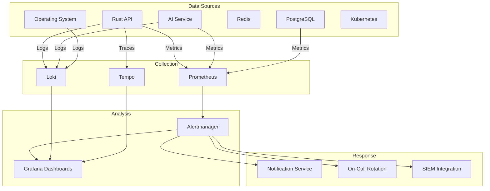
```mermaid
graph TD
    subgraph "Data Sources"
        API[Rust API]
        AI[AI Service]
        PG[PostgreSQL]
        Redis[Redis]
        OS[Operating System]
        K8s[Kubernetes]
    end

    subgraph "Collection"
        Prom[Prometheus]
        Loki[Loki]
        Tempo[Tempo]
    end

    subgraph "Analysis"
        AlertManager[Alertmanager]
        Grafana[Grafana Dashboards]
    end

    subgraph "Response"
        Notify[Notification Service]
        OnCall[On-Call Rotation]
        SIEM[SIEM Integration]
    end

    API -->|Metrics| Prom
    AI -->|Metrics| Prom
    PG -->|Metrics| Prom
    API -->|Logs| Loki
    AI -->|Logs| Loki
    OS -->|Logs| Loki
    API -->|Traces| Tempo

    Prom --> AlertManager
    AlertManager --> Notify
    AlertManager --> Grafana
    Loki --> Grafana
    Tempo --> Grafana
    AlertManager --> OnCall
    AlertManager --> SIEM
```

### 22.2 Security Alerts

| Alert Name                  | Condition                                | Severity | Response Time |
| --------------------------- | ---------------------------------------- | -------- | ------------- |
| Brute force detected        | >5 failed logins from single IP in 5 min | High     | Immediate     |
| Account lockout             | Account locked due to failed attempts    | Medium   | 1 hour        |
| Unauthorized access attempt | 403 response rate > 10/min               | High     | Immediate     |
| Evidence tamper detected    | SHA-256 hash mismatch on evidence access | Critical | Immediate     |
| Anomalous API usage         | >500 requests/min from single user       | Medium   | 30 minutes    |
| Database connection spike   | >50 connections in 1 minute              | Medium   | 30 minutes    |
| JWT signing key aging       | Key age > 25 days                        | Low      | 7 days        |
| Backup failure              | Scheduled backup did not complete        | High     | 1 hour        |
| Service health degraded     | Health check failing for > 5 minutes     | High     | Immediate     |
| Unusual data export         | >100 evidence downloads in 1 hour        | High     | Immediate     |

### 22.3 MITRE ATT&CK Detection Coverage

| Technique                    | Detection Method                            |
| ---------------------------- | ------------------------------------------- |
| T1078 - Valid Accounts       | Anomalous login location, impossible travel |
| T1110 - Brute Force          | Failed login threshold monitoring           |
| T1059 - Command Injection    | WAF rules, input validation logs            |
| T1190 - Exploit Public App   | WAF anomaly detection                       |
| T1048 - Exfiltration Over C2 | Network egress monitoring, DLP policies     |
| T1565 - Data Manipulation    | Evidence integrity monitoring               |
| T1070 - Indicator Removal    | Audit log tamper detection                  |
| T1021 - Remote Services      | SSH anomaly detection                       |
| T1496 - Resource Hijacking   | CPU/memory anomaly detection                |
| T1195 - Supply Chain         | Dependency change detection, SBOM diffing   |

---

## 23. Vulnerability Management

### 23.1 Vulnerability Scanning Schedule

| Scan Type                | Frequency   | Tool                              | Scope               |
| ------------------------ | ----------- | --------------------------------- | ------------------- |
| Dependency scanning      | Every build | cargo-audit, pip-audit, npm audit | Code dependencies   |
| Container image scanning | Every build | Trivy, Grype                      | Docker images       |
| OS vulnerability scan    | Weekly      | OpenVAS, Nessus                   | Base OS             |
| Application scan         | Monthly     | OWASP ZAP, Burp Suite             | Web application     |
| Infrastructure scan      | Monthly     | Scout Suite                       | Cloud configuration |
| Penetration test         | Annual      | Third-party firm                  | Full platform       |

### 23.2 Vulnerability Remediation SLAs

| CVSS Score | Severity | Remediation SLA | Escalation            |
| ---------- | -------- | --------------- | --------------------- |
| 9.0-10.0   | Critical | 24 hours        | Immediate CISO notify |
| 7.0-8.9    | High     | 7 days          | Security team lead    |
| 4.0-6.9    | Medium   | 30 days         | Engineering team lead |
| 0.1-3.9    | Low      | 90 days         | Scheduled maintenance |

### 23.3 Vulnerability Management Process

```mermaid
graph TD
    A[Scan/Report] --> B[Classify & Prioritize]
    B --> C[Assign Owner]
    C --> D{CVSS >= 9.0?}
    D -->|Yes| E[Emergency Fix]
    D -->|No| F[Standard Fix]
    E --> G[Hotfix + Emergency Deploy]
    F --> H[Regular Sprint Fix]
    G --> I[Verify Fix]
    H --> I
    I --> J[Rescan]
    J --> K[Close or Escalate]
    K --> L[Update Vulnerability Register]
```

### 23.4 Patch Management

| Component             | Patch Strategy                          | Frequency |
| --------------------- | --------------------------------------- | --------- |
| OS packages           | Unattended-upgrades (security only)     | Daily     |
| Rust dependencies     | Dependabot/Renovate PRs + CI testing    | Weekly    |
| Python dependencies   | Dependabot/Renovate PRs + CI testing    | Weekly    |
| npm packages          | Dependabot/Renovate PRs + CI testing    | Weekly    |
| PostgreSQL            | Minor version upgrade (rolling restart) | Monthly   |
| Redis                 | Minor version upgrade                   | Monthly   |
| Container base images | Rebuild + redeploy                      | Monthly   |

---

## 24. Incident Response

### 24.1 Incident Response Workflow

```mermaid
graph TD
    A[Incident Detected] --> B[Classification]
    B --> C{Severity?}
    C -->|P1 Critical| D[Immediate Response]
    C -->|P2 High| E[Urgent Response]
    C -->|P3 Medium| F[Standard Response]
    C -->|P4 Low| G[Scheduled Response]

    D --> H[Assemble IR Team]
    E --> H
    F --> I[Assign to Engineer]
    G --> J[Backlog]

    H --> K[Containment]
    K --> L[Eradication]
    L --> M[Recovery]
    M --> N[Post-Incident Review]
    N --> O[Update Playbooks]
    O --> P[Close Incident]
```

### 24.2 Incident Severity Levels

| Level | Response Time | Resolution Target | Escalation             | Examples                    |
| ----- | ------------- | ----------------- | ---------------------- | --------------------------- |
| P1    | 15 minutes    | 4 hours           | CISO + CTO immediately | Data breach, active exploit |
| P2    | 1 hour        | 24 hours          | Security team lead     | Privilege escalation, DoS   |
| P3    | 4 hours       | 7 days            | Engineering lead       | Vulnerability discovered    |
| P4    | 24 hours      | 30 days           | Backlog                | Minor configuration issue   |

### 24.3 Incident Response Team

| Role               | Responsibility                           |
| ------------------ | ---------------------------------------- |
| Incident Commander | Overall coordination, decision-making    |
| Security Lead      | Technical investigation, containment     |
| Engineering Lead   | System recovery, patch application       |
| Communications     | Stakeholder notification, status updates |
| Legal              | Regulatory notification, legal counsel   |
| Management         | Resource allocation, business decisions  |

### 24.4 Incident Playbooks

| Playbook                | Trigger                       | Key Steps                                    |
| ----------------------- | ----------------------------- | -------------------------------------------- |
| Data Breach             | Evidence of data exfiltration | Contain, assess scope, notify, remediate     |
| Account Compromise      | Unauthorized access detected  | Lock account, reset credentials, investigate |
| DDoS Attack             | Abnormal traffic volume       | Enable rate limiting, CDN, contact ISP       |
| Ransomware              | File encryption detected      | Isolate systems, do NOT pay, restore         |
| Insider Threat          | Suspicious employee activity  | Monitor, collect evidence, HR/legal          |
| Supply Chain Compromise | Malicious dependency detected | Isolate, rollback, rebuild, notify           |

### 24.5 Evidence Preservation

| Step | Action                                   |
| ---- | ---------------------------------------- |
| 1    | Capture affected system memory dump      |
| 2    | Preserve relevant audit logs (snapshot)  |
| 3    | Clone affected database records          |
| 4    | Screenshot affected systems              |
| 5    | Document chain of custody                |
| 6    | Store in secure, tamper-evident location |

---

## 25. Business Continuity and Disaster Recovery

### 25.1 Recovery Objectives

| Metric                         | Target  | Justification                         |
| ------------------------------ | ------- | ------------------------------------- |
| RTO (Recovery Time Objective)  | 4 hours | Security monitoring cannot be offline |
| RPO (Recovery Point Objective) | 1 hour  | Max 1 hour data loss acceptable       |
| MTTR (Mean Time to Recovery)   | 2 hours | Target for P1 incidents               |
| Availability target            | 99.9%   | Security platform SLA                 |

### 25.2 Backup Strategy

| Data Type           | Frequency    | Retention | Storage Location  | Encryption            |
| ------------------- | ------------ | --------- | ----------------- | --------------------- |
| PostgreSQL database | Hourly       | 30 days   | S3 (cross-region) | AES-256-GCM           |
| Evidence files      | Continuous   | 30 days   | S3 (same-region)  | AES-256-GCM           |
| Audit logs          | Hourly       | 1 year    | S3 (cross-region) | AES-256-GCM           |
| Configuration       | On change    | 90 days   | Git repository    | Repository encryption |
| Redis snapshots     | Every 15 min | 24 hours  | EBS snapshots     | EBS encryption        |

### 25.3 Disaster Recovery Plan

| Scenario                 | Recovery Steps                                       | RTO     |
| ------------------------ | ---------------------------------------------------- | ------- |
| Database failure         | Promote read replica, restore from backup            | 30 min  |
| API server failure       | Restart from container image, load balancer failover | 5 min   |
| Evidence storage failure | Restore from S3 backup                               | 2 hours |
| Full region outage       | Activate cross-region DR                             | 4 hours |
| Complete compromise      | Wipe, rebuild from images, restore data              | 4 hours |

---

## 26. Compliance

### 26.1 Regulatory Requirements

| Regulation    | Applicability        | Key Requirements                                         |
| ------------- | -------------------- | -------------------------------------------------------- |
| GDPR          | EU personal data     | Data minimization, right to erasure, breach notification |
| CCPA          | California residents | Consumer rights, data disclosure                         |
| SOC 2 Type II | Enterprise customers | Security controls audit                                  |
| HIPAA         | Healthcare customers | PHI protection, BAA requirements                         |
| PCI DSS       | Payment processing   | Card data protection                                     |
| ISO 27001     | International        | Information security management                          |

### 26.2 Compliance Controls Mapping

| GDPR Article                  | VigilantAI Control                              |
| ----------------------------- | ----------------------------------------------- |
| Art. 5 - Data minimization    | Collect only necessary data per NFR             |
| Art. 17 - Right to erasure    | Hard delete API endpoint                        |
| Art. 25 - Privacy by design   | Data classification, encryption at rest         |
| Art. 32 - Security measures   | TLS, RBAC, encryption, audit logging            |
| Art. 33 - Breach notification | 72-hour notification capability                 |
| Art. 35 - DPIA                | Privacy impact assessment for evidence handling |

### 26.3 Audit Readiness

| Requirement                | Implementation                            |
| -------------------------- | ----------------------------------------- |
| Access control evidence    | RBAC permission matrix (Section 10.3)     |
| Audit trail evidence       | Immutable audit_logs table (Section 21.1) |
| Encryption evidence        | TLS configuration, AES-256 storage        |
| Incident response evidence | IR playbooks, incident log                |
| Vulnerability management   | Scan reports, remediation records         |
| Change management          | Git history, deployment logs              |
| Backup/DR evidence         | Backup verification logs, DR test results |

---

## 27. Security Testing

### 27.1 Testing Types

| Test Type               | Frequency   | Scope                               | Responsible      |
| ----------------------- | ----------- | ----------------------------------- | ---------------- |
| Unit tests (Rust)       | Every build | Business logic, middleware          | Development team |
| Unit tests (Python)     | Every build | AI service logic                    | Development team |
| Integration tests       | Every build | API endpoints, DB queries           | Development team |
| Security unit tests     | Every build | Auth, RBAC, input validation        | Development team |
| Static analysis (SAST)  | Every build | Rust (cargo-audit), Python (bandit) | Development team |
| Dynamic analysis (DAST) | Weekly      | Running application                 | Security team    |
| Penetration testing     | Annual      | Full platform                       | Third party      |
| Red team exercise       | Annual      | Full infrastructure                 | Third party      |

### 27.2 Security Test Cases

| Test ID | Category         | Test Description                            | Expected Result        |
| ------- | ---------------- | ------------------------------------------- | ---------------------- |
| ST-001  | Authentication   | Login with invalid credentials              | 401 + failed count     |
| ST-002  | Authentication   | Login with valid credentials                | 200 + JWT tokens       |
| ST-003  | Authentication   | Access API with expired JWT                 | 401                    |
| ST-004  | Authorization    | Access resource without required permission | 403                    |
| ST-005  | Authorization    | Access other site's data                    | 403 or empty           |
| ST-006  | Input validation | Submit SQL injection in query parameter     | 400 or safe query      |
| ST-007  | Input validation | Submit XSS in user input                    | 400 or sanitized       |
| ST-008  | Rate limiting    | Exceed rate limit                           | 429 Too Many Requests  |
| ST-009  | Evidence         | Tamper with evidence file                   | Hash mismatch detected |
| ST-010  | Evidence         | Access evidence without permission          | 403                    |
| ST-011  | Audit            | Verify audit log for sensitive action       | Log entry exists       |
| ST-012  | WebSocket        | Connect without valid JWT                   | Connection rejected    |
| ST-013  | CORS             | Send request from unauthorized origin       | CORS preflight blocked |

---

## 28. Security Governance

### 28.1 Security Policies

| Policy                          | Description                                 |
| ------------------------------- | ------------------------------------------- |
| Information Security Policy     | Overall security governance framework       |
| Access Control Policy           | RBAC, least privilege, need-to-know         |
| Cryptography Policy             | Approved algorithms, key management         |
| Incident Response Policy        | Detection, response, recovery, notification |
| Data Classification Policy      | RESTRICTED, CONFIDENTIAL, INTERNAL, PUBLIC  |
| Acceptable Use Policy           | Permitted use of systems and data           |
| Vulnerability Management Policy | Scanning, remediation, SLAs                 |
| Third-Party Risk Policy         | Vendor assessment, integration security     |

### 28.2 Security Review Cadence

| Review Type                  | Frequency        | Participants               |
| ---------------------------- | ---------------- | -------------------------- |
| Security architecture review | Quarterly        | Security team, architects  |
| Code review (security)       | Every PR         | Security-trained reviewers |
| Access review                | Monthly          | Security admin, team leads |
| Incident post-mortem         | After each P1/P2 | IR team                    |
| Penetration test review      | Annual           | Security team, third party |
| Compliance audit             | Annual           | Compliance team, auditors  |
| Tabletop exercise            | Semi-annual      | IR team, management        |

### 28.3 Security Training

| Training Topic                | Audience                    | Frequency   |
| ----------------------------- | --------------------------- | ----------- |
| Secure coding practices       | All developers              | Annual      |
| OWASP Top 10                  | All developers              | Annual      |
| Incident response             | Security + engineering team | Semi-annual |
| Phishing awareness            | All employees               | Quarterly   |
| Access control best practices | Admins                      | Annual      |
| Data handling procedures      | All employees               | Annual      |

---

## 29. Security Roadmap

### 29.1 Phase 1: Foundation (Current)

| Control                      | Status         |
| ---------------------------- | -------------- |
| JWT RS256 authentication     | ✅ Implemented |
| RBAC with 6 roles            | ✅ Implemented |
| Rate limiting                | ✅ Implemented |
| Input validation             | ✅ Implemented |
| Audit logging                | ✅ Implemented |
| Evidence integrity (SHA-256) | ✅ Implemented |
| TLS 1.3                      | ✅ Implemented |
| HTTPS enforcement            | ✅ Implemented |

### 29.2 Phase 2: Hardening (Q3 2025)

| Control                        | Status         |
| ------------------------------ | -------------- |
| Container image scanning       | 🔄 In Progress |
| SBOM generation                | 🔄 In Progress |
| Dependency scanning automation | 🔄 In Progress |
| mTLS for internal services     | 📋 Planned     |
| HSM for JWT key storage        | 📋 Planned     |
| WAF integration                | 📋 Planned     |

### 29.3 Phase 3: Advanced (Q4 2025)

| Control                      | Status     |
| ---------------------------- | ---------- |
| SIEM integration             | 📋 Planned |
| Threat intelligence feeds    | 📋 Planned |
| Automated incident response  | 📋 Planned |
| Penetration testing (annual) | 📋 Planned |
| SOC 2 Type II audit          | 📋 Planned |
| Zero Trust Network Access    | 📋 Planned |

### 29.4 Phase 4: Enterprise (2026)

| Control                    | Status     |
| -------------------------- | ---------- |
| SSO integration (OIDC)     | 📋 Planned |
| MFA (TOTP/SMS)             | 📋 Planned |
| Hardware security modules  | 📋 Planned |
| Secret rotation automation | 📋 Planned |
| ISO 27001 certification    | 📋 Planned |
| Red team exercises         | 📋 Planned |

---

## 30. Glossary

| Term         | Definition                                                  |
| ------------ | ----------------------------------------------------------- |
| AES-256      | Advanced Encryption Standard with 256-bit key               |
| RBAC         | Role-Based Access Control                                   |
| JWT          | JSON Web Token                                              |
| RS256        | RSA signature with SHA-256                                  |
| TLS          | Transport Layer Security                                    |
| mTLS         | Mutual TLS (both client and server authenticate)            |
| STRIDE       | Spoofing, Tampering, Repudiation, Info Disclosure, DoS, EoP |
| MITRE ATT&CK | Adversarial Tactics, Techniques, and Common Knowledge       |
| OWASP        | Open Web Application Security Project                       |
| SBOM         | Software Bill of Materials                                  |
| SAST         | Static Application Security Testing                         |
| DAST         | Dynamic Application Security Testing                        |
| WAF          | Web Application Firewall                                    |
| DLP          | Data Loss Prevention                                        |
| SIEM         | Security Information and Event Management                   |
| SCRAM        | Salted Challenge Response Authentication Mechanism          |
| CSP          | Content Security Policy                                     |
| HSTS         | HTTP Strict Transport Security                              |
| CORS         | Cross-Origin Resource Sharing                               |
| ZTNA         | Zero Trust Network Access                                   |
| HSM          | Hardware Security Module                                    |
| BAA          | Business Associate Agreement                                |
| RTO          | Recovery Time Objective                                     |
| RPO          | Recovery Point Objective                                    |
| PII          | Personally Identifiable Information                         |
| PHI          | Protected Health Information                                |

---

## 31. Appendices

### Appendix A: Security Controls Matrix

| Control ID | Control Description          | Category       | Implementation Section | Status     |
| ---------- | ---------------------------- | -------------- | ---------------------- | ---------- |
| SC-001     | JWT RS256 authentication     | Authentication | Section 9              | ✅ Active  |
| SC-002     | Refresh token rotation       | Authentication | Section 9.5            | ✅ Active  |
| SC-003     | Account lockout              | Authentication | Section 9.8            | ✅ Active  |
| SC-004     | Password policy (Argon2id)   | Authentication | Section 8.3            | ✅ Active  |
| SC-005     | RBAC authorization           | Authorization  | Section 10             | ✅ Active  |
| SC-006     | Site-scoped data access      | Authorization  | Section 10.5           | ✅ Active  |
| SC-007     | Rate limiting                | API Security   | Section 11.2           | ✅ Active  |
| SC-008     | Input validation             | API Security   | Section 11.3           | ✅ Active  |
| SC-009     | SQL injection prevention     | API Security   | Section 15.6           | ✅ Active  |
| SC-010     | Evidence integrity (SHA-256) | Evidence       | Section 16.2           | ✅ Active  |
| SC-011     | Audit logging                | Audit          | Section 21             | ✅ Active  |
| SC-012     | TLS 1.3 transport encryption | Cryptography   | Section 17.6           | ✅ Active  |
| SC-013     | AES-256-GCM data at rest     | Cryptography   | Section 17.1           | ✅ Active  |
| SC-014     | Container isolation          | Infrastructure | Section 13.4           | 🔄 Partial |
| SC-015     | Dependency scanning          | Vulnerability  | Section 23.1           | 🔄 Partial |

### Appendix B: Encryption Algorithms Reference

| Algorithm   | Type       | Key Size    | Block Size | Use Case                   |
| ----------- | ---------- | ----------- | ---------- | -------------------------- |
| AES-256-GCM | Symmetric  | 256-bit     | 128-bit    | Data at rest, evidence     |
| RSA-2048    | Asymmetric | 2048-bit    | N/A        | JWT signing (RS256)        |
| SHA-256     | Hash       | 256-bit     | 512-bit    | Content hashing, passwords |
| Argon2id    | KDF        | Variable    | N/A        | Password hashing           |
| bcrypt      | KDF        | 184-bit     | N/A        | Password hashing (legacy)  |
| TLS 1.3     | Protocol   | 128-256 bit | N/A        | Transport encryption       |
| ECDSA P-256 | Asymmetric | 256-bit     | N/A        | TLS certificates           |

### Appendix C: Threat Model Reference

| STRIDE Category        | Description                                   |
| ---------------------- | --------------------------------------------- |
| Spoofing               | Impersonation of a user, system, or component |
| Tampering              | Unauthorized modification of data             |
| Repudiation            | Denying actions without proof of authenticity |
| Information Disclosure | Unauthorized access to sensitive information  |
| Denial of Service      | Disruption of service availability            |
| Elevation of Privilege | Gaining unauthorized access levels            |

### Appendix D: Data Classification Reference

| Level        | Description                         | Examples                                   |
| ------------ | ----------------------------------- | ------------------------------------------ |
| RESTRICTED   | Highest sensitivity, minimal access | Credentials, keys, tokens, passwords       |
| CONFIDENTIAL | Business-critical, limited access   | Evidence, audit logs, incidents, user data |
| INTERNAL     | Internal use, broad employee access | Detection events, system config, metrics   |
| PUBLIC       | Approved for public consumption     | Marketing materials, public API docs       |

### Appendix E: Compliance Readiness Checklist

| Regulation      | Requirement                    | Control Mapping               | Status |
| --------------- | ------------------------------ | ----------------------------- | ------ |
| GDPR Art. 17    | Right to erasure               | Hard delete endpoint          | ✅     |
| GDPR Art. 32    | Security measures              | TLS, encryption, RBAC         | ✅     |
| GDPR Art. 33    | Breach notification (72 hrs)   | Incident response plan        | 🔄     |
| SOC 2 CC6.1     | Logical access controls        | RBAC, JWT auth                | ✅     |
| SOC 2 CC6.8     | System boundaries              | Network segmentation          | 🔄     |
| SOC 2 CC7.2     | Monitoring                     | Audit logs, Prometheus        | ✅     |
| SOC 2 CC8.1     | Change management              | Git, CI/CD, review process    | ✅     |
| HIPAA §164.312 | Access control                 | RBAC, least privilege         | ✅     |
| HIPAA §164.312 | Audit controls                 | Audit logging                 | ✅     |
| ISO 27001 A.10  | Cryptography                   | AES-256, TLS 1.3, RS256       | ✅     |
| ISO 27001 A.12  | Operations security            | Logging, monitoring, scanning | ✅     |
| ISO 27001 A.14  | System acquisition/development | Secure SDLC, testing          | 🔄     |

---

*End of VigilantAI Security Architecture Document*
