# VigilantAI — Deployment Architecture

> **Enterprise Security Intelligence Platform**
> Deployment Architecture Document — Version 1.0

---

## Table of Contents

| Section | Title                                           |
|---------|-------------------------------------------------|
| 1       | Document Control                                |
| 2       | Revision History                                |
| 3       | Introduction                                    |
| 4       | Deployment Objectives                           |
| 5       | Deployment Principles                           |
| 6       | Overall Deployment Architecture                  |
| 7       | Environment Strategy                            |
| 8       | Infrastructure Architecture                     |
| 9       | Service Deployment                              |
| 10      | Container Architecture                          |
| 11      | Network Architecture                            |
| 12      | Load Balancing                                 |
| 13      | High Availability                               |
| 14      | Scalability                                     |
| 15      | Storage Architecture                            |
| 16      | Configuration Management                        |
| 17      | CI/CD Architecture                              |
| 18      | Monitoring Architecture                         |
| 19      | Logging Architecture                            |
| 20      | Backup Strategy                                |
| 21      | Disaster Recovery                               |
| 22      | Deployment Security                             |
| 23      | Operational Procedures                          |
| 24      | Capacity Planning                               |
| 25      | Cost Optimization                               |
| 26      | Future Deployment Roadmap                       |
| 27      | Glossary                                        |
| 28      | Appendices                                      |

---

## 1. Document Control

| Field              | Value                                      |
|--------------------|---------------------------------------------|
| **Document Title** | Deployment Architecture                     |
| **Product Name**   | VigilantAI Enterprise Security Intelligence Platform |
| **Document Type**  | Deployment Reference                        |
| **Version**        | 1.0                                         |
| **Date**           | 2026-07-21                                  |
| **Classification** | Internal — Confidential                     |
| **Owner**          | Platform Architecture                       |
| **Approved By**    | *[Pending Approval]*                        |
| **Review Cycle**   | Quarterly                                   |
| **Distribution**   | DevOps, Platform Engineering, SRE, Cloud Architecture, Security Engineering, Operations |

---

## 2. Revision History

| Version | Date       | Author          | Changes                                      |
|---------|------------|-----------------|----------------------------------------------|
| 1.0     | 2026-07-21 | Platform Team   | Initial document creation                    |

---

## 3. Introduction

### 3.1 Purpose

This document defines the complete deployment architecture of the VigilantAI Enterprise Security Intelligence Platform. It describes how the platform is deployed, hosted, operated, scaled, monitored, secured, backed up, upgraded, and recovered across development, testing, staging, production, and disaster recovery environments.

This document serves as the definitive deployment reference for DevOps Engineers, Platform Engineers, Site Reliability Engineers (SREs), Cloud Architects, Infrastructure Engineers, Security Engineers, Operations Teams, and Enterprise Customers.

### 3.2 Audience

| Role                          | Primary Use                                  |
|-------------------------------|----------------------------------------------|
| DevOps Engineers              | CI/CD pipeline design, deployment automation  |
| Platform Engineers            | Infrastructure provisioning, service deployment|
| Site Reliability Engineers    | Monitoring, incident response, capacity planning |
| Cloud Architects              | Cloud infrastructure design, hybrid deployment|
| Security Engineers            | Deployment security, secrets management       |
| Operations Teams              | Day-to-day operations, maintenance procedures |
| Enterprise Customers          | On-premise deployment planning                |

### 3.3 Scope

This document covers:

- Deployment strategy across all environments
- Infrastructure architecture and sizing
- Service deployment topology
- Container orchestration architecture
- Network architecture and segmentation
- Load balancing and traffic management
- High availability and disaster recovery
- Scalability patterns and auto-scaling
- Storage architecture for evidence and data
- Configuration management and secrets
- CI/CD pipeline architecture
- Monitoring, logging, and observability
- Backup and recovery procedures
- Deployment security controls
- Operational procedures and runbooks
- Capacity planning and cost optimization

### 3.4 References

| Document                                      | Description                                  |
|-----------------------------------------------|----------------------------------------------|
| docs/01-Executive-Summary.md                  | Product overview, architecture vision        |
| docs/02-Business-Requirements.md              | Business goals, personas, requirements       |
| docs/03-System-Requirements-Specification.md  | Functional/non-functional requirements       |
| docs/04-Software-Architecture.md              | Tech stack, component architecture           |
| docs/05-Database-Design.md                    | Entity definitions, storage design           |
| docs/06-API-Specification.md                  | API contracts, endpoints, rate limits        |
| docs/07-Security-Architecture.md              | Security controls, encryption, compliance    |

---

## 4. Deployment Objectives

### 4.1 Availability

| Objective                        | Target          | Justification                              |
|----------------------------------|-----------------|--------------------------------------------|
| Platform availability            | 99.9%           | Security monitoring cannot be offline       |
| API uptime                       | 99.95%          | Critical for real-time alert delivery       |
| Dashboard availability           | 99.9%           | Security operators require continuous access|
| Planned downtime                 | < 4 hours/month | Maintenance windows during low-activity    |
| Unplanned downtime               | < 30 minutes    | Automatic recovery within MTTR              |

### 4.2 Reliability

| Objective                        | Target          | Justification                              |
|----------------------------------|-----------------|--------------------------------------------|
| Mean Time Between Failures (MTBF) | > 720 hours   | 30 days of continuous operation             |
| Mean Time To Recovery (MTTR)     | < 30 minutes    | Automatic recovery preferred               |
| Data durability                  | 99.999999%      | Evidence and audit log integrity            |
| Zero data loss                  | RPO = 0         | No data loss for critical operations        |
| Automatic failover              | < 60 seconds    | Database and application failover           |

### 4.3 Scalability

| Objective                        | Target          | Justification                              |
|----------------------------------|-----------------|--------------------------------------------|
| Camera fleet support             | 50 → 10,000+    | Linear scaling with camera fleet growth     |
| Concurrent users                 | 50 → 500+       | Enterprise operator scaling                |
| API throughput                   | 100 → 5,000 req/s | Event processing scaling                  |
| Storage growth                   | 500 GB → 100 TB | Evidence retention scaling                  |
| GPU inference                    | 1 → 16 GPUs     | AI model scaling                           |

### 4.4 Maintainability

| Objective                        | Target          | Justification                              |
|----------------------------------|-----------------|--------------------------------------------|
| Deployment time                  | < 30 minutes    | Fast customer onboarding                    |
| Upgrade time                     | < 15 minutes    | Minimal maintenance window                  |
| Rollback time                    | < 5 minutes     | Quick recovery from failed deployments      |
| Configuration change             | < 5 minutes     | Rapid operational adjustments               |
| Documentation currency           | Always current  | Deployment docs match actual configuration  |

### 4.5 Performance

| Objective                        | Target          | Justification                              |
|----------------------------------|-----------------|--------------------------------------------|
| API response time (p50)          | < 50ms          | Responsive dashboard experience             |
| API response time (p95)          | < 200ms         | Consistent performance under load           |
| API response time (p99)          | < 500ms         | Tail latency within acceptable bounds       |
| Evidence retrieval               | < 10 seconds    | Fast forensic access                        |
| AI inference latency             | < 200ms         | Real-time detection requirement             |
| WebSocket event delivery         | < 1 second      | Near-instant alert delivery                 |

### 4.6 Security

| Objective                        | Target          | Justification                              |
|----------------------------------|-----------------|--------------------------------------------|
| TLS 1.3 everywhere              | 100%            | All communication encrypted in transit       |
| Secrets in environment variables | 100%            | No hardcoded credentials                    |
| Container image scanning        | Every build     | No known vulnerabilities in production      |
| Network segmentation            | 4 zones         | Defense-in-depth architecture               |
| Audit logging                   | 100%            | Complete operational audit trail            |

### 4.7 Operational Excellence

| Objective                        | Target          | Justification                              |
|----------------------------------|-----------------|--------------------------------------------|
| Infrastructure as Code          | 100%            | Reproducible, version-controlled deployment  |
| Automated deployments           | 100%            | No manual deployment steps                  |
| Automated monitoring            | 100%            | Proactive incident detection                |
| Automated backup                | 100%            | No manual backup procedures                 |
| Runbook coverage                | 100%            | Documented response for all known scenarios  |

---

## 5. Deployment Principles

### 5.1 Cloud Native

| Principle                       | Implementation                                    |
|---------------------------------|---------------------------------------------------|
| Containerized services          | All services deployed as Docker containers         |
| Stateless application tier      | API servers are stateless; scale horizontally      |
| Externalized configuration      | Environment variables; no hardcoded config         |
| Service independence            | Services deploy, scale, and fail independently     |
| API-driven communication        | HTTP/WebSocket APIs between all services           |

### 5.2 Infrastructure as Code Ready

| Principle                       | Implementation                                    |
|---------------------------------|---------------------------------------------------|
| Version-controlled infrastructure| All deployment configs in Git                     |
| Reproducible environments       | Identical deployment across dev/staging/prod      |
| Parameterized deployments       | Environment-specific values via variables          |
| Documented provisioning         | Step-by-step deployment procedures                |

### 5.3 Immutable Infrastructure

| Principle                       | Implementation                                    |
|---------------------------------|---------------------------------------------------|
| No in-place upgrades            | Deploy new containers; replace old ones            |
| Container image versioning      | Semantic versioning for all container images       |
| Configuration in image          | Build-time configuration baked into images         |
| Runtime configuration           | Environment variables injected at deployment      |

### 5.4 Container First

| Principle                       | Implementation                                    |
|---------------------------------|---------------------------------------------------|
| Single-container services       | Each service runs in its own container             |
| Minimal base images             | Distroless or Alpine base images                   |
| Non-root execution              | All containers run as non-root user                |
| Resource limits                 | CPU and memory limits per container                |
| Health checks                   | Liveness and readiness probes for all services     |

### 5.5 Automation First

| Principle                       | Implementation                                    |
|---------------------------------|---------------------------------------------------|
| Automated builds                | CI pipeline builds and tests all changes           |
| Automated deployments           | CD pipeline deploys to all environments            |
| Automated scaling               | Auto-scaling based on resource metrics             |
| Automated recovery              | Automatic restart on container failure             |
| Automated backup                | Scheduled backup with verification                 |

### 5.6 High Availability

| Principle                       | Implementation                                    |
|---------------------------------|---------------------------------------------------|
| No single point of failure      | Redundant components at every tier                 |
| Health check monitoring         | Continuous health verification                     |
| Automatic failover              | Service and database failover                     |
| Data replication                | Database and cache replication                    |
| Load distribution               | Traffic distributed across healthy instances       |

### 5.7 Fault Tolerance

| Principle                       | Implementation                                    |
|---------------------------------|---------------------------------------------------|
| Graceful degradation            | Partial failures don't cascade                    |
| Circuit breakers                | External calls wrapped in circuit breakers         |
| Retry with backoff              | Exponential backoff for transient failures         |
| Resource isolation              | GPU, CPU, and memory isolated per service         |
| Bulkhead pattern                | Failure in one service doesn't affect others      |

### 5.8 Observability

| Principle                       | Implementation                                    |
|---------------------------------|---------------------------------------------------|
| Structured logging              | JSON-structured logs from all services             |
| Metrics collection              | Prometheus-compatible metrics from all components  |
| Distributed tracing             | Correlation IDs across all service boundaries      |
| Health endpoints                | /health, /ready, /live for all services            |
| Centralized dashboards          | Grafana dashboards for all operational metrics     |

---

## 6. Overall Deployment Architecture

### 6.1 Logical Deployment Architecture

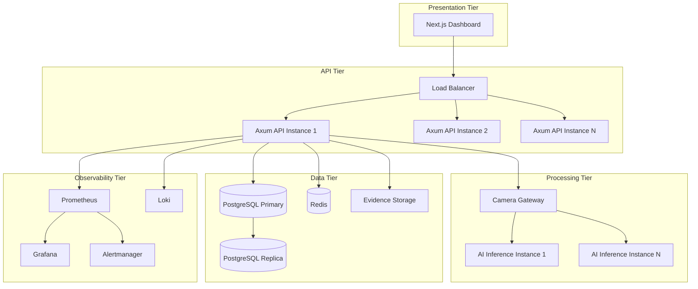

### 6.2 Physical Deployment Architecture

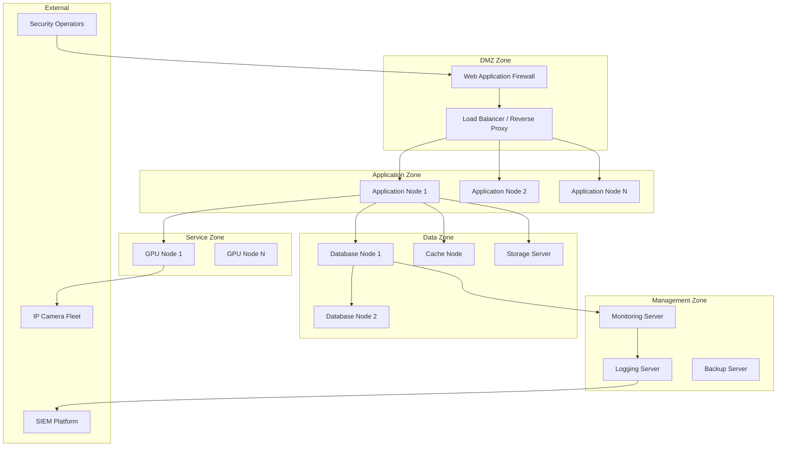

### 6.3 Hybrid Deployment Architecture

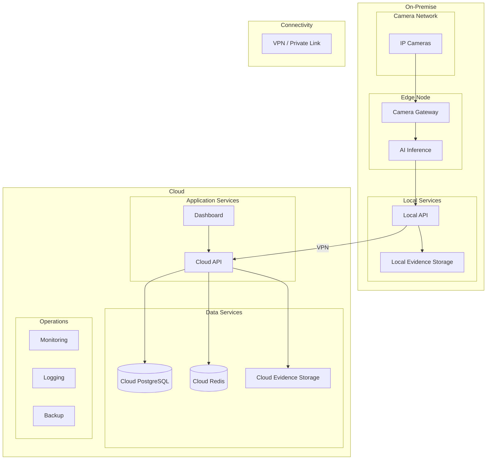

### 6.4 Deployment Layers

| Layer                     | Components                                      | Responsibility                  |
|---------------------------|------------------------------------------------|---------------------------------|
| Presentation              | Next.js Dashboard                               | User interface, real-time updates|
| API Gateway               | Load Balancer, WAF, TLS termination             | Traffic routing, security       |
| Application               | Axum API instances                              | Business logic, API serving     |
| Processing                | Camera Gateway, AI Inference                    | Stream ingestion, detection     |
| Data                      | PostgreSQL, Redis, Evidence Storage             | Persistent data, caching        |
| Observability             | Prometheus, Grafana, Loki, Alertmanager         | Monitoring, alerting, logging   |
| Operations                | Backup, Secrets, Certificates                   | Operational support             |

### 6.5 Deployment Boundaries

| Boundary                  | Description                                     | Security Controls              |
|---------------------------|------------------------------------------------|--------------------------------|
| External ↔ DMZ            | Internet to load balancer                      | TLS 1.3, WAF, rate limiting    |
| DMZ ↔ Application         | Load balancer to API servers                   | mTLS, service auth             |
| Application ↔ Data        | API servers to database/cache                  | mTLS, encrypted connections    |
| Application ↔ Service     | API servers to AI/Gateway                      | mTLS, internal API key         |
| Application ↔ Management  | All services to monitoring/logging             | Read-only access, audit        |

---

## 7. Environment Strategy

### 7.1 Environment Architecture

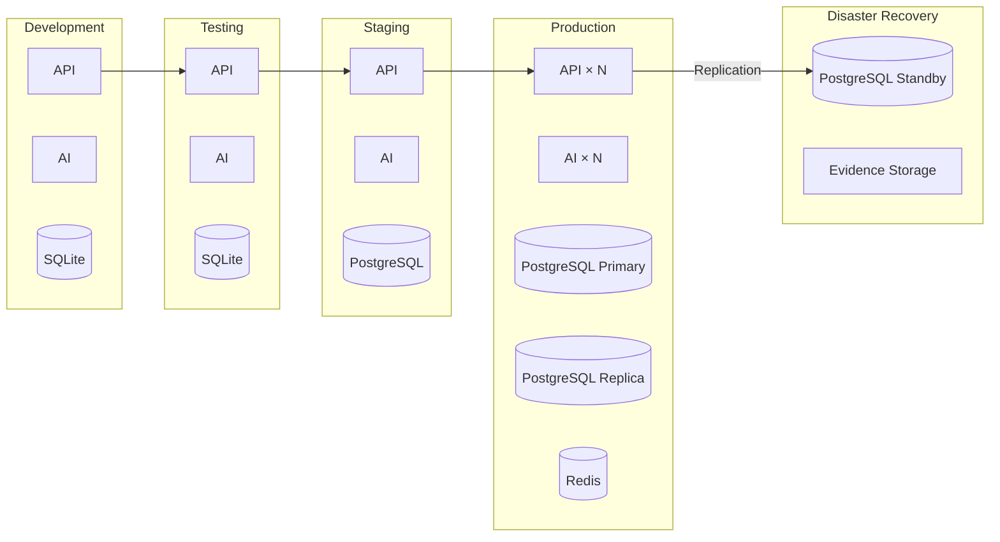

### 7.2 Environment Definitions

| Environment  | Purpose                          | Data          | Infrastructure           | Scale            |
|--------------|----------------------------------|---------------|--------------------------|------------------|
| Development  | Local developer work             | Mock/synthetic| Developer workstation     | Single node      |
| Testing      | Integration and regression tests | Test data     | CI runner / dev server    | Single node      |
| QA           | Quality assurance validation     | Production-like| Dedicated QA server     | Single node      |
| Staging      | Pre-production validation        | Anonymized prod| Production mirror      | Production-like  |
| Production   | Live customer-facing platform    | Real data     | Production infrastructure| Scaled           |
| DR           | Disaster recovery                | Production copy| Standby infrastructure | Minimal          |

### 7.3 Environment Isolation

| Isolation Mechanism        | Development | Testing | Staging | Production |
|----------------------------|-------------|---------|---------|------------|
| Separate VPC/VLAN          | No          | Yes     | Yes     | Yes        |
| Separate database          | No          | Yes     | Yes     | Yes        |
| Separate secrets           | No          | Yes     | Yes     | Yes        |
| Separate monitoring        | No          | Yes     | Yes     | Yes        |
| Network ACLs               | No          | Yes     | Yes     | Yes        |
| Separate DNS               | No          | Yes     | Yes     | Yes        |
| Separate TLS certificates  | Self-signed | Self-signed | Let's Encrypt | Custom CA |

### 7.4 Promotion Strategy

| Stage                      | Trigger                    | Validation Required                    |
|----------------------------|---------------------------|----------------------------------------|
| Development → Testing      | Merge to main branch       | Unit tests pass, code review approved  |
| Testing → QA               | Release candidate tagged  | Integration tests pass, security scan  |
| QA → Staging               | QA sign-off               | Performance tests, UAT sign-off        |
| Staging → Production       | Staging validation passed | Manual approval gate, rollback plan    |
| Production → DR            | Automated replication     | Replication lag < 1 second             |

### 7.5 Deployment Profiles

| Profile         | Containers                                    | Use Case                      |
|-----------------|-----------------------------------------------|-------------------------------|
| Development     | All containers; debug logging; hot reload     | Local development             |
| Testing         | All containers; test config; mock data        | Automated testing             |
| QA              | All containers; production config; test data  | Quality assurance             |
| Staging         | All containers; production config; test data  | Pre-production validation     |
| Production      | All containers; hardened config; monitoring   | Enterprise deployment         |
| Minimal (MVP)   | API + Gateway + AI + SQLite; single node       | Small deployment; 50 cameras  |

---

## 8. Infrastructure Architecture

### 8.1 Application Servers

| Component              | Minimum Spec                              | Recommended Spec                         |
|------------------------|-------------------------------------------|------------------------------------------|
| Application Node       | 8 vCPU, 16 GB RAM, 100 GB SSD             | 16 vCPU, 32 GB RAM, 200 GB NVMe SSD     |
| GPU Node               | 8 vCPU, 32 GB RAM, 1× NVIDIA T4 (16 GB)  | 16 vCPU, 64 GB RAM, 4× NVIDIA A10 (24 GB) |
| Camera Gateway Node    | 8 vCPU, 16 GB RAM, 100 GB SSD             | 16 vCPU, 32 GB RAM, 200 GB NVMe SSD     |
| Monitoring Node        | 4 vCPU, 8 GB RAM, 500 GB SSD              | 8 vCPU, 16 GB RAM, 1 TB NVMe SSD        |

### 8.2 GPU Nodes

| GPU Tier       | GPU Model          | VRAM    | Use Case                      | Scaling Model     |
|----------------|--------------------|---------|-------------------------------|-------------------|
| Entry          | NVIDIA T4          | 16 GB   | Development, small deployment | Single GPU        |
| Standard       | NVIDIA A10         | 24 GB   | Production (up to 500 cameras)| 2-4 GPUs          |
| High           | NVIDIA A100        | 40 GB   | Large deployment (5000+ cameras)| 4-8 GPUs        |
| Enterprise     | NVIDIA H100        | 80 GB   | Maximum inference throughput   | 8-16 GPUs         |

### 8.3 Database Servers

| Component              | Minimum Spec                              | Recommended Spec                         |
|------------------------|-------------------------------------------|------------------------------------------|
| PostgreSQL Primary     | 8 vCPU, 32 GB RAM, 500 GB NVMe SSD       | 16 vCPU, 64 GB RAM, 2 TB NVMe SSD       |
| PostgreSQL Replica     | 8 vCPU, 32 GB RAM, 500 GB NVMe SSD       | 16 vCPU, 64 GB RAM, 2 TB NVMe SSD       |
| Redis                  | 4 vCPU, 16 GB RAM, 100 GB SSD             | 8 vCPU, 32 GB RAM, 200 GB NVMe SSD       |

### 8.4 Storage Servers

| Storage Type           | Minimum Capacity                          | Recommended Capacity                     | IOPS             |
|------------------------|-------------------------------------------|------------------------------------------|-------------------|
| Evidence Storage       | 500 GB                                    | 10 TB                                    | 1,000+            |
| Backup Storage         | 1 TB                                      | 20 TB                                    | 500+              |
| Archive Storage        | 5 TB                                      | 100 TB                                   | 100+              |
| Object Storage (S3)    | 1 TB                                      | 100 TB                                   | 10,000+           |

### 8.5 Monitoring Servers

| Component              | Minimum Spec                              | Recommended Spec                         |
|------------------------|-------------------------------------------|------------------------------------------|
| Prometheus             | 4 vCPU, 8 GB RAM, 500 GB SSD              | 8 vCPU, 16 GB RAM, 2 TB NVMe SSD        |
| Grafana                | 2 vCPU, 4 GB RAM, 50 GB SSD               | 4 vCPU, 8 GB RAM, 100 GB SSD             |
| Loki                   | 4 vCPU, 8 GB RAM, 1 TB SSD                | 8 vCPU, 16 GB RAM, 5 TB NVMe SSD        |

### 8.6 Network Components

| Component              | Specification                              | Purpose                                  |
|------------------------|-------------------------------------------|------------------------------------------|
| Load Balancer          | L7 application load balancer               | TLS termination, traffic routing         |
| WAF                    | Web Application Firewall                    | OWASP protection, rate limiting          |
| DNS                    | DNS server or cloud DNS                     | Service discovery, domain resolution     |
| VPN Gateway            | IPSec or WireGuard VPN                      | Hybrid connectivity, remote access       |
| Firewall               | Stateful firewall with IDS/IPS              | Network segmentation, threat detection  |
| Certificate Manager    | ACME-compatible (Let's Encrypt) or custom CA | TLS certificate provisioning            |

### 8.7 DNS Architecture

| Domain                              | Purpose                      | DNS Type   | TTL    |
|-------------------------------------|------------------------------|------------|--------|
| `app.vigilantai.com`               | Dashboard                    | A / CNAME  | 300s   |
| `api.vigilantai.com`               | API endpoint                 | A / CNAME  | 300s   |
| `ws.vigilantai.com`                | WebSocket endpoint           | A / CNAME  | 300s   |
| `*.internal.vigilantai.com`        | Internal services            | A          | 60s    |
| `evidence.vigilantai.com`          | Evidence download            | A / CNAME  | 300s   |
| `_acme-challenge.vigilantai.com`   | Let's Encrypt validation     | TXT        | 60s    |

### 8.8 Certificate Architecture

| Certificate Type           | Issuer              | Renewal        | Scope                  |
|---------------------------|---------------------|----------------|------------------------|
| Dashboard TLS             | Let's Encrypt       | Auto (90 days) | app.vigilantai.com     |
| API TLS                   | Let's Encrypt       | Auto (90 days) | api.vigilantai.com     |
| WebSocket TLS             | Let's Encrypt       | Auto (90 days) | ws.vigilantai.com      |
| Internal mTLS             | Custom CA           | Manual (365 days) | Service-to-service |
| Database TLS              | Custom CA           | Manual (365 days) | API ↔ PostgreSQL    |
| Evidence Storage TLS      | Custom CA           | Manual (365 days) | API ↔ Storage      |

---

## 9. Service Deployment

### 9.1 Service Deployment Architecture

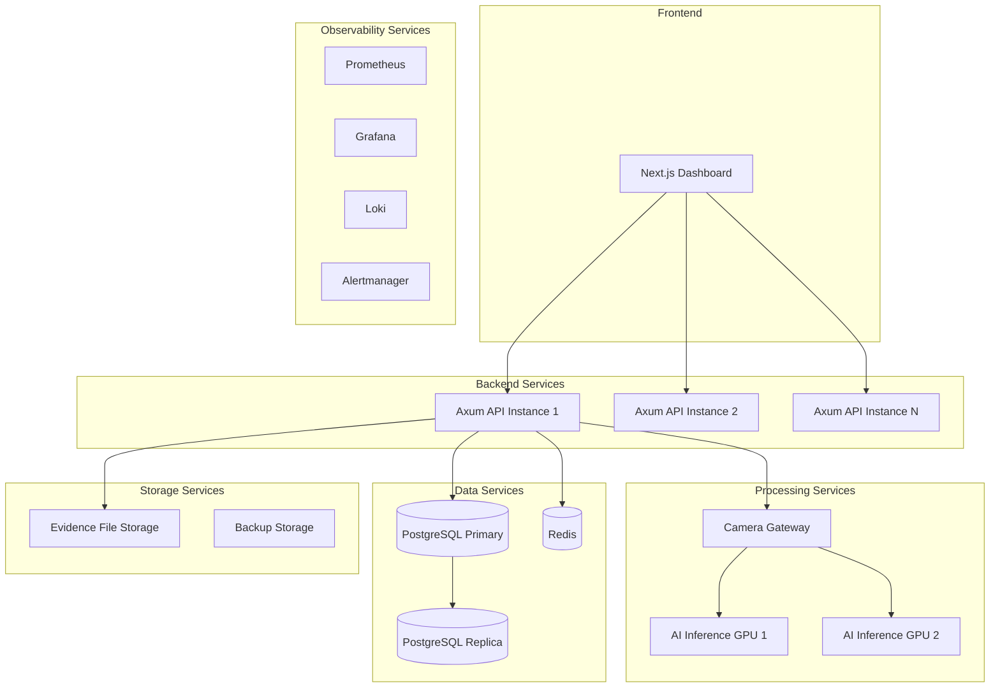

### 9.2 Frontend Deployment

| Component               | Next.js Dashboard                              |
|-------------------------|------------------------------------------------|
| Technology              | Next.js 14, React 18, TypeScript, Tailwind CSS |
| Deployment mode         | Static export (`next export`)                   |
| Container base          | nginx:alpine                                    |
| Port                    | 3000 (container) → 80 (nginx)                  |
| Static assets           | Served by nginx, no backend dependency          |
| Build output            | `out/` directory, static HTML/CSS/JS            |
| Environment variables   | `NEXT_PUBLIC_API_URL`, `NEXT_PUBLIC_WS_URL`     |
| Scaling                 | Horizontal (stateless, CDN-served)              |
| SSL termination         | Load balancer                                   |
| Health check            | `GET /` → 200 (nginx default)                   |

### 9.3 Rust Backend Deployment

| Component               | Axum API Server                                 |
|-------------------------|------------------------------------------------|
| Technology              | Rust, Axum, Tokio, SQLx                         |
| Binary                  | `vigilantai-api` (compiled binary)              |
| Port                    | 8080                                            |
| Health endpoint         | `GET /api/v1/health` → 200                      |
| Readiness endpoint      | `GET /api/v1/health/ready` → 200/503            |
| Liveness endpoint       | `GET /api/v1/health/live` → 200                 |
| Connection pool         | Min 5, Max 20 (configurable)                    |
| Worker threads          | Tokio work-stealing (all available CPUs)        |
| Graceful shutdown       | 30-second drain period                          |
| Environment variables   | DATABASE_URL, JWT_PRIVATE_KEY, JWT_PUBLIC_KEY, CORS_ORIGINS, REDIS_URL, INTERNAL_API_KEY |
| Scaling                 | Horizontal (stateless, behind load balancer)    |
| Deployment units        | Containerized binary                            |

### 9.4 AI Service Deployment

| Component               | AI Inference Service                             |
|-------------------------|------------------------------------------------|
| Technology              | Python 3.11, FastAPI, YOLO, OpenCV              |
| Port                    | 8081 (internal, not exposed externally)         |
| Health endpoint         | `GET /internal/v1/health` → 200                 |
| GPU access              | CUDA 11.8+ (optional, CPU fallback)             |
| Model weights           | Mounted from local filesystem or object storage  |
| Environment variables   | MODEL_PATH, DEVICE (cpu/cuda:0), INTERNAL_API_KEY |
| Scaling                 | Vertical (GPU), Horizontal (multiple instances) |
| Deployment units        | Containerized with GPU passthrough              |
| Inter-service comm      | Internal HTTP API to Rust backend               |

### 9.5 Camera Gateway Deployment

| Component               | Camera Gateway Service                          |
|-------------------------|------------------------------------------------|
| Technology              | Rust, Tokio, RTSP client                        |
| Port                    | None (outbound connections only)                |
| RTSP port               | 554 (standard), configurable                    |
| Health endpoint         | Internal API (connection count, error rate)     |
| Stream management       | Connection pooling, frame buffering             |
| Environment variables   | CAMERA_CONFIG_PATH, INTERNAL_API_KEY            |
| Scaling                 | Horizontal (partition cameras by site/group)    |
| Deployment units        | Containerized binary                            |
| Camera assignment       | Partitioned across gateway instances            |

### 9.6 PostgreSQL Deployment

| Component               | PostgreSQL                                      |
|-------------------------|------------------------------------------------|
| Version                 | 16+                                             |
| Port                    | 5432                                            |
| Authentication          | SCRAM-SHA-256                                   |
| Connection pooling      | SQLx built-in (min 5, max 20 per service)       |
| Primary/Replica         | Streaming replication (async)                   |
| Data directory          | `/var/lib/postgresql/data` (Docker volume)      |
| Config file             | Custom postgresql.conf with tuning              |
| Backup                  | pg_dump + WAL archiving                          |
| Health check            | `pg_isready` (30-second interval)               |
| Environment variables   | POSTGRES_DB, POSTGRES_USER, POSTGRES_PASSWORD, DATABASE_URL |

### 9.7 Redis Deployment

| Component               | Redis                                           |
|-------------------------|------------------------------------------------|
| Version                 | 7+                                              |
| Port                    | 6379                                            |
| Authentication          | AUTH command with password                       |
| Persistence             | AOF (append-only file) for durability            |
| Eviction                | allkeys-lru (memory management)                  |
| Max memory              | 2 GB (configurable)                              |
| TLS                     | Required for non-loopback                        |
| Health check            | `redis-cli ping` (30-second interval)            |
| Environment variables   | REDIS_URL, REDIS_PASSWORD                        |

### 9.8 Evidence Storage Deployment

| Component               | Evidence File Storage                            |
|-------------------------|------------------------------------------------|
| File system             | Local filesystem (S3/GCS in future)             |
| Directory structure     | `{site_id}/{YYYY-MM-DD}/{uuid}.{ext}`           |
| File permissions        | 0644 (read-only)                                 |
| Directory permissions   | 0755                                             |
| Integrity verification  | SHA-256 hash on creation, verified on access    |
| Max file size           | 10 MB per clip                                   |
| Allowed formats         | JPEG, PNG, MP4                                   |
| Retention               | Configurable (default: 90 days)                  |
| Mount point             | Docker volume: `/var/lib/vigilantai/evidence`    |

### 9.9 Monitoring Stack Deployment

| Component               | Deployment Details                               |
|-------------------------|------------------------------------------------|
| Prometheus              | Time-series DB, 15-day local retention           |
| Grafana                 | Dashboard UI, provisioned dashboards             |
| Alertmanager            | Alert routing, notification channels             |
| Node Exporter           | Host-level metrics (CPU, memory, disk, network)  |
| cAdvisor                | Container-level metrics                          |
| Blackbox Exporter       | HTTP/TCP/ICMP probes for endpoint monitoring     |
| Port mappings           | Prometheus:9090, Grafana:3001, Alertmanager:9093 |

### 9.10 Logging Stack Deployment

| Component               | Deployment Details                               |
|-------------------------|------------------------------------------------|
| Loki                    | Log aggregation, 30-day retention                |
| Promtail                | Log collection agent (sidecar or daemon)         |
| Log retention           | 30 days hot, 90 days warm, 365 days cold         |
| Log format              | JSON-structured (tracing crate for Rust)         |
| Port                    | Loki:3100, Promtail:9080                         |

---

## 10. Container Architecture

### 10.1 Container Layout

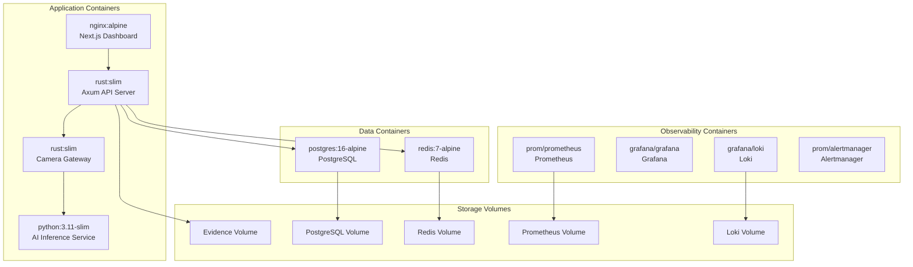

### 10.2 Container Specifications

| Container            | Base Image                   | Ports    | Volumes                    | Resource Limits            |
|----------------------|------------------------------|----------|----------------------------|----------------------------|
| Next.js Dashboard    | nginx:1.25-alpine            | 3000→80  | None                       | CPU: 0.5, Memory: 256 MB   |
| Axum API             | rust:1.78-slim               | 8080     | Evidence storage mount     | CPU: 4, Memory: 4 GB       |
| AI Inference         | python:3.11-slim             | 8081     | Model weights mount        | CPU: 8, Memory: 16 GB      |
| Camera Gateway       | rust:1.78-slim               | None     | Frame buffer mount         | CPU: 4, Memory: 4 GB       |
| PostgreSQL           | postgres:16-alpine           | 5432     | Data volume                | CPU: 4, Memory: 16 GB      |
| Redis                | redis:7-alpine               | 6379     | Data volume                | CPU: 2, Memory: 4 GB       |
| Prometheus           | prom/prometheus:v2.51        | 9090     | Prometheus volume          | CPU: 2, Memory: 4 GB       |
| Grafana              | grafana/grafana:10.4         | 3000     | Grafana volume             | CPU: 1, Memory: 2 GB       |
| Loki                 | grafana/loki:2.9             | 3100     | Loki volume                | CPU: 2, Memory: 4 GB       |
| Alertmanager         | prom/alertmanager:v0.27      | 9093     | Config volume              | CPU: 0.5, Memory: 512 MB   |

### 10.3 Container Networking

| Network               | Subnet        | Purpose                          | Services                      |
|-----------------------|---------------|----------------------------------|-------------------------------|
| vigilantai-app        | 172.20.0.0/16 | Application communication        | All app containers            |
| vigilantai-data       | 172.21.0.0/16 | Database and cache communication | PG, Redis                     |
| vigilantai-monitor    | 172.22.0.0/16 | Monitoring and logging           | Prometheus, Loki, Alertmanager|
| vigilantai-external   | 172.23.0.0/16 | External-facing services         | Dashboard, API                |

### 10.4 Container Lifecycle

| Phase                    | Behavior                                          |
|--------------------------|---------------------------------------------------|
| Start                    | Container starts, runs health check                |
| Healthy                  | Passes liveness + readiness probes                 |
| Unhealthy                | Failed health check → automatic restart            |
| Shutdown                 | SIGTERM → graceful drain (30s) → SIGKILL           |
| Upgrade                  | New container started → health verified → old stopped |
| Failure                  | Restart policy: `unless-stopped` (always restart)  |
| Resource exhaustion      | OOM killed → restart with backoff                  |

### 10.5 Image Strategy

| Strategy                  | Implementation                                    |
|---------------------------|---------------------------------------------------|
| Base image selection      | Official images only (Docker Hub verified)         |
| Image scanning            | Trivy scan on every build                          |
| Image signing             | Cosign signatures (planned)                        |
| Layer optimization        | Multi-stage builds, minimal layers                 |
| Tag strategy              | `latest`, semver tags, git SHA tags                |
| Registry                  | Private registry (ECR/GCR/ACR or self-hosted)      |
| Cleanup                   | Automated image pruning (keep last 5 versions)     |

### 10.6 Container Isolation

| Isolation Mechanism       | Implementation                                    |
|---------------------------|---------------------------------------------------|
| User namespace            | Non-root user (UID 1000) in all containers         |
| Read-only filesystem      | tmpfs for temp dirs, read-only rootfs where possible |
| Capability dropping       | Drop ALL capabilities, add only required ones      |
| Seccomp profiles          | Restricted syscall profiles                        |
| Resource limits           | CPU and memory limits enforced                     |
| Network policies          | Inter-container network ACLs                       |
| Privileged containers     | None (prohibited in production)                    |

### 10.7 Runtime Architecture

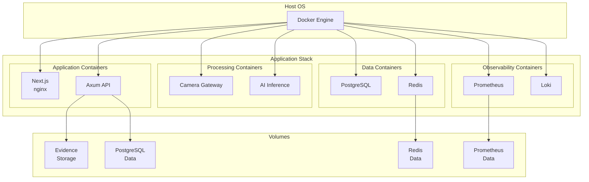

---

## 11. Network Architecture

### 11.1 VPC Architecture

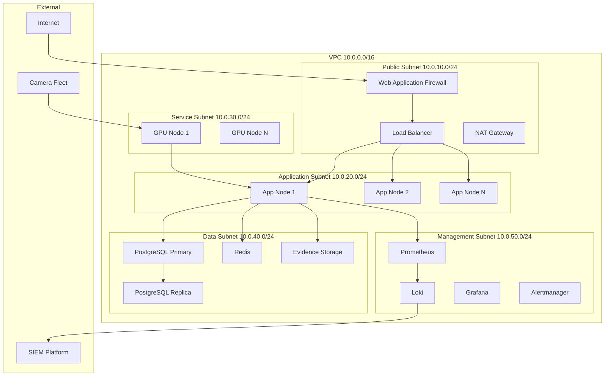

### 11.2 Subnet Design

| Subnet                  | CIDR            | Purpose                          | Hosts    |
|-------------------------|-----------------|----------------------------------|----------|
| Public / DMZ            | 10.0.10.0/24    | Load balancer, WAF, NAT          | 254      |
| Application             | 10.0.20.0/24    | API servers, Gateway             | 254      |
| Service                 | 10.0.30.0/24    | GPU nodes, AI inference          | 254      |
| Data                    | 10.0.40.0/24    | Database, cache, storage         | 254      |
| Management              | 10.0.50.0/24    | Monitoring, logging, backup      | 254      |

### 11.3 Firewall Rules

| Source Zone      | Destination Zone  | Port    | Protocol | Purpose                    |
|------------------|-------------------|---------|----------|----------------------------|
| Internet         | DMZ               | 443     | TCP      | HTTPS traffic              |
| Internet         | DMZ               | 80      | TCP      | HTTP → HTTPS redirect      |
| DMZ              | Application       | 8080    | TCP      | API requests               |
| DMZ              | Application       | 3000    | TCP      | Dashboard                  |
| Application      | Data              | 5432    | TCP      | PostgreSQL                 |
| Application      | Data              | 6379    | TCP      | Redis                      |
| Application      | Data              | 2049    | TCP      | NFS (evidence storage)     |
| Application      | Service           | 8081    | TCP      | AI Inference               |
| Service          | Data              | 5432    | TCP      | AI → DB (read-only)        |
| Camera Network   | Service           | 554     | TCP      | RTSP streams               |
| Management       | All zones         | 9090    | TCP      | Prometheus metrics         |
| Management       | All zones         | 3100    | TCP      | Loki logs                  |
| Management       | External          | 443     | TCP      | SIEM export                |

### 11.4 Internal Communication

| Communication Path            | Protocol  | Auth Method          | Encryption     |
|-------------------------------|-----------|----------------------|----------------|
| Client ↔ Load Balancer        | HTTPS     | TLS termination      | TLS 1.3        |
| Load Balancer ↔ API           | HTTP      | Network isolation    | mTLS (planned) |
| API ↔ PostgreSQL              | PostgreSQL| SCRAM-SHA-256        | TLS 1.3        |
| API ↔ Redis                   | Redis     | AUTH + TLS           | TLS 1.3        |
| API ↔ AI Inference            | HTTP      | Internal API key     | mTLS (planned) |
| API ↔ Camera Gateway          | HTTP      | Internal API key     | mTLS (planned) |
| API ↔ Evidence Storage        | Filesystem| OS permissions       | Disk encryption|
| AI ↔ Camera Gateway           | HTTP      | Internal API key     | mTLS (planned) |
| API ↔ Prometheus              | HTTP      | Network ACLs         | None (internal)|
| API ↔ Loki                    | HTTP      | Network ACLs         | None (internal)|

### 11.5 Ingress Architecture

| Traffic Type       | Entry Point          | Routing                          | Security                 |
|--------------------|----------------------|----------------------------------|--------------------------|
| Dashboard (HTTPS)  | Load Balancer :443   | Path-based → nginx:80            | TLS 1.3, CSP, HSTS       |
| API (HTTPS)        | Load Balancer :443   | Path-based → Axum:8080           | TLS 1.3, JWT validation   |
| WebSocket (WSS)    | Load Balancer :443   | Path-based → Axum:8080           | TLS 1.3, JWT validation   |
| RTSP               | Camera Gateway       | Direct connection to cameras      | Username/password         |
| Internal API       | Service network      | HTTP → internal services          | Service key auth          |

### 11.6 Egress Architecture

| Source Zone      | Destination          | Port    | Protocol | Purpose                |
|------------------|----------------------|---------|----------|------------------------|
| Application      | SMTP server          | 587     | SMTP/TLS | Email notifications    |
| Application      | External APIs        | 443     | HTTPS    | Third-party integrations|
| Service          | Model registry       | 443     | HTTPS    | AI model downloads     |
| Management       | SIEM platform        | 443     | HTTPS    | Security event export  |
| Management       | NTP server           | 123     | UDP      | Time synchronization   |
| Management       | DNS resolver         | 53      | UDP/TCP  | Domain resolution      |

---

## 12. Load Balancing

### 12.1 Load Balancer Architecture

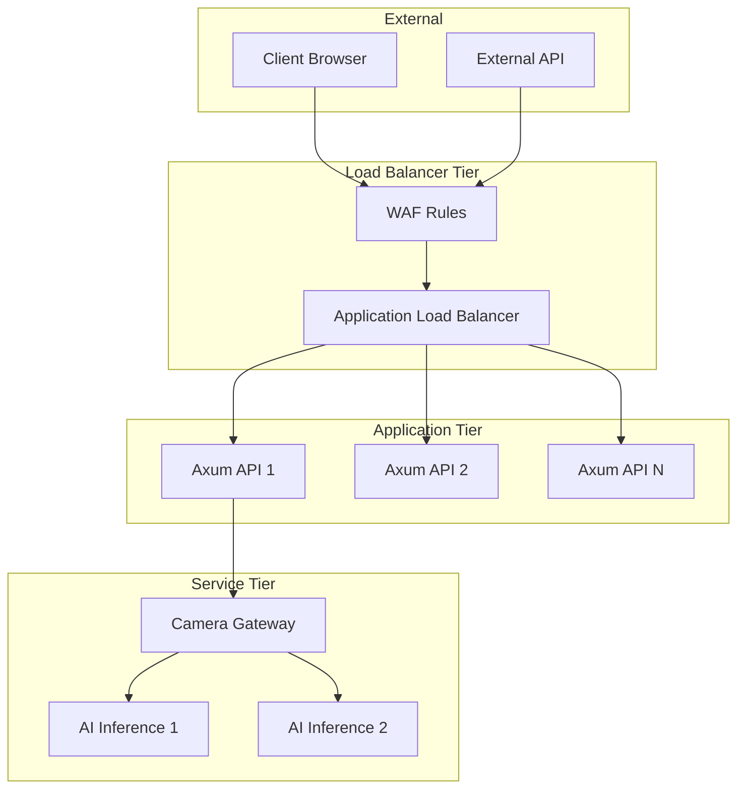

### 12.2 External Load Balancer

| Configuration               | Value                                          |
|-----------------------------|------------------------------------------------|
| Type                        | Layer 7 (Application)                           |
| Protocol                    | HTTPS (TLS 1.3 termination)                    |
| Algorithm                   | Least connections (with server affinity)         |
| Health check                | GET /api/v1/health → 200                        |
| Health check interval       | 10 seconds                                      |
| Unhealthy threshold         | 3 consecutive failures                          |
| Healthy threshold           | 2 consecutive successes                         |
| Timeout                     | 5 seconds                                       |
| Drain time                  | 30 seconds                                      |
| Sticky sessions             | IP-based (for WebSocket affinity)               |
| SSL offloading              | Yes (TLS termination at LB)                     |

### 12.3 Internal Load Balancer

| Configuration               | Value                                          |
|-----------------------------|------------------------------------------------|
| Type                        | Layer 4 (TCP)                                   |
| Purpose                     | AI Inference request distribution                |
| Algorithm                   | Round-robin                                      |
| Health check                | GET /internal/v1/health → 200                   |
| Health check interval       | 15 seconds                                      |
| Unhealthy threshold         | 3 consecutive failures                          |
| Session affinity            | None (stateless inference)                       |

### 12.4 Traffic Routing

| Route Pattern               | Target                | Load Balancer    |
|-----------------------------|-----------------------|------------------|
| `app.vigilantai.com/*`     | Next.js Dashboard     | External LB      |
| `api.vigilantai.com/*`     | Axum API              | External LB      |
| `ws.vigilantai.com/*`      | Axum API (WebSocket)  | External LB      |
| `*.internal:8081`           | AI Inference          | Internal LB      |
| `*.internal:554`            | Camera Gateway        | Direct (no LB)   |

### 12.5 Session Strategy

| Session Type          | Strategy                                      |
|-----------------------|-----------------------------------------------|
| WebSocket connections | IP-based sticky sessions at load balancer      |
| API requests          | Stateless (JWT-based, no session affinity)     |
| Database connections  | Connection pooling (SQLx built-in)             |
| Cache connections     | Connection pooling (Redis built-in)            |
| AI inference          | Stateless (round-robin distribution)           |

### 12.6 Failover

| Failure Scenario              | Failover Behavior                               |
|-------------------------------|------------------------------------------------|
| Single API server failure     | LB removes from pool; traffic rerouted          |
| All API servers in zone       | Cross-zone failover (multi-AZ deployment)       |
| Database primary failure      | Automatic replica promotion (< 60 seconds)      |
| Redis failure                 | API degrades; session data lost; re-auth required|
| AI inference failure          | Camera Gateway buffers frames; alert generated  |
| Evidence storage full         | Alert generated; oldest evidence archived        |

---

## 13. High Availability

### 13.1 Redundancy Strategy

| Component              | Redundancy Level   | Instances  | Failure Impact    |
|------------------------|--------------------|------------|-------------------|
| Load Balancer          | Active-Passive     | 2          | Auto-failover     |
| Axum API               | Active-Active      | 2-4        | None (others serve)|
| Camera Gateway         | Active-Active      | 2          | Partial (camera reassignment)|
| AI Inference           | Active-Active      | 2-4        | Slower inference   |
| PostgreSQL             | Primary + Replica  | 2          | Auto-promotion    |
| Redis                  | Primary + Replica  | 2          | Auto-promotion    |
| Evidence Storage       | RAID / Replicated  | 2+         | Data preserved    |
| Monitoring             | Single + Backup    | 1+1        | Manual switch     |

### 13.2 Database High Availability

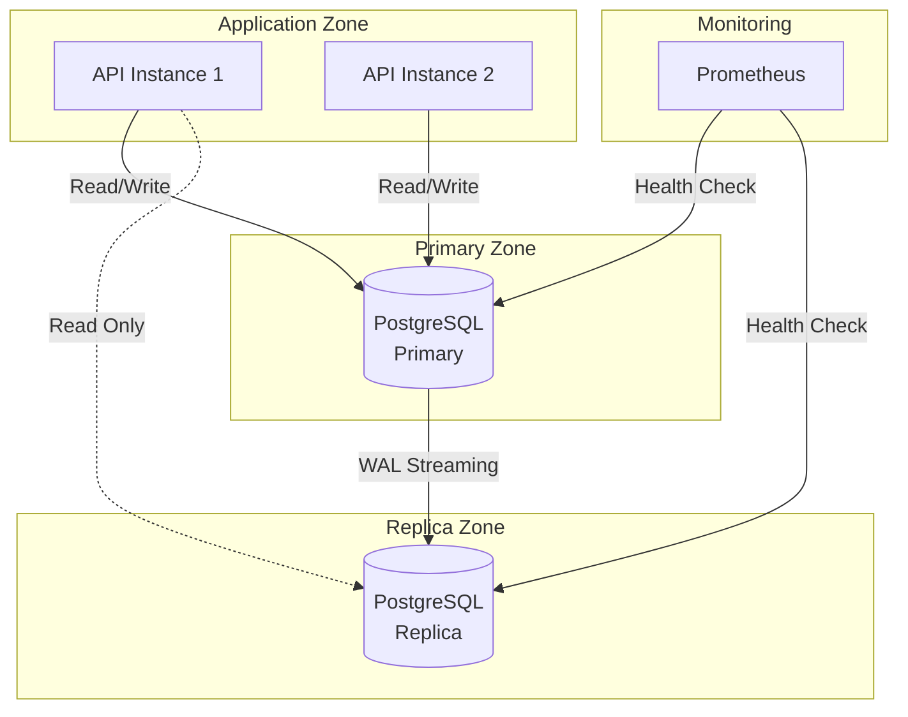

| HA Feature              | Configuration                                   |
|-------------------------|------------------------------------------------|
| Replication mode        | Asynchronous streaming replication               |
| Replication lag target  | < 1 second                                       |
| Automatic failover      | Yes (patroni or repmgr)                          |
| Failover time           | < 30 seconds                                     |
| Failover trigger        | Primary unreachable for > 10 seconds             |
| Read replicas           | 1 (expandable to 3)                              |
| Read routing            | Read-only queries routed to replica              |
| Write routing           | All writes to primary only                       |
| Connection pooling      | SQLx pool with health-aware routing              |

### 13.3 Redis High Availability

| HA Feature              | Configuration                                   |
|-------------------------|------------------------------------------------|
| Mode                    | Redis Sentinel                                    |
| Sentinel instances      | 3 (quorum: 2)                                    |
| Automatic failover      | Yes                                               |
| Failover time           | < 10 seconds                                      |
| Data persistence        | AOF (append-only file) every second              |
| Max memory policy       | allkeys-lru                                       |
| Replication             | 1 primary + 1 replica                             |

### 13.4 Application High Availability

| Strategy                  | Implementation                                    |
|---------------------------|---------------------------------------------------|
| Rolling updates           | One instance at a time; health check between each |
| Zero-downtime deployment  | New instance starts → health verified → old stops  |
| Graceful shutdown         | 30-second drain period for in-flight requests      |
| Health check monitoring   | 10-second interval; 3 failures → restart           |
| Resource isolation        | CPU and memory limits prevent resource exhaustion  |
| Auto-restart              | Docker restart policy: `unless-stopped`            |

### 13.5 Storage High Availability

| Storage Type      | HA Strategy                                      |
|-------------------|--------------------------------------------------|
| Evidence          | RAID 10 (mirroring + striping)                    |
| PostgreSQL data   | EBS replication (AWS) / LVM snapshot (on-prem)    |
| Redis data        | AOF replication + periodic snapshot                |
| Backup            | Cross-region replication (S3) / local + offsite   |
| Logs              | Loki replication factor 2                          |
| Metrics           | Prometheus remote write to Thanos (planned)        |

### 13.6 Health Checks

| Service               | Check Method                                      | Interval | Timeout |
|-----------------------|---------------------------------------------------|----------|---------|
| Load Balancer         | TCP connect on port 443                            | 5s       | 3s      |
| Axum API              | GET /api/v1/health → 200                           | 10s      | 5s      |
| Axum API (ready)      | GET /api/v1/health/ready → 200                     | 10s      | 5s      |
| Camera Gateway        | Internal API → connection count + error rate       | 15s      | 5s      |
| AI Inference          | GET /internal/v1/health → 200                      | 30s      | 10s     |
| PostgreSQL            | pg_isready + replication lag check                 | 10s      | 5s      |
| Redis                 | redis-cli ping                                     | 10s      | 3s      |
| Evidence Storage      | Disk usage + write throughput check                | 60s      | 10s     |
| Prometheus            | GET /-/healthy → 200                               | 30s      | 5s      |
| Loki                  | GET /ready → 200                                   | 30s      | 5s      |

---

## 14. Scalability

### 14.1 Scaling Architecture

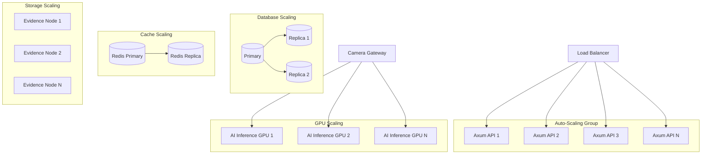

### 14.2 Camera Fleet Scaling Tiers

| Tier         | Cameras        | Architecture                                        | Infrastructure             |
|--------------|----------------|-----------------------------------------------------|----------------------------|
| Tier 1 (MVP) | 50-200        | Single node: SQLite, single AI instance             | 1× 16 vCPU, 32 GB, 1× T4  |
| Tier 2       | 200-1,000      | 2-3 nodes: PostgreSQL, event processor scaling      | 3× 16 vCPU, 32 GB, 2× A10 |
| Tier 3       | 1,000-5,000    | Multiple gateway + event processor; PG cluster      | 6× 16 vCPU, 64 GB, 4× A10 |
| Tier 4       | 5,000-10,000+  | Distributed architecture; load balancing; read replicas | 12+ nodes, 8× A10    |

### 14.3 Horizontal Scaling

| Component              | Scaling Trigger                       | Scaling Action                        |
|------------------------|---------------------------------------|---------------------------------------|
| Axum API               | CPU > 70% for 5 minutes               | Add new instance                      |
| Axum API               | CPU < 30% for 30 minutes              | Remove instance (min 2)               |
| AI Inference           | GPU utilization > 80%                  | Add new GPU node                      |
| AI Inference           | Inference queue > 100 pending          | Add new GPU node                      |
| Camera Gateway         | Active streams > 500 per gateway       | Add new gateway, redistribute cameras |
| Redis                  | Memory > 80%                           | Scale vertically or add replica       |
| PostgreSQL             | Connection pool > 80% utilized         | Add read replica                      |

### 14.4 Vertical Scaling

| Component              | Scaling Action                                      |
|------------------------|-----------------------------------------------------|
| Axum API               | Increase CPU/RAM allocation                         |
| AI Inference           | Upgrade GPU (T4 → A10 → A100 → H100)               |
| PostgreSQL             | Increase CPU/RAM/storage                            |
| Redis                  | Increase memory allocation                          |
| Evidence Storage       | Expand volume or add storage nodes                  |

### 14.5 Auto-Scaling Policies

| Policy                  | Metric                    | Threshold  | Action                        |
|-------------------------|---------------------------|------------|-------------------------------|
| Scale out (API)         | CPU average > 70%         | 5 min      | Add 1 instance                |
| Scale in (API)          | CPU average < 30%         | 30 min     | Remove 1 instance             |
| Scale out (GPU)         | GPU utilization > 80%     | 5 min      | Add 1 GPU node                |
| Scale out (DB)          | Connections > 80%         | 5 min      | Add read replica              |
| Scale out (Storage)     | Disk usage > 80%          | 5 min      | Expand volume                 |
| Safety minimum          | N/A                       | N/A        | Never scale below 2 API instances |
| Safety maximum          | N/A                       | N/A        | Cap at configured maximum      |

### 14.6 Database Scaling

| Strategy                  | Implementation                                    |
|---------------------------|---------------------------------------------------|
| Read replicas             | 1-3 read replicas for read-heavy workloads        |
| Connection pooling        | SQLx pool with min/max connections                 |
| Query optimization        | Index tuning, query plan analysis                  |
| Partitioning              | Time-based partitioning for detection_events      |
| Archival                  | Move old data to cold storage                      |

### 14.7 Cache Scaling

| Strategy                  | Implementation                                    |
|---------------------------|---------------------------------------------------|
| Vertical                  | Increase Redis memory allocation                   |
| Horizontal                | Redis Cluster (planned)                            |
| Sharding                  | By user_id or site_id hash                         |
| Eviction                  | allkeys-lru for memory management                  |

### 14.8 Storage Scaling

| Strategy                  | Implementation                                    |
|---------------------------|---------------------------------------------------|
| Volume expansion          | Online volume expansion (no downtime)              |
| Tiered storage            | Hot (SSD) → Warm (HDD) → Cold (S3 Glacier)        |
| Data archival             | Automated archival based on retention policy       |
| Distributed storage       | Ceph/MinIO for multi-node evidence (planned)       |

---

## 15. Storage Architecture

### 15.1 Storage Architecture Diagram

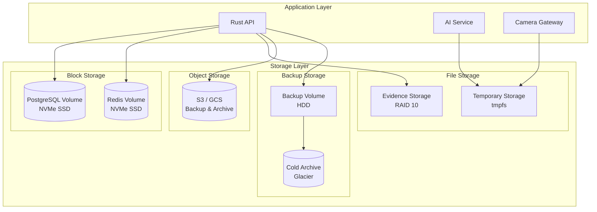

### 15.2 Database Storage

| Parameter                 | Value                                           |
|---------------------------|-------------------------------------------------|
| Storage type              | NVMe SSD (block storage)                         |
| Volume size (primary)     | 500 GB (expandable to 4 TB)                      |
| Volume size (replica)     | 500 GB (match primary)                           |
| IOPS                      | 10,000+ (provisioned)                            |
| Throughput                | 500+ MB/s                                        |
| Filesystem                | ext4 (Linux)                                     |
| Mount options             | `noatime,nodiratime`                             |
| Backup                    | Hourly pg_dump + WAL archiving                    |
| Encryption                | AES-256 (disk-level or LUKS)                     |

### 15.3 Evidence Storage

| Parameter                 | Value                                           |
|---------------------------|-------------------------------------------------|
| Storage type              | RAID 10 (NVMe SSD for hot, HDD for warm)        |
| Initial capacity          | 500 GB (expandable to 100 TB)                    |
| Directory structure       | `{site_id}/{YYYY-MM-DD}/{uuid}.{ext}`            |
| File permissions          | 0644 (read-only)                                 |
| Directory permissions     | 0755                                             |
| Max file size             | 10 MB per clip                                   |
| File formats              | JPEG, PNG, MP4                                   |
| Integrity                 | SHA-256 hash per file                            |
| Access pattern            | Write-once, read-many (WORM)                     |
| Tiering                   | Hot (SSD, 0-90 days) → Warm (HDD, 91-365 days) → Cold (S3, 365+ days) |

### 15.4 Object Storage

| Parameter                 | Value                                           |
|---------------------------|-------------------------------------------------|
| Backend                   | AWS S3 / GCP Cloud Storage / MinIO (on-prem)     |
| Use case                  | Backup, archive, cold evidence storage            |
| Bucket structure          | `vigilantai-{env}-{region}-{account}`            |
| Encryption                | SSE-S3 or SSE-KMS                                |
| Versioning                | Enabled for backup buckets                       |
| Lifecycle                 | IA after 30 days, Glacier after 90 days          |

### 15.5 Temporary Storage

| Parameter                 | Value                                           |
|---------------------------|-------------------------------------------------|
| Purpose                   | Frame buffers, intermediate processing            |
| Storage type              | tmpfs (RAM-backed) or host tmpdir                 |
| Capacity                  | 2-4 GB per instance                               |
| Cleanup                   | Automatic on container stop                       |
| Access pattern            | High-throughput, short-lived                      |

### 15.6 Backup Storage

| Parameter                 | Value                                           |
|---------------------------|-------------------------------------------------|
| Storage type              | HDD (cost-optimized)                              |
| Capacity                  | 1-20 TB (grow with data)                          |
| Backup format             | pg_dump (PostgreSQL), tar (evidence), JSON (config) |
| Encryption                | AES-256-GCM before upload                         |
| Verification              | Automated restore test on weekly schedule         |

### 15.7 Archive Storage

| Parameter                 | Value                                           |
|---------------------------|-------------------------------------------------|
| Backend                   | AWS S3 Glacier / GCP Coldline / on-prem tape      |
| Use case                  | Long-term evidence retention, compliance archive   |
| Retention                 | 1-7 years (configurable)                          |
| Retrieval                 | 1-24 hours (Glacier) / immediate (Coldline)       |
| Encryption                | AES-256-GCM                                       |

### 15.8 Retention Strategy

| Data Type            | Hot Tier           | Warm Tier          | Cold Tier           | Deletion         |
|----------------------|--------------------|--------------------|---------------------|------------------|
| Evidence clips       | 0-90 days          | 91-365 days        | 365+ days           | 365+ days        |
| Detection events     | 0-30 days          | 31-90 days         | 90+ days            | 365+ days        |
| Audit logs           | 0-30 days          | 31-365 days        | 365+ days           | Never            |
| Application logs     | 0-7 days           | 8-30 days          | N/A                 | 30 days          |
| Backup               | 0-30 days          | 31-90 days         | 90+ days            | 365 days         |

---

## 16. Configuration Management

### 16.1 Configuration Architecture

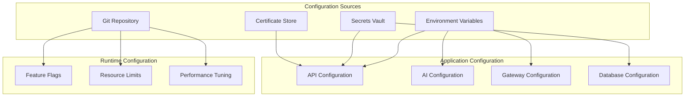

### 16.2 Environment Variables

| Variable                 | Service        | Description                                   | Required | Default        |
|--------------------------|----------------|-----------------------------------------------|----------|----------------|
| `DATABASE_URL`           | API, AI        | PostgreSQL connection string                  | Yes      | —              |
| `REDIS_URL`              | API            | Redis connection string                       | Yes      | —              |
| `JWT_PRIVATE_KEY`        | API            | RSA private key for JWT signing               | Yes      | —              |
| `JWT_PUBLIC_KEY`         | API            | RSA public key for JWT verification           | Yes      | —              |
| `ENCRYPTION_KEY`         | API            | AES-256 key for evidence encryption           | Yes      | —              |
| `CORS_ORIGINS`           | API            | Allowed CORS origins (comma-separated)        | Yes      | —              |
| `INTERNAL_API_KEY`       | API, AI, GW    | Service-to-service authentication key         | Yes      | —              |
| `LOG_LEVEL`              | All            | Logging level (debug/info/warn/error)         | No       | info           |
| `MODEL_PATH`             | AI             | Path to YOLO model weights                    | Yes      | —              |
| `DEVICE`                 | AI             | Inference device (cpu/cuda:0)                 | No       | cpu            |
| `EVIDENCE_DIR`           | API            | Evidence storage directory path               | Yes      | —              |
| `CORS_ORIGIN`            | Dashboard      | API URL for dashboard CORS                    | Yes      | —              |
| `NEXT_PUBLIC_API_URL`    | Dashboard      | Public API URL                                | Yes      | —              |
| `NEXT_PUBLIC_WS_URL`     | Dashboard      | Public WebSocket URL                          | Yes      | —              |
| `POSTGRES_DB`            | PostgreSQL     | Database name                                 | Yes      | —              |
| `POSTGRES_USER`          | PostgreSQL     | Database user                                 | Yes      | —              |
| `POSTGRES_PASSWORD`      | PostgreSQL     | Database password                             | Yes      | —              |

### 16.3 Secrets Management

| Secret                    | Storage Location         | Rotation Period | Access Scope           |
|---------------------------|--------------------------|-----------------|------------------------|
| JWT_PRIVATE_KEY           | Environment variable      | 30 days         | API service only       |
| JWT_PUBLIC_KEY            | Environment variable      | 30 days         | All API instances      |
| ENCRYPTION_KEY            | Environment variable      | 90 days         | API service only       |
| DATABASE_URL (password)   | Environment variable      | 90 days         | API + AI services      |
| REDIS_PASSWORD            | Environment variable      | 90 days         | API service only       |
| INTERNAL_API_KEY          | Environment variable      | 30 days         | Inter-service only     |
| TLS certificates          | OS certificate store      | 365 days        | All services           |

### 16.4 Configuration Versioning

| Config Type              | Versioning Strategy                           |
|--------------------------|------------------------------------------------|
| Application config       | Git-tracked, semantic versioning                |
| Environment variables    | Per-environment config files in Git             |
| Docker Compose files     | Git-tracked, per-environment overrides          |
| Nginx config             | Git-tracked, templated                          |
| Prometheus rules         | Git-tracked, versioned alert rules              |
| Grafana dashboards       | Git-tracked, provisioned from Git               |
| Database migrations      | SQLx migrate, versioned in Git                  |

### 16.5 Deployment Profiles

| Profile        | Environment Variables               | Log Level | Hot Reload | Debug |
|----------------|-------------------------------------|-----------|------------|-------|
| Development    | .env.dev                            | debug     | Yes        | Yes   |
| Testing        | .env.test                           | debug     | No         | Yes   |
| QA             | .env.qa                             | info      | No         | No    |
| Staging        | .env.staging                        | info      | No         | No    |
| Production     | .env.production                     | warn      | No         | No    |

---

## 17. CI/CD Architecture

### 17.1 CI/CD Pipeline Architecture

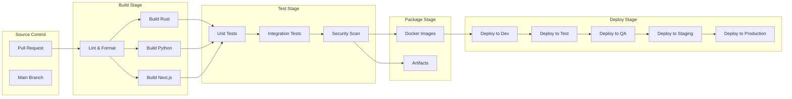

### 17.2 Build Pipeline

| Stage                    | Actions                                         |
|--------------------------|------------------------------------------------|
| Source checkout          | Clone repository at commit SHA                  |
| Dependency resolution    | `cargo fetch`, `pip install`, `npm ci`          |
| Linting                  | `cargo clippy`, `ruff check`, `eslint`          |
| Formatting               | `cargo fmt`, `ruff format`, `prettier`          |
| Compilation              | `cargo build --release`, `pip wheel`, `npm run build` |
| Unit tests               | `cargo test`, `pytest`, `vitest`                |
| Integration tests        | Docker Compose up + test suite                   |
| Security scanning        | `cargo audit`, `pip-audit`, `npm audit`, Trivy  |
| SBOM generation          | `syft` → CycloneDX format                       |
| Docker build             | Multi-stage builds for each service              |
| Image push               | Push to private registry with semver + SHA tags  |

### 17.3 Deployment Pipeline

| Stage                    | Trigger                    | Validation                         |
|--------------------------|----------------------------|------------------------------------|
| Build                    | PR merged to main          | All tests pass, security scan clean|
| Deploy to Dev            | Auto after build           | Smoke tests pass                   |
| Deploy to Test           | Auto after Dev             | Integration tests pass             |
| Deploy to QA             | Auto after Test            | QA sign-off                        |
| Deploy to Staging        | Manual trigger             | Performance tests, UAT sign-off    |
| Deploy to Production     | Manual approval gate       | Staging validation, rollback plan  |

### 17.4 Approval Gates

| Gate                      | Approver                   | Criteria                          |
|---------------------------|----------------------------|-----------------------------------|
| PR merge                  | 2 code reviewers           | Tests pass, no blockers           |
| QA deployment             | QA lead                    | Integration tests pass            |
| Staging deployment        | Engineering lead           | Performance benchmarks met        |
| Production deployment     | Engineering + Security lead | Staging validated, rollback plan  |
| Hotfix production         | Engineering lead           | Critical bug fix, tests pass      |

### 17.5 Rollback Strategy

| Rollback Type             | Trigger                    | Process                           |
|---------------------------|----------------------------|-----------------------------------|
| Container rollback        | Health check failure       | Revert to previous image tag      |
| Full rollback             | Production failure         | Deploy previous stable version    |
| Database rollback         | Schema migration failure   | Run down migration (if safe)      |
| Configuration rollback    | Config change failure      | Revert Git commit + redeploy      |

### 17.6 Release Strategy

| Release Type              | Frequency                  | Scope                             |
|---------------------------|----------------------------|-----------------------------------|
| Patch                     | As needed                  | Bug fixes, security patches       |
| Minor                     | Bi-weekly                  | Features, improvements            |
| Major                     | Quarterly                  | Breaking changes, major features  |
| Hotfix                    | As needed                  | Critical production fixes         |

---

## 18. Monitoring Architecture

### 18.1 Monitoring Architecture Diagram

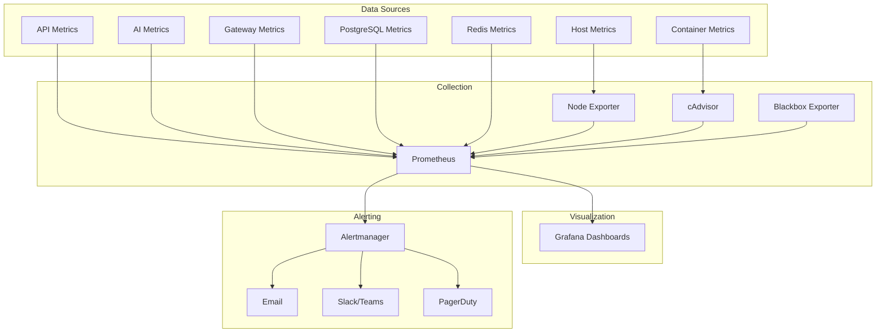

### 18.2 Application Metrics

| Metric Category         | Key Metrics                                                    |
|------------------------|-----------------------------------------------------------------|
| API                    | Request rate, latency (p50/p95/p99), error rate, active connections |
| Detection              | Frames processed/sec, detections/sec, inference latency        |
| Event Processing       | Events generated/sec, rules evaluated/sec, alert queue depth   |
| Camera Gateway         | Active streams, frame drop rate, reconnection attempts         |
| WebSocket              | Active connections, messages/sec, connection failures          |

### 18.3 Infrastructure Metrics

| Metric Category         | Key Metrics                                                    |
|------------------------|-----------------------------------------------------------------|
| CPU                    | Usage %, load average (1/5/15 min), steal time                |
| Memory                 | Usage %, available, swap usage, OOM events                     |
| Disk                   | Usage %, IOPS, throughput, latency, I/O wait                   |
| Network                | Bandwidth, packets/sec, errors, dropped packets                |
| Process                | Open file descriptors, context switches, thread count          |

### 18.4 GPU Metrics

| Metric                  | Description                                    | Alert Threshold  |
|-------------------------|------------------------------------------------|------------------|
| GPU utilization         | Percentage of GPU compute in use               | > 90%            |
| GPU memory usage        | VRAM utilized vs. total                        | > 85%            |
| GPU temperature         | Operating temperature                          | > 85°C           |
| GPU power draw          | Power consumption                              | > TDP 90%        |
| Inference latency       | Per-inference processing time                  | > 200ms          |
| Inference throughput    | Frames per second                              | < minimum FPS    |

### 18.5 Database Metrics

| Metric                  | Description                                    | Alert Threshold  |
|-------------------------|------------------------------------------------|------------------|
| Connection pool         | Active/idle/waiting connections                | > 80% utilized   |
| Query latency           | Average/p95 query response time                | > 100ms (p95)    |
| Replication lag         | Primary-replica sync delay                     | > 5 seconds      |
| Disk usage              | Database volume utilization                     | > 80%            |
| Deadlocks               | Deadlock count per minute                      | > 0              |
| Cache hit ratio         | Buffer cache hit percentage                    | < 95%            |
| Write throughput        | Transactions per second                        | > baseline × 2   |

### 18.6 Dashboards

| Dashboard               | Audience                    | Key Panels                            |
|-------------------------|-----------------------------|---------------------------------------|
| Platform Overview       | All operations              | Service health, request rate, errors  |
| API Performance         | DevOps, SRE                 | Latency distribution, throughput      |
| AI Inference            | ML engineers, SRE           | GPU utilization, inference latency    |
| Camera Fleet            | Security operations         | Active streams, frame drops           |
| Database                | DBA, SRE                    | Connections, queries, replication     |
| Storage                 | SRE, Platform               | Disk usage, evidence growth           |
| Security                | Security team               | Auth failures, rate limits, threats   |
| Business Metrics        | Management                  | Incidents, detections, SLA compliance |

### 18.7 Alerting Rules

| Alert Name                  | Condition                                      | Severity  | Window  |
|-----------------------------|------------------------------------------------|-----------|---------|
| APIHighErrorRate            | 5xx rate > 5%                                  | High      | 5 min   |
| APILatencyHigh              | p95 latency > 500ms                            | Medium    | 5 min   |
| APIHighCPU                  | CPU > 80% for 5 minutes                        | Medium    | 5 min   |
| APIHighMemory               | Memory > 85% for 5 minutes                     | Medium    | 5 min   |
| GPUHighUtilization          | GPU > 90% for 10 minutes                       | High      | 10 min  |
| GPUHighTemperature          | GPU > 85°C for 5 minutes                       | Critical  | 5 min   |
| DatabaseConnectionPoolHigh  | Pool > 80% utilized                            | High      | 5 min   |
| DatabaseReplicationLag      | Lag > 5 seconds                                | High      | 5 min   |
| DatabaseDiskHigh            | Disk > 80%                                     | High      | 5 min   |
| StorageDiskHigh             | Disk > 80%                                     | High      | 5 min   |
| CameraStreamDropped        | > 5% frame drops                               | Medium    | 5 min   |
| HealthCheckFailed          | Service health check failed 3 times            | High      | 1 min   |
| BruteForceDetected         | > 5 failed logins from single IP in 5 min     | High      | 5 min   |
| EvidenceIntegrityFailed    | SHA-256 hash mismatch                          | Critical  | 1 min   |
| BackupFailed               | Scheduled backup failed                        | High      | 1 min   |

---

## 19. Logging Architecture

### 19.1 Logging Pipeline

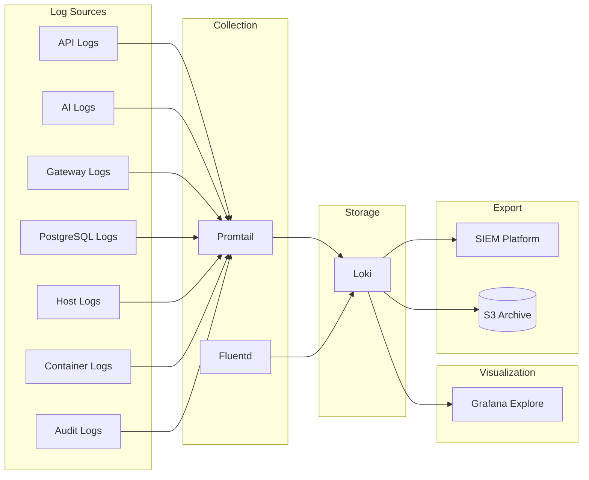

### 19.2 Log Categories

| Category           | Sources                          | Retention (Hot) | Retention (Warm) | Retention (Cold) |
|--------------------|----------------------------------|-----------------|------------------|------------------|
| Application        | API, AI, Gateway                 | 7 days          | 30 days          | 90 days          |
| Audit              | API (audit_logs table)           | 30 days         | 365 days         | 7 years          |
| Security           | Auth, rate limiting, threats     | 30 days         | 365 days         | 7 years          |
| Infrastructure     | OS, Docker, network              | 7 days          | 30 days          | 90 days          |
| Database           | PostgreSQL slow query, error log | 7 days          | 30 days          | 90 days          |
| AI                 | Inference logs, model loading    | 7 days          | 30 days          | 90 days          |

### 19.3 Structured Log Format

```json
{
  "timestamp": "2026-07-21T10:30:00.000Z",
  "level": "info",
  "service": "vigilantai-api",
  "module": "event_processor",
  "request_id": "req-abc-123",
  "user_id": "uuid-of-user",
  "camera_id": "cam-042",
  "event_id": "evt-789",
  "message": "Security event generated",
  "event_type": "intrusion",
  "severity": "high",
  "duration_ms": 45,
  "status": 200
}
```

### 19.4 Log Aggregation

| Component               | Implementation                                    |
|-------------------------|---------------------------------------------------|
| Collection              | Promtail (file-based) or Fluentd (container-based)|
| Transport               | HTTP push to Loki                                  |
| Storage                 | Loki (S3-backed for production)                    |
| Query                   | LogQL (Grafana Explore)                            |
| Indexing                | Label-based (service, level, environment)          |
| Compression             | gzip (90%+ compression ratio)                     |
| Deduplication           | Loki automatic deduplication                       |

### 19.5 Log Retention Policy

| Log Type              | Hot (Local SSD) | Warm (S3 Standard) | Cold (S3 Glacier) | Total  |
|-----------------------|-----------------|--------------------|--------------------|--------|
| Application logs      | 7 days          | 30 days            | 90 days            | 127 days|
| Audit logs            | 30 days         | 365 days           | 7 years            | 7+ years|
| Security alerts       | 30 days         | 365 days           | 7 years            | 7+ years|
| Database logs         | 7 days          | 30 days            | 90 days            | 127 days|
| Infrastructure logs   | 7 days          | 30 days            | 90 days            | 127 days|

### 19.6 Distributed Tracing

| Feature                 | Implementation                                    |
|-------------------------|---------------------------------------------------|
| Correlation ID          | Generated at API gateway on each inbound request  |
| Propagation             | Via `X-Request-ID` header across all services      |
| Storage                 | Included in all log entries                        |
| Retention               | Same as application logs                           |
| Analysis                | Grafana Explore with trace-to-log linking          |

---

## 20. Backup Strategy

### 20.1 Backup Architecture

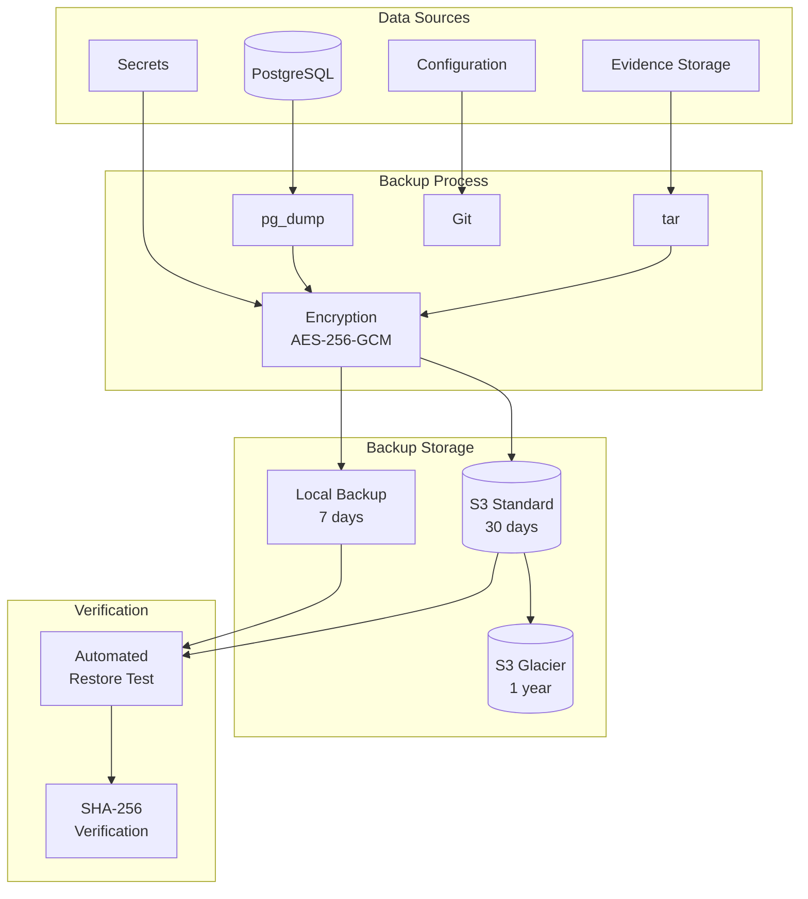

### 20.2 Database Backup

| Backup Type       | Frequency    | Retention    | Storage Location     | Verification        |
|-------------------|--------------|--------------|----------------------|---------------------|
| pg_dump (full)    | Hourly       | 7 days       | Local + S3           | Restore test weekly |
| WAL archiving     | Continuous   | 7 days       | Local + S3           | Point-in-time test  |
| Replica snapshot  | Daily        | 30 days      | S3                   | Integrity check     |
| Logical backup    | Daily        | 30 days      | S3                   | Restore test monthly|

### 20.3 Evidence Backup

| Backup Type       | Frequency    | Retention    | Storage Location     |
|-------------------|--------------|--------------|----------------------|
| Incremental       | Every 6 hours| 30 days      | S3 Standard          |
| Full              | Weekly       | 90 days      | S3 Standard          |
| Archive           | Monthly      | 1 year       | S3 Glacier           |

### 20.4 Configuration Backup

| Backup Type       | Frequency    | Retention    | Storage Location     |
|-------------------|--------------|--------------|----------------------|
| Git repository    | On every commit| Indefinite  | GitHub/GitLab        |
| Docker Compose    | On every commit| Indefinite  | GitHub/GitLab        |
| Environment files | On every change| Indefinite  | Git (secrets excluded)|
| Nginx config      | On every change| Indefinite  | Git                  |
| Prometheus rules  | On every change| Indefinite  | Git                  |
| Grafana dashboards| On every change| Indefinite  | Git                  |

### 20.5 Backup Encryption

| Data Type         | Encryption Method  | Key Management                    |
|-------------------|--------------------|------------------------------------|
| Database dumps    | AES-256-GCM        | Environment variable (rotated)     |
| Evidence archives | AES-256-GCM        | Environment variable (rotated)     |
| Configuration     | Git repository encryption | Repository-level encryption   |
| Secrets           | Vault encryption   | Vault master key                  |

### 20.6 Backup Verification

| Verification Type          | Frequency      | Process                              |
|----------------------------|----------------|--------------------------------------|
| Backup integrity           | Daily          | SHA-256 checksum verification        |
| Database restore test      | Weekly         | Restore to test environment          |
| Evidence integrity test    | Weekly         | Hash verification on random samples  |
| Full DR test               | Quarterly      | Complete failover to DR site         |
| Backup completeness        | Daily          | Compare backup count vs. expected    |

### 20.7 Restore Process

| Recovery Scenario           | RTO      | RPO     | Process                              |
|----------------------------|----------|---------|--------------------------------------|
| Database corruption         | 30 min   | 1 hour  | Restore from latest pg_dump + WAL    |
| Evidence storage failure    | 2 hours  | 6 hours | Restore from S3 incremental backup   |
| Full infrastructure loss   | 4 hours  | 1 hour  | Rebuild from images + restore backup |
| Accidental data deletion   | 1 hour   | 0       | Point-in-time recovery from WAL      |

---

## 21. Disaster Recovery

### 21.1 Recovery Objectives

| Metric                       | Target          | Justification                       |
|------------------------------|-----------------|-------------------------------------|
| RTO (Recovery Time Objective)| 4 hours         | Security monitoring cannot be offline|
| RPO (Recovery Point Objective)| 1 hour          | Max 1 hour data loss acceptable     |
| MTTR (Mean Time to Recovery) | 2 hours         | Target for P1 incidents             |
| Availability target          | 99.9%           | Security platform SLA               |
| Backup verification          | Weekly          | Ensure recoverability               |
| DR test frequency            | Quarterly       | Validate DR readiness               |

### 21.2 Disaster Scenarios

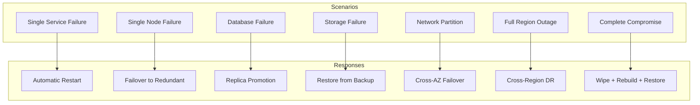

### 21.3 Recovery Procedures

| Scenario                  | Detection                           | Response                                    | Recovery                              |
|---------------------------|--------------------------------------|----------------------------------------------|----------------------------------------|
| Single service crash      | Health check failure                 | Automatic container restart                  | Service resumes automatically          |
| Single node failure       | Node unreachable                     | Load balancer removes node; traffic rerouted | Replace node; redeploy services        |
| Database primary failure  | Replication monitoring alert         | Automatic replica promotion                  | Rebuild primary; establish replication |
| Evidence storage failure  | Disk usage / I/O alert               | Switch to backup storage                     | Restore from S3 backup                 |
| Network partition         | Cross-zone connectivity loss         | Cross-zone failover                          | Restore connectivity; rebalance        |
| Full region outage        | All health checks failing            | Activate DR region                           | Failover to DR; restore from backup    |
| Complete compromise       | Security incident detected           | Isolate, wipe, rebuild                       | Restore from last known good backup    |

### 21.4 Failover Architecture

```mermaid
graph TB
    subgraph "Primary Region"
        LB_P[Load Balancer]
        API_P[API Servers]
        PG_P[(PostgreSQL Primary)]
        REDIS_P[(Redis Primary)]
        EVID_P[Evidence Storage]
    end

    subgraph "DR Region"
        LB_DR[Load Balancer]
        API_DR[API Servers]
        PG_DR[(PostgreSQL Standby)]
        REDIS_DR[(Redis Standby)]
        EVID_DR[Evidence Storage]
    end

    subgraph "DNS"
        DNS[Route 53 / DNS]
    end

    DNS -->|Primary| LB_P
    DNS -.->|Failover| LB_DR
    PG_P -->|Replication| PG_DR
    REDIS_P -->|Replication| REDIS_DR
    EVID_P -->|Sync| EVID_DR
```

### 21.5 Failover Process

| Step | Action                                              | Time        |
|------|-----------------------------------------------------|-------------|
| 1    | Detect failure (health checks, monitoring)          | 0-30 sec    |
| 2    | Assess scope and impact                             | 30-60 sec   |
| 3    | Decision to failover (auto or manual)               | 1-2 min     |
| 4    | Activate DR infrastructure                          | 2-5 min     |
| 5    | Update DNS to point to DR                           | 5-10 min    |
| 6    | Verify DR services healthy                          | 10-15 min   |
| 7    | Validate data integrity                             | 15-30 min   |
| 8    | Communicate status to stakeholders                  | 30-60 min   |
| 9    | Monitor DR performance                              | Ongoing     |

### 21.6 Failback Process

| Step | Action                                              | Time        |
|------|-----------------------------------------------------|-------------|
| 1    | Primary region restored and validated                | N/A         |
| 2    | Establish replication from DR → Primary              | 15-30 min   |
| 3    | Verify replication lag < 1 second                    | 5 min       |
| 4    | Schedule maintenance window                          | Planning    |
| 5    | Switch DNS back to primary                           | 5-10 min    |
| 6    | Verify primary services healthy                      | 5-10 min    |
| 7    | Monitor primary performance                          | Ongoing     |
| 8    | Decommission DR (if temporary)                       | As needed   |

### 21.7 Business Continuity

| Business Function             | Continuity Plan                                   | RTO     |
|-------------------------------|---------------------------------------------------|---------|
| Security monitoring           | Automatic failover to DR region                    | 15 min  |
| Alert delivery                | Queued alerts delivered on recovery                | 30 min  |
| Evidence capture              | Camera Gateway buffers; uploads on recovery        | 1 hour  |
| Dashboard access              | DR region serves dashboard                         | 15 min  |
| API access                    | DR region serves API                               | 15 min  |
| Audit logging                 | Logs buffered; flushed on recovery                 | 1 hour  |

---

## 22. Deployment Security

### 22.1 Secure Image Pipeline

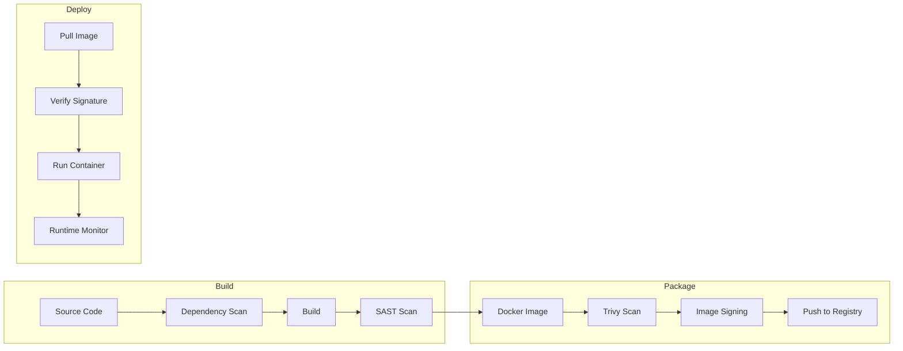

### 22.2 Container Security

| Control                        | Implementation                                    |
|--------------------------------|---------------------------------------------------|
| Base images                    | Official, verified, minimal (Alpine/distroless)   |
| Image scanning                 | Trivy on every build, CI gate on critical findings |
| Image signing                  | Cosign signatures (planned)                        |
| Non-root user                  | `USER 1000:1000` in all containers                |
| Read-only filesystem           | tmpfs for temp dirs, read-only rootfs where possible |
| No shell access                | Distroless images (no bash/sh)                     |
| Resource limits                | CPU and memory limits per container                |
| Seccomp profiles               | Restricted syscall profiles                        |
| Capability dropping            | Drop ALL, add only NET_BIND_SERVICE if needed      |

### 22.3 Secrets Security

| Control                        | Implementation                                    |
|--------------------------------|---------------------------------------------------|
| No secrets in images           | Runtime injection only                             |
| No secrets in Git              | .gitignore, pre-commit hooks, secret scanning      |
| No secrets in logs             | Log field filtering, structured logging            |
| Secrets rotation               | Scheduled rotation with graceful restart           |
| Encrypted at rest              | Disk encryption (LUKS/EBS)                         |
| Access control                 | Service-specific env vars, RBAC                    |

### 22.4 Network Security

| Control                        | Implementation                                    |
|--------------------------------|---------------------------------------------------|
| Network segmentation           | VPC with 5 subnets (DMZ, App, Service, Data, Mgmt) |
| Firewall rules                 | Stateful firewall with allow-list                  |
| TLS 1.3 everywhere            | All external and internal (planned mTLS)           |
| WAF                            | OWASP Top 10 protection, rate limiting             |
| DDoS protection                | Load balancer DDoS mitigation                      |
| DNS security                   | DNSSEC (planned)                                   |

### 22.5 Host Security

| Control                        | Implementation                                    |
|--------------------------------|---------------------------------------------------|
| OS hardening                   | CIS benchmark compliance                           |
| Automatic updates              | Unattended-upgrades (security only)                |
| SSH access                     | Key-based only, bastion host                       |
| Firewall                       | UFW/iptables with default deny                     |
| Audit framework                | auditd for system-level audit logging              |
| File integrity                 | AIDE or Tripwire (planned)                         |

### 22.6 Runtime Security

| Control                        | Implementation                                    |
|--------------------------------|---------------------------------------------------|
| Container monitoring           | Falco or Sysdig (planned)                          |
| Process whitelisting           | Seccomp profiles per container                     |
| Filesystem monitoring          | Read-only rootfs, tmpfs for temp                   |
| Network monitoring             | Container network policies                         |
| Resource monitoring            | CPU/memory limits enforced                         |
| Anomaly detection              | Prometheus alerting on anomalies                   |

### 22.7 Certificate Management

| Certificate Type           | Issuer              | Renewal        | Automation      |
|---------------------------|---------------------|----------------|-----------------|
| External TLS               | Let's Encrypt       | 90 days        | certbot auto    |
| Internal mTLS              | Custom CA           | 365 days       | Manual + script |
| Database TLS               | Custom CA           | 365 days       | Manual + script |
| API signing (JWT)          | Self-generated      | 30 days        | Manual + script |

### 22.8 Security Scanning Schedule

| Scan Type                | Frequency    | Tool              | Scope                    |
|--------------------------|--------------|-------------------|--------------------------|
| Dependency scanning      | Every build  | cargo-audit, pip-audit, npm audit | Code dependencies |
| Container image scanning | Every build  | Trivy, Grype      | Docker images            |
| OS vulnerability scan    | Weekly       | OpenVAS           | Base OS                  |
| Application scan         | Monthly      | OWASP ZAP         | Web application          |
| Penetration test         | Annual       | Third-party firm  | Full platform            |

---

## 23. Operational Procedures

### 23.1 Deployment Process

| Step | Action                                              | Responsible      | Verification                      |
|------|-----------------------------------------------------|------------------|------------------------------------|
| 1    | Create release branch from main                     | Developer        | Branch created                     |
| 2    | Run full test suite                                 | CI pipeline      | All tests pass                     |
| 3    | Build Docker images                                 | CI pipeline      | Images built successfully          |
| 4    | Security scan (Trivy, cargo-audit, pip-audit)       | CI pipeline      | No critical findings               |
| 5    | Push images to registry                             | CI pipeline      | Images tagged and pushed           |
| 6    | Deploy to staging                                   | CD pipeline      | Health checks pass                 |
| 7    | Run staging validation tests                        | QA team          | Tests pass                         |
| 8    | Manual approval gate                                | Engineering lead | Approval recorded                  |
| 9    | Deploy to production (rolling update)               | CD pipeline      | Zero-downtime deployment           |
| 10   | Monitor for 15 minutes                              | SRE team         | No errors or anomalies             |
| 11   | Tag release in Git                                  | Release manager  | Release tagged                     |
| 12   | Update release notes                                | Release manager  | Notes published                    |

### 23.2 Health Verification Checklist

| Check                            | Target                          | Pass Criteria                     |
|----------------------------------|--------------------------------|-----------------------------------|
| API health endpoint              | GET /api/v1/health             | 200 OK                            |
| API readiness endpoint           | GET /api/v1/health/ready       | 200 OK                            |
| Dashboard loads                  | GET /                          | 200 OK, < 2 seconds               |
| Database connectivity            | pg_isready                     | Accepting connections             |
| Redis connectivity               | redis-cli ping                 | PONG                              |
| Evidence storage writable        | Touch test file                | File created successfully         |
| WebSocket connection             | Connect to ws/v1/stream        | Connection established            |
| AI inference health              | GET /internal/v1/health        | 200 OK, model loaded              |
| Prometheus metrics               | GET /metrics                   | Metrics endpoint responding       |
| Grafana dashboards               | GET /api/health                | 200 OK                            |

### 23.3 Maintenance Windows

| Maintenance Type         | Schedule              | Duration    | Impact                          |
|--------------------------|-----------------------|-------------|----------------------------------|
| Security patching         | Monthly (2nd Saturday)| 2 hours     | Rolling restart, zero downtime  |
| Database maintenance      | Weekly (Sunday 2 AM)  | 1 hour      | Brief read-only period           |
| Evidence archival         | Daily (3 AM)          | 30 minutes  | No user impact                   |
| Certificate renewal       | Monthly (automated)   | 5 minutes   | Brief connection reset           |
| Log rotation              | Daily (automated)     | 5 minutes   | No user impact                   |

### 23.4 Upgrade Strategy

| Upgrade Type             | Process                                    | Downtime  |
|--------------------------|--------------------------------------------|-----------|
| Patch (bug fix)          | Rolling update; one instance at a time      | Zero      |
| Minor (feature)          | Rolling update with health check gates     | Zero      |
| Major (breaking)         | Blue-green deployment                      | Zero      |
| Database schema          | Backward-compatible migrations first        | Zero      |
| AI model                 | Hot-swap model weights; no restart          | Zero      |
| Infrastructure           | Rolling replacement of nodes                | Zero      |

### 23.5 Blue-Green Deployment

```mermaid
graph TB
    subgraph "Current (Blue)"
        LB_B[Load Balancer]
        API_B1[API Blue 1]
        API_B2[API Blue 2]
    end

    subgraph "New (Green)"
        LB_G[Load Balancer]
        API_G1[API Green 1]
        API_G2[API Green 2]
    end

    subgraph "DNS"
        DNS[DNS Record]
    end

    DNS --> LB_B
    DNS -.->|Switch| LB_G

    LB_B --> API_B1
    LB_B --> API_B2
    LB_G --> API_G1
    LB_G --> API_G2
```

| Step | Action                                              |
|------|-----------------------------------------------------|
| 1    | Deploy new version to Green environment              |
| 2    | Run health checks on Green                           |
| 3    | Run smoke tests on Green                             |
| 4    | Switch DNS/load balancer from Blue to Green          |
| 5    | Monitor Green for errors                             |
| 6    | If stable, keep Green; if issues, switch back to Blue|
| 7    | Decommission Blue after validation period            |

### 23.6 Rollback Strategy

| Trigger                    | Rollback Action                               | Time to Rollback |
|----------------------------|-----------------------------------------------|-------------------|
| Health check failure       | Revert to previous container image tag         | 2-5 minutes       |
| Error rate spike           | Revert to previous container image tag         | 2-5 minutes       |
| Database migration failure | Run down migration; revert code                | 5-15 minutes      |
| Full deployment failure    | Blue-green switch back                         | 1-2 minutes       |
| Data corruption            | Point-in-time recovery from WAL                | 15-60 minutes     |

### 23.7 Operational Checklist

| Pre-Deployment                                    |
|---------------------------------------------------|
| [ ] All tests passing in staging                   |
| [ ] Security scan clean (no critical findings)     |
| [ ] Release notes prepared                         |
| [ ] Rollback plan documented                       |
| [ ] Stakeholders notified                          |
| [ ] Monitoring dashboards open                     |
| [ ] On-call engineer available                     |

| Post-Deployment                                    |
|----------------------------------------------------|
| [ ] Health checks passing                          |
| [ ] Error rate within normal range                 |
| [ ] API latency within SLA                         |
| [ ] No new alerts firing                           |
| [ ] WebSocket connections stable                   |
| [ ] Evidence storage accessible                    |
| [ ] Database replication healthy                   |
| [ ] Monitoring confirmed for 15 minutes            |

---

## 24. Capacity Planning

### 24.1 Capacity Matrix

| Resource              | Tier 1 (MVP)         | Tier 2 (Standard)      | Tier 3 (Enterprise)    | Tier 4 (Large)          |
|-----------------------|----------------------|------------------------|------------------------|-------------------------|
| Cameras               | 50-200               | 200-1,000              | 1,000-5,000            | 5,000-10,000+           |
| API nodes             | 1                    | 2                      | 4                      | 8+                      |
| GPU nodes             | 1                    | 2                      | 4                      | 8+                      |
| Database nodes        | 1 (SQLite)           | 1 (PostgreSQL)         | 2 (PG primary + replica)| 4+ (PG cluster)        |
| Redis nodes           | 0                    | 1                      | 2 (sentinel)           | 3+ (cluster)            |
| Total vCPU            | 16                   | 48                     | 128                    | 256+                    |
| Total RAM             | 32 GB                | 96 GB                  | 256 GB                 | 512+ GB                 |
| Total GPU VRAM        | 16 GB (1× T4)        | 48 GB (2× A10)         | 96 GB (4× A10)         | 192+ GB (8× A10)       |
| Storage               | 500 GB               | 2 TB                   | 10 TB                  | 50+ TB                  |
| Network bandwidth     | 1 Gbps               | 10 Gbps                | 25 Gbps                | 100 Gbps                |

### 24.2 CPU Sizing

| Component              | vCPU per Instance   | Instances (Tier 2) | Total vCPU           |
|------------------------|--------------------|---------------------|----------------------|
| Axum API               | 4                  | 2                   | 8                    |
| AI Inference           | 8                  | 2                   | 16                   |
| Camera Gateway         | 4                  | 1                   | 4                    |
| PostgreSQL             | 8                  | 1                   | 8                    |
| Redis                  | 2                  | 1                   | 2                    |
| Prometheus             | 2                  | 1                   | 2                    |
| Loki                   | 2                  | 1                   | 2                    |
| Grafana                | 1                  | 1                   | 1                    |
| Load Balancer          | 2                  | 1                   | 2                    |
| **Total**              |                    |                     | **45**               |

### 24.3 Memory Sizing

| Component              | RAM per Instance    | Instances (Tier 2) | Total RAM            |
|------------------------|--------------------|---------------------|----------------------|
| Axum API               | 4 GB               | 2                   | 8 GB                 |
| AI Inference           | 16 GB              | 2                   | 32 GB                |
| Camera Gateway         | 4 GB               | 1                   | 4 GB                 |
| PostgreSQL             | 16 GB              | 1                   | 16 GB                |
| Redis                  | 4 GB               | 1                   | 4 GB                 |
| Prometheus             | 4 GB               | 1                   | 4 GB                 |
| Loki                   | 4 GB               | 1                   | 4 GB                 |
| Grafana                | 2 GB               | 1                   | 2 GB                 |
| OS overhead            | 2 GB               | 5                   | 10 GB                |
| **Total**              |                    |                     | **84 GB**            |

### 24.4 GPU Sizing

| Workload               | GPU Model      | VRAM   | Cameras Supported | Scaling Factor       |
|------------------------|----------------|--------|--------------------|----------------------|
| Single detection model | NVIDIA T4      | 16 GB  | Up to 50 cameras   | 1 GPU per 50 cameras |
| Dual detection model   | NVIDIA A10     | 24 GB  | Up to 150 cameras  | 1 GPU per 150 cameras|
| Batch inference        | NVIDIA A100    | 40 GB  | Up to 500 cameras  | 1 GPU per 500 cameras|
| Multi-model inference  | NVIDIA H100    | 80 GB  | Up to 1000 cameras | 1 GPU per 1000 cameras|

### 24.5 Storage Sizing

| Data Type            | Per Camera/Day  | 200 Cameras/Day | 1000 Cameras/Day | Growth Rate       |
|----------------------|-----------------|-----------------|------------------|-------------------|
| Evidence clips       | 500 MB          | 100 GB          | 500 GB           | Linear with cameras|
| Detection events     | 50 MB           | 10 GB           | 50 GB            | Linear with cameras|
| Audit logs           | 10 MB           | 2 GB            | 10 GB            | Linear with activity|
| Database             | 20 MB           | 4 GB            | 20 GB            | Linear with events |
| Application logs     | 50 MB           | 10 GB           | 50 GB            | Linear with activity|

### 24.6 Bandwidth Sizing

| Traffic Type          | Per Camera      | 200 Cameras     | 1000 Cameras     |
|-----------------------|-----------------|-----------------|------------------|
| RTSP ingest           | 4 Mbps          | 800 Mbps        | 4 Gbps           |
| API requests          | 0.1 Mbps        | 20 Mbps         | 100 Mbps         |
| WebSocket             | 0.05 Mbps       | 10 Mbps         | 50 Mbps          |
| Evidence upload       | 0.02 Mbps       | 4 Mbps          | 20 Mbps          |
| **Total bandwidth**   | **4.17 Mbps**   | **834 Mbps**    | **4.17 Gbps**    |

### 24.7 Growth Forecast

| Metric                | Year 1          | Year 2          | Year 3          | Year 5          |
|-----------------------|-----------------|-----------------|-----------------|-----------------|
| Cameras               | 200             | 500             | 1,000           | 5,000           |
| Evidence storage      | 5 TB            | 15 TB           | 50 TB           | 200 TB          |
| Database size         | 50 GB           | 200 GB          | 500 GB          | 2 TB            |
| Concurrent users      | 10              | 25              | 50              | 200             |
| API requests/sec      | 100             | 500             | 1,000           | 5,000           |

---

## 25. Cost Optimization

### 25.1 Resource Optimization

| Strategy                  | Implementation                                    | Savings          |
|---------------------------|---------------------------------------------------|------------------|
| Right-sizing              | Monitor and adjust resource allocation             | 20-30%           |
| Auto-scaling              | Scale down during off-peak hours                   | 30-50%           |
| Spot instances            | Use spot/preemptible for AI inference workloads    | 60-70%           |
| Reserved instances        | Commit to 1-year for baseline workload             | 30-40%           |
| Container optimization    | Multi-stage builds, minimal images                 | 50% image size   |
| Resource limits           | Prevent runaway resource consumption               | 20-30%           |

### 25.2 Storage Tiering

| Tier                  | Storage Type     | Cost per GB/month | Use Case                      |
|-----------------------|------------------|-------------------|-------------------------------|
| Hot                   | NVMe SSD         | $0.10-0.20        | Active evidence, database     |
| Warm                  | HDD / S3 Standard| $0.02-0.05        | Recent evidence, backups      |
| Cold                  | S3 Glacier       | $0.004            | Archive, compliance           |
| Deep Archive          | S3 Glacier Deep  | $0.001            | Long-term retention           |

### 25.3 GPU Cost Optimization

| Strategy                  | Implementation                                    | Savings          |
|---------------------------|---------------------------------------------------|------------------|
| GPU sharing               | Time-slice AI inference across workloads           | 30-40%           |
| Model optimization        | Quantized models (INT8/FP16) reduce VRAM           | 50% VRAM         |
| Batch processing          | Batch frames to maximize GPU utilization            | 20-30%           |
| Spot GPU instances        | Use preemptible for non-critical inference          | 60-70%           |
| GPU auto-scaling          | Scale GPU nodes based on inference queue depth      | 30-50%           |

### 25.4 Operational Efficiency

| Strategy                  | Implementation                                    | Savings          |
|---------------------------|---------------------------------------------------|------------------|
| Automated deployments     | Eliminate manual deployment effort                 | 80% deploy time  |
| Automated monitoring      | Reduce manual monitoring overhead                  | 50% ops time     |
| Automated backup          | Eliminate manual backup procedures                 | 100% backup time |
| Infrastructure as Code    | Reproducible deployments reduce errors              | 40% incident time|
| Centralized logging       | Reduce troubleshooting time                        | 30% debug time   |

### 25.5 Cost Estimation (AWS Reference)

| Component              | Instance Type      | Monthly Cost (approx.) |
|------------------------|--------------------|-----------------------|
| API (2× m5.xlarge)     | m5.xlarge          | $280                  |
| AI (2× p3.2xlarge)     | p3.2xlarge         | $4,600                |
| Gateway (1× m5.xlarge) | m5.xlarge          | $140                  |
| PostgreSQL (r5.xlarge) | r5.xlarge          | $350                  |
| Redis (r5.large)       | r5.large           | $175                  |
| EBS (2 TB gp3)         | gp3                | $160                  |
| S3 (10 TB)             | S3 Standard        | $230                  |
| Data transfer          | —                  | $500                  |
| Load Balancer          | ALB                | $50                   |
| **Total (estimated)**  |                    | **~$6,485/month**     |

---

## 26. Future Deployment Roadmap

### 26.1 Phase 1: MVP (Current)

| Component              | Deployment                                    |
|------------------------|-----------------------------------------------|
| Orchestration          | Docker Compose                                 |
| Infrastructure         | Single node or small cluster                   |
| Database               | SQLite (MVP) → PostgreSQL (Phase 2)            |
| Scaling                | Manual (vertical + horizontal)                 |
| Monitoring             | Basic (Prometheus + Grafana)                   |
| Backup                 | Manual pg_dump + cron                          |

### 26.2 Phase 2: Production Hardening

| Component              | Enhancement                                    |
|------------------------|------------------------------------------------|
| Database               | Full PostgreSQL with replication                |
| Caching                | Redis for distributed caching                   |
| Monitoring             | Full observability stack (Prometheus, Loki, Grafana) |
| Backup                 | Automated backup with S3 replication            |
| Security               | mTLS, secrets vault, image signing              |
| HA                     | Multi-node with automatic failover              |

### 26.3 Phase 3: Kubernetes Migration

| Component              | Enhancement                                    |
|------------------------|------------------------------------------------|
| Orchestration          | Kubernetes (EKS/GKE/AKS)                       |
| Scaling                | Horizontal Pod Autoscaler (HPA)                 |
| Service mesh           | Istio or Linkerd (planned)                      |
| Secrets                | External Secrets Operator with Vault            |
| Ingress                | NGINX Ingress Controller                        |
| Certificates           | cert-manager with Let's Encrypt                 |
| GitOps                 | ArgoCD or Flux (planned)                        |
| Helm                   | Helm charts for all services                    |

### 26.4 Phase 4: Multi-Region

| Component              | Enhancement                                    |
|------------------------|------------------------------------------------|
| Multi-region           | Active-active across 2+ regions                 |
| Global load balancing  | Route 53 / Cloudflare                           |
| Data replication       | Cross-region PostgreSQL replication             |
| Evidence replication   | Cross-region S3 replication                     |
| DNS                    | GeoDNS for latency-based routing                |
| Compliance             | Data residency per region                       |

### 26.5 Phase 5: Edge AI Deployment

| Component              | Enhancement                                    |
|------------------------|------------------------------------------------|
| Edge inference         | On-camera or edge device processing              |
| Edge model             | Lightweight YOLO variants (YOLO-Nano)           |
| Edge sync              | Edge-to-cloud event synchronization              |
| Edge management        | Centralized model management and deployment      |
| Bandwidth optimization | Process at edge; upload events only              |

### 26.6 Phase 6: Serverless Components

| Component              | Enhancement                                    |
|------------------------|------------------------------------------------|
| API                    | AWS Lambda / Cloud Functions for API endpoints  |
| Event processing       | SQS/Cloud Tasks for async event processing      |
| Evidence storage       | S3 with Lambda triggers                         |
| Notifications          | SNS/PubSub for notification delivery             |
| Scheduled tasks        | Cloud Scheduler for maintenance tasks            |

### 26.7 Phase 7: Enterprise Edge Deployment

| Component              | Enhancement                                    |
|------------------------|------------------------------------------------|
| Edge appliance         | Pre-configured hardware appliance               |
| Local processing       | Full AI inference at edge                        |
| Local storage          | Edge evidence storage with cloud sync            |
| Offline operation       | Fully functional without cloud connectivity     |
| Fleet management       | Centralized management of edge appliances        |
| Remote updates         | OTA update capability for edge devices           |

---

## 27. Glossary

| Term                          | Definition                                      |
|-------------------------------|-------------------------------------------------|
| ALB                           | Application Load Balancer                        |
| AZ                            | Availability Zone                                |
| Blue-Green                    | Deployment strategy with two identical environments |
| CI/CD                         | Continuous Integration / Continuous Deployment   |
| cAdvisor                      | Container Advisor — container resource monitoring|
| DDoS                          | Distributed Denial of Service                    |
| DR                            | Disaster Recovery                                |
| EBS                           | Elastic Block Store (AWS)                        |
| EKS                           | Elastic Kubernetes Service (AWS)                 |
| GKE                           | Google Kubernetes Engine                         |
| GPU                           | Graphics Processing Unit                         |
| HPA                           | Horizontal Pod Autoscaler                        |
| HSTS                          | HTTP Strict Transport Security                   |
| Kubernetes                    | Container orchestration platform                 |
| L7                            | Layer 7 (Application layer) load balancer        |
| mTLS                          | Mutual TLS (both client and server authenticate) |
| MTTR                          | Mean Time To Recovery                            |
| NAT                           | Network Address Translation                      |
| NVMe                          | Non-Volatile Memory Express (fast storage)       |
| OOM                           | Out of Memory                                    |
| RPO                           | Recovery Point Objective                         |
| RTSP                          | Real-Time Streaming Protocol                     |
| RTO                           | Recovery Time Objective                          |
| S3                            | Simple Storage Service (AWS)                     |
| SAST                          | Static Application Security Testing              |
| SBOM                          | Software Bill of Materials                       |
| Sentinel                      | Redis high-availability solution                 |
| Seccomp                       | Secure Computing Mode (Linux syscall filtering)  |
| SIGTERM                       | Signal Terminate (graceful shutdown signal)       |
| Trivy                         | Container image security scanner                 |
| VPC                           | Virtual Private Cloud                            |
| WAF                           | Web Application Firewall                         |
| WAL                           | Write-Ahead Log (PostgreSQL)                     |

---

## 28. Appendices

### Appendix A: Infrastructure Inventory

| Component              | Technology           | Version       | Port(s)  | Container Image                    |
|------------------------|----------------------|---------------|----------|------------------------------------|
| Dashboard              | Next.js + nginx      | 14 + 1.25     | 3000→80  | vigilantai-dashboard:latest        |
| API Server             | Rust + Axum          | 1.78          | 8080     | vigilantai-api:latest              |
| AI Inference           | Python + FastAPI     | 3.11          | 8081     | vigilantai-ai:latest               |
| Camera Gateway         | Rust                 | 1.78          | None     | vigilantai-gateway:latest          |
| PostgreSQL             | PostgreSQL           | 16            | 5432     | postgres:16-alpine                 |
| Redis                  | Redis                | 7             | 6379     | redis:7-alpine                     |
| Prometheus             | Prometheus           | 2.51          | 9090     | prom/prometheus:v2.51              |
| Grafana                | Grafana              | 10.4          | 3000     | grafana/grafana:10.4               |
| Loki                   | Loki                 | 2.9           | 3100     | grafana/loki:2.9                   |
| Alertmanager           | Alertmanager         | 0.27          | 9093     | prom/alertmanager:v0.27            |
| Promtail               | Promtail             | 2.9           | 9080     | grafana/promtail:2.9               |
| Node Exporter          | Node Exporter        | 1.7           | 9100     | prom/node-exporter:v1.7            |

### Appendix B: Environment Matrix

| Feature                | Development | Testing  | QA       | Staging    | Production | DR         |
|------------------------|-------------|----------|----------|------------|------------|------------|
| Database               | SQLite      | SQLite   | PostgreSQL| PostgreSQL | PostgreSQL | PostgreSQL |
| Redis                  | No          | No       | Yes      | Yes        | Yes        | Yes        |
| Monitoring             | No          | Basic    | Full     | Full       | Full       | Full       |
| Logging                | stdout      | file     | Loki     | Loki       | Loki       | Loki       |
| Backup                 | No          | No       | Manual   | Manual     | Auto       | Auto       |
| TLS                    | Self-signed | Self-signed| Let's Encrypt| Custom CA| Custom CA  | Custom CA  |
| Network segmentation   | No          | No       | Basic    | Full       | Full       | Full       |
| Container scanning     | No          | Yes      | Yes      | Yes        | Yes        | Yes        |
| HA                     | No          | No       | No       | Yes        | Yes        | Yes        |
| DR                     | No          | No       | No       | No         | Yes        | Standby    |

### Appendix C: Port Matrix

| Service                 | Internal Port | External Port | Protocol | Purpose                        |
|-------------------------|---------------|---------------|----------|--------------------------------|
| Next.js Dashboard       | 80            | 443           | HTTP(S)  | Dashboard UI                   |
| Axum API                | 8080          | 443           | HTTP(S)  | REST API + WebSocket           |
| AI Inference            | 8081          | — (internal)  | HTTP     | Internal AI service            |
| Camera Gateway          | —             | — (outbound)  | RTSP     | Camera stream connections      |
| PostgreSQL              | 5432          | — (internal)  | PostgreSQL| Database                      |
| Redis                   | 6379          | — (internal)  | Redis    | Cache + sessions               |
| Prometheus              | 9090          | 9090          | HTTP     | Metrics endpoint               |
| Grafana                 | 3000          | 3001          | HTTP     | Dashboard UI                   |
| Loki                    | 3100          | — (internal)  | HTTP     | Log aggregation                |
| Alertmanager            | 9093          | — (internal)  | HTTP     | Alert routing                  |
| Promtail                | 9080          | — (internal)  | HTTP     | Log collection                 |
| Node Exporter           | 9100          | — (internal)  | HTTP     | Host metrics                   |

### Appendix D: Service Matrix

| Service                 | Dependencies                         | Health Endpoint               | Restart Policy   |
|-------------------------|--------------------------------------|-------------------------------|------------------|
| Next.js Dashboard       | None                                 | GET /                         | unless-stopped   |
| Axum API                | PostgreSQL, Redis, Evidence Storage  | GET /api/v1/health            | unless-stopped   |
| AI Inference            | GPU (optional), Model Weights        | GET /internal/v1/health       | unless-stopped   |
| Camera Gateway          | AI Inference, API                    | Internal API                  | unless-stopped   |
| PostgreSQL              | Storage volume                       | pg_isready                    | unless-stopped   |
| Redis                   | Storage volume                       | redis-cli ping                | unless-stopped   |
| Prometheus              | Storage volume                       | GET /-/healthy                | unless-stopped   |
| Grafana                 | Prometheus, Loki                     | GET /api/health               | unless-stopped   |
| Loki                    | Storage volume                       | GET /ready                    | unless-stopped   |
| Alertmanager            | Prometheus                           | GET /-/healthy                | unless-stopped   |

### Appendix E: Deployment Checklist

| Pre-Deployment                                    |
|---------------------------------------------------|
| [ ] All source code merged and reviewed            |
| [ ] All tests passing                              |
| [ ] Security scan clean                            |
| [ ] Docker images built and pushed                 |
| [ ] Release notes prepared                         |
| [ ] Rollback plan documented                       |
| [ ] Stakeholders notified                          |
| [ ] Monitoring dashboards open                     |
| [ ] On-call engineer available                     |

| Deployment                                         |
|----------------------------------------------------|
| [ ] Backup current state                           |
| [ ] Deploy to staging first                        |
| [ ] Validate staging health checks                 |
| [ ] Deploy to production (rolling update)          |
| [ ] Verify production health checks                |
| [ ] Check error rates                              |
| [ ] Check API latency                              |
| [ ] Check WebSocket connections                    |
| [ ] Check database replication                     |
| [ ] Monitor for 15 minutes                         |

| Post-Deployment                                    |
|----------------------------------------------------|
| [ ] All services healthy                           |
| [ ] No new alerts firing                           |
| [ ] Release tagged in Git                          |
| [ ] Release notes published                        |
| [ ] Monitoring confirmed                           |
| [ ] Stakeholders notified of completion            |

### Appendix F: Capacity Matrix

| Tier       | Cameras | API Nodes | GPU Nodes | DB Nodes | Total vCPU | Total RAM | Total VRAM | Storage |
|------------|---------|-----------|-----------|----------|------------|-----------|------------|---------|
| MVP        | 50-200  | 1         | 1         | 1        | 16         | 32 GB     | 16 GB      | 500 GB  |
| Standard   | 200-1K  | 2         | 2         | 1        | 48         | 96 GB     | 48 GB      | 2 TB    |
| Enterprise | 1K-5K   | 4         | 4         | 2        | 128        | 256 GB    | 96 GB      | 10 TB   |
| Large      | 5K-10K+ | 8+        | 8+        | 4+       | 256+       | 512+ GB   | 192+ GB    | 50+ TB  |

---

*End of VigilantAI Deployment Architecture Document*
