# VigilantAI Operations Runbook

## Enterprise Security Intelligence Platform

---

**Document Classification:** Confidential — Internal Operations

**Document ID:** VA-OPS-RB-010

**Version:** 1.0

**Last Updated:** 2026-07-23

---

# Table of Contents

1. [Document Control](#1-document-control)
2. [Revision History](#2-revision-history)
3. [Introduction](#3-introduction)
4. [Operations Overview](#4-operations-overview)
5. [Roles & Responsibilities](#5-roles--responsibilities)
6. [Production Environment Overview](#6-production-environment-overview)
7. [Production Architecture](#7-production-architecture)
8. [Service Inventory](#8-service-inventory)
9. [Infrastructure Inventory](#9-infrastructure-inventory)
10. [Daily Operations Checklist](#10-daily-operations-checklist)
11. [Shift Handover Procedure](#11-shift-handover-procedure)
12. [System Health Checks](#12-system-health-checks)
13. [Startup Procedures](#13-startup-procedures)
14. [Shutdown Procedures](#14-shutdown-procedures)
15. [Service Restart Procedures](#15-service-restart-procedures)
16. [Kubernetes Operations](#16-kubernetes-operations)
17. [Docker Operations](#17-docker-operations)
18. [Database Operations](#18-database-operations)
19. [Redis Operations](#19-redis-operations)
20. [Evidence Storage Operations](#20-evidence-storage-operations)
21. [AI Service Operations](#21-ai-service-operations)
22. [Camera Gateway Operations](#22-camera-gateway-operations)
23. [Monitoring Strategy](#23-monitoring-strategy)
24. [Prometheus Operations](#24-prometheus-operations)
25. [Grafana Dashboards](#25-grafana-dashboards)
26. [Log Management (Loki)](#26-log-management-loki)
27. [Alert Management](#27-alert-management)
28. [Incident Response](#28-incident-response)
29. [Severity Classification](#29-severity-classification)
30. [Major Incident Process](#30-major-incident-process)
31. [Escalation Matrix](#31-escalation-matrix)
32. [Communication Plan](#32-communication-plan)
33. [Disaster Recovery](#33-disaster-recovery)
34. [Backup Strategy](#34-backup-strategy)
35. [Restore Procedures](#35-restore-procedures)
36. [Business Continuity](#36-business-continuity)
37. [High Availability Operations](#37-high-availability-operations)
38. [Scaling Procedures](#38-scaling-procedures)
39. [Capacity Planning](#39-capacity-planning)
40. [Performance Monitoring](#40-performance-monitoring)
41. [Resource Optimization](#41-resource-optimization)
42. [Certificate Management](#42-certificate-management)
43. [Secret Rotation](#43-secret-rotation)
44. [User Administration](#44-user-administration)
45. [RBAC Operations](#45-rbac-operations)
46. [Maintenance Windows](#46-maintenance-windows)
47. [Patch Management](#47-patch-management)
48. [Upgrade Procedures](#48-upgrade-procedures)
49. [Rollback Procedures](#49-rollback-procedures)
50. [Release Verification](#50-release-verification)
51. [Security Monitoring](#51-security-monitoring)
52. [Vulnerability Response](#52-vulnerability-response)
53. [Compliance Operations](#53-compliance-operations)
54. [Operational Metrics](#54-operational-metrics)
55. [SLO](#55-slo)
56. [SLA](#56-sla)
57. [Error Budget](#57-error-budget)
58. [On-call Procedures](#58-on-call-procedures)
59. [Runbooks](#59-runbooks)
60. [Standard Operating Procedures](#60-standard-operating-procedures)
61. [Troubleshooting Guide](#61-troubleshooting-guide)
62. [Frequently Asked Questions](#62-frequently-asked-questions)
63. [Glossary](#63-glossary)
64. [Appendices](#64-appendices)

---

## 1. Document Control

### 1.1 Document Information

| Field                 | Value                                                        |
|-----------------------|--------------------------------------------------------------|
| Document Title        | VigilantAI Operations Runbook                                |
| Document ID           | VA-OPS-RB-010                                                |
| Version               | 1.0                                                          |
| Classification        | Confidential — Internal Operations                           |
| Author                | SRE / Platform Engineering                                   |
| Approved By           | VP of Engineering, Director of SRE                           |
| Effective Date        | 2026-07-23                                                   |
| Review Cycle          | Quarterly                                                    |
| Next Review           | 2026-10-23                                                   |
| Distribution          | SRE Team, Platform Engineering, Production Operations, On-Call |

### 1.2 Document Purpose

This Operations Runbook is the authoritative reference for operating, monitoring, maintaining, upgrading, backing up, restoring, scaling, and recovering the VigilantAI Enterprise Security Intelligence Platform in production. It is maintained by the SRE team and validated after every major incident, upgrade, or architectural change.

This document is **not** a deployment guide, developer guide, or architecture document. It focuses exclusively on production operations — what to do, when to do it, who does it, and how to verify it worked.

### 1.3 Applicable Audience

| Role                          | Usage                                                    |
|-------------------------------|----------------------------------------------------------|
| SRE Engineers                 | Primary operators; daily use for all operational tasks    |
| Production Operations Leads   | Shift handover, escalation coordination, incident command|
| On-Call Engineers             | Incident response, troubleshooting, recovery              |
| Platform Engineers            | Infrastructure changes, capacity planning, upgrades       |
| Security Operations           | Security monitoring, vulnerability response, compliance   |
| Engineering Managers          | Incident oversight, SLA reporting, budget decisions       |
| Database Administrators       | Database operations, backup/restore, performance tuning   |

### 1.4 Referenced Documents

| Document ID | Document Title                          | Relationship     |
|-------------|-----------------------------------------|------------------|
| VA-001      | Executive Summary                       | Source of Truth  |
| VA-002      | Business Requirements                   | Source of Truth  |
| VA-003      | System Requirements Specification       | Source of Truth  |
| VA-004      | Software Architecture                   | Source of Truth  |
| VA-005      | Database Design                         | Source of Truth  |
| VA-006      | API Specification                       | Source of Truth  |
| VA-007      | Security Architecture                   | Source of Truth  |
| VA-008      | Deployment Architecture                 | Source of Truth  |
| VA-009      | Developer Guide                         | Source of Truth  |
| VA-OPS-RB-010 | Operations Runbook                    | This document    |

---

## 2. Revision History

| Version | Date       | Author           | Changes                                           |
|---------|------------|------------------|---------------------------------------------------|
| 0.1     | 2026-07-23 | SRE Team         | Initial draft — all 64 sections                    |
| 1.0     | 2026-07-23 | SRE Team         | First release — reviewed and approved              |

---

## 3. Introduction

### 3.1 Purpose

VigilantAI is a mission-critical Enterprise Security Intelligence Platform that provides 24/7 real-time threat detection, event correlation, and evidence management. The platform processes live video streams from security cameras across multiple facilities, applies AI-powered detection models, correlates events across camera networks, and maintains a tamper-proof chain of custody for all digital evidence.

Downtime directly impacts physical security. A degraded platform means undetected threats, missed events, and compromised evidence integrity. This Operations Runbook exists to ensure the platform remains available, performant, secure, and recoverable at all times.

### 3.2 Scope

This runbook covers the complete production operations lifecycle:

- **Operational Procedures** — daily checks, shift handovers, startup and shutdown sequences
- **Service Operations** — restart, scaling, upgrade, and rollback procedures for every production service
- **Infrastructure Operations** — Kubernetes, Docker, database, Redis, storage, and network operations
- **Monitoring and Alerting** — Prometheus, Grafana, Loki, alert rules, and dashboard operations
- **Incident Management** — detection, classification, escalation, communication, and post-incident review
- **Backup and Recovery** — backup strategy, restore procedures, disaster recovery, and business continuity
- **Security Operations** — certificate management, secret rotation, vulnerability response, compliance
- **Maintenance** — patch management, upgrade windows, release verification, and capacity planning

### 3.3 Operational Principles

The operations team adheres to the following principles derived from Google SRE practices:

1. **Availability is the primary SLO.** Security monitoring cannot tolerate unplanned downtime.
2. **Automation over manual intervention.** Every recurring task should be automated; manual steps are documented here as fallbacks.
3. **Verify after every change.** No operation is complete until health checks pass and monitoring confirms normal behavior.
4. **Defend depth.** Every critical component has redundancy. Failover is automatic; manual recovery is the last resort.
5. **Preserve evidence integrity.** No operational action may compromise the chain of custody for stored evidence.
6. **Blameless post-incident.** Every incident produces learnings that improve the system and the runbook.

### 3.4 How to Use This Runbook

- **Routine Operations:** Refer to Sections 10–12 for daily checklists, shift handover, and health checks.
- **Service Operations:** Refer to Sections 13–22 for startup, shutdown, restart, and service-specific procedures.
- **Monitoring:** Refer to Sections 23–27 for monitoring strategy, tooling, dashboards, and alert management.
- **Incidents:** Refer to Sections 28–32 for incident response, severity classification, escalation, and communication.
- **Recovery:** Refer to Sections 33–36 for disaster recovery, backup, restore, and business continuity.
- **Maintenance:** Refer to Sections 46–50 for maintenance windows, patching, upgrades, rollback, and release verification.
- **Security:** Refer to Sections 51–53 for security monitoring, vulnerability response, and compliance.
- **Service Level Management:** Refer to Sections 54–57 for metrics, SLOs, SLAs, and error budgets.

---

## 4. Operations Overview

### 4.1 Operational Model

VigilantAI operates on a shared-responsibility model between the SRE team and the application engineering teams. The SRE team owns production reliability, infrastructure, monitoring, and incident response. Application teams own service logic, feature releases, and application-level debugging.

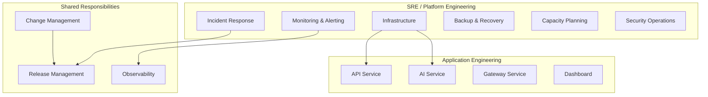

### 4.2 Operational Hours

| Category                  | Hours                                                         |
|---------------------------|---------------------------------------------------------------|
| Platform availability     | 24/7/365 (uninterrupted security monitoring)                  |
| SRE on-call coverage      | 24/7/365 (rotating weekly)                                    |
| SRE business hours        | Monday–Friday, 08:00–18:00 UTC                                |
| Maintenance windows       | Saturday 02:00–06:00 UTC (primary); Sunday 02:00–06:00 UTC (backup) |
| Change advisory board     | Tuesday and Thursday, 14:00–15:00 UTC                         |
| Post-incident review      | Within 48 hours of P1/P2 incident resolution                  |

### 4.3 Service Tier Classification

| Tier | Services                          | RTO     | RPO     | Impact of Outage                          |
|------|-----------------------------------|---------|---------|-------------------------------------------|
| 1    | PostgreSQL, Axum API, Camera Gateway | 15 min | 1 hour  | Complete loss of security monitoring       |
| 2    | Redis, AI Inference Service       | 30 min  | 1 hour  | Degraded detection; cached data loss       |
| 3    | Next.js Dashboard, Evidence Storage | 1 hour | 6 hours | UI unavailable; evidence write paused      |
| 4    | Prometheus, Grafana, Loki         | 2 hours | 24 hours| Observability gap; no lasting data impact  |

### 4.4 Operational Artifacts

| Artifact                    | Location                              | Owner              |
|-----------------------------|---------------------------------------|--------------------|
| This Runbook                | `docs/10-Operations-Runbook.md`       | SRE Team           |
| Deployment Architecture     | `docs/08-Deployment-Architecture.md`  | Platform Engineering |
| Security Architecture       | `docs/07-Security-Architecture.md`    | Security Team      |
| Incident Timeline Template  | Appendix A                            | SRE Team           |
| Change Request Template     | Appendix B                            | Platform Engineering |
| Post-Incident Report Template | Appendix C                          | SRE Team           |

---

## 5. Roles & Responsibilities

### 5.1 RACI Matrix — Operational Activities

| Activity                    | SRE  | App Eng | Security | DBA  | Management |
|-----------------------------|------|---------|----------|------|------------|
| Daily health checks         | R/A  | C       | I        | C    | I          |
| Incident response           | R/A  | C       | C        | C    | I          |
| Major incident command      | R    | C       | C        | C    | A          |
| Backup operations           | R/A  | I       | I        | R    | I          |
| Restore operations          | R/A  | C       | I        | R    | I          |
| Database maintenance        | C    | I       | I        | R/A  | I          |
| Capacity planning           | R/A  | C       | I        | C    | A          |
| Patch management            | R    | C       | C        | C    | A          |
| Secret rotation             | R    | C       | A        | C    | I          |
| Certificate management      | R/A  | I       | C        | I    | I          |
| Security monitoring         | R    | I       | R/A      | I    | I          |
| Vulnerability response      | C    | R       | A        | I    | I          |
| Compliance audits           | C    | C       | R/A      | C    | A          |
| Upgrade execution           | R    | C       | C        | C    | A          |
| Rollback execution          | R/A  | C       | C        | C    | I          |
| Performance tuning          | R    | C       | I        | R    | I          |
| DR testing                  | R/A  | C       | C        | C    | A          |

**R** = Responsible, **A** = Accountable, **C** = Consulted, **I** = Informed

### 5.2 On-Call Roles

| Role                          | Coverage     | Responsibilities                                        |
|-------------------------------|-------------|---------------------------------------------------------|
| Primary On-Call               | 24/7        | First responder for all alerts; initial triage and mitigation |
| Secondary On-Call             | 24/7        | Backup if primary is unavailable; assists during major incidents |
| Incident Commander            | Per-incident | Coordinates response; owns communication; declares resolution |
| Subject Matter Expert (SME)   | On-demand   | Deep expertise for specific subsystems (DB, AI, network) |

### 5.3 Escalation Contacts

| Level | Role                          | Contact Method        | Response SLA  |
|-------|-------------------------------|-----------------------|---------------|
| L1    | Primary On-Call               | PagerDuty             | 5 minutes     |
| L2    | Secondary On-Call             | PagerDuty             | 10 minutes    |
| L3    | SRE Team Lead                 | Phone + Slack         | 15 minutes    |
| L4    | Engineering Manager           | Phone + Slack         | 30 minutes    |
| L5    | VP of Engineering             | Phone                 | 1 hour        |
| L6    | CISO (security incidents)     | Phone                 | 1 hour        |

---

## 6. Production Environment Overview

### 6.1 Environment Inventory

| Environment    | Purpose                          | Infrastructure        | Data                |
|----------------|----------------------------------|-----------------------|---------------------|
| development    | Local developer machines         | Docker Compose        | Synthetic           |
| integration    | Pre-production integration tests | Kubernetes (staging cluster) | Anonymized subset |
| staging        | Pre-release validation           | Kubernetes (staging cluster) | Production mirror  |
| production     | Live security monitoring         | Kubernetes (prod cluster)    | Live production data |
| disaster-recovery | Business continuity           | Kubernetes (DR region)      | Replicated production |
| sandbox        | experimentation and training     | Isolated cluster      | Synthetic           |

### 6.2 Production Cluster Specification

| Attribute                    | Value                                              |
|------------------------------|----------------------------------------------------|
| Orchestrator                 | Kubernetes 1.29+                                   |
| Control Plane Nodes          | 3 (HA etcd, stacked topology)                      |
| Worker Nodes (Application)   | 6 (dedicated for application workloads)            |
| Worker Nodes (Data)          | 3 (PostgreSQL, Redis, storage-heavy)               |
| Worker Nodes (GPU)           | 2 (NVIDIA T4/A10G for AI inference)               |
| Worker Nodes (Monitoring)    | 2 (Prometheus, Grafana, Loki)                      |
| Total CPU                    | 256 vCPU across all nodes                          |
| Total Memory                 | 1024 GB across all nodes                           |
| Total GPU                    | 4× NVIDIA T4 (16 GB VRAM each) or 2× A10G (24 GB) |
| Container Runtime            | containerd 1.7+                                    |
| CNI                          | Cilium 1.15+                                       |
| Ingress Controller           | NGINX Ingress Controller 1.10+                     |
| Storage Provider             | Longhorn 1.6+ (or cloud CSI driver)                |
| Service Mesh                 | None (not required at current scale)               |

### 6.3 Network Overview

| Network Segment     | CIDR              | Purpose                           |
|---------------------|-------------------|-----------------------------------|
| Management          | 10.0.0.0/24       | Jump hosts, bastion, VPN          |
| Application         | 10.0.1.0/24       | API, Gateway, AI, Dashboard pods  |
| Data                | 10.0.2.0/24       | PostgreSQL, Redis pods            |
| Monitoring          | 10.0.3.0/24       | Prometheus, Grafana, Loki pods    |
| Storage             | 10.0.4.0/24       | Evidence storage, NFS mounts      |

### 6.4 External Dependencies

| Dependency              | Purpose                          | SLA       | Failover Strategy         |
|-------------------------|----------------------------------|-----------|---------------------------|
| DNS Provider            | Domain resolution                | 99.99%    | Multi-provider (Cloudflare + Route53) |
| TLS Certificate Authority | Certificate issuance           | 99.99%    | Backup CA (Let's Encrypt + DigiCert) |
| Object Storage (S3)     | Evidence backup, DR replication  | 99.99%    | Cross-region replication   |
| Email Provider          | Alert delivery, notifications    | 99.9%     | Secondary SMTP relay       |
| Time Source (NTP)       | Clock synchronization            | 99.99%    | Multiple NTP servers       |

---

## 7. Production Architecture

### 7.1 Architecture Diagram

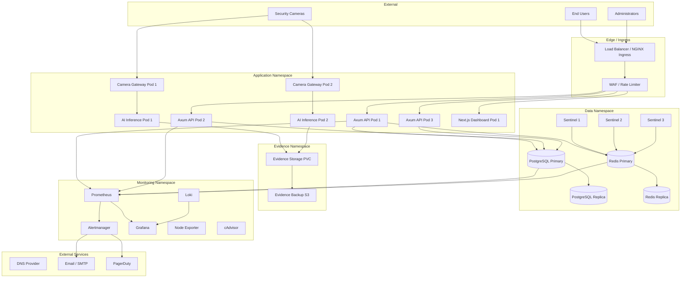

### 7.2 Namespace Layout

| Namespace            | Purpose                              | Key Resources                                    |
|----------------------|--------------------------------------|--------------------------------------------------|
| `vigilant-app`       | Application workloads                | Deployments, Services, ConfigMaps, Secrets       |
| `vigilant-data`      | Data stores                          | StatefulSets for PostgreSQL, Redis               |
| `vigilant-evidence`  | Evidence management                  | PersistentVolumeClaims, evidence workers         |
| `vigilant-monitoring`| Observability stack                  | Prometheus, Grafana, Loki, Alertmanager          |
| `vigilant-gateway`   | Camera gateway pods                  | DaemonSet or Deployment for RTSP ingestion       |
| `ingress-nginx`      | Ingress controller                   | NGINX Ingress Controller                         |
| `kube-system`        | Kubernetes system components         | Cilium, CoreDNS, metrics-server                  |

### 7.3 Inter-Service Communication

| Source              | Target              | Protocol    | Port    | Encryption  |
|---------------------|---------------------|-------------|---------|-------------|
| Load Balancer       | Axum API            | HTTP/2      | 8080    | TLS terminated at LB |
| Load Balancer       | Next.js Dashboard   | HTTP/2      | 3000    | TLS terminated at LB |
| Axum API            | PostgreSQL          | TCP (TLS)   | 5432    | mTLS        |
| Axum API            | Redis               | TCP (TLS)   | 6379    | TLS         |
| Camera Gateway      | AI Inference         | gRPC (TLS)  | 8081    | mTLS        |
| Camera Gateway      | PostgreSQL           | TCP (TLS)   | 5432    | mTLS        |
| Camera Gateway      | Redis                | TCP (TLS)   | 6379    | TLS         |
| Prometheus          | All services         | HTTP        | varies  | mTLS (service mesh) |
| Next.js Dashboard   | Axum API             | HTTP/WebSocket | 8080  | TLS         |

---

## 8. Service Inventory

### 8.1 Core Services

| Service                | Version | Port  | Protocol | CPU Request | Memory Request | CPU Limit | Memory Limit | Replicas |
|------------------------|---------|-------|----------|-------------|----------------|-----------|--------------|----------|
| Axum API               | 1.x     | 8080  | HTTP/2   | 500m        | 512Mi          | 2000m     | 2Gi          | 3        |
| Next.js Dashboard      | 1.x     | 3000  | HTTP     | 250m        | 256Mi          | 1000m     | 1Gi          | 2        |
| Camera Gateway         | 1.x     | 8082  | gRPC     | 500m        | 512Mi          | 2000m     | 2Gi          | 2        |
| AI Inference Service   | 1.x     | 8081  | gRPC     | 1000m       | 2Gi            | 4000m     | 8Gi          | 2        |

### 8.2 Data Services

| Service                | Version | Port  | Protocol | CPU Request | Memory Request | CPU Limit | Memory Limit | Replicas |
|------------------------|---------|-------|----------|-------------|----------------|-----------|--------------|----------|
| PostgreSQL             | 16.x    | 5432  | TCP/TLS  | 1000m       | 2Gi            | 4000m     | 16Gi         | 2 (1P+1R)|
| Redis                  | 7.x     | 6379  | TCP/TLS  | 500m        | 1Gi            | 2000m     | 4Gi          | 2 (1P+1R)|
| Redis Sentinel         | 7.x     | 26379 | TCP      | 100m        | 128Mi          | 500m      | 256Mi        | 3        |

### 8.3 Infrastructure Services

| Service                | Version  | Port  | Protocol | CPU Request | Memory Request | CPU Limit | Memory Limit | Replicas |
|------------------------|----------|-------|----------|-------------|----------------|-----------|--------------|----------|
| Prometheus             | 2.51+    | 9090  | HTTP     | 1000m       | 2Gi            | 2000m     | 8Gi          | 1        |
| Grafana                | 11.x     | 3000  | HTTP     | 250m        | 256Mi          | 1000m     | 1Gi          | 1        |
| Loki                   | 3.x      | 3100  | HTTP     | 500m        | 1Gi            | 2000m     | 4Gi          | 1        |
| Alertmanager           | 0.27+    | 9093  | HTTP     | 100m        | 128Mi          | 500m      | 512Mi        | 3        |
| Node Exporter          | 1.7+     | 9100  | HTTP     | 50m         | 64Mi           | 200m      | 128Mi        | per-node |
| cAdvisor               | built-in | 8080  | HTTP     | 50m         | 64Mi           | 200m      | 128Mi        | per-node |
| Blackbox Exporter      | 0.25+    | 9115  | HTTP     | 50m         | 64Mi           | 200m      | 128Mi        | 1        |

### 8.4 Health Check Endpoints

| Service                | Liveness Probe                | Readiness Probe               | Startup Probe              | Interval |
|------------------------|-------------------------------|-------------------------------|----------------------------|----------|
| Axum API               | `GET /api/v1/health/live`     | `GET /api/v1/health/ready`    | `GET /api/v1/health/live`  | 10s      |
| Next.js Dashboard      | `GET /api/health/live`        | `GET /api/health/ready`       | `GET /api/health/live`     | 15s      |
| Camera Gateway         | `GET /health/live`            | `GET /health/ready`           | `GET /health/live`         | 10s      |
| AI Inference Service   | `GET /health/live`            | `GET /health/ready`           | `GET /health/live`         | 10s      |
| PostgreSQL             | `pg_isready -U postgres`      | `pg_isready -U postgres`      | `pg_isready -U postgres`   | 10s      |
| Redis                  | `redis-cli ping`              | `redis-cli ping`              | `redis-cli ping`           | 10s      |
| Prometheus             | `GET /-/healthy`              | `GET /-/healthy`              | `GET //-/healthy`          | 30s      |
| Grafana                | `GET /api/health`             | `GET /api/health`             | `GET /api/health`          | 30s      |
| Loki                   | `GET /ready`                  | `GET /ready`                  | `GET /ready`               | 30s      |

### 8.5 Service Dependency Graph

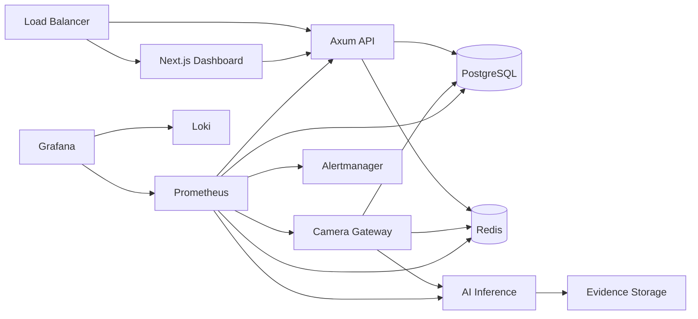

---

## 9. Infrastructure Inventory

### 9.1 Server Inventory

| Hostname            | Role                  | IP Address    | OS              | CPU  | RAM   | GPU         | Storage   |
|---------------------|-----------------------|---------------|-----------------|------|-------|-------------|-----------|
| va-prod-master-01   | K8s Control Plane     | 10.0.0.11     | Ubuntu 22.04    | 8    | 32 GB | None        | 256 GB SSD|
| va-prod-master-02   | K8s Control Plane     | 10.0.0.12     | Ubuntu 22.04    | 8    | 32 GB | None        | 256 GB SSD|
| va-prod-master-03   | K8s Control Plane     | 10.0.0.13     | Ubuntu 22.04    | 8    | 32 GB | None        | 256 GB SSD|
| va-prod-app-01      | K8s Worker (App)      | 10.0.1.11     | Ubuntu 22.04    | 16   | 64 GB | None        | 512 GB SSD|
| va-prod-app-02      | K8s Worker (App)      | 10.0.1.12     | Ubuntu 22.04    | 16   | 64 GB | None        | 512 GB SSD|
| va-prod-app-03      | K8s Worker (App)      | 10.0.1.13     | Ubuntu 22.04    | 16   | 64 GB | None        | 512 GB SSD|
| va-prod-app-04      | K8s Worker (App)      | 10.0.1.14     | Ubuntu 22.04    | 16   | 64 GB | None        | 512 GB SSD|
| va-prod-app-05      | K8s Worker (App)      | 10.0.1.15     | Ubuntu 22.04    | 16   | 64 GB | None        | 512 GB SSD|
| va-prod-app-06      | K8s Worker (App)      | 10.0.1.16     | Ubuntu 22.04    | 16   | 64 GB | None        | 512 GB SSD|
| va-prod-data-01     | K8s Worker (Data)     | 10.0.2.11     | Ubuntu 22.04    | 16   | 128 GB| None        | 2 TB NVMe |
| va-prod-data-02     | K8s Worker (Data)     | 10.0.2.12     | Ubuntu 22.04    | 16   | 128 GB| None        | 2 TB NVMe |
| va-prod-data-03     | K8s Worker (Data)     | 10.0.2.13     | Ubuntu 22.04    | 16   | 128 GB| None        | 2 TB NVMe |
| va-prod-gpu-01      | K8s Worker (GPU)      | 10.0.1.21     | Ubuntu 22.04    | 16   | 64 GB | 2× T4 16GB  | 1 TB SSD  |
| va-prod-gpu-02      | K8s Worker (GPU)      | 10.0.1.22     | Ubuntu 22.04    | 16   | 64 GB | 2× T4 16GB  | 1 TB SSD  |
| va-prod-mon-01      | K8s Worker (Monitor)  | 10.0.3.11     | Ubuntu 22.04    | 8    | 64 GB | None        | 2 TB SSD  |
| va-prod-mon-02      | K8s Worker (Monitor)  | 10.0.3.12     | Ubuntu 22.04    | 8    | 64 GB | None        | 2 TB SSD  |
| va-prod-storage-01  | Evidence Storage      | 10.0.4.11     | Ubuntu 22.04    | 8    | 32 GB | None        | 20 TB HDD |
| va-prod-storage-02  | Evidence Storage      | 10.0.4.12     | Ubuntu 22.04    | 8    | 32 GB | None        | 20 TB HDD |

### 9.2 Port Map

| Service                | Port  | Protocol | Namespace        | Exposure     |
|------------------------|-------|----------|------------------|--------------|
| Axum API               | 8080  | HTTP/2   | vigilant-app     | ClusterIP    |
| Next.js Dashboard      | 3000  | HTTP     | vigilant-app     | ClusterIP    |
| Camera Gateway         | 8082  | gRPC     | vigilant-gateway | ClusterIP    |
| AI Inference Service   | 8081  | gRPC     | vigilant-app     | ClusterIP    |
| PostgreSQL             | 5432  | TCP      | vigilant-data    | ClusterIP    |
| Redis                  | 6379  | TCP      | vigilant-data    | ClusterIP    |
| Redis Sentinel         | 26379 | TCP      | vigilant-data    | ClusterIP    |
| Prometheus             | 9090  | HTTP     | vigilant-monitoring | ClusterIP |
| Grafana                | 3000  | HTTP     | vigilant-monitoring | Ingress   |
| Loki                   | 3100  | HTTP     | vigilant-monitoring | ClusterIP |
| Alertmanager           | 9093  | HTTP     | vigilant-monitoring | ClusterIP |
| Node Exporter          | 9100  | HTTP     | monitoring       | HostNetwork  |
| Ingress (NGINX)        | 80/443| HTTP/TLS | ingress-nginx    | LoadBalancer |

### 9.3 Storage Inventory

| Storage Class        | Provisioner       | Reclaim Policy | Volume Type | Default Size | Usage                  |
|----------------------|-------------------|----------------|-------------|--------------|------------------------|
| local-data           | local-path        | Retain         | hostPath    | 2 TB         | PostgreSQL data, Redis |
| local-evidence       | local-path        | Retain         | hostPath    | 20 TB        | Video evidence storage |
| local-monitoring     | local-path        | Retain         | hostPath    | 2 TB         | Prometheus, Loki data  |
| fast-ssd             | local-path        | Retain         | hostPath    | 512 GB       | Application temp data  |
| backup-nfs           | nfs.csi           | Retain         | NFS         | Unlimited    | Backup staging         |

---

## 10. Daily Operations Checklist

### 10.1 Morning Checklist (Start of Business Day)

| # | Task                                        | Owner          | Verification                                | Time   |
|---|---------------------------------------------|----------------|---------------------------------------------|--------|
| 1 | Review overnight alerts in Grafana          | On-Call SRE    | No unresolved P1/P2 alerts                  | 5 min  |
| 2 | Check all services are healthy              | On-Call SRE    | All health checks passing in dashboard       | 5 min  |
| 3 | Review error rates (last 24h)               | On-Call SRE    | Error rate within SLO thresholds             | 5 min  |
| 4 | Check PostgreSQL replication lag            | On-Call SRE    | Lag < 1 second                              | 2 min  |
| 5 | Check Redis replication health              | On-Call SRE    | All Sentinels report healthy primary         | 2 min  |
| 6 | Check disk usage across all nodes           | On-Call SRE    | All volumes < 80% utilization                | 3 min  |
| 7 | Review evidence storage consumption         | On-Call SRE    | Usage within projected capacity              | 2 min  |
| 8 | Check TLS certificate expiry dates          | On-Call SRE    | No certificates expiring within 30 days      | 2 min  |
| 9 | Review camera gateway connection status     | On-Call SRE    | All expected cameras connected               | 3 min  |
| 10| Check AI inference throughput               | On-Call SRE    | FPS processing within expected range         | 2 min  |
| 11| Review backup completion status             | On-Call SRE    | All backups completed successfully           | 3 min  |
| 12| Check Kubernetes node health                | On-Call SRE    | All nodes in Ready state                     | 2 min  |
| 13| Review pending Pod restarts                 | On-Call SRE    | No unexpected restart loops                  | 2 min  |
| 14| Check log pipeline health (Loki)            | On-Call SRE    | Loki ingestion rate stable, no drops         | 2 min  |
| 15| Review security alerts (last 24h)           | Security Ops   | No unresolved security incidents             | 5 min  |

### 10.2 End-of-Day Checklist

| # | Task                                        | Owner          | Verification                                | Time   |
|---|---------------------------------------------|----------------|---------------------------------------------|--------|
| 1 | Verify all alerts from the day are resolved | On-Call SRE    | Alertmanager shows 0 active alerts           | 5 min  |
| 2 | Confirm no pending changes                  | On-Call SRE    | Change log reviewed                         | 2 min  |
| 3 | Update shift handover notes                 | On-Call SRE    | Notes posted to #ops-handover               | 5 min  |
| 4 | Verify backup completion for the day        | On-Call SRE    | Backup reports show success                  | 2 min  |
| 5 | Review capacity trend alerts                | On-Call SRE    | No new capacity warnings                    | 2 min  |

---

## 11. Shift Handover Procedure

### 11.1 Handover Process

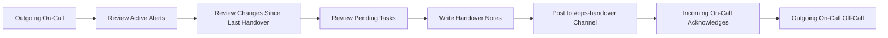

### 11.2 Handover Template

The outgoing on-call engineer posts the following template to the `#ops-handover` Slack channel at the end of their shift:

| Field                              | Details                                                        |
|------------------------------------|----------------------------------------------------------------|
| **Shift Period**                   | [Start Date/Time] — [End Date/Time] UTC                       |
| **Engineer**                       | [Name]                                                         |
| **Active Alerts at Shift End**     | [List any unresolved alerts with severity and duration]        |
| **Incidents During Shift**         | [List any incidents with status and root cause if known]       |
| **Changes Deployed**               | [List any deployments or infrastructure changes]               |
| **Pending Tasks**                  | [Tasks requiring follow-up from incoming shift]               |
| **Known Issues**                   | [Degraded services, workarounds in place]                      |
| **Upcoming Maintenance**           | [Scheduled maintenance windows approaching]                    |
| **Notes**                          | [Anything else the incoming engineer should know]             |

### 11.3 Handover Rules

1. **Overlap period:** 15 minutes minimum between outgoing and incoming on-call engineers.
2. **Acknowledgment:** The incoming engineer must acknowledge the handover notes in writing.
3. **Open incidents:** If any P1/P2 incident is in progress, the outgoing engineer remains engaged until the incident is resolved or formally handed over.
4. **Documentation:** All handover notes are retained for 90 days for audit and trend analysis.
5. **Escalation:** If the incoming engineer cannot be reached within 10 minutes of shift start, the outgoing engineer escalates to the SRE Team Lead.

---

## 12. System Health Checks

### 12.1 Health Check Matrix

| Component               | Check Method                    | Expected Result                   | Failure Action                          | Frequency |
|-------------------------|----------------------------------|-----------------------------------|------------------------------------------|-----------|
| Axum API                | `GET /api/v1/health/ready`       | HTTP 200 with `{"status":"ready"}` | Restart pod; check logs                  | 10s       |
| Next.js Dashboard       | `GET /api/health/ready`          | HTTP 200 with `{"status":"ok"}`   | Restart pod; check build                | 15s       |
| Camera Gateway          | `GET /health/ready`              | HTTP 200                          | Restart pod; verify RTSP streams         | 10s       |
| AI Inference Service    | `GET /health/ready`              | HTTP 200, GPU available           | Restart pod; check GPU driver            | 10s       |
| PostgreSQL Primary      | `pg_isready` + replication check | Accepting connections, streaming  | Failover to replica; investigate         | 10s       |
| PostgreSQL Replica      | `pg_isready` + lag check         | In recovery, lag < 1s             | Alert; rebuild replica if needed         | 10s       |
| Redis Primary           | `redis-cli ping`                 | `PONG`                            | Sentinel auto-failover; verify           | 10s       |
| Redis Replica           | `redis-cli ping` + lag check     | `PONG`, connected to primary      | Reconfigure replication                  | 10s       |
| Redis Sentinel          | `redis-cli sentinel master`      | Reports correct primary           | Restart sentinel; check quorum           | 10s       |
| Evidence Storage        | `df -h` + write test             | < 80% used, write succeeds        | Archive old evidence; alert capacity     | 60s       |
| Prometheus              | `GET /-/healthy`                 | HTTP 200                          | Restart; check storage                   | 30s       |
| Grafana                 | `GET /api/health`                | HTTP 200, `database_backend: ok`  | Restart; check database                  | 30s       |
| Loki                    | `GET /ready`                     | HTTP 200                          | Restart; check storage and ingestion     | 30s       |
| Ingress Controller      | `GET /healthz`                   | HTTP 200                          | Restart; check upstream services         | 10s       |
| Kubernetes API          | `kubectl cluster-info`           | API server responding              | Check etcd; control plane nodes          | 60s       |

### 12.2 Health Check Verification Procedure

After any service restart or deployment:

1. **Wait for readiness:** Confirm the pod transitions from `Pending` → `Running` → `Ready`.
2. **Verify health endpoint:** Manually call the readiness endpoint and confirm HTTP 200.
3. **Check logs:** Review the last 50 lines of logs for error patterns.
4. **Verify connectivity:** Confirm the service can reach its dependencies (database, Redis, etc.).
5. **Confirm monitoring:** Verify the service appears in Prometheus targets and is scraping successfully.
6. **Validate traffic:** Confirm the load balancer is routing traffic to the new instance.
7. **Run smoke tests:** Execute the relevant smoke test suite (see Section 50).
8. **Monitor for 15 minutes:** Watch error rates, latency, and resource consumption for 15 minutes post-change.

---

## 13. Startup Procedures

### 13.1 Full System Startup Sequence

When bringing the entire platform online (e.g., after a complete power event or DR activation), the following sequence must be followed strictly. Dependencies must start before dependents.

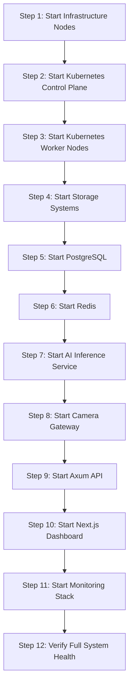

### 13.2 Startup Sequence Details

| Step | Component                    | Procedure                                                         | Verification                                | Timeout |
|------|------------------------------|-------------------------------------------------------------------|---------------------------------------------|---------|
| 1    | Infrastructure nodes         | Power on all physical/virtual servers; verify BIOS POST           | All nodes accessible via SSH                | 10 min  |
| 2    | Kubernetes control plane     | Start kubelet on master nodes; verify etcd quorum                 | `kubectl get nodes` shows all masters Ready | 5 min   |
| 3    | Kubernetes worker nodes      | Start kubelet on worker nodes; verify registration                | `kubectl get nodes` shows all workers Ready | 5 min   |
| 4    | Storage systems              | Mount evidence volumes; verify NFS/iSCSI connectivity             | `df -h` confirms mounts                     | 5 min   |
| 5    | PostgreSQL                   | Start primary, wait for recovery; start replica, wait for streaming | `pg_isready` returns accepting connections | 5 min   |
| 6    | Redis                        | Start primary, start replicas, start Sentinels                    | Sentinel reports healthy primary             | 3 min   |
| 7    | AI Inference Service         | Start pods; verify GPU availability                               | GPU detected, model loaded                   | 5 min   |
| 8    | Camera Gateway               | Start pods; verify RTSP stream connections                        | All expected cameras show connected          | 10 min  |
| 9    | Axum API                     | Start pods; verify readiness                                      | All pods Ready; health check returns 200     | 3 min   |
| 10   | Next.js Dashboard            | Start pods; verify readiness                                      | All pods Ready; health check returns 200     | 3 min   |
| 11   | Monitoring stack             | Start Prometheus, Loki, Grafana, Alertmanager                      | All targets scraping; dashboards loading     | 5 min   |
| 12   | Full system verification     | Run end-to-end health check; verify all SLOs                      | All services healthy; no active alerts       | 10 min  |

**Total estimated startup time:** 69 minutes (full cold start)

### 13.3 Post-Startup Validation

After completing the startup sequence:

1. **Run the daily health checklist** (Section 10.1).
2. **Verify camera connectivity:** Confirm all expected cameras are streaming.
3. **Verify AI inference:** Confirm the detection engine is processing frames.
4. **Verify event pipeline:** Confirm events are being generated and stored.
5. **Verify alerting:** Send a test alert through Alertmanager and confirm delivery.
6. **Notify stakeholders:** Post to `#ops-status` that the platform is fully operational.

---

## 14. Shutdown Procedures

### 14.1 Graceful Shutdown Sequence

A graceful shutdown reverses the startup order, draining connections before stopping each component.

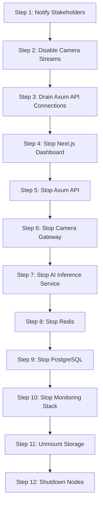

### 14.2 Shutdown Sequence Details

| Step | Component                    | Procedure                                                         | Timeout |
|------|------------------------------|-------------------------------------------------------------------|---------|
| 1    | Notify stakeholders          | Post shutdown notice to `#ops-status`; page on-call team          | 2 min   |
| 2    | Disable camera streams       | Notify camera operators to stop feeds; wait for streams to drain  | 5 min   |
| 3    | Drain API connections        | Set ingress to return 503; wait for active requests to complete   | 5 min   |
| 4    | Stop Next.js Dashboard       | Scale deployment to 0 replicas                                    | 1 min   |
| 5    | Stop Axum API                | Scale deployment to 0 replicas                                    | 1 min   |
| 6    | Stop Camera Gateway          | Scale deployment to 0 replicas                                    | 1 min   |
| 7    | Stop AI Inference Service    | Scale deployment to 0 replicas                                    | 1 min   |
| 8    | Stop Redis                   | `redis-cli SHUTDOWN NOSAVE` on replica first, then primary        | 2 min   |
| 9    | Stop PostgreSQL              | `pg_ctl stop -m fast` on replica first, then primary              | 5 min   |
| 10   | Stop monitoring stack        | Scale Prometheus, Loki, Grafana, Alertmanager to 0                | 2 min   |
| 11   | Unmount storage              | Unmount NFS/iSCSI mounts; verify clean unmount                   | 5 min   |
| 12   | Shutdown nodes               | `shutdown -h now` on all nodes; verify power off                 | 10 min  |

### 14.3 Emergency Shutdown

In the event of a security compromise or catastrophic failure requiring immediate shutdown:

1. **Isolate the network:** Disconnect the platform from external networks immediately.
2. **Stop all application services:** Scale all deployments to 0.
3. **Stop data services:** Stop PostgreSQL and Redis immediately (data safety is secondary to containment).
4. **Preserve evidence:** Do **not** delete or modify any evidence storage volumes.
5. **Preserve logs:** Do **not** delete or modify any log storage.
6. **Preserve audit trails:** Do **not** delete or modify audit log data.
7. **Document everything:** Record all actions taken with timestamps for post-incident investigation.

---

## 15. Service Restart Procedures

### 15.1 General Restart Principles

- **One service at a time.** Never restart multiple dependent services simultaneously.
- **Verify before proceeding.** Confirm the restarted service is healthy before touching the next.
- **Rolling restarts preferred.** Use Kubernetes rolling update strategy rather than pod deletion.
- **Notify first.** Post a notice to `#ops-status` before restarting any production service.
- **Window awareness.** Avoid restarts during peak camera hours unless addressing an active incident.

### 15.2 Service-Specific Restart Procedures

#### Axum API

| Step | Action                                                              |
|------|---------------------------------------------------------------------|
| 1    | Verify no active P1/P2 incidents affecting the API                 |
| 2    | Post restart notice to `#ops-status`                                |
| 3    | Trigger rolling restart: scale to current+1, then scale back       |
| 4    | Wait for new pod to reach Ready state                               |
| 5    | Verify readiness endpoint returns HTTP 200                          |
| 6    | Confirm Prometheus target is up and scraping                        |
| 7    | Verify error rate remains within SLO for 5 minutes                 |
| 8    | Post completion notice to `#ops-status`                             |

#### Next.js Dashboard

| Step | Action                                                              |
|------|---------------------------------------------------------------------|
| 1    | Verify no active incidents affecting the dashboard                  |
| 2    | Post restart notice to `#ops-status`                                |
| 3    | Trigger rolling restart                                              |
| 4    | Wait for new pod to reach Ready state                               |
| 5    | Verify readiness endpoint returns HTTP 200                          |
| 6    | Test login flow in a browser                                        |
| 7    | Confirm WebSocket connections establish successfully                |
| 8    | Post completion notice to `#ops-status`                             |

#### Camera Gateway

| Step | Action                                                              |
|------|---------------------------------------------------------------------|
| 1    | Verify AI Inference Service is healthy                              |
| 2    | Post restart notice to `#ops-status`                                |
| 3    | Identify which cameras are handled by this gateway instance         |
| 4    | Trigger rolling restart (one gateway pod at a time)                 |
| 5    | Wait for pod to reach Ready state                                   |
| 6    | Verify all expected camera streams are reconnected                  |
| 7    | Confirm frame processing is resuming in Prometheus metrics          |
| 8    | Monitor for 10 minutes to confirm stable reconnection               |
| 9    | Post completion notice to `#ops-status`                             |

#### AI Inference Service

| Step | Action                                                              |
|------|---------------------------------------------------------------------|
| 1    | Verify GPU driver is functional (`nvidia-smi`)                      |
| 2    | Post restart notice to `#ops-status`                                |
| 3    | Trigger rolling restart (one pod at a time to maintain inference)   |
| 4    | Wait for pod to reach Ready state and GPU to be allocated           |
| 5    | Verify model is loaded (check startup logs)                         |
| 6    | Confirm inference latency is within normal range                    |
| 7    | Verify detection events are flowing                                 |
| 8    | Monitor for 10 minutes                                              |
| 9    | Post completion notice to `#ops-status`                             |

### 15.3 Restart Verification Checklist

| Check                              | Target Service              | Expected Result                     |
|------------------------------------|-----------------------------|-------------------------------------|
| Pod status                         | Restarted service           | Running, Ready                      |
| Health endpoint                    | Restarted service           | HTTP 200                            |
| Logs (last 50 lines)               | Restarted service           | No ERROR or PANIC entries           |
| Prometheus target                  | Restarted service           | UP, last scrape < 30s ago          |
| Error rate                         | Restarted service           | Within SLO threshold               |
| Latency (p99)                      | Restarted service           | Within normal range                 |
| Dependency connectivity            | Restarted service           | Database: connected, Redis: connected|
| Upstream traffic                   | Load balancer               | Traffic flowing to new pod          |

---

## 16. Kubernetes Operations

### 16.1 Cluster Operations

#### Viewing Cluster State

| Command Purpose                     | Command                                                 |
|-------------------------------------|---------------------------------------------------------|
| List all nodes                      | `kubectl get nodes -o wide`                             |
| List all pods (all namespaces)      | `kubectl get pods --all-namespaces -o wide`             |
| List all services                   | `kubectl get svc --all-namespaces`                      |
| List all deployments                | `kubectl get deploy --all-namespaces`                   |
| List all StatefulSets               | `kubectl get sts --all-namespaces`                      |
| List all PersistentVolumeClaims     | `kubectl get pvc --all-namespaces`                      |
| Describe a node                     | `kubectl describe node <node-name>`                     |
| View resource consumption           | `kubectl top nodes`                                     |
| View pod resource consumption       | `kubectl top pods --all-namespaces --sort-by=memory`    |

#### Pod Operations

| Action                              | Command                                                 |
|-------------------------------------|---------------------------------------------------------|
| View pod logs                       | `kubectl logs <pod> -n <namespace> --tail=100`          |
| View previous container logs        | `kubectl logs <pod> -n <namespace> --previous`          |
| Exec into a pod                     | `kubectl exec -it <pod> -n <namespace> -- /bin/sh`      |
| Delete a pod (triggers restart)     | `kubectl delete pod <pod> -n <namespace>`               |
| View pod events                     | `kubectl describe pod <pod> -n <namespace>`             |
| Check pod resource limits           | `kubectl get pod <pod> -n <namespace> -o yaml \| grep resources` |

#### Deployment Operations

| Action                              | Command                                                 |
|-------------------------------------|---------------------------------------------------------|
| Scale deployment                    | `kubectl scale deploy <name> -n <ns> --replicas=N`      |
| Trigger rolling restart             | `kubectl rollout restart deploy <name> -n <ns>`         |
| View rollout status                 | `kubectl rollout status deploy <name> -n <ns>`          |
| View rollout history                | `kubectl rollout history deploy <name> -n <ns>`         |
| Rollback to previous revision       | `kubectl rollout undo deploy <name> -n <ns>`            |
| Rollback to specific revision       | `kubectl rollout undo deploy <name> --to-revision=N`    |

#### Emergency Operations

| Action                              | Command                                                 |
|-------------------------------------|---------------------------------------------------------|
| Drain a node                        | `kubectl drain <node> --ignore-daemonsets --delete-emptydir-data --force` |
| Cordon a node (mark unschedulable)  | `kubectl cordon <node>`                                 |
| Uncordon a node                     | `kubectl uncordon <node>`                               |
| Force delete a stuck pod            | `kubectl delete pod <pod> -n <ns> --grace-period=0 --force` |
| View OOMKilled events               | `kubectl get events --all-namespaces --field-selector reason=OOMKilling` |

### 16.2 Kubernetes Troubleshooting

| Symptom                             | Diagnostic Steps                                       |
|-------------------------------------|--------------------------------------------------------|
| Pod stuck in Pending                | Check events, verify node capacity, check PVC binding  |
| Pod stuck in ContainerCreating      | Check events, verify image pull, check node disk       |
| Pod in CrashLoopBackOff             | Check logs (`--previous`), verify config, check deps   |
| Pod OOMKilled                       | Check memory limits, review usage, increase if needed  |
| Node NotReady                       | Check kubelet, verify network, check disk pressure     |
| Service not reachable               | Check endpoints, verify selector, check network policy |
| PVC stuck in Pending                | Check StorageClass, verify provisioner, check capacity |
| DNS resolution failures             | Check CoreDNS pods, verify DNS config, test resolution |

### 16.3 Resource Quotas and Limits

| Namespace            | CPU Limit | Memory Limit | Pod Count Limit |
|----------------------|-----------|--------------|-----------------|
| vigilant-app         | 32 cores  | 64 Gi        | 50              |
| vigilant-data        | 16 cores  | 64 Gi        | 20              |
| vigilant-gateway     | 8 cores   | 16 Gi        | 20              |
| vigilant-monitoring  | 8 cores   | 32 Gi        | 30              |
| vigilant-evidence    | 4 cores   | 8 Gi         | 10              |

---

## 17. Docker Operations

### 17.1 Docker Compose (Non-Kubernetes Environments)

For development, staging, and environments where Kubernetes is not deployed, Docker Compose manages all services.

#### Service Management

| Action                              | Command                                                 |
|-------------------------------------|---------------------------------------------------------|
| Start all services                  | `docker compose up -d`                                  |
| Stop all services                   | `docker compose down`                                   |
| Restart a specific service          | `docker compose restart <service>`                      |
| View running services               | `docker compose ps`                                     |
| View service logs                   | `docker compose logs -f <service>`                      |
| View all service logs               | `docker compose logs -f --tail=100`                     |
| Rebuild and restart                 | `docker compose up -d --build <service>`                |
| Remove all containers               | `docker compose down -v` (also removes volumes)         |

### 17.2 Docker Container Health

| Check                               | Command                                                 |
|-------------------------------------|---------------------------------------------------------|
| Container status                    | `docker inspect --format='{{.State.Health.Status}}' <container>` |
| Container resource usage            | `docker stats <container> --no-stream`                  |
| Container logs                      | `docker logs <container> --tail=100 -f`                 |
| Container inspect (full)            | `docker inspect <container>`                            |
| Enter container                     | `docker exec -it <container> /bin/sh`                   |
| Copy files from container           | `docker cp <container>:/path /local/path`               |

### 17.3 Docker Network Operations

| Action                              | Command                                                 |
|-------------------------------------|---------------------------------------------------------|
| List networks                       | `docker network ls`                                     |
| Inspect network                     | `docker network inspect <network>`                      |
| Connect container to network        | `docker network connect <network> <container>`          |
| Disconnect container from network   | `docker network disconnect <network> <container>`       |

### 17.4 Docker Image Management

| Action                              | Command                                                 |
|-------------------------------------|---------------------------------------------------------|
| List images                         | `docker images`                                         |
| Remove dangling images              | `docker image prune`                                    |
| Remove all unused images            | `docker image prune -a`                                 |
| View image history                  | `docker history <image>`                                |
| Check image vulnerabilities         | `trivy image <image>`                                   |

### 17.5 Docker Cleanup Schedule

| Task                                | Frequency    | Command                                       |
|-------------------------------------|--------------|-----------------------------------------------|
| Prune stopped containers            | Daily        | `docker container prune -f`                   |
| Prune dangling images               | Daily        | `docker image prune -f`                       |
| Prune unused volumes                | Weekly       | `docker volume prune -f`                      |
| Prune unused networks               | Weekly       | `docker network prune -f`                     |
| Full system prune                   | Monthly      | `docker system prune -a --volumes -f`         |

---

## 18. Database Operations

### 18.1 PostgreSQL Daily Operations

#### Health Monitoring

| Metric                            | Healthy Range         | Alert Threshold      |
|-----------------------------------|-----------------------|----------------------|
| Connections (active)              | < 80% of max          | > 80% of max         |
| Replication lag                   | < 1 second            | > 5 seconds          |
| Transaction rate                  | Normal baseline       | > 200% of baseline   |
| Cache hit ratio                   | > 99%                 | < 99%                |
| Deadlocks                         | 0 per hour            | > 0 per hour         |
| Long-running queries              | 0                     | > 0 (> 60 seconds)   |
| Table bloat                       | < 20%                 | > 30%                |
| Disk usage                        | < 80%                 | > 85%                |
| WAL size                          | < 1 GB                | > 5 GB               |
| Active vacuum processes           | As scheduled          | Stuck for > 1 hour   |

#### Routine Maintenance

| Task                                | Frequency    | Window                    | Responsibility |
|-------------------------------------|--------------|---------------------------|----------------|
| Review slow query log               | Daily        | Morning check             | On-Call SRE    |
| Check replication lag               | Continuous   | Monitored via Prometheus  | Automated      |
| Review connection pool metrics      | Daily        | Morning check             | On-Call SRE    |
| Analyze table statistics            | Weekly       | Maintenance window        | DBA            |
| Reindex bloated indexes             | As needed    | Maintenance window        | DBA            |
| Review and clean expired sessions   | Weekly       | Maintenance window        | DBA            |
| Vacuum analyze (manual)             | Weekly       | Maintenance window        | DBA            |
| Check disk usage trend              | Daily        | Morning check             | On-Call SRE    |
| Review pg_stat_activity             | Daily        | Morning check             | On-Call SRE    |
| Verify backup integrity             | Weekly       | Maintenance window        | SRE            |

#### Connection Pool Configuration

| Parameter                         | Value                                                         |
|-----------------------------------|---------------------------------------------------------------|
| Pool minimum connections          | 5                                                             |
| Pool maximum connections          | 20 per API instance                                           |
| Connection timeout                | 5 seconds                                                     |
| Idle timeout                      | 300 seconds                                                   |
| Max lifetime                      | 1800 seconds                                                  |
| Health check interval             | 30 seconds                                                    |

### 18.2 PostgreSQL Recovery Procedures

#### Point-in-Time Recovery

| Step | Action                                                              |
|------|---------------------------------------------------------------------|
| 1    | Identify the exact timestamp or WAL position for recovery           |
| 2    | Stop writes to the database (set application to read-only)          |
| 3    | Take a `pg_basebackup` of the current state (for safety)           |
| 4    | Configure `recovery_target_time` in PostgreSQL configuration        |
| 5    | Start PostgreSQL in recovery mode                                   |
| 6    | Monitor recovery progress via logs                                  |
| 7    | Verify data consistency at the target point                         |
| 8    | Promote to read-write after verification                            |
| 9    | Rebuild replicas from the recovered primary                         |
| 10   | Notify application teams; resume normal operations                  |

#### Database Corruption Response

| Step | Action                                                              |
|------|---------------------------------------------------------------------|
| 1    | **Stop all writes immediately** — set API to maintenance mode       |
| 2    | Assess the extent of corruption (`pg_catalog` checks)               |
| 3    | If corruption is limited, attempt `pg_resetwal` (with DBA approval) |
| 4    | If corruption is severe, initiate point-in-time recovery from backup|
| 5    | Verify data integrity with table-level checksums                    |
| 6    | Rebuild any affected indexes                                        |
| 7    | Resume operations after verification                                |
| 8    | File incident report; schedule root cause analysis                  |

### 18.3 Database Schema Changes

| Step | Action                                                              |
|------|---------------------------------------------------------------------|
| 1    | Review migration in version control                                 |
| 2    | Test migration on staging environment                               |
| 3    | Verify rollback migration exists and is tested                      |
| 4    | Schedule change during maintenance window                           |
| 5    | Notify stakeholders via `#ops-changes`                              |
| 6    | Create a database backup before migration                           |
| 7    | Run migration with `--dry-run` first                                |
| 8    | Execute migration                                                   |
| 9    | Verify application functionality post-migration                     |
| 10   | Monitor error rates for 15 minutes                                  |
| 11   | Document change in change log                                       |

---

## 19. Redis Operations

### 19.1 Redis Health Monitoring

| Metric                            | Healthy Range         | Alert Threshold      |
|-----------------------------------|-----------------------|----------------------|
| Memory usage                      | < 80% of maxmemory    | > 80% of maxmemory   |
| Connected clients                 | < 500                 | > 500                |
| Hit rate                          | > 95%                 | < 90%                |
| Replication lag                   | 0 bytes               | > 1024 bytes         |
| Ops per second                    | Normal baseline       | > 300% of baseline   |
| Rejected connections              | 0                     | > 0                  |
| Evicted keys                      | 0 per minute          | > 100 per minute     |
| Sentinel master status            | `master`              | Not `master`         |
| Sentinel quorum                   | 2 of 3 sentinels      | < 2 sentinels        |
| AOF rewrite in progress           | As scheduled          | Stuck for > 1 hour   |

### 19.2 Redis Operations

| Task                                | Command / Procedure                                      |
|-------------------------------------|----------------------------------------------------------|
| Check Redis status                  | `redis-cli INFO server`                                  |
| Check memory usage                  | `redis-cli INFO memory`                                  |
| Check replication status            | `redis-cli INFO replication`                             |
| Check slow log                      | `redis-cli SLOWLOG GET 20`                               |
| Flush all data (emergency only)     | `redis-cli FLUSHALL` (requires approval)                 |
| Restart Redis gracefully            | `redis-cli SHUTDOWN NOSAVE` (Sentinel auto-failovers)    |
| Monitor real-time commands          | `redis-cli MONITOR` (briefly, for debugging)             |

### 19.3 Redis Sentinel Operations

| Task                                | Procedure                                                |
|-------------------------------------|----------------------------------------------------------|
| Check Sentinel status               | `redis-cli SENTINEL master <master-name>`                |
| Check Sentinel failover status      | `redis-cli SENTINEL get-master-addr-by-name <master>`    |
| Trigger manual failover             | `redis-cli SENTINEL failover <master-name>` (emergency)  |
| Reset Sentinel                      | `redis-cli SENTINEL RESET <master-name>`                 |
| Add a new replica                   | Update Sentinel config; restart Sentinel instances       |
| View all monitored Sentinels        | `redis-cli SENTINEL sentinels <master-name>`             |

### 19.4 Redis Memory Management

| Metric                            | Configuration                                             |
|-----------------------------------|-----------------------------------------------------------|
| maxmemory policy                  | `allkeys-lru` (evict least recently used keys)            |
| maxmemory size                    | 4 Gi (per Redis instance)                                 |
| Snapshot (RDB) frequency          | Every 900 seconds if ≥ 1 key changed                      |
| AOF frequency                     | Every second (fsync)                                      |
| AOF rewrite threshold             | 100% growth since last rewrite                            |

---

## 20. Evidence Storage Operations

### 20.1 Evidence Storage Health

| Metric                            | Healthy Range         | Alert Threshold      |
|-----------------------------------|-----------------------|----------------------|
| Disk usage                        | < 75%                 | > 80%                |
| Write latency                     | < 5ms                 | > 20ms               |
| Read latency                      | < 5ms                 | > 20ms               |
| IOPS (read)                       | Normal baseline       | < 50% of baseline    |
| IOPS (write)                      | Normal baseline       | < 50% of baseline    |
| Throughput                        | Normal baseline       | < 50% of baseline    |
| RAID health                       | Optimal               | Degraded or failed   |
| Evidence hash verification        | All pass              | Any failure          |
| Chain of custody integrity        | Verified              | Any tamper detected  |

### 20.2 Evidence Storage Procedures

| Task                                | Frequency    | Procedure                                            |
|-------------------------------------|--------------|------------------------------------------------------|
| Monitor disk usage                  | Continuous   | Prometheus alert on > 80% usage                      |
| Archive old evidence                | Monthly      | Move evidence older than retention period to cold storage |
| Verify evidence hashes              | Weekly       | Run SHA-256 verification against stored evidence     |
| Check RAID health                   | Daily        | Review RAID controller status via monitoring         |
| Capacity projection                 | Weekly       | Calculate days until 80% usage at current growth rate|
| Backup verification                 | Weekly       | Restore a random evidence file from backup; verify hash |
| Cleanup orphaned evidence           | Monthly      | Identify evidence not linked to any event; archive   |

### 20.3 Evidence Retention Policy

| Evidence Type              | Hot Storage    | Warm Storage   | Cold Archive    | Deletion     |
|----------------------------|----------------|----------------|-----------------|--------------|
| Video footage              | 30 days        | 90 days        | 1 year          | After 1 year |
| Detection snapshots        | 90 days        | 1 year         | 3 years         | After 3 years|
| Event metadata             | 1 year         | 3 years        | 7 years         | After 7 years|
| Audit logs                 | 1 year         | 7 years        | 10 years        | Never        |
| Incident evidence          | 3 years        | 7 years        | 10 years        | Never        |

---

## 21. AI Service Operations

### 21.1 AI Inference Health Monitoring

| Metric                            | Healthy Range         | Alert Threshold      |
|-----------------------------------|-----------------------|----------------------|
| GPU utilization                   | 40–85%                | > 90% or < 10%       |
| GPU memory usage                  | < 85%                 | > 85%                |
| GPU temperature                   | < 80°C                | > 85°C               |
| GPU power draw                    | < 90% TDP             | > 90% TDP            |
| Inference latency (p99)           | < 200ms               | > 500ms              |
| Inference throughput              | > minimum FPS         | < minimum FPS        |
| Model load time                   | < 30 seconds          | > 60 seconds         |
| Detection accuracy                | Baseline ± 5%         | > 10% deviation      |
| Frame drop rate                   | < 1%                  | > 5%                 |
| CUDA errors                       | 0                     | > 0                  |

### 21.2 AI Service Procedures

| Task                                | Frequency    | Procedure                                            |
|-------------------------------------|--------------|------------------------------------------------------|
| Monitor GPU health                  | Continuous   | Prometheus + nvidia-smi metrics                       |
| Check model version                 | Daily        | Verify loaded model matches expected version          |
| Review detection accuracy           | Weekly       | Compare detection rate against baseline               |
| Clean GPU memory                    | As needed    | Restart inference pod if memory fragmentation observed|
| Update detection model              | Per release   | Follow model update procedure in Developer Guide     |
| Review false positive rate          | Weekly       | Analyze detection events for accuracy trends          |
| GPU driver update                   | Monthly      | Update during maintenance window; full restart        |
| Model retraining                    | Quarterly    | Coordinate with ML team; staged rollout              |

### 21.3 GPU Operations

| Task                                | Procedure                                                |
|-------------------------------------|----------------------------------------------------------|
| Check GPU status                    | `nvidia-smi` (from within pod with GPU access)           |
| Monitor GPU metrics                 | Prometheus `nvidia_dcgm_exporter` metrics                |
| Reset GPU                           | Restart the pod containing the GPU workload              |
| GPU driver update                   | Update node driver; cordoned node; restart GPU pods      |
| GPU failure response                | Cordon affected node; reschedule GPU pods to healthy node|

---

## 22. Camera Gateway Operations

### 22.1 Gateway Health Monitoring

| Metric                            | Healthy Range         | Alert Threshold      |
|-----------------------------------|-----------------------|----------------------|
| Active camera streams             | Expected count        | < expected count     |
| Frame drop rate                   | < 1%                  | > 5%                 |
| Reconnection attempts             | 0                     | > 5 per minute       |
| RTSP connection status            | All connected         | Any disconnected     |
| Frame processing latency          | < 50ms                | > 200ms              |
| Queue depth                       | < 100                 | > 1000               |
| Gateway pod restarts              | 0 per day             | > 2 per hour         |
| Memory usage                      | < 80% of limit        | > 80% of limit       |
| Network bandwidth                 | < 80% of NIC capacity | > 80% of NIC capacity|

### 22.2 Camera Management Procedures

| Task                                | Procedure                                                |
|-------------------------------------|----------------------------------------------------------|
| Add a new camera                    | Update camera configuration; deploy to gateway; verify stream |
| Remove a camera                     | Update configuration; remove from gateway; clean up       |
| Reconnect a dropped camera          | Verify RTSP URL; check network; restart gateway if needed |
| Switch camera to different gateway  | Update config on both gateways; verify on target gateway  |
| Update RTSP credentials             | Update secret; rolling restart gateways                   |
| Check camera health                 | Verify stream status in gateway dashboard                 |

### 22.3 Gateway Troubleshooting

| Symptom                             | Diagnostic Steps                                       |
|-------------------------------------|--------------------------------------------------------|
| Camera not connecting               | Check RTSP URL, credentials, network path, firewall    |
| High frame drop rate                | Check network bandwidth, gateway CPU/memory, GPU load  |
| High reconnection rate              | Check camera power, network stability, RTSP server     |
| Gateway pod crashing                | Check OOMKilled, check logs for RTSP errors            |
| Frames not reaching AI service      | Check AI service health, gateway-to-AI network path    |
| High latency in frame delivery      | Check network between gateway and AI, check queue depth|

---

## 23. Monitoring Strategy

### 23.1 Monitoring Architecture

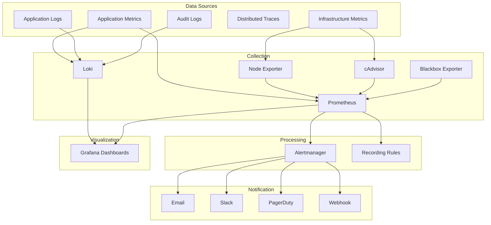

### 23.2 Monitoring Categories

| Category              | Data Source           | Collection Tool     | Retention   |
|-----------------------|-----------------------|---------------------|-------------|
| Application metrics   | API, AI, Gateway      | Prometheus          | 30 days     |
| Infrastructure metrics| Nodes, containers     | Node Exporter/cAdvisor | 30 days  |
| Application logs      | All services          | Loki                | 30 days     |
| Audit logs            | API, DB               | Loki                | 1 year      |
| Security logs         | WAF, auth, access     | Loki                | 1 year      |
| Error tracking        | Application errors    | Prometheus + Loki   | 90 days     |
| Uptime monitoring     | External endpoints    | Blackbox Exporter   | 90 days     |
| Certificate monitoring| TLS certificates      | Prometheus          | 30 days     |

### 23.3 Key Metrics Summary

| Metric                              | Source            | Current Value | SLO Target    |
|--------------------------------------|-------------------|---------------|---------------|
| API request rate                     | Axum API          | Measured      | —             |
| API error rate (5xx)                 | Axum API          | Measured      | < 0.1%        |
| API latency (p99)                    | Axum API          | Measured      | < 500ms       |
| Detection throughput                 | AI Inference      | Measured      | > min FPS     |
| Inference latency (p99)              | AI Inference      | Measured      | < 200ms       |
| Active camera streams                | Camera Gateway    | Measured      | 100% expected |
| Frame drop rate                      | Camera Gateway    | Measured      | < 1%          |
| PostgreSQL connections               | PostgreSQL        | Measured      | < 80% max     |
| PostgreSQL replication lag           | PostgreSQL        | Measured      | < 1 second    |
| Redis hit rate                       | Redis             | Measured      | > 95%         |
| Evidence storage usage               | Storage           | Measured      | < 80%         |
| Pod restart count                    | Kubernetes        | Measured      | < 2 per pod/day|
| Error budget remaining               | Calculated        | Measured      | > 0%          |

---

## 24. Prometheus Operations

### 24.1 Prometheus Health

| Check                               | Method                                               | Expected Result            |
|-------------------------------------|------------------------------------------------------|----------------------------|
| Prometheus is running               | `GET /-/healthy`                                     | HTTP 200                   |
| Targets are up                      | `GET /api/v1/targets` (or Prometheus UI → Status → Targets) | All targets show `UP` |
| Storage is healthy                  | Check disk usage for Prometheus data directory        | < 80% of allocated space   |
| Alertmanager connected              | `GET /api/v1/alertmanager/targets`                   | Connected                  |
| Query performance                   | Execute a known query; measure response time          | < 5 seconds                |
| Scrape interval consistency         | Check `scrape_duration_seconds` metrics              | Consistent across targets  |

### 24.2 Prometheus Operations

| Task                                | Procedure                                                |
|-------------------------------------|----------------------------------------------------------|
| Check Prometheus health             | Access Prometheus UI at `:9090/-/healthy`                 |
| View active targets                 | Prometheus UI → Status → Targets                          |
| View active alerts                  | Prometheus UI → Alerts                                    |
| Execute a query                     | Prometheus UI → Graph → enter PromQL query                |
| Check storage usage                 | `du -sh /prometheus/data`                                 |
| Force garbage collection            | `POST /-/gc` (Prometheus API)                             |
| Reload configuration                | `POST /-/reload` (Prometheus API)                         |
| Restart Prometheus                  | Delete pod; Kubernetes restarts it automatically          |

### 24.3 Prometheus Recording Rules

Recording rules pre-compute frequently used or expensive queries and record the result as a new time series. This improves dashboard performance and alert reliability.

| Recording Rule                      | Expression                                           | Purpose                      |
|-------------------------------------|------------------------------------------------------|------------------------------|
| `api:request_rate:5m`              | `rate(http_requests_total[5m])`                      | API request rate (5m window) |
| `api:error_rate:5m`               | `rate(http_requests_total{status=~"5.."}[5m])`       | API error rate               |
| `api:latency:p99:5m`              | `histogram_quantile(0.99, rate(http_request_duration_seconds_bucket[5m]))` | API p99 latency |
| `ai:inference_latency:p99:5m`     | `histogram_quantile(0.99, rate(inference_duration_seconds_bucket[5m]))` | AI p99 latency |
| `pg:replication_lag:max`           | `max(pg_replication_lag_seconds)`                     | DB replication lag           |

### 24.4 PromQL Quick Reference

| Query Purpose                       | PromQL Expression                                     |
|-------------------------------------|-------------------------------------------------------|
| Request rate per second             | `rate(http_requests_total[5m])`                       |
| Error rate (5xx)                    | `rate(http_requests_total{status=~"5.."}[5m])`        |
| Error percentage                    | `rate(http_requests_total{status=~"5.."}[5m]) / rate(http_requests_total[5m]) * 100` |
| p99 latency                         | `histogram_quantile(0.99, rate(http_request_duration_seconds_bucket[5m]))` |
| CPU usage percentage                | `100 - (avg by(instance) (rate(node_cpu_seconds_total{mode="idle"}[5m])) * 100)` |
| Memory usage percentage             | `(1 - node_memory_MemAvailable_bytes / node_memory_MemTotal_bytes) * 100` |
| Disk usage percentage               | `(1 - node_filesystem_avail_bytes / node_filesystem_size_bytes) * 100` |
| Pod restart count (last 24h)        | `increase(kube_pod_container_status_restarts_total[24h])` |

---

## 25. Grafana Dashboards

### 25.1 Dashboard Inventory

| Dashboard Name                | Purpose                              | Refresh Rate | Key Metrics                                      |
|-------------------------------|--------------------------------------|--------------|--------------------------------------------------|
| Platform Overview             | High-level platform health           | 30s          | Service status, error rate, request rate, latency |
| API Performance               | Axum API deep-dive                   | 15s          | Request rate, latency percentiles, error codes    |
| AI Inference                  | Detection engine performance          | 15s          | GPU utilization, inference latency, FPS throughput |
| Camera Gateway                | Camera stream health                 | 30s          | Active streams, frame drops, reconnections        |
| PostgreSQL                    | Database health and performance      | 30s          | Connections, replication lag, query rate, cache   |
| Redis                         | Cache performance                    | 30s          | Hit rate, memory, ops/sec, connections            |
| Kubernetes Cluster            | Cluster-wide health                  | 60s          | Node status, pod count, resource usage            |
| Kubernetes Pods               | Per-pod resource usage               | 30s          | CPU, memory, restarts, OOM kills                  |
| Monitoring Stack              | Prometheus/Loki/Alertmanager health  | 60s          | Scrape rate, ingestion rate, alert volume         |
| Security Events               | Security-relevant events             | 30s          | Auth failures, WAF blocks, suspicious activity    |
| Evidence Storage              | Evidence disk and throughput         | 60s          | Usage, write rate, read rate, IOPS                |
| Capacity Planning             | Growth trends and projections        | 300s         | Usage trends, days-to-full, scaling triggers      |

### 25.2 Grafana Operations

| Task                                | Procedure                                                |
|-------------------------------------|----------------------------------------------------------|
| Access Grafana                      | Navigate to `https://grafana.{domain}` (or internal URL) |
| Check Grafana health                | `GET /api/health`                                        |
| View all dashboards                 | Grafana UI → Dashboards → Browse                         |
| Search dashboards                   | Grafana UI → Dashboards → Search                          |
| View alert rules                    | Grafana UI → Alerting → Alert rules                       |
| Export a dashboard                  | Grafana UI → Dashboard → Settings → JSON Model → Copy    |
| Import a dashboard                  | Grafana UI → Dashboards → Import → Upload JSON file      |
| Restart Grafana                     | Delete pod; Kubernetes restarts automatically             |

### 25.3 Grafana Alert Rules

| Rule Name                          | Condition                                    | Severity   | Duration |
|------------------------------------|----------------------------------------------|------------|----------|
| API Error Rate High                | error_rate > 1% for 5 min                    | Warning    | 5m       |
| API Error Rate Critical            | error_rate > 5% for 2 min                    | Critical   | 2m       |
| API Latency High                   | p99_latency > 1s for 5 min                   | Warning    | 5m       |
| PostgreSQL Replication Lag         | lag > 5s for 2 min                            | Warning    | 2m       |
| PostgreSQL Replication Critical    | lag > 30s for 1 min                           | Critical   | 1m       |
| GPU Temperature High               | temp > 85°C for 5 min                         | Warning    | 5m       |
| GPU Memory Critical                | memory > 90% for 5 min                        | Critical   | 5m       |
| Evidence Storage High              | usage > 80%                                   | Warning    | 5m       |
| Evidence Storage Critical          | usage > 90%                                   | Critical   | 1m       |
| Camera Stream Down                 | active_streams < expected for 2 min           | Warning    | 2m       |
| Camera Stream Critical             | active_streams < 50% expected for 1 min       | Critical   | 1m       |
| Pod Restart Loop                   | restarts > 5 in 1 hour                        | Warning    | 1h       |
| Node NotReady                      | node condition Ready == false for 2 min       | Critical   | 2m       |

---

## 26. Log Management (Loki)

### 26.1 Loki Health

| Check                               | Method                                               | Expected Result            |
|-------------------------------------|------------------------------------------------------|----------------------------|
| Loki is running                     | `GET /ready`                                         | HTTP 200                   |
| Ingestion is active                 | Check Loki ingestion rate metric                     | Stable, no drops           |
| Storage is healthy                  | Check disk usage for Loki data directory              | < 80% of allocated space   |
| Log pipeline (Promtail/Fluentd)     | Check Promtail/Fluentd pods                          | All running, no errors     |
| Query performance                   | Execute a log query in Grafana                       | Returns within 10 seconds  |

### 26.2 Log Query Examples (LogQL)

| Purpose                             | LogQL Query                                            |
|-------------------------------------|-------------------------------------------------------|
| All logs from a namespace           | `{namespace="vigilant-app"}`                          |
| Error logs from API service         | `{namespace="vigilant-app", app="axum-api"} |= "ERROR"` |
| Logs matching a pattern             | `{namespace="vigilant-app"} \|~ "timeout\|deadline"`   |
| Logs excluding a pattern            | `{namespace="vigilant-app"} !~ "healthcheck"`          |
| Count of errors per minute          | `rate({namespace="vigilant-app"} |= "ERROR" [1m])`    |
| Logs with specific user ID          | `{namespace="vigilant-app"} \| json \| userId="user-123"` |

### 26.3 Log Retention

| Log Category               | Retention Period  | Storage Tier    | Archive Policy              |
|----------------------------|-------------------|-----------------|-----------------------------|
| Application logs           | 30 days           | Local SSD       | Compress and move to S3     |
| Audit logs                 | 1 year            | Local SSD + S3  | Compress; immutable storage |
| Security logs              | 1 year            | Local SSD + S3  | Compress; immutable storage |
| Kubernetes system logs     | 14 days           | Local SSD       | Drop after retention        |
| Access logs (ingress)      | 90 days           | Local SSD       | Compress and move to S3     |
| Error logs                 | 90 days           | Local SSD       | Compress and move to S3     |

### 26.4 Log Management Procedures

| Task                                | Procedure                                                |
|-------------------------------------|----------------------------------------------------------|
| View logs in Grafana                | Grafana → Explore → Select Loki → Enter LogQL query      |
| Search for errors in a time range   | Use Grafana Explore with time range selector and `|= "ERROR"` |
| Download log export                 | Grafana → Explore → Query → Download                     |
| Check Loki ingestion rate           | Prometheus: `rate(loki_ingester_bytes_received_total[5m])` |
| Check Loki chunk storage            | Loki API: `/loki/api/v1/labels` or check disk usage      |
| Restart Loki                        | Delete pod; Kubernetes restarts automatically             |
| Flush Loki chunks                   | `POST /flush` (Loki API) — during maintenance only       |

---

## 27. Alert Management

### 27.1 Alert Severity Levels

| Severity    | Description                                           | Response Time | Notification Channels      | Auto-Page |
|-------------|-------------------------------------------------------|---------------|----------------------------|-----------|
| Critical    | Service down, data loss risk, security breach         | Immediate     | PagerDuty, Slack, Email    | Yes       |
| Warning     | Degraded performance, approaching threshold           | 15 minutes    | Slack, Email               | No        |
| Info        | Noteworthy event, informational                       | Next business day | Slack                   | No        |
| Resolved    | Previously firing alert now resolved                  | N/A           | Slack (auto-resolved)      | No        |

### 27.2 Alert Rule Inventory

| Alert Name                         | Severity   | Condition                                     | Runbook Link               |
|------------------------------------|------------|-----------------------------------------------|----------------------------|
| `ServiceDown`                      | Critical   | Health check failing > 2 minutes               | Section 15                 |
| `HighErrorRate`                    | Critical   | 5xx error rate > 5% for 2 minutes              | Section 61                 |
| `HighLatency`                      | Warning    | p99 latency > 1s for 5 minutes                 | Section 61                 |
| `PostgresReplicationLag`           | Warning    | Replication lag > 5s for 2 minutes             | Section 18                 |
| `PostgresReplicationLagCritical`   | Critical   | Replication lag > 30s for 1 minute             | Section 18                 |
| `PostgresConnectionPoolExhausted`  | Warning    | Active connections > 80% of max for 5 min      | Section 18                 |
| `RedisMemoryHigh`                  | Warning    | Memory usage > 80% of maxmemory for 5 min      | Section 19                 |
| `RedisReplicationBroken`           | Critical   | Replication lag > 1KB for 2 minutes            | Section 19                 |
| `RedisSentinelFailover`            | Warning    | Sentinel failover triggered                    | Section 19                 |
| `GPUMemoryCritical`               | Critical   | GPU memory > 90% for 5 minutes                 | Section 21                 |
| `GPUTemperatureHigh`              | Warning    | GPU temperature > 85°C for 5 minutes           | Section 21                 |
| `InferenceLatencyHigh`            | Warning    | p99 inference latency > 500ms for 5 min        | Section 21                 |
| `CameraStreamDown`                 | Warning    | Active streams < expected for 2 minutes        | Section 22                 |
| `CameraStreamCritical`            | Critical   | Active streams < 50% expected for 1 minute     | Section 22                 |
| `FrameDropRateHigh`               | Warning    | Frame drop rate > 5% for 5 minutes             | Section 22                 |
| `EvidenceStorageHigh`             | Warning    | Disk usage > 80%                               | Section 20                 |
| `EvidenceStorageCritical`         | Critical   | Disk usage > 90%                               | Section 20                 |
| `NodeNotReady`                     | Critical   | Node Ready condition = false for 2 min         | Section 16                 |
| `PodCrashLooping`                 | Warning    | Pod restarts > 5 in 1 hour                     | Section 16                 |
| `PodOOMKilled`                     | Warning    | Pod OOMKilled event                            | Section 16                 |
| `CertificateExpiringSoon`         | Warning    | Certificate expires within 30 days             | Section 42                 |
| `CertificateExpiringCritical`     | Critical   | Certificate expires within 7 days              | Section 42                 |
| `BackupFailed`                     | Critical   | Scheduled backup did not complete              | Section 34                 |
| `SecurityBruteForce`              | Critical   | > 5 failed logins from single IP in 5 min      | Section 51                 |
| `SecurityUnauthorizedAccess`      | Critical   | 403 response rate > 10/min                     | Section 51                 |
| `SecurityEvidenceTamper`          | Critical   | SHA-256 hash mismatch on evidence access       | Section 51                 |

### 27.3 Alertmanager Configuration

| Setting                             | Value                                                  |
|-------------------------------------|--------------------------------------------------------|
| Cluster mode                        | 3 instances, gossip protocol                          |
| Inhibition rules                    | Critical inhibits Warning for same alertname           |
| Silence duration (default)          | 4 hours                                                |
| Group interval                      | 5 minutes                                              |
| Repeat interval (critical)          | 1 hour                                                 |
| Repeat interval (warning)           | 4 hours                                                |
| Routing tree                        | Critical → PagerDuty + Slack + Email                   |
|                                     | Warning → Slack + Email                                |
|                                     | Info → Slack                                           |

### 27.4 Alert Silence Procedures

| Step | Action                                                              |
|------|---------------------------------------------------------------------|
| 1    | Verify the alert is expected (e.g., during planned maintenance)     |
| 2    | Open Alertmanager UI or Grafana Alerting                            |
| 3    | Create a silence matching the alert labels                          |
| 4    | Set the duration to match the maintenance window (max 24 hours)     |
| 5    | Add a comment explaining why the silence was created                |
| 6    | Notify the team in `#ops-alerts` that the silence is active        |
| 7    | Remove the silence immediately after the maintenance is complete    |

### 27.5 Alert Triage Procedure

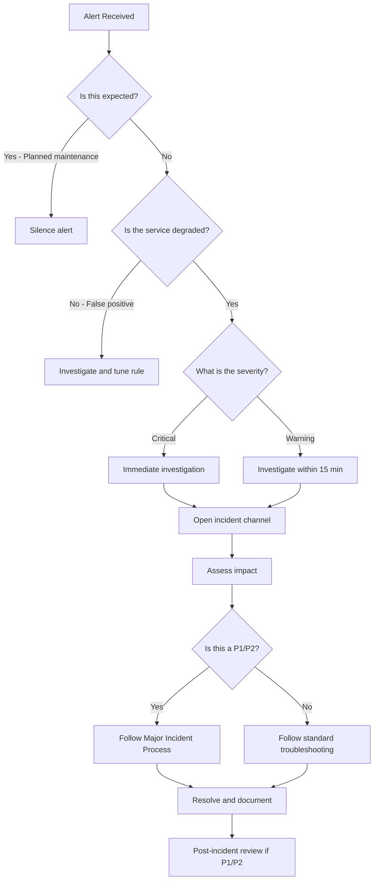

---

## 28. Incident Response

### 28.1 Incident Lifecycle

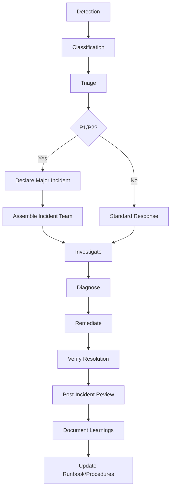

### 28.2 Incident Response Principles

1. **Detect early.** Automated monitoring detects most incidents. Manual reports from users are also valid detection sources.
2. **Classify quickly.** Determine severity within 5 minutes of detection.
3. **Communicate proactively.** Update stakeholders at least every 30 minutes during active incidents.
4. **Contain first, diagnose second.** Stop the bleeding before finding root cause.
5. **Escalate without hesitation.** If in doubt, escalate. Over-communication is better than under-communication.
6. **Preserve evidence.** Do not destroy logs, metrics, or audit trails while investigating.
7. **Verify resolution.** Confirm the issue is resolved and not just masked.
8. **Learn from every incident.** Every P1/P2 produces a post-incident review.

### 28.3 Incident Response Roles

| Role                          | Responsibilities                                         |
|-------------------------------|----------------------------------------------------------|
| Incident Commander (IC)       | Owns the incident; coordinates response; makes decisions |
| Technical Lead                | Leads investigation and remediation                      |
| Communications Lead           | Updates stakeholders; manages status page                |
| Scribe                        | Documents timeline, actions, and decisions                |
| Subject Matter Expert (SME)   | Provides deep expertise for specific subsystems          |

### 28.4 Incident Response Checklist

| # | Step                                          | Details                                              |
|---|-----------------------------------------------|------------------------------------------------------|
| 1 | Acknowledge the alert                         | Within 5 minutes of page                             |
| 2 | Open incident channel                         | Create `#incident-YYYY-MM-DD-description` Slack channel |
| 3 | Assign roles                                  | IC, Tech Lead, Comms, Scribe                         |
| 4 | Classify severity                             | P1, P2, P3, or P4 (see Section 29)                   |
| 5 | Post initial status update                    | What happened, what's impacted, who's working on it  |
| 6 | Begin investigation                           | Gather logs, metrics, recent changes                 |
| 7 | Identify root cause (if possible)             | Correlate timeline of events                         |
| 8 | Implement mitigation                          | Fix the issue, or apply workaround                   |
| 9 | Verify resolution                             | Confirm metrics are returning to normal              |
| 10| Post resolution update                        | Issue resolved; services restored                    |
| 11| Schedule post-incident review                 | Within 48 hours for P1/P2                            |
| 12| Complete post-incident report                 | Within 5 business days of incident                   |

### 28.5 Common Incident Scenarios

| Scenario                        | Detection Source       | Initial Response                                    | Escalation                |
|---------------------------------|------------------------|-----------------------------------------------------|---------------------------|
| API service down                | Health check alert     | Check pod status; restart if needed                 | SRE Lead if > 15 min      |
| Database primary failure        | Replication lag alert  | Verify auto-failover occurred; check replica health | DBA + SRE Lead            |
| GPU failure                     | GPU metrics alert      | Check nvidia-smi; restart inference pod             | AI team + SRE             |
| Camera stream mass disconnect   | Gateway alert          | Check network; restart gateway pods                 | Network team + SRE        |
| Evidence storage full           | Disk usage alert       | Archive old evidence; expand if needed              | SRE Lead                  |
| Security breach detected        | Security alert         | Isolate affected systems; notify CISO               | Security team + CISO      |
| Certificate expiry imminent     | Certificate alert      | Renew certificate; check auto-renewal               | SRE Lead                  |
| Memory exhaustion (OOM)         | Pod OOMKilled event    | Check limits; increase if needed; restart           | SRE                       |
| Network partition               | Connectivity alert     | Check cross-zone connectivity; failover if needed   | Network team + SRE Lead   |
| Data corruption                 | Application errors     | Stop writes; assess extent; recover from backup     | DBA + SRE Lead + CISO     |

---

## 29. Severity Classification

### 29.1 Severity Definitions

| Severity | Name        | Description                                                                 | Impact                                              | Examples                                                          |
|----------|-------------|-----------------------------------------------------------------------------|------------------------------------------------------|--------------------------------------------------------------------|
| P1       | Critical    | Complete platform outage or security breach with active data exfiltration   | Security monitoring is offline; evidence at risk      | All APIs down; database primary failure with no failover; active breach |
| P2       | Major       | Significant service degradation affecting core security functions           | Detection capabilities degraded; partial data loss   | AI inference offline; multiple camera streams lost; evidence storage full |
| P3       | Minor       | Non-critical service degradation or performance issue                       | Reduced operational efficiency; no data loss         | Dashboard slow; non-critical alerts failing; single camera offline |
| P4       | Low         | Cosmetic issue, informational alert, or minor inconvenience                | Minimal operational impact                           | UI display bug; informational log anomaly; documentation issue    |

### 29.2 Severity Decision Tree

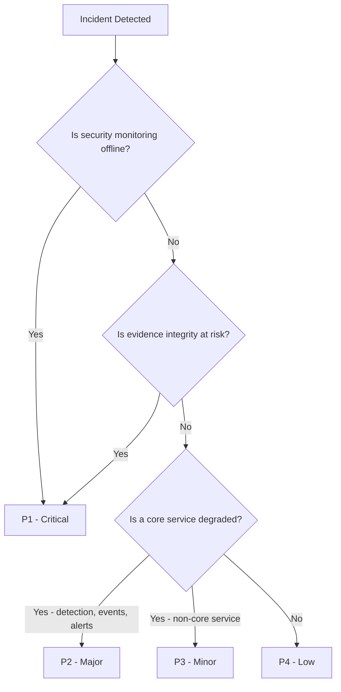

### 29.3 Service-to-Severity Mapping

| Service Affected               | Single Instance Failure | Multiple Instance Failure | Complete Outage |
|--------------------------------|------------------------|---------------------------|-----------------|
| Axum API                       | P3                     | P2                        | P1              |
| AI Inference Service           | P3                     | P2                        | P1              |
| Camera Gateway                 | P3                     | P2                        | P1              |
| PostgreSQL                     | P2 (if failover works) | P1                        | P1              |
| Redis                          | P3 (if failover works) | P2                        | P2              |
| Next.js Dashboard              | P4                     | P3                        | P3              |
| Prometheus                     | P3                     | P2                        | P2              |
| Grafana                        | P4                     | P3                        | P3              |
| Loki                           | P3                     | P3                        | P2              |
| Evidence Storage               | P2                     | P1                        | P1              |

---

## 30. Major Incident Process

### 30.1 Major Incident Definition

An incident is classified as **Major** if any of the following are true:

- Classified as P1 or P2
- Affects more than one Tier 1 service simultaneously
- Involves a security breach or unauthorized access
- Results in evidence integrity compromise
- Triggers the disaster recovery process
- Requires involvement of more than 3 team members

### 30.2 Major Incident Timeline

| Phase                 | Time Target     | Activities                                                |
|-----------------------|-----------------|-----------------------------------------------------------|
| Detection             | 0 minutes       | Alert fires or user reports issue                         |
| Acknowledgment        | < 5 minutes     | On-call engineer acknowledges; begins investigation       |
| Classification        | < 5 minutes     | Determine severity; open incident channel                 |
| Declaration           | < 10 minutes     | IC declares major incident; assembles team                |
| Initial Communication | < 15 minutes     | Status page updated; stakeholders notified                |
| Investigation         | Ongoing          | Root cause investigation; mitigation attempts             |
| Updates               | Every 30 min     | Status updates to stakeholders                            |
| Mitigation            | Varies           | Issue contained or service restored                       |
| Resolution            | Varies           | All services confirmed healthy; monitoring stable         |
| All-Clear             | < 15 min after resolution | Status page updated; stakeholders notified      |
| Post-Incident Review  | Within 48 hours  | Blameless review meeting scheduled                        |
| Post-Incident Report  | Within 5 days    | Written report with root cause, timeline, actions         |

### 30.3 Major Incident Checklist

| # | Step                                          | Owner          | Completed |
|---|-----------------------------------------------|----------------|-----------|
| 1 | Acknowledge alert within 5 minutes            | On-Call SRE    | [ ]       |
| 2 | Open incident Slack channel                   | On-Call SRE    | [ ]       |
| 3 | Assign Incident Commander                     | SRE Team Lead  | [ ]       |
| 4 | Assign Technical Lead                         | IC             | [ ]       |
| 5 | Assign Communications Lead                    | IC             | [ ]       |
| 6 | Assign Scribe                                 | IC             | [ ]       |
| 7 | Post initial status in incident channel       | Comms Lead     | [ ]       |
| 8 | Update status page                            | Comms Lead     | [ ]       |
| 9 | Notify executive stakeholders                 | Comms Lead     | [ ]       |
| 10| Begin investigation                           | Tech Lead      | [ ]       |
| 11| Identify mitigation strategy                  | Tech Lead      | [ ]       |
| 12| Implement mitigation                          | Tech Lead      | [ ]       |
| 13| Verify resolution                             | Tech Lead      | [ ]       |
| 14| Post resolution update                        | Comms Lead     | [ ]       |
| 15| Update status page to resolved                | Comms Lead     | [ ]       |
| 16| Schedule post-incident review                 | IC             | [ ]       |
| 17| Assign post-incident report author            | IC             | [ ]       |
| 18| Close incident channel (after 7 days)         | IC             | [ ]       |

### 30.4 Major Incident Communication Template

**Initial Notification:**

> **[VigilantAI Major Incident — P{X}]**
>
> **Summary:** {Brief description of the issue}
>
> **Impact:** {What services/functions are affected}
>
> **Status:** Investigating / Identified / Mitigating / Monitoring / Resolved
>
> **Current Action:** {What the team is doing}
>
> **Next Update:** {Time of next update, typically 30 minutes}
>
> **Incident Commander:** {Name}

---

## 31. Escalation Matrix

### 31.1 Technical Escalation

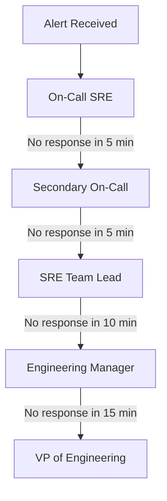

### 31.2 Escalation Matrix

| Escalation Level | Trigger                                    | Contact                         | Method         | Response SLA |
|------------------|--------------------------------------------|---------------------------------|----------------|--------------|
| L1               | Initial alert                              | Primary On-Call SRE             | PagerDuty      | 5 minutes    |
| L2               | L1 no response in 5 min                    | Secondary On-Call SRE           | PagerDuty      | 5 minutes    |
| L3               | L2 no response in 5 min OR P1 declared     | SRE Team Lead                   | Phone + Slack  | 10 minutes   |
| L4               | L3 no response in 10 min OR P1 > 30 min    | Engineering Manager             | Phone + Slack  | 15 minutes   |
| L5               | L4 no response in 15 min OR P1 > 1 hour    | VP of Engineering               | Phone          | 30 minutes   |
| L6               | Security breach / data exfiltration         | CISO                            | Phone          | 15 minutes   |
| L7               | External communication required            | VP of Engineering + Legal       | Phone          | 30 minutes   |

### 31.3 Functional Escalation

| Domain                          | Primary Contact               | Secondary Contact              | When to Escalate                            |
|---------------------------------|-------------------------------|--------------------------------|---------------------------------------------|
| Database (PostgreSQL)           | DBA On-Call                   | SRE Team Lead                  | Replication failure, data corruption        |
| AI / Machine Learning           | ML Engineering Lead           | AI Service On-Call              | Model failure, GPU hardware issues          |
| Networking                      | Network Engineering           | Infrastructure Lead            | Network partition, DNS failure              |
| Security                        | Security Operations Lead      | CISO                           | Security breach, evidence tampering         |
| Storage                         | Infrastructure Lead           | SRE Team Lead                  | Storage failure, RAID degradation           |
| Kubernetes                     | Platform Engineering          | SRE Team Lead                  | Cluster failure, etcd issues                |

---

## 32. Communication Plan

### 32.1 Communication Channels

| Channel                      | Purpose                                    | Audience                     | Update Frequency (Active Incident) |
|------------------------------|--------------------------------------------|------------------------------|------------------------------------|
| `#ops-status`                | Platform status updates                    | All engineering              | Every 30 minutes                   |
| `#ops-alerts`                | Automated alert notifications              | SRE team                     | Real-time                          |
| `#ops-handover`              | Shift handover notes                       | SRE team                     | At shift change                    |
| `#incident-YYYY-MM-DD-desc`  | Active major incident coordination         | Incident team                | As needed (real-time)              |
| PagerDuty                    | Critical alert paging                      | On-call engineer             | Real-time                          |
| Email (ops-announce)         | Non-urgent operational announcements       | All engineering              | As needed                          |
| Status Page (external)       | External-facing service status             | Customers / stakeholders     | Every 30 minutes during incidents  |
| Bridge Call (Zoom)           | Real-time incident coordination            | Incident team                | During active P1/P2 incidents      |

### 32.2 Stakeholder Notification Matrix

| Stakeholder                      | P1 Notification | P2 Notification | P3/P4 Notification | Status Updates |
|----------------------------------|-----------------|-----------------|---------------------|----------------|
| SRE Team                         | Immediate       | 15 minutes      | Next business day   | Every 30 min   |
| Engineering Manager              | 15 minutes      | 1 hour          | Daily summary       | Every 1 hour   |
| VP of Engineering                | 30 minutes      | 4 hours         | Weekly summary      | Every 2 hours  |
| CISO (security incidents)        | 15 minutes      | 1 hour          | Daily summary       | Every 1 hour   |
| Product Management               | 1 hour          | 4 hours         | Weekly summary      | Every 2 hours  |
| Customer Success                 | 1 hour          | 4 hours         | As needed           | Every 2 hours  |
| External Customers               | 2 hours         | 8 hours         | As needed           | Every 4 hours  |

### 32.3 Communication Cadence by Severity

| Severity | Initial Comms | Updates During Incident | Resolution Comms | Post-Incident Comms |
|----------|---------------|------------------------|------------------|---------------------|
| P1       | 15 min        | Every 30 min           | Within 15 min    | Within 48 hours     |
| P2       | 30 min        | Every 1 hour           | Within 30 min    | Within 48 hours     |
| P3       | 4 hours       | Every 4 hours          | Within 4 hours   | As needed           |
| P4       | Next business day | As needed          | Next business day| Not required        |

---

## 33. Disaster Recovery

### 33.1 Recovery Objectives

| Metric                       | Target          | Justification                                    |
|------------------------------|-----------------|--------------------------------------------------|
| RTO (Recovery Time Objective)| 4 hours         | Security monitoring cannot be offline long-term  |
| RPO (Recovery Point Objective)| 1 hour          | Maximum acceptable data loss                      |
| MTTR (Mean Time to Recovery) | 2 hours         | Target for P1 incidents                           |
| Availability target          | 99.9%           | Security platform operational SLA                 |
| Backup verification          | Weekly          | Ensure recoverability                             |
| DR test frequency            | Quarterly       | Validate DR readiness                             |

### 33.2 Disaster Recovery Flow

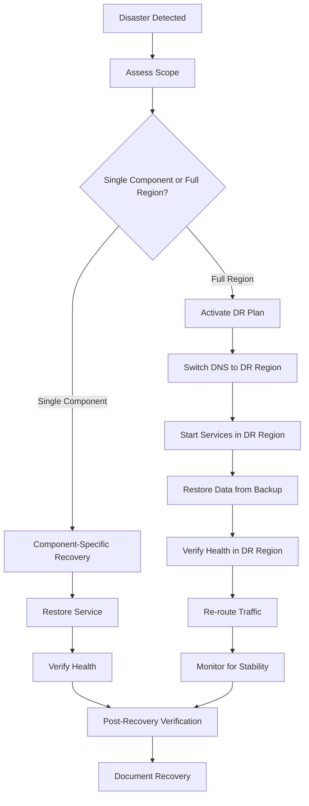

### 33.3 Recovery Procedures by Scenario

| Scenario                      | Detection                           | Immediate Response                           | Recovery Procedure                                | Estimated Time |
|-------------------------------|--------------------------------------|----------------------------------------------|----------------------------------------------------|----------------|
| Single service crash          | Health check failure                 | Automatic container restart                  | Service resumes automatically                      | 1 minute       |
| Single node failure           | Node unreachable                     | Load balancer removes node                   | Replace node; redeploy services                    | 30 minutes     |
| Database primary failure      | Replication monitoring alert         | Automatic replica promotion (Patroni/Repgmr) | Rebuild primary; establish new replication         | 30 minutes     |
| Redis primary failure         | Sentinel failover alert              | Automatic Sentinel failover                   | Verify new primary; rebuild old primary            | 10 minutes     |
| Evidence storage failure      | Disk I/O alert                       | Switch to backup storage mount                | Restore from S3 backup                             | 2 hours        |
| Network partition             | Cross-zone connectivity loss         | Cross-zone failover                          | Restore connectivity; rebalance                     | 1 hour         |
| Full region outage            | All health checks failing            | Activate DR region                           | Failover to DR; restore from backup               | 4 hours        |
| Complete security compromise  | Security incident detected           | Isolate, wipe, rebuild                       | Restore from last known good backup                | 4+ hours       |

### 33.4 DR Testing

| Test Type                     | Frequency   | Scope                                          | Success Criteria                                  |
|-------------------------------|-------------|-------------------------------------------------|----------------------------------------------------|
| Backup restore test           | Monthly     | Restore random database backup                  | Data integrity verified                            |
| Evidence restore test         | Monthly     | Restore random evidence file from backup        | Hash matches original                              |
| Component failover test       | Quarterly   | Simulate failure of each HA component           | Failover completes within RTO                      |
| Full DR activation            | Annually    | Activate DR region; run full platform           | Platform operational in DR within RTO              |
| Chaos engineering             | Quarterly   | Inject random failures using Chaos Monkey/Litmus| System self-heals or degrades gracefully           |

---

## 34. Backup Strategy

### 34.1 Backup Schedule

| Data                    | Method          | Frequency     | Retention       | Storage Location        | Verification     |
|-------------------------|-----------------|---------------|-----------------|-------------------------|------------------|
| PostgreSQL (full)       | pg_dump         | Daily 02:00   | 30 days         | Local + S3              | Weekly restore   |
| PostgreSQL (incremental)| WAL archiving   | Continuous    | 7 days          | Local + S3              | Daily check      |
| PostgreSQL (snapshot)   | pg_basebackup   | Weekly Sun    | 4 weeks         | S3                      | Monthly restore  |
| Redis                   | RDB snapshot    | Every 15 min  | 24 hours        | Local                   | Weekly verify    |
| Evidence storage        | Incremental     | Daily 01:00   | 90 days         | S3                      | Weekly hash check|
| Evidence storage (full) | Full backup     | Weekly Sun    | 12 weeks        | S3                      | Monthly restore  |
| Configuration files     | Git + snapshot  | On change     | Indefinite      | Git + S3                | —                |
| Kubernetes manifests    | etcd snapshot   | Daily 03:00   | 30 days         | Local + S3              | Monthly restore  |
| TLS certificates        | Manual export   | On renewal    | Until renewal   | Secrets manager + S3    | —                |
| Grafana dashboards      | API export      | Daily 04:00   | 30 days         | S3                      | —                |
| Prometheus rules        | Git versioned   | On change     | Indefinite      | Git                     | —                |

### 34.2 Backup Verification Checklist

| # | Check                                         | Expected Result                     |
|---|-----------------------------------------------|--------------------------------------|
| 1 | Backup file exists and is non-zero size        | File present, size matches estimate |
| 2 | Backup file is not corrupt                     | Restore command completes without error |
| 3 | Restored data matches source data              | Row counts match; checksums match    |
| 4 | Restored database accepts connections          | `pg_isready` returns success         |
| 5 | Evidence file hash matches original            | SHA-256 hashes identical             |
| 6 | Backup metadata logged                         | Backup ID, time, size recorded       |
| 7 | S3 replication confirmed                       | Object visible in secondary region   |

### 34.3 Backup Monitoring

| Alert                          | Condition                                    | Severity   |
|--------------------------------|----------------------------------------------|------------|
| BackupFailed                   | Scheduled backup did not complete             | Critical   |
| BackupSizeAnomaly              | Backup size differs by > 50% from average    | Warning    |
| BackupDurationAnomaly          | Backup takes > 200% of average duration      | Warning    |
| WALArchiveLag                  | WAL archive lag > 1 hour                      | Warning    |
| WALArchiveLagCritical          | WAL archive lag > 4 hours                     | Critical   |
| S3ReplicationLag               | Cross-region replication lag > 1 hour         | Warning    |

---

## 35. Restore Procedures

### 35.1 Restore Decision Tree

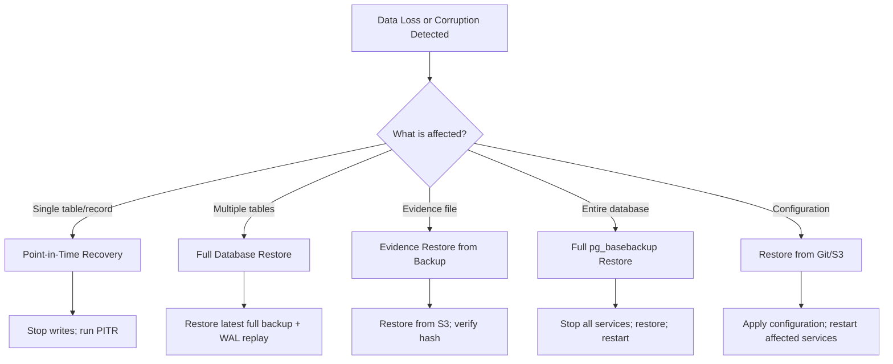

### 35.2 Restore Procedures

#### PostgreSQL Point-in-Time Restore

| Step | Action                                                              |
|------|---------------------------------------------------------------------|
| 1    | Stop all application writes (set API to maintenance mode)           |
| 2    | Create a safety backup of current state (even if corrupted)         |
| 3    | Identify target recovery time from incident timeline                |
| 4    | Download the most recent full backup before target time             |
| 5    | Configure `recovery_target_time` in PostgreSQL                      |
| 6    | Start PostgreSQL in recovery mode                                   |
| 7    | Monitor recovery progress (check logs for WAL replay progress)      |
| 8    | Verify data integrity at recovery point (row counts, key queries)  |
| 9    | Promote database to read-write                                      |
| 10   | Rebuild replicas from recovered primary                             |
| 11   | Resume application writes                                            |
| 12   | Verify application functionality end-to-end                          |

#### PostgreSQL Full Restore

| Step | Action                                                              |
|------|---------------------------------------------------------------------|
| 1    | Stop all application services                                       |
| 2    | Stop PostgreSQL primary                                             |
| 3    | Back up current data directory (for investigation)                  |
| 4    | Restore from latest `pg_basebackup`                                |
| 5    | Configure WAL replay from archive                                   |
| 6    | Start PostgreSQL and verify recovery                                |
| 7    | Verify data integrity                                               |
| 8    | Start application services in order (Section 13)                    |
| 9    | Verify full platform health                                         |

#### Evidence File Restore

| Step | Action                                                              |
|------|---------------------------------------------------------------------|
| 1    | Identify the evidence file(s) to restore                           |
| 2    | Locate backup in S3 by file ID or timestamp                        |
| 3    | Download backup file to local evidence storage                      |
| 4    | Compute SHA-256 hash of restored file                               |
| 5    | Compare hash against the hash stored in the database                |
| 6    | If hashes match, restore is successful                              |
| 7    | If hashes do not match, try alternate backup version                |
| 8    | Update database record to reflect restored file location            |
| 9    | Log restoration in audit trail                                      |

### 35.3 Restore Verification Checklist

| # | Check                                         | Expected Result                     |
|---|-----------------------------------------------|--------------------------------------|
| 1 | Restored service starts without errors         | No ERROR or PANIC in logs            |
| 2 | Application connects to restored database      | Connection pool established           |
| 3 | Data integrity checks pass                     | Row counts, checksums match          |
| 4 | Evidence hashes match originals                | SHA-256 identical                     |
| 5 | Application functionality works end-to-end     | Login, search, evidence access work  |
| 6 | Monitoring confirms healthy state              | All metrics within normal range      |
| 7 | Audit trail documents the restore              | Restore event logged                  |

---

## 36. Business Continuity

### 36.1 Business Continuity Objectives

| Objective                       | Target                                                |
|---------------------------------|-------------------------------------------------------|
| Security monitoring continuity  | No more than 4 hours of unplanned downtime per year  |
| Evidence preservation           | Zero evidence loss or corruption                      |
| Audit trail continuity          | No gaps in audit log coverage                         |
| User access                     | Dashboard available 99.9% of time                     |
| Camera stream processing        | < 1% frame loss during any single incident            |

### 36.2 Continuity Strategies

| Risk                              | Strategy                                            | RTO     | RPO     |
|-----------------------------------|-----------------------------------------------------|---------|---------|
| Single service failure           | Kubernetes auto-restart; rolling update              | 1 min   | 0       |
| Single node failure              | Kubernetes rescheduling; LB removal                  | 5 min   | 0       |
| Database failure                 | Automatic failover to replica                        | 30 min  | 1 hour  |
| Storage failure                  | Failover to backup storage; restore from S3          | 2 hours | 6 hours |
| Network failure (single zone)    | Cross-zone failover                                 | 5 min   | 0       |
| Full region outage               | DR region activation                                | 4 hours | 1 hour  |
| Security compromise              | Isolation, wipe, rebuild, restore                    | 4 hours | 1 hour  |
| Complete data loss               | Full restore from offsite backup                     | 4 hours | 1 hour  |

### 36.3 Essential Functions During Outage

During a platform outage, the following functions must be maintained or quickly restored:

| Priority | Function                          | Minimum Viable Capability                         |
|----------|-----------------------------------|----------------------------------------------------|
| 1        | Camera video recording            | Cameras continue recording to local NVR            |
| 2        | Alert generation                  | At minimum, health check alerts operational         |
| 3        | Evidence chain of custody         | Existing evidence remains intact and verifiable     |
| 4        | Security monitoring               | At minimum, one camera stream with AI detection     |
| 5        | Event logging                     | At minimum, application audit logs captured         |
| 6        | User access (dashboard)           | Read-only access to recent events and evidence      |

---

## 37. High Availability Operations

### 37.1 HA Component Matrix

| Component              | Redundancy Level   | Instances  | Failover Mode        | Failover Time |
|------------------------|--------------------|------------|----------------------|---------------|
| Load Balancer          | Active-Passive     | 2          | Automatic            | < 30 seconds  |
| Axum API               | Active-Active      | 2–4        | Automatic (K8s)      | < 10 seconds  |
| Camera Gateway         | Active-Active      | 2          | Automatic (K8s)      | < 10 seconds  |
| AI Inference           | Active-Active      | 2–4        | Automatic (K8s)      | < 10 seconds  |
| Next.js Dashboard      | Active-Active      | 2          | Automatic (K8s)      | < 10 seconds  |
| PostgreSQL             | Primary + Replica  | 2          | Automatic (Patroni)  | < 30 seconds  |
| Redis                  | Primary + Replica  | 2          | Automatic (Sentinel) | < 10 seconds  |
| Redis Sentinel         | Quorum             | 3          | Leader election      | < 10 seconds  |
| Evidence Storage       | RAID 10            | 2+         | RAID rebuild         | < 1 hour      |
| Prometheus             | Single + Backup    | 1+1        | Manual switch        | < 15 minutes  |
| Grafana                | Single             | 1          | Restart              | < 5 minutes   |

### 37.2 HA Health Monitoring

| Check                              | Tool           | Interval | Failure Action                                |
|------------------------------------|----------------|----------|-----------------------------------------------|
| Load balancer health               | Blackbox       | 5s       | Failover to passive LB                        |
| API pod health                     | K8s probes     | 10s      | K8s restarts pod                              |
| PostgreSQL replication status      | pg_exporter    | 10s      | Alert; verify Patroni failover                |
| Redis Sentinel status              | redis_exporter | 10s      | Alert; verify Sentinel failover               |
| Node health                        | node_exporter  | 15s      | K8s drains node; reschedules pods             |
| Disk RAID health                   | smartctl       | 60s      | Alert; schedule replacement                   |

### 37.3 HA Verification Procedures

After any failover event:

| # | Check                                         | Expected Result                     |
|---|-----------------------------------------------|--------------------------------------|
| 1 | Affected service is healthy                   | Health check returns HTTP 200        |
| 2 | Traffic is flowing to new instance             | Load balancer shows active connections|
| 3 | Database writes are succeeding                 | Application can write new data       |
| 4 | Database reads are succeeding                  | Application can read data            |
| 5 | Redis is accepting commands                    | Cache reads and writes succeed       |
| 6 | Prometheus is scraping new target              | Target status is UP                  |
| 7 | No new alerts are firing                       | Alertmanager shows 0 new alerts      |
| 8 | Evidence writes are succeeding                 | New evidence can be stored           |
| 9 | Camera streams are processing                  | Frame rate is normal                 |
| 10| Monitor for 30 minutes                         | No anomalies detected                |

---

## 38. Scaling Procedures

### 38.1 Scaling Workflow

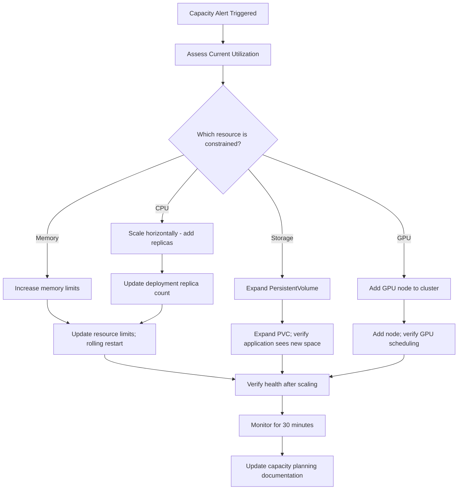

### 38.2 Scaling Procedures by Service

| Service               | Scale Direction    | Trigger                                   | Procedure                                          |
|-----------------------|--------------------|--------------------------------------------|----------------------------------------------------|
| Axum API              | Horizontal (pods)  | CPU > 70% sustained 5 min                  | Increase replicas; verify health                   |
| AI Inference          | Horizontal (pods)  | GPU > 85% sustained 5 min                  | Add GPU node; increase replicas                    |
| Camera Gateway        | Horizontal (pods)  | Frame drop rate > 2% sustained             | Add gateway pod; redistribute camera assignments   |
| Next.js Dashboard     | Horizontal (pods)  | CPU > 70% sustained 5 min                  | Increase replicas                                  |
| PostgreSQL            | Vertical           | CPU > 70% or memory > 80%                  | Increase resource limits; rolling restart          |
| PostgreSQL            | Horizontal (reads) | Read latency > 200ms p99                   | Add read replica                                   |
| Redis                 | Vertical           | Memory > 80%                               | Increase maxmemory; rolling restart                |
| Evidence Storage      | Volume expansion   | Usage > 75%                                | Expand PVC; verify mount                           |
| Prometheus            | Volume expansion   | Usage > 75%                                | Expand PVC; restart if needed                      |
| Loki                  | Volume expansion   | Usage > 75%                                | Expand PVC; restart if needed                      |

### 38.3 Camera Fleet Scaling Tiers

| Tier        | Cameras | API Instances | Gateway Pods | AI Pods    | GPU Nodes | Evidence Storage |
|-------------|---------|---------------|--------------|------------|-----------|------------------|
| Small       | 1–25    | 2             | 1            | 1          | 1         | 5 TB             |
| Medium      | 26–100  | 3             | 2            | 2          | 1         | 20 TB            |
| Large       | 101–500 | 4             | 3            | 4          | 2         | 50 TB            |
| Enterprise  | 501+    | 6+            | 4+           | 6+         | 3+        | 100 TB+          |

---

## 39. Capacity Planning

### 39.1 Capacity Metrics to Track

| Metric                              | Source            | Collection Frequency | Projection Method     |
|--------------------------------------|-------------------|----------------------|------------------------|
| CPU utilization per node             | node_exporter     | Continuous           | 30-day linear trend    |
| Memory utilization per node          | node_exporter     | Continuous           | 30-day linear trend    |
| Disk usage (all volumes)             | node_exporter     | Continuous           | 30-day linear trend    |
| Evidence storage growth rate         | Custom metric     | Daily                | 30-day linear trend    |
| Database size                        | pg_exporter       | Daily                | 30-day linear trend    |
| API request rate                     | Prometheus        | Continuous           | 30-day linear trend    |
| AI inference throughput              | Prometheus        | Continuous           | 30-day linear trend    |
| Camera count (active streams)        | Gateway metrics   | Continuous           | Quarterly projection   |
| Connection pool utilization          | pg_exporter       | Continuous           | 7-day trend            |
| Kubernetes pod count                 | kube-state-metrics| Continuous           | 30-day linear trend    |

### 39.2 Capacity Thresholds

| Resource              | Warning Threshold | Critical Threshold | Action                           |
|-----------------------|-------------------|--------------------|------------------------------------|
| CPU (cluster-wide)    | 70% average       | 85% average        | Add nodes or scale services        |
| Memory (cluster-wide) | 75% average       | 90% average        | Add nodes or increase limits       |
| Disk (any volume)     | 75% used          | 85% used           | Expand volume or archive data      |
| Evidence storage      | 75% used          | 85% used           | Archive old evidence; expand       |
| Database size         | 75% of allocated  | 85% of allocated   | Archive old data; expand storage   |
| API connections       | 80% of pool max   | 90% of pool max    | Increase pool size or add replicas |
| GPU memory            | 80% used          | 90% used           | Add GPU capacity or optimize model |
| Pod count             | 80% of quota      | 90% of quota       | Request quota increase             |

### 39.3 Capacity Planning Reviews

| Review Type              | Frequency    | Participants                        | Output                       |
|--------------------------|-------------|--------------------------------------|------------------------------|
| Weekly capacity check    | Weekly      | On-Call SRE                         | Capacity status report        |
| Monthly capacity review  | Monthly     | SRE Lead, Platform Engineering      | Capacity forecast             |
| Quarterly capacity plan  | Quarterly   | SRE Lead, Platform Eng, Management  | Procurement plan              |
| Post-incident capacity   | After P1/P2 | SRE Team                            | Capacity gap analysis         |

---

## 40. Performance Monitoring

### 40.1 Performance Baselines

| Metric                              | Baseline (Typical)     | Alert Threshold    |
|--------------------------------------|------------------------|--------------------|
| API request latency (p50)            | 50–100ms               | > 200ms            |
| API request latency (p95)            | 100–250ms              | > 500ms            |
| API request latency (p99)            | 250–500ms              | > 1000ms           |
| AI inference latency (p99)           | 50–150ms               | > 500ms            |
| Camera frame processing latency      | 10–50ms                | > 200ms            |
| PostgreSQL query latency (p95)       | 10–50ms                | > 200ms            |
| Redis command latency (p95)          | 1–5ms                  | > 20ms             |
| WebSocket message latency            | 10–50ms                | > 200ms            |
| Dashboard page load time             | 1–3 seconds            | > 5 seconds        |

### 40.2 Performance Investigation Procedure

| Step | Action                                                              |
|------|---------------------------------------------------------------------|
| 1    | Identify the affected metric (latency, throughput, error rate)      |
| 2    | Check Grafana dashboards for the specific service                  |
| 3    | Correlate with recent changes (deployments, config changes)         |
| 4    | Check resource utilization (CPU, memory, disk, network)            |
| 5    | Check dependency health (database, Redis, downstream services)     |
| 6    | Review application logs for errors or warnings                      |
| 7    | Check for unusual traffic patterns (spikes, DDoS)                  |
| 8    | Profile application if needed (CPU flame graph, memory profile)    |
| 9    | Identify root cause                                                |
| 10   | Implement fix or mitigation                                        |
| 11   | Verify performance returns to baseline                              |

### 40.3 Performance Optimization Checklist

| Area                      | Optimization                                        |
|---------------------------|-----------------------------------------------------|
| API latency               | Review slow queries; add caching; optimize handlers |
| AI inference              | Optimize batch size; model quantization; GPU tuning |
| Database                  | Add indexes; vacuum; analyze; connection pooling    |
| Redis                     | Optimize key patterns; adjust TTL; increase memory  |
| Network                   | Check bandwidth; optimize TLS; HTTP/2 multiplexing  |
| Storage                   | Upgrade to SSD; RAID optimization; tiered storage   |
| Kubernetes                | Resource tuning; HPA configuration; pod affinity    |

---

## 41. Resource Optimization

### 41.1 Resource Right-Sizing

| Service               | Current Request | Current Limit | Recommended Action                   |
|------------------------|-----------------|---------------|--------------------------------------|
| Axum API               | 500m / 512Mi    | 2000m / 2Gi   | Monitor; right-size quarterly        |
| AI Inference           | 1000m / 2Gi     | 4000m / 8Gi   | GPU-bound; optimize batch size       |
| Camera Gateway         | 500m / 512Mi    | 2000m / 2Gi   | Monitor; right-size quarterly        |
| Next.js Dashboard      | 250m / 256Mi    | 1000m / 1Gi   | Low usage; consider reducing         |
| PostgreSQL             | 1000m / 2Gi     | 4000m / 16Gi  | CPU-bound during vacuum; monitor     |
| Redis                  | 500m / 1Gi      | 2000m / 4Gi   | Memory-bound; monitor eviction rate  |
| Prometheus             | 1000m / 2Gi     | 2000m / 8Gi   | Increase if scrape targets grow      |
| Grafana                | 250m / 256Mi    | 1000m / 1Gi   | Low usage; current sizing sufficient |
| Loki                   | 500m / 1Gi      | 2000m / 4Gi   | Increase if log volume grows         |

### 41.2 Cost Optimization Strategies

| Strategy                        | Description                                               | Savings   |
|---------------------------------|-----------------------------------------------------------|-----------|
| Right-sizing                    | Match resource requests to actual usage                   | 15–30%    |
| Node autoscaling                | Add/remove nodes based on demand                          | 10–20%    |
| Spot/preemptible instances      | Use for non-critical workloads (monitoring, staging)      | 50–70%    |
| Reserved capacity               | Commit to 1-year for production nodes                     | 20–40%    |
| Storage tiering                 | Move cold evidence to cheaper storage tiers               | 30–50%    |
| Image optimization              | Slim container base images                                | 5–10%     |
| Idle resource cleanup           | Remove unused PVCs, services, endpoints                   | 5–10%     |

---

## 42. Certificate Management

### 42.1 Certificate Inventory

| Certificate                | Issuer          | Expiry       | Auto-Renew | Renewal Method              |
|----------------------------|-----------------|--------------|------------|-----------------------------|
| *.vigilantai.com           | Let's Encrypt   | 90 days      | Yes        | cert-manager                |
| API internal TLS           | Internal CA     | 1 year       | No         | Manual renewal              |
| PostgreSQL TLS             | Internal CA     | 1 year       | No         | Manual renewal              |
| Redis TLS                  | Internal CA     | 1 year       | No         | Manual renewal              |
| Inter-service mTLS         | Internal CA     | 1 year       | No         | Manual renewal              |
| Evidence storage TLS       | Internal CA     | 1 year       | No         | Manual renewal              |
| Monitoring internal TLS    | Internal CA     | 1 year       | No         | Manual renewal              |

### 42.2 Certificate Monitoring

| Alert                          | Condition                                   | Severity   | Response   |
|--------------------------------|---------------------------------------------|------------|------------|
| CertificateExpiringSoon        | Expires within 30 days                      | Warning    | Plan renewal|
| CertificateExpiringCritical    | Expires within 7 days                       | Critical   | Renew now  |
| CertificateExpired             | Certificate has expired                     | Critical   | Immediate  |
| cert-managerRenewalFailed      | Auto-renewal attempt failed                 | Critical   | Manual renewal |

### 42.3 Certificate Renewal Procedure

| Step | Action                                                              |
|------|---------------------------------------------------------------------|
| 1    | Check current certificate expiry date                              |
| 2    | For auto-renewed certs (cert-manager): check cert-manager logs     |
| 3    | For manual certs: generate new CSR                                  |
| 4    | Submit CSR to internal CA or Let's Encrypt                         |
| 5    | Receive signed certificate                                          |
| 6    | Update Kubernetes Secret with new certificate                       |
| 7    | Rolling restart affected services to pick up new certificate       |
| 8    | Verify TLS handshake works with new certificate                    |
| 9    | Monitor for 15 minutes to confirm no errors                        |
| 10   | Log certificate renewal in operations log                           |

---

## 43. Secret Rotation

### 43.1 Secret Inventory

| Secret                          | Storage Location     | Rotation Frequency | Auto-Rotate | Impact of Expiry               |
|---------------------------------|----------------------|--------------------|-------------|--------------------------------|
| JWT Signing Key (RS256)        | Kubernetes Secret    | 30 days            | Yes         | All tokens invalid; users logged out |
| Database password               | Kubernetes Secret    | 90 days            | No          | All API connections fail       |
| Redis password                  | Kubernetes Secret    | 90 days            | No          | All cache operations fail      |
| Evidence storage encryption key | Kubernetes Secret    | 365 days           | No          | Cannot read encrypted evidence |
| Camera RTSP credentials         | Kubernetes Secret    | 90 days            | No          | Camera streams fail            |
| API integration tokens          | Database (RBAC)      | Per token config   | No          | API integrations fail          |
| TLS certificates                 | Kubernetes Secret    | Per cert (see §42) | Yes/No      | HTTPS fails; browser warnings  |
| SMTP credentials                | Kubernetes Secret    | 90 days            | No          | Alert emails fail              |
| S3 access keys                  | Kubernetes Secret    | 90 days            | No          | Backup/restore fails           |
| PagerDuty API key               | Kubernetes Secret    | 365 days           | No          | Alert routing fails            |

### 43.2 Secret Rotation Procedure

| Step | Action                                                              |
|------|---------------------------------------------------------------------|
| 1    | Generate new secret value (random 256-bit minimum)                 |
| 2    | Update the secret in the secrets manager / Kubernetes Secret       |
| 3    | Rolling restart affected services (one at a time)                  |
| 4    | Verify each service starts successfully with new secret            |
| 5    | Verify all dependent services are functioning                      |
| 6    | Invalidate old secret value                                        |
| 7    | Monitor for 15 minutes for authentication failures                |
| 8    | Log rotation in operations log with timestamp                      |

### 43.3 Secret Rotation Schedule

| Month    | Secrets to Rotate                                             |
|----------|---------------------------------------------------------------|
| January  | Database password, Redis password, Camera RTSP credentials    |
| February | JWT signing key, SMTP credentials                             |
| March    | S3 access keys, API integration tokens (audit)                |
| April    | Evidence storage encryption key (annual)                       |
| May      | Database password, Redis password, Camera RTSP credentials    |
| June     | JWT signing key, TLS internal certificates                    |
| July     | S3 access keys, SMTP credentials, PagerDuty API key (annual) |
| August   | Database password, Redis password, Camera RTSP credentials    |
| September| JWT signing key, API integration tokens (audit)               |
| October  | S3 access keys, SMTP credentials                              |
| November | Database password, Redis password, Camera RTSP credentials    |
| December | JWT signing key, Full annual secret review                     |

### 43.4 Secret Rotation Monitoring

| Alert                          | Condition                                    | Severity   |
|--------------------------------|----------------------------------------------|------------|
| JWTSigningKeyAging             | Key age > 25 days                            | Warning    |
| JWTSigningKeyExpiry            | Key age > 29 days                            | Critical   |
| SecretRotationOverdue          | Secret not rotated within expected window    | Warning    |
| AuthenticationFailureSpike     | > 10 auth failures in 1 minute after rotation| Warning    |

---

## 44. User Administration

### 44.1 User Lifecycle Operations

| Action                    | Procedure                                                              | Approver            |
|---------------------------|------------------------------------------------------------------------|---------------------|
| New user provisioning     | Create account; assign role; notify user; issue temporary password     | Security Admin      |
| User role change          | Verify authorization; update role; confirm new permissions             | Security Admin      |
| User deactivation         | Disable account; revoke active sessions; preserve audit trail          | Security Admin      |
| User reactivation         | Verify identity; re-enable account; issue new temporary password      | Security Admin      |
| Password reset            | Verify identity; generate reset link; enforce password policy         | Self-service / Admin|
| MFA reset                 | Verify identity; disable old MFA; enroll new MFA                      | Security Admin      |
| Account deletion          | Export data (if needed); archive; delete after retention period        | Security Admin + DBA|

### 44.2 User Administration Procedures

#### Create New User

| Step | Action                                                              |
|------|---------------------------------------------------------------------|
| 1    | Receive user creation request with manager approval                 |
| 2    | Verify request includes: name, email, required role, justification  |
| 3    | Create user account in the platform                                 |
| 4    | Assign appropriate RBAC role (see Section 45)                       |
| 5    | Generate temporary password (16+ chars, mixed case, numbers, symbols)|
| 6    | Send temporary credentials via secure channel                       |
| 7    | User must change password on first login                            |
| 8    | Verify user can log in and access appropriate resources             |
| 9    | Log user creation in audit trail                                    |

#### Deactivate User

| Step | Action                                                              |
|------|---------------------------------------------------------------------|
| 1    | Receive deactivation request with manager approval                  |
| 2    | Verify the user is not an active incident responder                 |
| 3    | Disable the user account (do not delete yet)                        |
| 4    | Revoke all active sessions and refresh tokens                       |
| 5    | Verify the user cannot log in                                       |
| 6    | Log deactivation in audit trail                                     |
| 7    | Preserve account data for compliance retention period               |

### 44.3 User Management Monitoring

| Metric                              | Alert Condition                        | Severity   |
|--------------------------------------|----------------------------------------|------------|
| Failed login attempts (per user)     | > 5 in 5 minutes                       | Warning    |
| Account lockout                      | Account locked due to failed attempts  | Info       |
| Admin actions                        | Any role change or user creation       | Info (audit)|
| Bulk user operations                 | > 10 user changes in 1 hour            | Warning    |

---

## 45. RBAC Operations

### 45.1 Role Inventory

| Role                | Description                                            | Access Level  |
|---------------------|--------------------------------------------------------|---------------|
| system_admin        | Full platform administration                           | All resources |
| security_admin      | Security configuration, user management, audit         | Security + Users |
| security_analyst    | View events, manage alerts, access evidence            | Events + Evidence |
| operator            | Operational tasks, monitoring, incident response       | Monitoring + Incidents |
| viewer              | Read-only access to dashboard and reports              | Read-only     |
| api_integration     | Programmatic API access for external integrations      | API only      |

### 45.2 Permission Matrix

| Permission                       | system_admin | security_admin | security_analyst | operator | viewer | api_integration |
|----------------------------------|:------------:|:--------------:|:----------------:|:--------:|:------:|:---------------:|
| Manage users                     | Yes          | Yes            | No               | No       | No     | No              |
| Manage roles                     | Yes          | No             | No               | No       | No     | No              |
| View dashboard                   | Yes          | Yes            | Yes              | Yes      | Yes    | No              |
| View events                      | Yes          | Yes            | Yes              | Yes      | Yes    | Yes             |
| Manage alerts                    | Yes          | Yes            | Yes              | Yes      | No     | No              |
| Access evidence                  | Yes          | Yes            | Yes              | No       | No     | Yes             |
| Download evidence                | Yes          | Yes            | Yes              | No       | No     | No              |
| Manage cameras                   | Yes          | Yes            | No               | Yes      | No     | No              |
| Manage detection rules           | Yes          | Yes            | Yes              | No       | No     | No              |
| View audit logs                  | Yes          | Yes            | No               | No       | No     | No              |
| Manage system settings           | Yes          | No             | No               | No       | No     | No              |
| Execute API operations           | Yes          | Yes            | Yes              | Yes      | No     | Yes             |
| Manage integrations              | Yes          | Yes            | No               | No       | No     | No              |
| View reports                     | Yes          | Yes            | Yes              | Yes      | Yes    | Yes             |
| Manage reports                   | Yes          | Yes            | Yes              | No       | No     | No              |

### 45.3 RBAC Operations

| Task                                | Procedure                                                |
|-------------------------------------|----------------------------------------------------------|
| Add a new role                      | Define permissions; test in staging; deploy to production|
| Modify role permissions             | Review impact; update role; verify affected users         |
| Audit role assignments              | Monthly review of all user-role assignments               |
| Remove unused roles                 | Verify no users assigned; remove from system              |
| Verify RBAC enforcement             | Attempt access as each role; verify correct behavior      |
| Review API integration permissions  | Quarterly review of API token scopes                      |

---

## 46. Maintenance Windows

### 46.1 Maintenance Schedule

| Window                   | Day       | Time (UTC)           | Duration | Scope                              |
|--------------------------|-----------|----------------------|----------|------------------------------------|
| Primary                  | Saturday  | 02:00–06:00          | 4 hours  | All non-emergency maintenance      |
| Backup (Primary fails)   | Sunday    | 02:00–06:00          | 4 hours  | All non-emergency maintenance      |
| Emergency                | Any day   | Any time             | As needed| Critical security patches only     |
| Database maintenance     | Saturday  | 02:00–04:00          | 2 hours  | PostgreSQL maintenance tasks       |
| Kubernetes upgrades      | Saturday  | 02:00–06:00          | 4 hours  | K8s version upgrades               |
| Security patching        | Saturday  | 02:00–04:00          | 2 hours  | OS and dependency security patches |

### 46.2 Maintenance Procedure

| Step | Action                                                              |
|------|---------------------------------------------------------------------|
| 1    | Schedule maintenance window in shared calendar (7 days minimum)     |
| 2    | Post maintenance notice to `#ops-status` (48 hours before)         |
| 3    | Send email notification to stakeholders (48 hours before)           |
| 4    | Verify no active P1/P2 incidents                                    |
| 5    | Create a database backup before starting                            |
| 6    | Post "maintenance started" notice to `#ops-status`                 |
| 7    | Execute maintenance tasks                                           |
| 8    | Run health checks after each task                                   |
| 9    | Run full system health check after all tasks complete               |
| 10   | Post "maintenance complete" notice to `#ops-status`               |
| 11   | Monitor for 15 minutes post-maintenance                            |
| 12   | Send completion email to stakeholders                               |
| 13   | Document all changes in change log                                  |

### 46.3 Maintenance Communication Template

**Pre-Maintenance:**

> **[VigilantAI Scheduled Maintenance]**
>
> **Date:** {Date}
> **Time:** {Start Time} — {End Time} UTC
> **Duration:** {Duration}
> **Scope:** {Description of what will be maintained}
> **Impact:** {Expected impact on services}
> **Action Required:** {Any action required from users}

**Post-Maintenance:**

> **[VigilantAI Maintenance Complete]**
>
> **Date:** {Date}
> **Completed At:** {Time} UTC
> **Summary:** {Summary of changes made}
> **Status:** All services healthy and operational
> **Next Steps:** Monitor for 24 hours; report any issues to support

---

## 47. Patch Management

### 47.1 Patch Categories

| Category         | Description                                    | Response Time | Testing Required     |
|------------------|------------------------------------------------|---------------|----------------------|
| Critical security| Actively exploited vulnerability               | 24 hours      | Minimal (verify fix) |
| High security    | Known exploit; high CVSS score                 | 7 days        | Functional test      |
| Medium security  | Potential vulnerability; medium CVSS           | 30 days       | Full regression      |
| Low security     | Minor vulnerability; low CVSS                  | 90 days       | Scheduled test       |
| Feature update   | New functionality; non-security                | Scheduled     | Full regression      |
| Bug fix          | Defect fix; non-security                       | Scheduled     | Targeted test        |

### 47.2 Patch Management Process

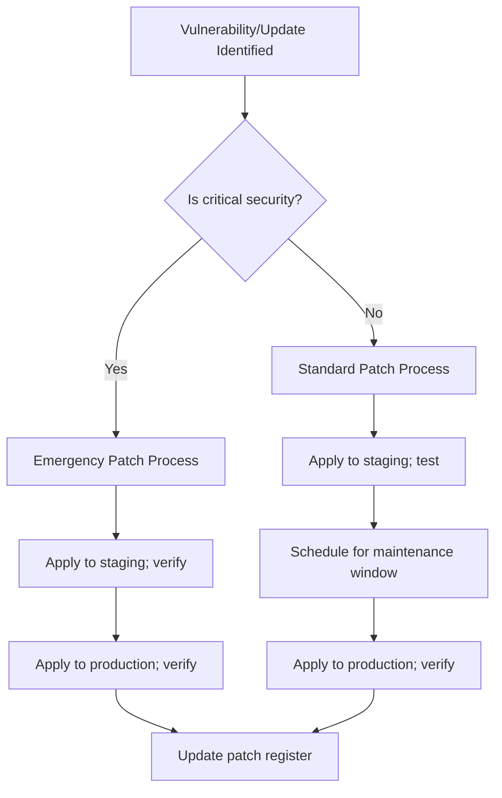

### 47.3 Patch Management Inventory

| Component              | Patch Strategy                                  | Frequency       | Responsible Team  |
|------------------------|------------------------------------------------|-----------------|-------------------|
| OS packages            | Unattended-upgrades (security only)            | Daily           | Platform Eng      |
| Rust dependencies      | Dependabot/Renovate PRs + CI testing           | Weekly          | App Eng           |
| Python dependencies    | Dependabot/Renovate PRs + CI testing           | Weekly          | AI Eng            |
| npm packages           | Dependabot/Renovate PRs + CI testing           | Weekly          | Frontend Eng      |
| PostgreSQL             | Minor version upgrade (rolling restart)        | Monthly         | DBA + SRE         |
| Redis                  | Minor version upgrade                           | Monthly         | SRE               |
| Container base images  | Rebuild + redeploy                             | Monthly         | Platform Eng      |
| Kubernetes             | Minor/patch version upgrade                     | Monthly         | Platform Eng      |
| NGINX Ingress          | Minor version upgrade                           | Monthly         | Platform Eng      |
| Monitoring stack       | Version upgrade                                 | Quarterly       | SRE               |

---

## 48. Upgrade Procedures

### 48.1 Upgrade Types

| Upgrade Type         | Scope                              | Frequency    | Risk Level  | Approval Required  |
|----------------------|------------------------------------|--------------|-------------|---------------------|
| Patch upgrade        | Bug fix, security patch            | As needed    | Low         | Change Advisory Board|
| Minor version upgrade| New features, backward-compatible  | Monthly      | Medium      | Change Advisory Board|
| Major version upgrade| Breaking changes, major refactor   | Quarterly    | High        | VP Engineering      |
| Infrastructure upgrade| K8s, database, Redis version     | Monthly      | Medium      | Change Advisory Board|
| Model upgrade        | AI detection model update          | Per release  | Medium      | AI Team Lead        |

### 48.2 Upgrade Procedure

| Step | Action                                                              |
|------|---------------------------------------------------------------------|
| 1    | Review release notes for breaking changes and deprecations         |
| 2    | Test upgrade on staging environment                                 |
| 3    | Verify all tests pass on staging                                    |
| 4    | Create database backup (if schema changes involved)                 |
| 5    | Schedule upgrade during maintenance window                          |
| 6    | Post upgrade notice to `#ops-status`                               |
| 7    | Execute upgrade using rolling update strategy                       |
| 8    | Verify each component after upgrade                                 |
| 9    | Run smoke test suite                                                |
| 10   | Monitor for 30 minutes post-upgrade                                |
| 11   | If issues arise, execute rollback (see Section 49)                  |
| 12   | Post completion notice to `#ops-status`                             |
| 13   | Update change log                                                   |

### 48.3 Kubernetes Upgrade Procedure

| Step | Action                                                              |
|------|---------------------------------------------------------------------|
| 1    | Check current Kubernetes version compatibility                      |
| 2    | Review Kubernetes changelog for deprecations                        |
| 3    | Test upgrade on staging cluster                                      |
| 4    | Create etcd snapshot backup                                         |
| 5    | Drain one control plane node                                        |
| 6    | Upgrade control plane node                                          |
| 7    | Uncordon and verify node health                                      |
| 8    | Repeat for remaining control plane nodes (one at a time)            |
| 9    | Drain one worker node                                               |
| 10   | Upgrade kubelet on worker node                                      |
| 11   | Uncordon and verify node and pod health                              |
| 12   | Repeat for remaining worker nodes (one at a time)                   |
| 13   | Verify all workloads are running correctly                           |
| 14   | Run full system health check                                        |
| 15   | Monitor for 1 hour post-upgrade                                     |

---

## 49. Rollback Procedures

### 49.1 Rollback Decision Criteria

| Condition                                           | Action                                              |
|-----------------------------------------------------|-----------------------------------------------------|
| Error rate > 5% within 15 minutes of deployment     | Immediate rollback                                  |
| P1/P2 incident caused by deployment                 | Immediate rollback                                  |
| Health check failures after deployment              | Immediate rollback                                  |
| Database migration failure                          | Rollback migration (if safe); then rollback deployment |
| Performance degradation > 200% from baseline        | Rollback                                            |
| User-reported critical functionality broken         | Investigate; rollback if confirmed                  |

### 49.2 Rollback Procedures

#### Application Rollback

| Step | Action                                                              |
|------|---------------------------------------------------------------------|
| 1    | Confirm the issue is caused by the recent deployment                |
| 2    | Notify team via `#ops-status` that rollback is starting            |
| 3    | Execute Kubernetes rollback: `kubectl rollout undo`                |
| 4    | Wait for rollback to complete                                       |
| 5    | Verify health endpoints return HTTP 200                             |
| 6    | Verify error rate returns to baseline                               |
| 7    | Monitor for 15 minutes                                              |
| 8    | Post rollback completion notice                                     |

#### Database Rollback

| Step | Action                                                              |
|------|---------------------------------------------------------------------|
| 1    | Stop all application writes (maintenance mode)                      |
| 2    | Assess if the schema change can be safely reversed                  |
| 3    | If safe: run the down migration                                     |
| 4    | If unsafe: initiate point-in-time recovery from backup             |
| 5    | Verify data integrity after rollback                                |
| 6    | Resume application writes                                            |
| 7    | Verify application functionality end-to-end                          |

#### Configuration Rollback

| Step | Action                                                              |
|------|---------------------------------------------------------------------|
| 1    | Identify the configuration change that caused the issue             |
| 2    | Revert the Git commit containing the configuration change           |
| 3    | Redeploy the affected configuration                                 |
| 4    | Verify the service picks up the reverted configuration              |
| 5    | Monitor for 15 minutes                                              |

### 49.3 Rollback Verification Checklist

| # | Check                                         | Expected Result                     |
|---|-----------------------------------------------|--------------------------------------|
| 1 | Service is running previous version            | Version tag matches rollback target  |
| 2 | Health checks pass                             | All endpoints return HTTP 200        |
| 3 | Error rate is within SLO                       | 5xx rate < 0.1%                     |
| 4 | Performance is within baseline                 | Latency p99 within normal range      |
| 5 | All features are functional                    | Smoke tests pass                     |
| 6 | Monitoring confirms healthy state              | All metrics normal                   |
| 7 | No new alerts firing                           | Alertmanager shows 0 new alerts      |

---

## 50. Release Verification

### 50.1 Smoke Test Suite

After every deployment, the following smoke tests are executed automatically:

| # | Test                                          | Expected Result                     |
|---|-----------------------------------------------|--------------------------------------|
| 1 | Health endpoint returns HTTP 200               | `{"status":"ready"}`                 |
| 2 | Login endpoint accepts valid credentials       | JWT token returned                   |
| 3 | Login endpoint rejects invalid credentials     | 401 Unauthorized                     |
| 4 | API returns events list                        | 200 with JSON array                  |
| 5 | API returns alerts list                        | 200 with JSON array                  |
| 6 | WebSocket connection establishes               | Connection upgraded to WS             |
| 7 | Dashboard loads in browser                     | 200 with HTML content                |
| 8 | Evidence endpoint responds                     | 200 (empty or with data)             |
| 9 | Detection rules endpoint responds              | 200 with JSON data                   |
| 10 | Camera list endpoint responds                  | 200 with JSON data                   |

### 50.2 Post-Deployment Verification Checklist

| # | Check                                         | Time Window    |
|---|-----------------------------------------------|----------------|
| 1 | All pods in Running + Ready state              | Immediate      |
| 2 | All health checks passing                      | Immediate      |
| 3 | Smoke test suite passes                        | Within 5 min   |
| 4 | Error rate within SLO                          | Within 15 min  |
| 5 | Latency within baseline                        | Within 15 min  |
| 6 | No new alerts firing                           | Within 15 min  |
| 7 | Prometheus scraping all new targets            | Within 5 min   |
| 8 | Logs flowing to Loki                           | Within 5 min   |
| 9 | Database connections stable                    | Within 15 min  |
| 10| Camera streams unaffected                      | Within 15 min  |
| 11| AI inference throughput normal                 | Within 15 min  |
| 12| Evidence writes functioning                    | Within 15 min  |

### 50.3 Deployment Verification Flow

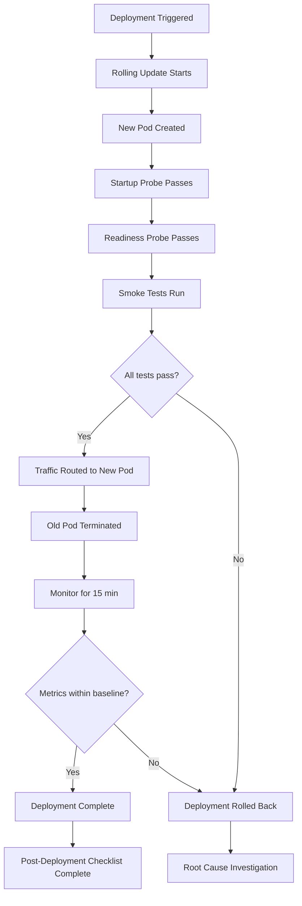

---

## 51. Security Monitoring

### 51.1 Security Monitoring Overview

| Category              | Data Source                | Monitoring Tool    | Alert Channel         |
|-----------------------|----------------------------|--------------------|-----------------------|
| Authentication        | API auth logs              | Prometheus + Loki  | PagerDuty (Critical)  |
| Authorization         | API access logs            | Prometheus + Loki  | Slack (Warning)       |
| API abuse             | WAF logs                   | Prometheus + Loki  | PagerDuty (Critical)  |
| Evidence integrity    | Hash verification logs     | Prometheus         | PagerDuty (Critical)  |
| Network intrusion     | Network flow logs          | Prometheus         | PagerDuty (Critical)  |
| System integrity      | File integrity monitoring  | Prometheus + Loki  | PagerDuty (Critical)  |
| Audit trail           | Audit log tamper detection | Prometheus         | PagerDuty (Critical)  |
| Vulnerability scan    | Scanner output             | Loki               | Slack (Info)          |
| Dependency changes    | SBOM diffing               | CI pipeline        | Slack (Warning)       |

### 51.2 Security Alert Rules

| Alert Name                          | Condition                                      | Severity  | Response Time   |
|-------------------------------------|------------------------------------------------|-----------|-----------------|
| Brute force detected                | > 5 failed logins from single IP in 5 min      | Critical  | Immediate       |
| Account lockout                     | Account locked due to failed attempts          | Info      | 1 hour          |
| Unauthorized access attempt         | 403 response rate > 10/min                     | Critical  | Immediate       |
| Evidence tamper detected            | SHA-256 hash mismatch on evidence access       | Critical  | Immediate       |
| Anomalous API usage                 | > 500 requests/min from single user            | Warning   | 30 minutes      |
| Database connection spike           | > 50 connections in 1 minute                    | Warning   | 30 minutes      |
| JWT signing key aging               | Key age > 25 days                              | Info      | 7 days          |
| Backup failure                      | Scheduled backup did not complete              | Critical  | 1 hour          |
| Service health degraded             | Health check failing for > 5 minutes           | Critical  | Immediate       |
| Unusual data export                 | > 100 evidence downloads in 1 hour             | Critical  | Immediate       |

### 51.3 Security Investigation Procedure

| Step | Action                                                              |
|------|---------------------------------------------------------------------|
| 1    | Acknowledge the security alert immediately                          |
| 2    | Open a dedicated incident channel (do not use general channels)     |
| 3    | Assess scope: what is affected, what data is at risk                |
| 4    | Contain the threat: block IPs, disable accounts, isolate systems   |
| 5    | Preserve evidence: do not modify logs, take forensic snapshots     |
| 6    | Notify CISO within 15 minutes for confirmed breaches               |
| 7    | Investigate root cause using logs, metrics, and audit trails        |
| 8    | Remediate the vulnerability                                         |
| 9    | Verify the threat is fully contained                                |
| 10   | Conduct post-incident security review                               |
| 11   | Update security monitoring rules if needed                          |
| 12   | Document findings in incident report                                |

---

## 52. Vulnerability Response

### 52.1 Vulnerability Severity and SLAs

| CVSS Score      | Severity   | Remediation SLA   | Escalation                    |
|-----------------|------------|-------------------|-------------------------------|
| 9.0–10.0        | Critical   | 24 hours          | Immediate CISO notification   |
| 7.0–8.9         | High       | 7 days            | Security team lead            |
| 4.0–6.9         | Medium     | 30 days           | Engineering team lead         |
| 0.1–3.9         | Low        | 90 days           | Scheduled maintenance         |

### 52.2 Vulnerability Scanning Schedule

| Scan Type                | Frequency    | Scope                    |
|--------------------------|--------------|--------------------------|
| Dependency scanning      | Every build  | Code dependencies        |
| Container image scanning | Every build  | Docker images            |
| OS vulnerability scan    | Weekly       | Base OS on all nodes     |
| Application scan         | Monthly      | Web application          |
| Infrastructure scan      | Monthly      | Cloud/infrastructure config|
| Penetration test         | Annual       | Full platform            |

### 52.3 Vulnerability Response Process

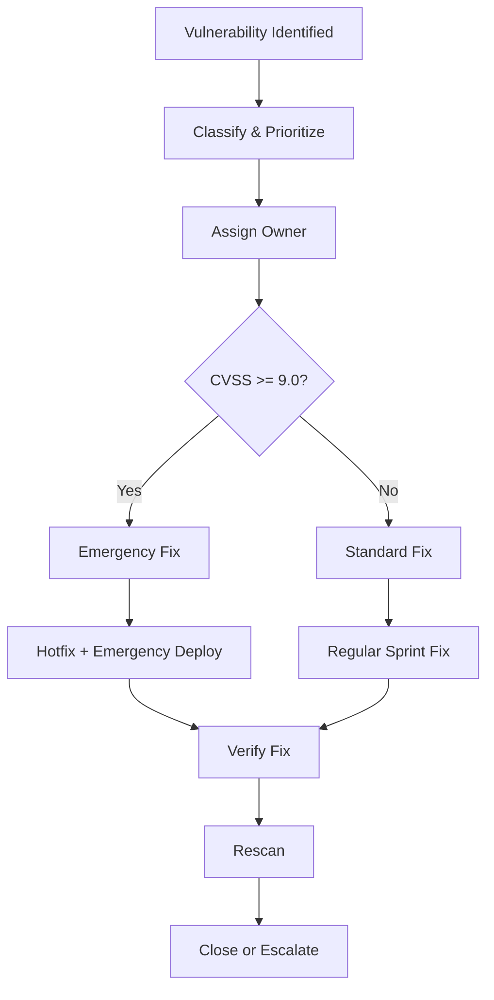

---

## 53. Compliance Operations

### 53.1 Compliance Framework Coverage

| Framework    | Relevant Controls                                | Verification Method              | Frequency     |
|--------------|--------------------------------------------------|----------------------------------|---------------|
| SOC 2 Type II| Access controls, audit logging, encryption       | Internal audit + external audit  | Annual        |
| GDPR         | Data minimization, right to erasure, consent     | Privacy impact assessment        | Quarterly     |
| HIPAA        | PHI handling, access controls, audit trails      | Compliance checklist             | Annual        |
| ISO 27001    | ISMS controls, risk assessment                   | Internal audit                   | Annual        |

### 53.2 Compliance Monitoring Tasks

| Task                                | Frequency    | Owner              | Evidence                           |
|-------------------------------------|--------------|--------------------|------------------------------------|
| Review audit log completeness       | Weekly       | Security Ops       | Audit log report                   |
| Verify encryption at rest           | Monthly      | Platform Eng       | Encryption verification report     |
| Verify encryption in transit        | Monthly      | Platform Eng       | TLS configuration audit            |
| Review access control assignments   | Monthly      | Security Admin     | RBAC audit report                  |
| Review data retention compliance    | Quarterly    | DBA + SRE          | Retention compliance report        |
| Verify backup integrity             | Monthly      | SRE                | Backup verification report         |
| Incident response plan review       | Quarterly    | SRE Lead           | IR plan review meeting minutes     |
| Business continuity test           | Annually     | SRE Lead           | DR test report                     |
| Penetration test                    | Annually     | External firm      | Pentest report                     |
| Security awareness training         | Annually     | CISO               | Training completion records        |
| Data classification review          | Quarterly    | Security Admin     | Classification audit report        |
| Vendor security assessment          | Annually     | Security Admin     | Vendor risk assessment             |

---

## 54. Operational Metrics

### 54.1 Key Operational Metrics

| Metric                              | Definition                                              | Target       | Measurement Period |
|--------------------------------------|---------------------------------------------------------|--------------|---------------------|
| Platform availability                | Uptime of all Tier 1 services                           | 99.9%        | Monthly             |
| MTTR (Mean Time to Recover)         | Average time from detection to resolution for P1/P2     | < 2 hours    | Monthly             |
| MTBF (Mean Time Between Failures)   | Average time between P1/P2 incidents                    | > 720 hours  | Quarterly           |
| Change failure rate                  | % of deployments causing incidents or rollbacks          | < 5%         | Monthly             |
| Deployment frequency                 | Number of production deployments per week               | 2–5          | Weekly              |
| Alert accuracy                       | % of alerts that are actionable (not false positives)   | > 90%        | Monthly             |
| On-call page rate                    | Pages per on-call engineer per week                     | < 5          | Weekly              |
| Backup success rate                  | % of scheduled backups that complete successfully       | 100%         | Monthly             |
| Certificate expiry incidents         | Number of certificates that expired without renewal     | 0            | Monthly             |
| Security incidents                   | Number of confirmed security incidents                  | 0            | Monthly             |

### 54.2 Operational Metrics Dashboard

The SRE team maintains a Grafana dashboard ("SRE Operational Metrics") that displays:

- Platform availability trend (rolling 30 days)
- MTTR trend (rolling 30 days)
- Incident count by severity (rolling 30 days)
- Change failure rate (rolling 30 days)
- Alert volume and accuracy (rolling 30 days)
- Backup success rate (rolling 30 days)
- On-call page rate (rolling 7 days)

### 54.3 Operational Metrics Reporting

| Report                        | Frequency    | Audience                  | Content                              |
|-------------------------------|-------------|---------------------------|---------------------------------------|
| Daily ops summary             | Daily       | SRE team                  | Alerts, incidents, changes            |
| Weekly ops report             | Weekly      | Engineering management    | Metrics, trends, upcoming maintenance |
| Monthly SRE report            | Monthly     | VP Engineering            | SLO compliance, incidents, capacity   |
| Quarterly business review     | Quarterly   | Executive team            | Availability, SLA compliance, costs   |
| Annual operations review      | Annually    | Executive team + Board    | Year in review, roadmap, improvements |

---

## 55. SLO

### 55.1 Service Level Objectives

| Service                | SLO Metric                       | Target     | Measurement Window | Error Budget |
|------------------------|----------------------------------|------------|--------------------|--------------|
| Axum API               | Availability (non-5xx)           | 99.95%     | Rolling 30 days    | 21.6 min/month |
| Axum API               | Latency (p99 < 500ms)            | 99.9%      | Rolling 30 days    | 43.2 min/month |
| AI Inference           | Availability                     | 99.9%      | Rolling 30 days    | 43.2 min/month |
| AI Inference           | Throughput (≥ min FPS)           | 99.9%      | Rolling 30 days    | 43.2 min/month |
| Camera Gateway         | Stream availability              | 99.95%     | Rolling 30 days    | 21.6 min/month |
| Camera Gateway         | Frame drop rate (< 1%)           | 99.9%      | Rolling 30 days    | 43.2 min/month |
| PostgreSQL             | Availability                     | 99.99%     | Rolling 30 days    | 4.3 min/month |
| Redis                  | Availability                     | 99.95%     | Rolling 30 days    | 21.6 min/month |
| Next.js Dashboard      | Availability                     | 99.9%      | Rolling 30 days    | 43.2 min/month |
| **Platform (overall)** | **End-to-end availability**      | **99.9%**  | **Rolling 30 days**| **43.2 min/month** |

### 55.2 SLO Measurement

| SLO                         | How Measured                                              | Data Source           |
|-----------------------------|-----------------------------------------------------------|-----------------------|
| API availability            | % of requests returning non-5xx                           | Prometheus (nginx/axum metrics) |
| API latency                 | % of requests with p99 < 500ms                            | Prometheus (histogram)|
| AI availability             | % of inference requests succeeding                        | Prometheus (ai metrics)|
| Camera stream availability  | % of expected cameras connected                           | Gateway metrics       |
| Frame drop rate             | 1 - (dropped_frames / total_frames)                       | Gateway metrics       |
| PostgreSQL availability     | % of time accepting connections                           | pg_exporter           |
| Redis availability          | % of time responding to PING                              | redis_exporter        |
| Dashboard availability      | % of time health check returns HTTP 200                   | Blackbox Exporter     |

---

## 56. SLA

### 56.1 Service Level Agreements

| SLA Metric                        | Target     | Measurement Period | Penalty                        |
|-----------------------------------|------------|--------------------|---------------------------------|
| Platform availability             | 99.9%      | Monthly            | Service credit per 0.1% below   |
| Incident response time (P1)       | < 15 min   | Per incident       | Escalation + executive notify   |
| Incident resolution time (P1)     | < 4 hours  | Per incident       | Service credit per hour over    |
| Evidence integrity                | 100%       | Continuous         | Immediate investigation         |
| Data durability                   | 99.999999% | Annual             | Data recovery + investigation   |
| Backup success rate               | 100%       | Monthly            | Immediate remediation           |

### 56.2 SLA Compliance Tracking

| SLA                          | Current Period  | Status      | Notes                           |
|------------------------------|-----------------|-------------|----------------------------------|
| Platform availability        | Current month   | On track    | —                               |
| P1 response time             | Current month   | On track    | —                               |
| P1 resolution time           | Current month   | On track    | —                               |
| Evidence integrity           | Current month   | On track    | —                               |
| Data durability              | Current year    | On track    | —                               |
| Backup success rate          | Current month   | On track    | —                               |

---

## 57. Error Budget

### 57.1 Error Budget Calculation

The platform overall SLO is 99.9% availability, measured over a rolling 30-day window.

| Parameter                       | Value                                                   |
|---------------------------------|---------------------------------------------------------|
| SLO target                      | 99.9%                                                   |
| Measurement window              | 30 days (43,200 minutes)                                |
| Total allowed downtime          | 43.2 minutes per 30-day window                          |
| Budget consumption rate         | Measured continuously via Prometheus                    |
| Budget remaining                | Displayed on SRE Operational Metrics dashboard          |

### 57.2 Error Budget Policy

| Budget Remaining | Status    | Actions Allowed                                      |
|------------------|-----------|------------------------------------------------------|
| > 50%            | Healthy   | All planned changes, upgrades, and experiments        |
| 25–50%           | Caution   | Reduce deployment velocity; increase testing          |
| 10–25%           | At Risk   | No non-critical changes; focus on reliability         |
| < 10%            | Critical  | Freeze all non-critical changes; reliability sprint   |
| 0%               | Exhausted | No changes without VP Engineering approval            |

### 57.3 Error Budget Tracking

| Task                                | Frequency    | Owner              | Action                                    |
|-------------------------------------|--------------|--------------------|-------------------------------------------|
| Calculate error budget remaining    | Continuous   | Automated          | Display on dashboard                      |
| Review error budget status          | Weekly       | SRE Lead           | Decide on velocity adjustments            |
| Error budget policy enforcement     | Per release  | Release manager    | Check budget before approving deployment  |
| Error budget replenishment review   | Monthly      | SRE Lead + Management | Assess if SLO targets are appropriate  |
| Post-incident budget impact         | Per incident | Incident Commander | Calculate budget consumed by incident     |

### 57.4 Error Budget Consumption Examples

| Incident                                          | Duration | Budget Consumed | Budget Remaining (30-day) |
|---------------------------------------------------|----------|-----------------|---------------------------|
| No incidents in period                            | 0 min    | 0 min           | 43.2 min                  |
| Single P2 incident (2-hour resolution)            | 120 min  | 120 min (budget exceeded) | 0 min (exhausted) |
| Single P3 incident (30-min degradation)           | 30 min   | 30 min          | 13.2 min                  |
| Maintenance window (30 min, covered by redundancy)| 0 min    | 0 min           | 43.2 min                  |

---

## 58. On-Call Procedures

### 58.1 On-Call Rotation

| Parameter                       | Value                                                   |
|---------------------------------|---------------------------------------------------------|
| Rotation schedule               | Weekly (Monday 08:00 UTC to Monday 08:00 UTC)           |
| Primary on-call                 | 1 engineer per week                                     |
| Secondary on-call               | 1 engineer per week (backup)                            |
| Handover time                   | Monday 08:00 UTC (15-minute overlap)                    |
| On-call compensation            | Per company policy                                      |
| Maximum consecutive weeks       | 2 (to prevent burnout)                                  |

### 58.2 On-Call Responsibilities

| Responsibility                     | Details                                                 |
|-------------------------------------|---------------------------------------------------------|
| Acknowledge alerts                  | Within 5 minutes of page                                |
| Triage and classify                 | Determine severity; follow appropriate procedure        |
| Investigate and mitigate            | Follow troubleshooting guide; resolve or escalate       |
| Communicate                         | Update incident channel; notify stakeholders for P1/P2  |
| Document                            | Record actions taken; update incident timeline          |
| Handover                            | Post handover notes; brief incoming on-call              |
| Maintain runbook accuracy           | Update runbook if procedures change                     |

### 58.3 On-Call Toolkit

| Tool                          | Purpose                                    | Access Method                   |
|-------------------------------|--------------------------------------------|---------------------------------|
| PagerDuty                     | Alert routing and escalation               | Web + Mobile app                |
| Slack                         | Team communication                         | Web + Desktop + Mobile          |
| Grafana                       | Monitoring dashboards                      | Web browser                     |
| Prometheus                    | Metric queries                             | Web browser (via Grafana)       |
| Loki                          | Log queries                                | Web browser (via Grafana)       |
| Kubernetes CLI (kubectl)      | Cluster operations                         | Terminal / SSH to jump host     |
| SSH                           | Direct node access                         | Terminal via VPN + jump host    |
| VPN                           | Network access to production               | VPN client                      |
| Status Page                   | External incident communication            | Web browser                     |
| Incident Timeline Template    | Documenting incident timeline              | Appendix A                      |

### 58.4 On-Call Best Practices

1. **Always have your phone charged and nearby.** Pages can come at any time.
2. **Test your alerting setup** at the start of each on-call rotation.
3. **Read the handover notes** from the previous on-call engineer.
4. **Check the upcoming maintenance schedule** before starting your rotation.
5. **Don't investigate alone on complex issues.** Page the secondary or escalate early.
6. **Take notes during incidents.** The scribe role helps, but take your own notes too.
7. **Update the runbook** if you find a procedure that is outdated or incomplete.
8. **Post-rotation self-care.** If you had a busy rotation, take time to recover.

---

## 59. Runbooks

### 59.1 Runbook Index

| Runbook ID | Title                                    | Section Reference | Trigger Alert                |
|------------|------------------------------------------|-------------------|------------------------------|
| RB-001     | API Service Down                         | Section 15        | ServiceDown (API)            |
| RB-002     | AI Inference Service Down                | Section 15        | ServiceDown (AI)             |
| RB-003     | Camera Gateway Down                      | Section 15        | ServiceDown (Gateway)        |
| RB-004     | PostgreSQL Primary Failure               | Section 18        | PostgresReplicationLagCritical|
| RB-005     | PostgreSQL Replication Lag                | Section 18        | PostgresReplicationLag       |
| RB-006     | Redis Primary Failure                    | Section 19        | RedisReplicationBroken       |
| RB-007     | Redis Memory High                        | Section 19        | RedisMemoryHigh              |
| RB-008     | Evidence Storage Full                    | Section 20        | EvidenceStorageCritical      |
| RB-009     | GPU Failure / Degradation                | Section 21        | GPUTemperatureHigh           |
| RB-010     | Camera Stream Mass Disconnect            | Section 22        | CameraStreamCritical         |
| RB-011     | High Error Rate (API)                    | Section 61        | HighErrorRate                |
| RB-012     | High Latency (API)                       | Section 61        | HighLatency                  |
| RB-013     | Kubernetes Node NotReady                 | Section 16        | NodeNotReady                 |
| RB-014     | Pod Crash Looping                        | Section 16        | PodCrashLooping              |
| RB-015     | Pod OOMKilled                            | Section 16        | PodOOMKilled                 |
| RB-016     | Certificate Expiring                     | Section 42        | CertificateExpiringCritical  |
| RB-017     | Backup Failed                            | Section 34        | BackupFailed                 |
| RB-018     | Security Breach Detected                 | Section 51        | SecurityBreach               |
| RB-019     | Brute Force Attack                       | Section 51        | SecurityBruteForce           |
| RB-020     | Evidence Integrity Tampering             | Section 51        | SecurityEvidenceTamper       |
| RB-021     | Full System Recovery (DR)                | Section 33        | N/A (manual trigger)         |
| RB-022     | Prometheus Down                          | Section 24        | ServiceDown (Prometheus)     |
| RB-023     | Loki Ingestion Failure                   | Section 26        | LokiIngestionDown            |
| RB-024     | Database Corruption Recovery             | Section 18        | DataCorruption               |

### 59.2 Runbook Usage Procedure

| Step | Action                                                              |
|------|---------------------------------------------------------------------|
| 1    | Identify the alert or incident                                     |
| 2    | Look up the corresponding runbook from the index above              |
| 3    | Follow the runbook procedure step by step                          |
| 4    | Document actions taken in the incident channel                      |
| 5    | If the runbook does not resolve the issue, escalate per Section 31  |
| 6    | After resolution, review the runbook for accuracy                   |
| 7    | Update the runbook if the procedure needs changes                   |

---

## 60. Standard Operating Procedures

### 60.1 SOP Index

| SOP ID  | Title                                    | Frequency        | Owner              |
|---------|------------------------------------------|------------------|--------------------|
| SOP-001 | Daily Health Check                       | Daily            | On-Call SRE        |
| SOP-002 | Shift Handover                           | Every shift      | On-Call SRE        |
| SOP-003 | Service Restart                          | As needed        | On-Call SRE        |
| SOP-004 | Database Maintenance                     | Weekly           | DBA                |
| SOP-005 | Backup Verification                      | Weekly           | SRE                |
| SOP-006 | Certificate Renewal                      | As needed        | SRE                |
| SOP-007 | Secret Rotation                          | Monthly          | SRE                |
| SOP-008 | Patch Application                        | As needed        | Platform Eng       |
| SOP-009 | Upgrade Execution                        | Monthly          | Platform Eng       |
| SOP-010 | User Provisioning                        | As needed        | Security Admin     |
| SOP-011 | User Deprovisioning                      | As needed        | Security Admin     |
| SOP-012 | Incident Response                        | Per incident     | Incident Commander |
| SOP-013 | Post-Incident Review                     | After P1/P2      | SRE Lead           |
| SOP-014 | DR Test                                  | Quarterly        | SRE Lead           |
| SOP-015 | Capacity Review                          | Monthly          | SRE Lead           |
| SOP-016 | Compliance Audit Preparation             | Quarterly        | Security Admin     |
| SOP-017 | Emergency Shutdown                       | Emergency        | SRE Lead           |
| SOP-018 | Maintenance Window Execution             | Monthly          | Platform Eng       |
| SOP-019 | Evidence Archive                         | Monthly          | SRE                |
| SOP-020 | Security Vulnerability Review            | Weekly           | Security Ops       |

### 60.2 SOP Document Template

Each SOP follows this structure:

| Section                   | Description                                              |
|---------------------------|----------------------------------------------------------|
| Purpose                   | Why this SOP exists                                      |
| Scope                     | What this SOP covers                                     |
| Prerequisites             | What must be in place before starting                    |
| Procedure                 | Step-by-step instructions                                |
| Verification              | How to verify the procedure was successful               |
| Rollback                  | How to undo if something goes wrong                      |
| References                | Related runbooks, documentation                          |
| Revision History          | Changes to this SOP                                      |

---

## 61. Troubleshooting Guide

### 61.1 Troubleshooting Decision Tree

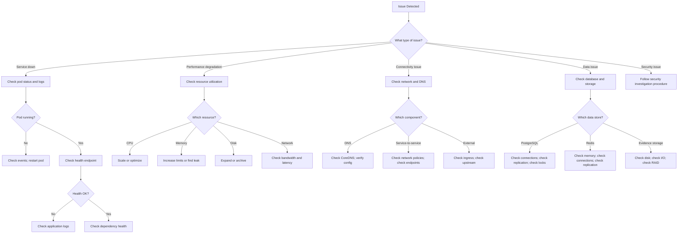

### 61.2 Common Issues and Resolutions

| Issue                                    | Symptoms                                         | Resolution                                         |
|------------------------------------------|--------------------------------------------------|----------------------------------------------------|
| API returning 503                        | Health check failing; load balancer reports down  | Check pod status; restart if needed                |
| Slow API responses                       | High p99 latency; users report slowness          | Check DB connections; check slow queries; scale    |
| Camera streams not processing            | No detections; frame drop alerts                 | Check gateway logs; verify RTSP; restart gateway   |
| AI inference returning errors            | Detection failures; inference timeout alerts     | Check GPU; restart inference pod; check model      |
| Database connection pool exhausted       | Connection errors in API logs                    | Kill idle connections; increase pool size; scale DB|
| Redis memory full                        | Eviction alerts; cache miss rate high            | Increase maxmemory; check key TTLs; flush old keys |
| Evidence storage write failing           | Evidence upload errors; disk full alerts         | Archive old evidence; expand volume                |
| Dashboard not loading                    | Blank page; JavaScript errors                    | Check Next.js pod; check API connectivity          |
| WebSocket disconnects                    | Users getting kicked; reconnection storms        | Check gateway; check load balancer timeout         |
| Prometheus not scraping targets          | Missing metrics; stale data                      | Check target status; check network; restart        |
| Loki not ingesting logs                  | Missing logs in Grafana                          | Check Promtail/Fluentd; check Loki storage         |
| High error rate after deployment         | 5xx spike after new version                      | Rollback to previous version; investigate          |
| OOMKilled pods                           | Pods restarting; memory limit reached            | Increase memory limit; check for memory leak       |
| Node NotReady                            | Pods not scheduling; node unreachable            | Check kubelet; check disk pressure; check network  |

### 61.3 Diagnostic Commands Quick Reference

| Purpose                             | Command                                                     |
|-------------------------------------|-------------------------------------------------------------|
| Check pod status                    | `kubectl get pods -n <namespace> -o wide`                   |
| View pod logs                       | `kubectl logs <pod> -n <namespace> --tail=100`              |
| Check pod events                    | `kubectl describe pod <pod> -n <namespace>`                 |
| Check node status                   | `kubectl get nodes -o wide`                                 |
| Check node resources                | `kubectl top nodes`                                         |
| Check pod resources                 | `kubectl top pods --all-namespaces --sort-by=memory`        |
| Check PVC status                    | `kubectl get pvc --all-namespaces`                          |
| Check service endpoints             | `kubectl get endpoints <service> -n <namespace>`            |
| Test API health                     | `curl -s https://api.{domain}/api/v1/health/ready`          |
| Check database connections          | Query `pg_stat_activity`                                    |
| Check replication lag               | Query `pg_stat_replication`                                 |
| Check Redis info                    | `redis-cli INFO`                                            |
| Check disk usage                    | `df -h`                                                     |
| Check network connectivity          | `ping <host>; curl -v <url>`                                |
| Check certificate expiry            | `openssl x509 -enddate -noout -in <cert.pem>`              |

---

## 62. Frequently Asked Questions

### 62.1 Operational FAQs

| Question                                                        | Answer                                                      |
|-----------------------------------------------------------------|-------------------------------------------------------------|
| What do I do if I receive an alert at 3 AM?                     | Acknowledge within 5 minutes; follow the relevant runbook; escalate if unsure |
| How do I silence an alert during maintenance?                   | Use Alertmanager UI; set silence matching alert labels; max 24 hours (Section 27.4) |
| How do I check if a backup completed successfully?              | Check Grafana backup dashboard; verify backup metrics in Prometheus |
| How do I request a database restore?                            | Follow restore procedures in Section 35; get approval from SRE Lead |
| How do I add a new camera to the platform?                      | Follow Camera Gateway Operations procedures in Section 22    |
| How do I create a new user?                                     | Follow User Administration procedures in Section 44          |
| How do I rotate a secret?                                       | Follow Secret Rotation procedures in Section 43              |
| How do I schedule a maintenance window?                         | Follow Maintenance Window procedures in Section 46           |
| How do I check platform SLO compliance?                         | Check the SRE Operational Metrics Grafana dashboard          |
| How do I report a security incident?                            | Follow Security Monitoring procedures in Section 51; notify CISO immediately |
| What do I do if the error budget is exhausted?                  | No changes without VP Engineering approval; focus on reliability (Section 57.2) |
| How do I escalate a P1 incident?                                | Follow Escalation Matrix in Section 31; IC makes escalation decisions |
| How do I access production servers?                             | VPN + SSH to jump host; then SSH to target node              |
| How do I check certificate expiry dates?                        | Check Certificate Management inventory in Section 42         |
| How do I verify evidence integrity?                             | Run SHA-256 verification against stored evidence (Section 20)|
| How do I perform a DR test?                                     | Follow DR Testing procedures in Section 33.4                 |
| How do I update the runbook?                                    | Edit `docs/10-Operations-Runbook.md`; submit PR; get review  |
| How do I report an operational metric?                          | Update the SRE Operational Metrics dashboard; add to weekly report |
| How do I get access to Grafana dashboards?                      | Request access from SRE Lead; RBAC role-based access          |
| How do I check if an upgrade went well?                         | Follow Release Verification procedures in Section 50          |

---

## 63. Glossary

| Term                          | Definition                                                     |
|-------------------------------|-----------------------------------------------------------------|
| Active-Active                 | Redundancy pattern where multiple instances serve traffic simultaneously |
| Active-Passive                | Redundancy pattern where one instance serves traffic; the other is standby |
| Alertmanager                  | Prometheus component for alert routing, deduplication, and silencing |
| AOF (Append-Only File)       | Redis persistence mode that logs every write operation          |
| Blackbox Exporter             | Prometheus exporter for probing endpoints from outside          |
| cadvisor                      | Container Advisor — collects container resource usage metrics   |
| cert-manager                  | Kubernetes controller for automated TLS certificate management  |
| Chain of Custody              | Documentary record of evidence handling to ensure admissibility |
| Cilium                        | Kubernetes CNI plugin providing networking and security         |
| cordon                        | Marking a Kubernetes node as unschedulable                     |
| DCGM Exporter                 | NVIDIA Data Center GPU Manager exporter for Prometheus          |
| DR (Disaster Recovery)        | Processes for restoring platform after catastrophic failure     |
| Error Budget                  | Allowed downtime calculated from SLO targets                    |
| etcd                          | Distributed key-value store backing Kubernetes cluster state   |
| gRPC                          | High-performance RPC framework used for inter-service communication |
| HA (High Availability)       | System design ensuring continuous operation with minimal downtime |
| Ingress                       | Kubernetes resource managing external HTTP/HTTPS access         |
| Liveness Probe                | Kubernetes health check that restarts pod if failing            |
| Longhorn                      | Kubernetes-native distributed storage system                    |
| MTBF (Mean Time Between Failures) | Average time between system failures                      |
| MTTR (Mean Time to Recover)  | Average time to restore service after failure                   |
| Patroni                       | PostgreSQL HA solution using distributed consensus             |
| pg_exporter                   | Prometheus exporter for PostgreSQL metrics                      |
| Point-in-Time Recovery (PITR)| Restoring database to specific moment using WAL                 |
| PromQL                        | Prometheus Query Language for metric queries                    |
| Promtail                      | Log shipper for Loki                                            |
| Readiness Probe               | Kubernetes health check that controls traffic routing           |
| redis_exporter                | Prometheus exporter for Redis metrics                           |
| Repmgr                        | PostgreSQL replication manager                                  |
| RPO (Recovery Point Objective)| Maximum acceptable data loss measured in time                   |
| RTO (Recovery Time Objective) | Maximum acceptable downtime measured in time                    |
| Rolling Update                | Kubernetes deployment strategy updating pods one at a time     |
| RTSP (Real Time Streaming Protocol) | Protocol for streaming video from cameras               |
| SLO (Service Level Objective)| Reliability target measured as percentage of successful requests|
| StatefulSet                   | Kubernetes workload for stateful applications                   |
| WAL (Write-Ahead Log)        | PostgreSQL transaction log for replication and recovery         |
| WAF (Web Application Firewall)| Filters and monitors HTTP traffic for security                |

---

## 64. Appendices

### Appendix A: Incident Timeline Template

Use this template when documenting incidents for post-incident review.

| Time (UTC)     | Actor              | Action                                              |
|----------------|--------------------|-----------------------------------------------------|
| YYYY-MM-DD HH:MM | [Name/Alert]    | [What happened]                                      |
|                |                    |                                                     |
|                |                    |                                                     |

**Incident Summary:**
- **Date:**
- **Duration:**
- **Severity:**
- **Impact:**
- **Root Cause:**
- **Resolution:**
- **Lessons Learned:**
- **Action Items:**

---

### Appendix B: Change Request Template

| Field                        | Details                                              |
|------------------------------|------------------------------------------------------|
| Change ID                    | CHG-YYYY-NNN                                        |
| Requester                    | [Name]                                               |
| Date Requested               | [Date]                                               |
| Change Type                  | Standard / Normal / Emergency                        |
| Description                  | [What is being changed]                              |
| Justification                | [Why the change is needed]                           |
| Risk Assessment              | Low / Medium / High                                  |
| Impact Assessment            | [What services are affected]                         |
| Rollback Plan                | [How to undo the change]                             |
| Testing Plan                 | [How the change will be verified]                    |
| Maintenance Window           | [Proposed time window]                               |
| Approval                     | [Change Advisory Board / VP Engineering]             |
| Implementation Date          | [Actual implementation date]                         |
| Verification Complete        | [Yes/No — date]                                      |
| Post-Change Review           | [Date — any issues?]                                 |

---

### Appendix C: Post-Incident Report Template

| Section                       | Content                                              |
|-------------------------------|------------------------------------------------------|
| Incident Title                | [Brief descriptive title]                            |
| Incident Date                 | [Date and time of occurrence]                        |
| Incident Duration             | [Start time to resolution time]                      |
| Severity                      | [P1 / P2 / P3 / P4]                                 |
| Incident Commander            | [Name]                                               |
| Technical Lead                | [Name]                                               |
| **Summary**                   | [2-3 sentence summary of the incident]               |
| **Impact**                    | [Users affected, services affected, data at risk]    |
| **Timeline**                  | [Detailed timeline of events — use Appendix A]       |
| **Root Cause**                | [Technical root cause analysis]                      |
| **Resolution**                | [How the incident was resolved]                      |
| **Detection**                 | [How the incident was detected; was detection timely?]|
| **What Went Well**            | [Things that worked during the response]             |
| **What Went Poorly**          | [Things that need improvement]                       |
| **Action Items**              | [Specific tasks with owners and due dates]           |
| **Lessons Learned**           | [Key takeaways for the organization]                 |
| **Follow-up Review Date**     | [Date to review action item completion]              |

---

### Appendix D: Emergency Contact List

| Role                          | Name              | Phone              | Email                       | PagerDuty               |
|-------------------------------|-------------------|--------------------|-----------------------------|-------------------------|
| Primary On-Call SRE           | [Rotation]        | [PagerDuty]        | [ops@vigilantai.com]        | [PD Service]            |
| Secondary On-Call SRE         | [Rotation]        | [PagerDuty]        | [ops@vigilantai.com]        | [PD Service]            |
| SRE Team Lead                 | [Name]            | [Phone]            | [Email]                     | [PD Service]            |
| Engineering Manager           | [Name]            | [Phone]            | [Email]                     | [PD Service]            |
| VP of Engineering             | [Name]            | [Phone]            | [Email]                     | —                       |
| CISO                          | [Name]            | [Phone]            | [Email]                     | —                       |
| DBA On-Call                   | [Rotation]        | [Phone]            | [Email]                     | [PD Service]            |
| Security Operations Lead      | [Name]            | [Phone]            | [Email]                     | [PD Service]            |
| Infrastructure Lead           | [Name]            | [Phone]            | [Email]                     | [PD Service]            |
| External: Cloud Provider Support | [Account ID]   | [Support Line]     | [Support Portal]            | —                       |
| External: PagerDuty Support   | —                 | [Support Line]     | [Support Portal]            | —                       |

---

### Appendix E: Maintenance Window Calendar

| Date          | Window          | Type                  | Scope                                    | Owner              |
|---------------|-----------------|-----------------------|------------------------------------------|--------------------|
| 1st Saturday  | 02:00–06:00 UTC | Monthly maintenance   | Patches, upgrades, configuration         | Platform Eng       |
| 2nd Saturday  | 02:00–04:00 UTC | Database maintenance  | PostgreSQL tasks, vacuum, reindex        | DBA                |
| 3rd Saturday  | 02:00–06:00 UTC | Kubernetes upgrade    | K8s version upgrade (if scheduled)       | Platform Eng       |
| 4th Saturday  | 02:00–04:00 UTC | Security patching     | OS and dependency security patches       | SRE                |
| Quarterly     | As scheduled    | DR test               | Full disaster recovery activation test   | SRE Lead           |
| Annually      | As scheduled    | Penetration test      | External security assessment             | Security Team      |

---

### Appendix F: Service Port Reference

| Service                | Internal Port | Protocol | Exposed Via        | External URL Pattern                     |
|------------------------|---------------|----------|--------------------|------------------------------------------|
| Axum API               | 8080          | HTTP/2   | NGINX Ingress      | `https://{domain}/api/v1`               |
| Next.js Dashboard      | 3000          | HTTP     | NGINX Ingress      | `https://{domain}`                       |
| Camera Gateway         | 8082          | gRPC     | ClusterIP (internal)| N/A (internal only)                      |
| AI Inference Service   | 8081          | gRPC     | ClusterIP (internal)| N/A (internal only)                      |
| PostgreSQL             | 5432          | TCP/TLS  | ClusterIP (internal)| N/A (internal only)                      |
| Redis                  | 6379          | TCP/TLS  | ClusterIP (internal)| N/A (internal only)                      |
| Redis Sentinel         | 26379         | TCP      | ClusterIP (internal)| N/A (internal only)                      |
| Prometheus             | 9090          | HTTP     | ClusterIP (internal)| N/A (internal only)                      |
| Grafana                | 3000          | HTTP     | NGINX Ingress      | `https://{domain}/grafana`               |
| Loki                   | 3100          | HTTP     | ClusterIP (internal)| N/A (internal only)                      |
| Alertmanager           | 9093          | HTTP     | ClusterIP (internal)| N/A (internal only)                      |
| Node Exporter          | 9100          | HTTP     | HostNetwork        | N/A (node-level)                         |

---

### Appendix G: Kubernetes Resource Quotas

| Namespace            | CPU Request | Memory Request | CPU Limit | Memory Limit | Pod Count | PVC Count |
|----------------------|-------------|----------------|-----------|--------------|-----------|-----------|
| vigilant-app         | 8 cores     | 16 Gi          | 32 cores  | 64 Gi        | 50        | 10        |
| vigilant-data        | 4 cores     | 8 Gi           | 16 cores  | 64 Gi        | 20        | 20        |
| vigilant-gateway     | 2 cores     | 4 Gi           | 8 cores   | 16 Gi        | 20        | 5         |
| vigilant-monitoring  | 2 cores     | 4 Gi           | 8 cores   | 32 Gi        | 30        | 10        |
| vigilant-evidence    | 1 core      | 2 Gi           | 4 cores   | 8 Gi         | 10        | 5         |

---

### Appendix H: Monitoring Targets Reference

| Target                        | Endpoint                                | Scrape Interval | Timeout |
|-------------------------------|-----------------------------------------|-----------------|---------|
| Axum API (pod 1)              | `http://10.0.1.x:8080/metrics`         | 15s             | 10s     |
| Axum API (pod 2)              | `http://10.0.1.x:8080/metrics`         | 15s             | 10s     |
| Axum API (pod 3)              | `http://10.0.1.x:8080/metrics`         | 15s             | 10s     |
| AI Inference (pod 1)          | `http://10.0.1.x:8081/metrics`         | 15s             | 10s     |
| AI Inference (pod 2)          | `http://10.0.1.x:8081/metrics`         | 15s             | 10s     |
| Camera Gateway (pod 1)        | `http://10.0.1.x:8082/metrics`         | 15s             | 10s     |
| Camera Gateway (pod 2)        | `http://10.0.1.x:8082/metrics`         | 15s             | 10s     |
| PostgreSQL Primary            | `http://10.0.2.x:9187/metrics`         | 30s             | 10s     |
| PostgreSQL Replica            | `http://10.0.2.x:9187/metrics`         | 30s             | 10s     |
| Redis Primary                 | `http://10.0.2.x:9121/metrics`         | 30s             | 10s     |
| Redis Replica                 | `http://10.0.2.x:9121/metrics`         | 30s             | 10s     |
| Node Exporter (each node)     | `http://10.0.x.x:9100/metrics`         | 15s             | 10s     |
| cAdvisor (each node)          | `http://10.0.x.x:8080/metrics`         | 30s             | 10s     |
| Kubernetes API                | `https://10.0.0.10:6443/metrics`       | 30s             | 10s     |
| Blackbox: API health          | `http://blackbox:9115/probe?target=...`| 60s             | 10s     |
| Blackbox: Dashboard health    | `http://blackbox:9115/probe?target=...`| 60s             | 10s     |

---

*End of Document*

**Document ID:** VA-OPS-RB-010

**Version:** 1.0

**Classification:** Confidential — Internal Operations

**Last Updated:** 2026-07-23

